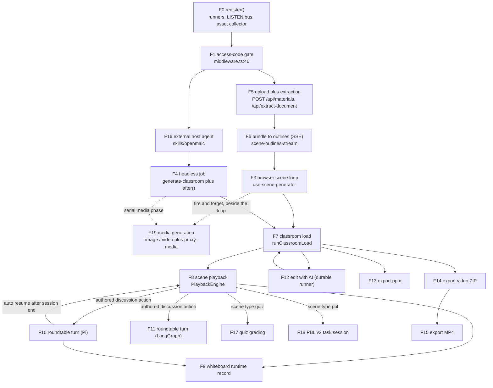
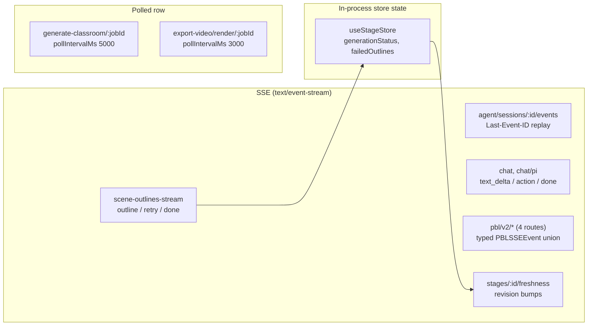

# 00 — The flow catalogue

Every end-to-end flow this topic documents, with its trigger, the containers it
crosses, and the page that traces it. Use this page to find the right trace;
use the chain diagram to understand which flow feeds which.

**Sources:** `git ls-files 'app/api/**/route.ts'` (69 route files), [`middleware.ts:46`](middleware.ts#L46),
[`instrumentation.ts:13`](instrumentation.ts#L13), plus the flow chapters listed in [`index.md`](docs/11-data-flows/index.md).

## Container vocabulary used in the table

Five runtime containers, defined in [`../02-container-view/index.md`](docs/02-container-view/index.md):

| Short name | What it is |
| --- | --- |
| **Browser** | The Next.js client bundle. Owns `useStageStore`, Dexie/IndexedDB, `PlaybackEngine`, the export compiler, and the in-class agent loop. |
| **Next server** | Node runtime (`process.env.NEXT_RUNTIME === 'nodejs'`). Route handlers, the durable agent runner, the material-extraction runner, the LISTEN bus. |
| **Edge middleware** | `middleware.ts` only. Two gates, no data access. |
| **PostgreSQL** | Authority for documents, agent sessions, materials, assets, runtime records — when `DATABASE_URL` is set. |
| **render-service** | A separate Node 22 container with `iptables OUTPUT DROP` egress lockdown. Frame capture + FFmpeg only. |
| **Model / vendor** | Any outbound LLM, TTS, ASR, image, video, web-search or document-extraction provider. |

## The catalogue

| # | Flow | Trigger | Containers crossed | Page |
| --- | --- | --- | --- | --- |
| F0 | Cold start and config resolution | Next calls `register()` once per server instance ([`instrumentation.ts:13`](instrumentation.ts#L13)) | Next server → PostgreSQL | [`01`](docs/11-data-flows/01-boot-and-config.md) |
| F1 | Access-code gate | any request matching [`middleware.ts:89`](middleware.ts#L89) while `ACCESS_CODE` is set | Edge middleware | [`01`](docs/11-data-flows/01-boot-and-config.md), [`12`](docs/11-data-flows/12-trust-boundaries-in-flight.md) |
| F2 | SIGTERM drain | orchestrator signal (`lib/server/register-shutdown-signals.ts`) | Next server → PostgreSQL | [`01`](docs/11-data-flows/01-boot-and-config.md) |
| F3 | Topic → classroom (browser loop) | composer submit on `/` ([`app/page.tsx:673`](app/page.tsx#L673) pushes `/generation-preview`) | Browser → Next server → Model → Browser (Dexie) | [`02`](docs/11-data-flows/02-topic-to-classroom.md) |
| F4 | Topic → classroom (headless job) | `POST /api/generate-classroom` | Next server → Model → PostgreSQL | [`02`](docs/11-data-flows/02-topic-to-classroom.md), [`09`](docs/11-data-flows/09-external-workbench.md) |
| F5 | Document → normalised material | file attach in the composer, or `POST /api/materials` | Browser → Next server → extractor vendor | [`03`](docs/11-data-flows/03-document-to-classroom.md) |
| F6 | Bundle → outline prompt | `POST /api/generate/scene-outlines-stream` (SSE) | Browser → Next server → Model | [`03`](docs/11-data-flows/03-document-to-classroom.md), [`02`](docs/11-data-flows/02-topic-to-classroom.md) |
| F7 | Classroom load (cold open) | navigate `/classroom/<id>` | Browser (Dexie) → Next server fallback | [`04`](docs/11-data-flows/04-scene-playback.md) |
| F8 | Scene playback | press play ([`PlaybackChromeRoot.tsx:1127`](components/edit/PlaybackChromeRoot.tsx#L1127)) | Browser only, plus `POST /api/generate/tts` for live segments | [`04`](docs/11-data-flows/04-scene-playback.md) |
| F9 | Whiteboard mutation → canvas | an authored `wb_*` action, or an agent whiteboard tool | Browser or Next server → PostgreSQL (RuntimeStore) | [`04`](docs/11-data-flows/04-scene-playback.md), [`06`](docs/11-data-flows/06-edit-with-ai.md) |
| F10 | Roundtable turn (Pi director) | learner interrupt, or an authored `discussion` action | Browser → `POST /api/chat/pi` → Model → Browser `ActionEngine` | [`05`](docs/11-data-flows/05-roundtable-turn.md) |
| F11 | Roundtable turn (LangGraph, default) | same triggers, `NEXT_PUBLIC_PI_CHAT_ENABLED` unset | Browser → `POST /api/chat` → Model | [`05`](docs/11-data-flows/05-roundtable-turn.md) |
| F12 | Edit with AI (durable) | `POST /api/agent/sessions` then the runner claims it | Browser → PostgreSQL → runner → Model → PostgreSQL → SSE → Browser | [`06`](docs/11-data-flows/06-edit-with-ai.md) |
| F13 | Export `.pptx` | export menu → `useExportPPTX()` | Browser only (vendored pptxgenjs) | [`07`](docs/11-data-flows/07-export-pptx.md) |
| F14 | Export video ZIP | export dialog → `useExportVideo().exportVideo(...)` | Browser only (compile + JSZip) | [`08`](docs/11-data-flows/08-export-video.md) |
| F15 | Export MP4 | `useVideoRenderStore.startRender(...)` | Browser → Next server relay → render-service | [`08`](docs/11-data-flows/08-export-video.md) |
| F16 | External host agent drives a deployment | an outside agent loads `skills/openmaic/SKILL.md` | External agent → Next server (F4) | [`09`](docs/11-data-flows/09-external-workbench.md) |
| F17 | Quiz attempt → grading | learner submits a short answer → `POST /api/quiz-grade` | Browser → Next server → Model | [`10`](docs/11-data-flows/10-quiz-and-pbl.md) |
| F18 | PBL v2 task session | a `pbl` scene renders | Browser → `/api/pbl/v2/*` (4 SSE routes) → Model → RuntimeStore | [`10`](docs/11-data-flows/10-quiz-and-pbl.md) |
| F19 | Media generation (image / video) | outlines declare `mediaGenerations` | Browser → `/api/generate/image` or `/video` → vendor → `POST /api/proxy-media` | [`02`](docs/11-data-flows/02-topic-to-classroom.md), [`12`](docs/11-data-flows/12-trust-boundaries-in-flight.md) |

## How the flows chain

Three chain properties worth naming:

1. **F6 → F3 is a gate, not a pipe.** The outline review step
   ([`app/generation-preview/page.tsx:680`](app/generation-preview/page.tsx#L680)) can hold the chain indefinitely, or
   auto-continue after `OUTLINE_REVIEW_AUTO_CONTINUE_MS` (2500 ms,
   [`page.tsx:66`](app/generation-preview/page.tsx#L66)). Nothing downstream starts until it resolves.
2. **F12 → F7 is the only loop back into an already-loaded classroom.** Every
   other flow either writes before the classroom loads or writes through
   `useStageStore`. The agent writes to PostgreSQL and the browser learns about
   it by rev-diffing (`GET /api/stages/:id/freshness` → `/manifest` →
   `/scenes?ids=`).
3. **F14 is the shared prefix of F15.** The compile and ZIP build always happen
   in the browser; only capture and encoding move to the service, stated at
   [`lib/video-export-app/build-export-zip.ts:11-13`](lib/video-export-app/build-export-zip.ts#L11-L13) as an anti-drift measure.

## Which transport each flow uses for progress

Four independent progress transports exist, one per consumer. This is the single
most common source of confusion when reading the code.

Only the outline stage streams generation progress, because it is the only stage
whose *partial* output is useful to a human. Scene generation reports through
store state in the browser and through a polled job row in the headless path —
see [`02`](docs/11-data-flows/02-topic-to-classroom.md).

## Cross-links

- Per-endpoint request/response shapes: [`../12-api-reference/index.md`](docs/12-api-reference/index.md).
- Structural view of the same components: [`../02-container-view/index.md`](docs/02-container-view/index.md).
- Deployment topology the containers map onto: [`../17-deployment-view/index.md`](docs/17-deployment-view/index.md).
