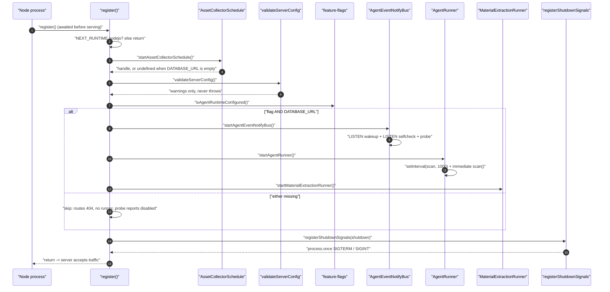
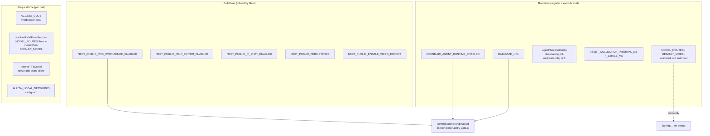
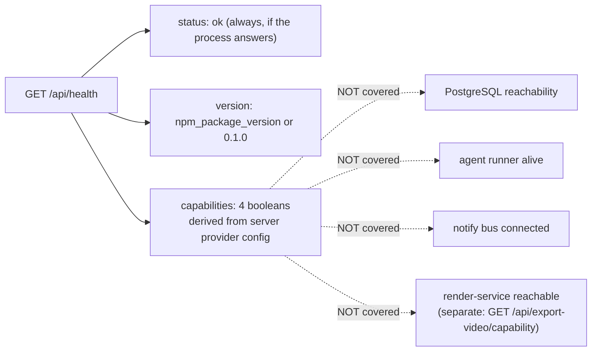
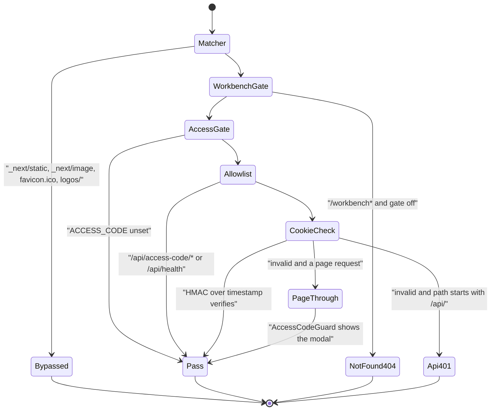
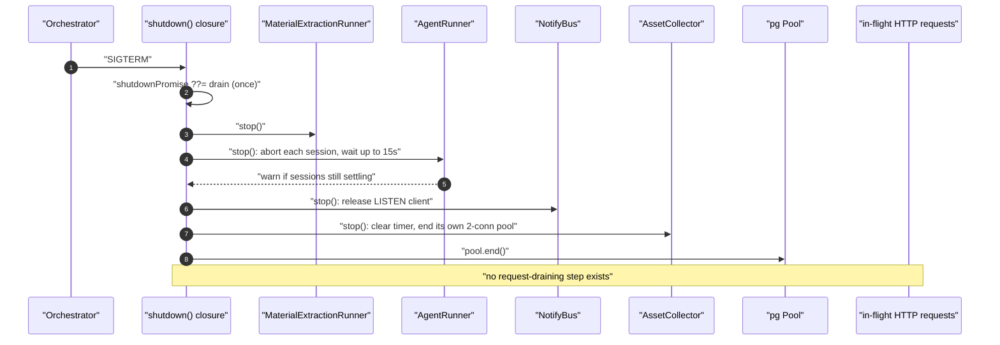

# 01 — Cold start, config resolution, readiness, drain

What happens between "the Node process exists" and "the first request is
served", what config is resolved when, what is validated (and what is only
warned about), and how the process shuts down.

**Sources:** `instrumentation.ts`, `lib/server/register-shutdown-signals.ts`,
`lib/server/config-validation.ts`, `lib/config/feature-flags.ts`,
`lib/persistence/asset-collector-schedule.ts`,
`lib/server/agent-runtime/config.ts`, [`lib/server/agent-runtime/runner.ts:1861`](lib/server/agent-runtime/runner.ts#L1861),
`lib/server/agent-runtime/event-notify-bus.ts`, `middleware.ts`,
`next.config.ts`, `app/api/health/route.ts`;
[`../appendix/research/app-shell-and-routing/03-flows.md`](docs/appendix/research/app-shell-and-routing/03-flows.md),
[`../appendix/research/api-surface/03-flows.md`](docs/appendix/research/api-surface/03-flows.md).

## The one startup hook

`instrumentation.ts` exports `register()`. Next calls it once per server
instance, before it serves a request. Its docstring states the constraint that
shapes everything below: *`register` must return before the server is ready, so
nothing here may block on I/O. Starting a timer does not.*

Consequences you can rely on:

- Every heavyweight resource (PG pool, asset byte store, agent session schema)
  is built **lazily on first use**, not at boot.
- The first line is `if (process.env.NEXT_RUNTIME !== 'nodejs') return;` — the
  Edge invocation of `register()` does nothing at all.
- All eight imports are dynamic, so the Edge bundle never pulls in `pg`, `fs` or
  `js-yaml`.
- This is **not** OpenTelemetry. No first-party `@opentelemetry/*` import exists
  in the tree; the filename is Next's convention, not a tracing choice.

## Boot hop table

| # | Where | Call | Effect | Failure posture |
| --- | --- | --- | --- | --- |
| 1 | [`instrumentation.ts:13`](instrumentation.ts#L13) | `register()` | awaited before the first request | — |
| 2 | [`instrumentation.ts:16`](instrumentation.ts#L16) | `NEXT_RUNTIME !== 'nodejs'` | Edge returns immediately | — |
| 3 | [`instrumentation.ts:19-21`](instrumentation.ts#L19-L21) | `startAssetCollectorSchedule()` | `setInterval(collectNow, ASSET_COLLECTION_INTERVAL_MS)`, `timer.unref()`; returns `undefined` when `DATABASE_URL` is empty ([`asset-collector-schedule.ts:102-104`](lib/persistence/asset-collector-schedule.ts#L102-L104)) | none — absence is a valid outcome |
| 4 | [`instrumentation.ts:28-29`](instrumentation.ts#L28-L29) | `validateServerConfig()` | emits `[config] …` warnings | **never throws** ([`config-validation.ts:202-213`](lib/server/config-validation.ts#L202-L213) wraps the whole body) |
| 5 | [`instrumentation.ts:37`](instrumentation.ts#L37) | `isAgentRuntimeConfigured()` | `OPENMAIC_AGENT_RUNTIME_ENABLED` truthy **and** trimmed `DATABASE_URL` non-empty ([`feature-flags.ts:23-25`](lib/config/feature-flags.ts#L23-L25)) | false ⇒ skip 6-8 |
| 6 | [`instrumentation.ts:43-45`](instrumentation.ts#L43-L45) | `startAgentEventNotifyBus()` | one dedicated `LISTEN` client per instance on `openmaic_agent_event_wakeup`, plus a self-check `LISTEN` on `openmaic_agent_event_selfcheck` ([`event-notify-bus.ts:31`](lib/server/agent-runtime/event-notify-bus.ts#L31), [`:39`](lib/server/agent-runtime/event-notify-bus.ts#L39), [`:286`](lib/server/agent-runtime/event-notify-bus.ts#L286)) | connect failure schedules a reconnect ([`:316-319`](lib/server/agent-runtime/event-notify-bus.ts#L316-L319)); the probe warns only ([`:301-305`](lib/server/agent-runtime/event-notify-bus.ts#L301-L305)) |
| 7 | [`instrumentation.ts:49`](instrumentation.ts#L49) | `startAgentRunner()` | installs the claim-scan `setInterval` at `scanIntervalMs` (1000 ms default), `unref()`s it, and fires one immediate `scan()` ([`runner.ts:1892-1894`](lib/server/agent-runtime/runner.ts#L1892-L1894)) | a failed scan logs `claim scan failed` and the next tick retries (`:1885`) |
| 8 | [`instrumentation.ts:50-51`](instrumentation.ts#L50-L51) | `startMaterialExtractionRunner()` | second background runner ([`lib/server/material-extraction/runner.ts:51`](lib/server/material-extraction/runner.ts#L51)) | same shape |
| 9 | [`instrumentation.ts:53-55`](instrumentation.ts#L53-L55) | one `try/catch` around 5-8 | logs `[instrumentation] Agent runtime startup failed` | **the app still boots without either runner** |
| 10 | [`instrumentation.ts:58-95`](instrumentation.ts#L58-L95) | build the `shutdown` closure | memoised via `shutdownPromise ??=` | — |
| 11 | [`instrumentation.ts:100-101`](instrumentation.ts#L100-L101) | `registerShutdownSignals(shutdown)` | two `process.once` handlers, in a Node-only module so Turbopack's Edge scan never sees `process.once` ([`register-shutdown-signals.ts:1-11`](lib/server/register-shutdown-signals.ts#L1-L11)) | — |

## Config resolution: three tiers, resolved at three different times

Two flag distinctions the code enforces and the docs must not blur:

| Distinction | Example | Why it matters |
| --- | --- | --- |
| **flag vs capability** | `isAgentRuntimeEnabled()` (intent) vs `isAgentRuntimeConfigured()` (usable) | `GET /api/agent/runtime` returns both separately; the 26 runtime route files (37 gate call sites) gate on the *configured* form. |
| **public vs server-only** | `NEXT_PUBLIC_PRO_WORKBENCH_ENABLED` vs `OPENMAIC_AGENT_RUNTIME_ENABLED` | The public flag is inlined into the client bundle at build time; the server flag never is. Both must be on for a workbench page to be reachable, checked once in `lib/workbench/entry-gate.ts`. |

`readBoolean` accepts only the literal strings `'true'` and `'1'`
([`feature-flags.ts:10-12`](lib/config/feature-flags.ts#L10-L12)). `TRUE`, `yes`, `on` are all *disabled*.

## What validation actually does

`validateServerConfig()` is warn-first by design, stated in its own header
comment. It reports, and never blocks:

| Check | Where | Message class |
| --- | --- | --- |
| `MODEL_ROUTES` not valid JSON | [`config-validation.ts:107-113`](lib/server/config-validation.ts#L107-L113) | falls back to `DEFAULT_MODEL` |
| `MODEL_ROUTES` key not in `LLM_STAGES` | `:121-125` | typo detection; lists the valid stages |
| unregistered provider prefix | `:84-88` | "not a registered provider (typo?)" |
| routed stage with no server API key | `:89-93` | routed stages cannot use a client key, so this is fatal at request time |
| bare model id (no `provider:`) | `:79-81` | deprecated, still defaults to `openai` |
| `<PREFIX>_MODELS` pinned on an unconfigured provider | `:148-168` | dead config |
| runtime flag without `DATABASE_URL` | `:186-190` | the classic "nothing happens" case, named explicitly |
| runtime flag with a bad `maic-agent-driver` route | `:191-195` | `assertAgentDriverRouteConfig` throw is downgraded to a warning |
| public workbench flag without the server flag | `:179-183` | UI enabled, routes 404 |

There is no schema validation of env at boot, and no fail-fast mode. The
deliberate trade is stated at [`config-validation.ts:22-24`](lib/server/config-validation.ts#L22-L24): *operators with
partial config still get a running app, and the warnings name exactly what is
broken.*

## Readiness

There is no `/readyz`, no `/livez`, and no startup probe endpoint. The only
health surface is `GET /api/health` ([`app/api/health/route.ts:11`](app/api/health/route.ts#L11)), which:

- is one of exactly two paths the access-code gate allowlists
  ([`middleware.ts:66`](middleware.ts#L66)) — the other is `/api/access-code/*`;
- returns `{ status: 'ok', version, capabilities: { webSearch, imageGeneration,
  videoGeneration, tts } }`;
- computes each capability as "at least one non-`disabled` server provider
  exists" ([`route.ts:16-21`](app/api/health/route.ts#L16-L21)) — it does **not** probe the vendor;
- reports nothing about PostgreSQL, the runners, or the notify bus.

*Inferred:* a liveness probe pointed at `/api/health` will report healthy on a
process whose agent runner died at step 9 of the boot table, because that failure
is caught and logged rather than recorded in any queryable state.

## First-request path on an `ACCESS_CODE` deployment

`middleware.ts` does two unrelated things in a fixed order, and the order
matters: the `/workbench*` 404 gate runs **before** the access-code allowlist,
so a disabled workbench 404s even for an authenticated visitor.

| # | Where | Decision |
| --- | --- | --- |
| 1 | [`middleware.ts:89`](middleware.ts#L89) | matcher `'/((?!_next/static\|_next/image\|favicon.ico\|logos/).*)'` — static assets and `logos/` bypass entirely |
| 2 | [`middleware.ts:53-58`](middleware.ts#L53-L58) | `/workbench` or `/workbench/*` with the gate off ⇒ `404 'Not found'` (plain text) |
| 3 | [`middleware.ts:60-63`](middleware.ts#L60-L63) | `ACCESS_CODE` unset ⇒ `next()`, gate fully off |
| 4 | [`middleware.ts:66-68`](middleware.ts#L66-L68) | allowlist: `/api/access-code/*`, `/api/health` |
| 5 | [`middleware.ts:71-74`](middleware.ts#L71-L74) | `verifyToken(cookie, accessCode)` — hand-rolled `crypto.subtle` HMAC-SHA256 over the token's timestamp half |
| 6 | [`middleware.ts:77-82`](middleware.ts#L77-L82) | invalid and `/api/*` ⇒ `401 {success:false, errorCode:'INVALID_REQUEST'}` |
| 7 | [`middleware.ts:85`](middleware.ts#L85) | invalid and a page ⇒ `next()` — the client renders the modal |

`verifyToken` never compares the embedded timestamp against now
([`middleware.ts:18-44`](middleware.ts#L18-L44)), so the token has no server-side expiry — only the
cookie's own 7-day `maxAge`. Covered as a crossing in
[`12-trust-boundaries-in-flight.md`](docs/11-data-flows/12-trust-boundaries-in-flight.md).

Response headers are added by [`next.config.ts:38-56`](next.config.ts#L38-L56): `X-Frame-Options:
SAMEORIGIN` (omitted when `ALLOWED_FRAME_ANCESTORS` is set, because the header
has no allowlist form) plus `Content-Security-Policy: frame-ancestors …`. That
is the *only* CSP the app emits — there is no `default-src`, `script-src` or
`connect-src` on any app response.

## Failure modes at boot

| Failure | Symptom | Where it is (not) handled |
| --- | --- | --- |
| `DATABASE_URL` unset, runtime flag on | 26 route files answer plain-text 404, no runner, asset collector absent | warned at [`config-validation.ts:186-190`](lib/server/config-validation.ts#L186-L190); process boots |
| PostgreSQL not yet up | notify bus reconnects with backoff ([`event-notify-bus.ts:316-319`](lib/server/agent-runtime/event-notify-bus.ts#L316-L319)); collector's first pass is one interval away *on purpose* ([`asset-collector-schedule.ts:169-171`](lib/persistence/asset-collector-schedule.ts#L169-L171)); agent store construction is lazy behind the first scan | tolerated by design |
| `LISTEN openmaic_agent_event_selfcheck` denied | `probeChannelListened = false` (`:288`), probe skipped, wakeups still work | warn only |
| `MODEL_ROUTES` malformed | every routed stage silently falls back to `DEFAULT_MODEL` | warned at boot, not enforced |
| driver route misconfigured | agent sessions fail when the runner tries to resolve a model | warned at boot (`:191-195`) |
| either runner throws during start | app serves HTTP with no background execution | caught at [`instrumentation.ts:53-55`](instrumentation.ts#L53-L55); **not reflected in `/api/health`** |

## SIGTERM drain

| # | Where | Step | On throw |
| --- | --- | --- | --- |
| 1 | [`register-shutdown-signals.ts:13-14`](lib/server/register-shutdown-signals.ts#L13-L14) | two `process.once` handlers: `SIGTERM`, `SIGINT` | self-removing |
| 2 | [`instrumentation.ts:59`](instrumentation.ts#L59) | `shutdownPromise ??=` | a concurrent SIGINT joins the same promise |
| 3 | [`instrumentation.ts:63`](instrumentation.ts#L63) | `extractionRunner?.stop()` | logged, continue |
| 4 | [`instrumentation.ts:68`](instrumentation.ts#L68) | `runner?.stop()` — aborts every running session, then polls `ctx.running.size` every 200 ms until a 15 s deadline ([`runner.ts:1909-1919`](lib/server/agent-runtime/runner.ts#L1909-L1919)) | logged, continue |
| 5 | [`instrumentation.ts:73`](instrumentation.ts#L73) | `stopAgentEventNotifyBus()` | logged, continue |
| 6 | [`instrumentation.ts:78`](instrumentation.ts#L78) | `assetSchedule?.stop()` | logged, continue |
| 7 | [`instrumentation.ts:82-88`](instrumentation.ts#L82-L88) | `getServerPersistenceProvider(DATABASE_URL)` → `pool.end()` | logged, continue |
| 8 | process | exits when the event loop drains; nothing calls `process.exit` | — |

Order is causal, not cosmetic: sessions are parked *before* any pool they use
closes, "so the last durable entry-tree checkpoint is preserved for immediate
takeover" ([`instrumentation.ts:60-61`](instrumentation.ts#L60-L61)).

The guarantee **not** made: nothing drains in-flight HTTP requests. Next closes
its own listener; `register()` has no hook for requests already executing, so a
`POST /api/generate/scene-content` mid-LLM-call is killed by process exit.
Sessions survive because the *durable* runtime keeps its state in PostgreSQL —
see [`06-edit-with-ai.md`](docs/11-data-flows/06-edit-with-ai.md).

## Open questions

- Whether any deployment sets `OPENMAIC_AGENT_RUNTIME_MAX_CONCURRENT` above the
  default 2 ([`config.ts:17`](lib/server/agent-runtime/config.ts#L17)); the number bounds every durable agent flow's
  throughput and no committed config names it.
- Whether the 15 s runner drain deadline ([`runner.ts:1912`](lib/server/agent-runtime/runner.ts#L1912)) is coordinated with
  any orchestrator's `terminationGracePeriodSeconds`. No manifest in the repo
  sets one.
