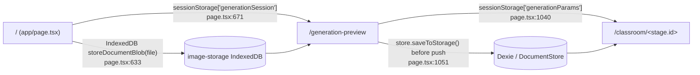
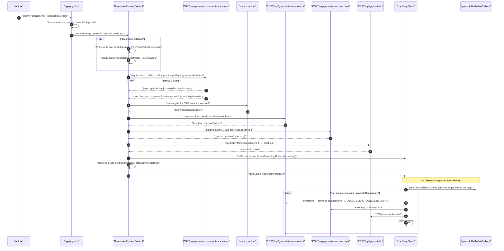
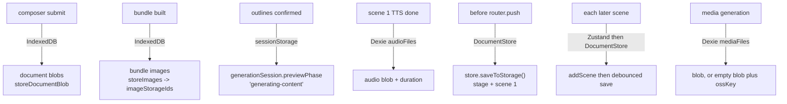
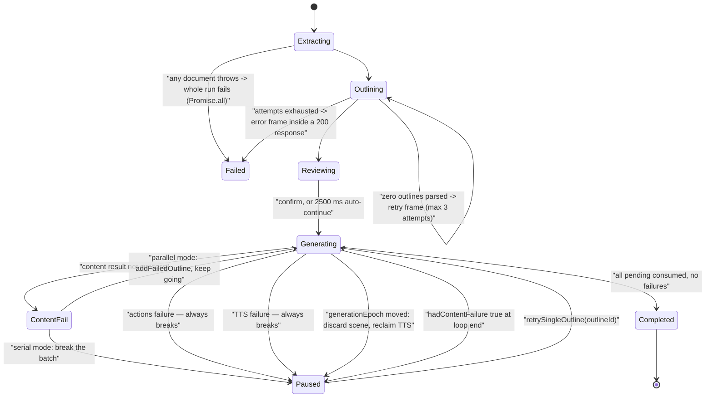
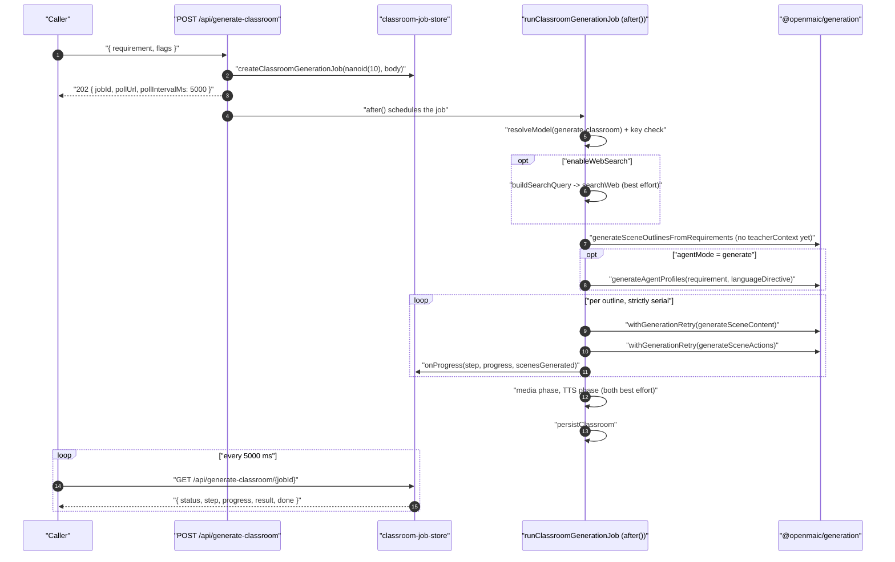

# 02 — Topic to classroom

The primary authoring flow: a free-text requirement becomes a persisted `Stage`
with ordered `Scene`s, each carrying typed content and an `Action` playback
script. Two implementations exist over the same primitives — a **browser loop**
and a **headless server job**. Both are traced here, because their retry and
partial-failure semantics differ and the difference is load-bearing.

**Sources:** `app/page.tsx:604-682`, `app/generation-preview/page.tsx:306`, `:568`,
`:680`, `:1014-1052`, `lib/hooks/use-scene-generator.ts:640-880`,
`lib/server/classroom-generation.ts`, `app/api/generate-classroom/route.ts`,
`app/api/generate/scene-outlines-stream/route.ts`,
`app/api/generate/scene-content/route.ts`, `app/api/generate/scene-actions/route.ts`,
`packages/@openmaic/generation/src/{outline-generator,scene-generator,scene-builder}.ts`;
`../appendix/research/generation-pipeline/03a-flows-ingestion-outline.md`,
`../appendix/research/generation-pipeline/03b-flows-scenes-and-quiz.md`.

## Route handoff: nothing travels as a route param

Neither key is schema-validated on read. `generationSession` is normalised
defensively (`app/generation-preview/page.tsx:223-237` backfills a missing
`previewPhase` and coerces `taskEngineMode`); `generationParams` is read as
untyped JSON and never cleared.

## Sequence — the browser path, end to end

## Hop table — outline stage

| # | Where | Call | Effect |
| --- | --- | --- | --- |
| 1 | `app/page.tsx:608-615` | build `UserRequirements` | `taskEngineMode: true` only when the vocational toggle is on |
| 2 | `app/page.tsx:671-673` | `sessionStorage.setItem('generationSession', …)` then `router.push` | the whole handoff payload |
| 3 | `app/generation-preview/page.tsx:306` | `startGeneration(sessionOverride?)` | one `AbortController` per run, replacing the previous one (`:311-313`) |
| 4 | `page.tsx:568` | `fetch('/api/generate/scene-outlines-stream', { headers: getApiHeaders() })` | credentials travel as `x-model` / `x-api-key` / `x-base-url` / `x-provider-type` headers |
| 5 | `app/api/generate/scene-outlines-stream/route.ts:299` | `resolveModelFromRequest(req, body, 'scene-outlines-stream')` | a `MODEL_ROUTES` entry for the stage **wins over `x-model` and discards the client key** |
| 6 | `route.ts:339-397` | `sortDocumentImagesForVision` → slice at `MAX_VISION_IMAGES` → `resolveVisionImagesForPrompt` | unresolvable asset ids are dropped from **both** the prompt text and the attachments, so `[see attached]` can never promise a missing image |
| 7 | `route.ts:421` | `buildOutlinePrompt(requirements, {...})` | package-owned; four golden snapshots pin it byte-for-byte |
| 8 | `route.ts:461-489` | `new ReadableStream` + 15 s `:heartbeat` | SSE opens with HTTP 200 before any model token arrives |
| 9 | `route.ts:551-599` per chunk | `extractLanguageDirective` / `extractCourseTitle` (8 KiB head scan, once each), then `extractNewOutlines(fullText, scanFrom)` | resumable brace matcher; each complete object is normalised, id-uniquified, `order`-assigned, emitted |
| 10 | `route.ts:543` | 512 KiB buffer ceiling | stop reading, finalise with whatever parsed |
| 11 | `route.ts:613-632` | zero outlines and attempts left | emit `retry`, restart the whole stream (3 attempts total) |
| 12 | `route.ts:661-672` | `uniquifyMediaElementIds` then emit `done` | `gen_img_1` → `gen_img_<nanoid(8)>` across the whole course |
| 13 | `page.tsx:616-625` | a `retry` frame | clears collected outlines **and** the latched directive/title, so a succeeding attempt cannot inherit stale values |
| 14 | `page.tsx:680-697` | review gate | `reviewOutlineEnabled` setting, or a sticky mid-stream intent; otherwise auto-continue after `OUTLINE_REVIEW_AUTO_CONTINUE_MS` (2500 ms) |
| 15 | `page.tsx:722-733` | `stage.taskEngineMode`, `stage.languageDirective`, `stage.name = courseTitle` | the LLM-inferred title replaces the raw-requirement placeholder |

## Hop table — per-scene stage (browser)

| # | Where | Call | Effect |
| --- | --- | --- | --- |
| 1 | `use-scene-generator.ts:645` | capture `startEpoch = state.generationEpoch` | every later step re-checks it |
| 2 | `:654-657` | pending = outlines whose `order` has no scene, sorted | resume-safe by construction |
| 3 | `:672` | `generateMediaForOutlines(...)` **not awaited** | image/video generation runs beside the loop; its rejection is only logged |
| 4 | `:677-684` | seed `previousSpeeches` from the highest-order existing scene | cross-scene speech coherence survives a resume |
| 5 | `:689-695` | re-clamp `parallelSceneConcurrency` a third time | "so a stale/garbage store value can never spawn an unbounded fetch fan-out" |
| 6 | `:727-749` | `lazyBoundedMap(pending, n, fetchContent, { shouldContinue })` | all promises created immediately, at most `n` executing; `shouldContinue` checks abort **and** epoch |
| 7 | `:753-774` | consume `contentPromises.get(outline.id)` **in order** | scene 1 still paints after content(1)+actions(1)+TTS(1) — there is no barrier |
| 8 | `app/api/generate/scene-content/route.ts:116` | `resolveModelFromRequest(req, body, 'scene-content:<type>')` | per-scene-type model routing, falling back to the base `scene-content` key |
| 9 | `route.ts:179` | `applyOutlineFallbacks(outline, !!languageModel, …)` | returns `effectiveOutline`, echoed back so the client's actions call uses the demoted type |
| 10 | `use-scene-generator.ts:804-816` | `POST /api/generate/scene-actions` with `content` + `previousSpeeches` | serial by necessity |
| 11 | `app/api/generate/scene-actions/route.ts:170` | `buildCompleteScene(outline, content, actions, stageId)` | returns `null` on shape mismatch |
| 12 | `use-scene-generator.ts:831-847` | `generateTTSForScene(scene, …)` | **a TTS failure fails the whole scene** and pauses the batch |
| 13 | `use-scene-generator.ts:850-854` | epoch re-check after TTS | epoch moved ⇒ `removeFreshTtsAllocations(...)` and break, so a stage switch never leaks audio assets |
| 14 | `use-scene-generator.ts:856-859` | `useStageStore.addScene(scene)` | scene becomes visible; `previousSpeeches` advances |

## Data shape at each boundary

| Boundary | Type | Declared in |
| --- | --- | --- |
| `/` → `/generation-preview` | `GenerationSessionState` (via `sessionStorage`) | `app/generation-preview/page.tsx` local type |
| composer → outline call | `UserRequirements` | `app/page.tsx:608` builds it |
| outline SSE frames | `{type:'languageDirective'\|'courseTitle'\|'outline'\|'retry'\|'done'\|'error', …}` | `app/api/generate/scene-outlines-stream/route.ts` (untyped literal objects; no shared union) |
| outline → content | `SceneOutline` | `@openmaic/dsl` |
| content response | `GeneratedSlideContent` / `GeneratedQuizContent` / `GeneratedInteractiveContent` / PBL `{ projectV2 }` | `packages/@openmaic/generation/src/scene-generator.ts` |
| actions response | `{ scene: Scene, previousSpeeches: string[] }` | assembled by `buildCompleteScene`, `scene-builder.ts:22` |
| persisted unit | `Stage` + `Scene[]` + outline | `packages/@openmaic/dsl/src/stage.ts` |
| audio | `AudioFileRecord { id, stageId, blob, duration, format, text, voice }` | written at `use-scene-generator.ts:474-483` |

The **outline SSE wire format is the only untyped contract in this flow** — there
is no exported discriminated union for it, unlike PBL's `PBLSSEEvent`
(`lib/pbl/v2/api/sse.ts`). Client and server agree by convention.

## Persistence points

Only P5 is synchronous with a user-visible transition: `await
store.saveToStorage()` at `page.tsx:1051` runs **before** `router.push`, so the
classroom route can never load an unsaved stage.

## Failure and recovery semantics

The asymmetry is documented in place at `use-scene-generator.ts:698-706`: scene
**content** has no cross-scene dependency so it may run ahead and a single
failure only marks that outline failed; **actions and TTS stay strictly serial**
to preserve the `previousSpeeches` chain and the pause-on-failure UX.

Governing convention across the whole pipeline is **degrade-don't-fail**:
malformed slide elements are dropped individually, unmapped image ids remove
their element, zero parsed actions fall back to a canned `Action` list. Two
deliberate exceptions: PBL scene generation throws `PBLGenerationError`, and a
scene's TTS failure fails the whole scene.

## The headless variant, and where it diverges

`POST /api/generate-classroom` runs the same generation package with different
wiring. Only the divergences are listed; the shared steps are above.

| Aspect | Browser loop | Headless job |
| --- | --- | --- |
| Entry | `startGeneration()` in a React component | `app/api/generate-classroom/route.ts` → `after(() => runClassroomGenerationJob(...))` — the work outlives the 202 response |
| Model resolution | per-request headers, client may supply a key | `resolveModel({ stage: 'generate-classroom' })` — **server-side only**, no client headers |
| Missing key | request fails at the route | `isProviderKeyRequired(providerId) && !apiKey` ⇒ throw naming the expected env var |
| Scene loop | bounded-parallel content, serial actions/TTS | **strictly serial**, one outline at a time |
| Agents | generated before the first scene, from settings | `agentMode === 'generate'` ⇒ `generateAgentProfiles`; any throw falls back to `getDefaultAgents()` |
| Web search | a separate client step | inline: `buildSearchQuery` → `searchWeb` → `formatSearchResultsAsContext`; any failure logs and continues with no research context |
| Store | `useStageStore` (Zustand) | `createInMemoryStore(stage)` + `createStageAPI(store)` — the store seam is faked in-process (`classroom-generation.ts:89`) |
| PBL failure | fails the scene, pauses the batch | `containPBLGenerationError` turns it into `null` — the scene is **skipped** (`classroom-generation.ts:42-46`) |
| Zero scenes | `paused` with failed outlines | `throw new Error('No scenes were generated')` — the job fails |
| Media + TTS | inline in the loop | separate phases, each in a try/catch that logs and continues |
| Progress | Zustand store state | a polled job row: 8 `ClassroomGenerationStep` values (`classroom-generation.ts:62-70`), `pollIntervalMs: 5000` |
| Persistence | `store.saveToStorage()` | `persistClassroom({ id, stage, scenes }, baseUrl)` |

`GenerateClassroomInput` (`classroom-generation.ts:48-60`) has exactly eleven
members. Notably absent: any `language` field — see
[`09-external-workbench.md`](./09-external-workbench.md) for why that matters.

## Open questions

- The two paths are near-duplicates with different retry wiring and different
  partial-failure semantics. Nothing in the tree records which is canonical, and
  no test pins them against each other.
- `sessionStorage['generationParams']` is never removed. A stale entry from a
  previous run is read by `/classroom/[id]` (`page.tsx:159-160`); whether the
  stage-id mismatch is checked before use was not traced end to end here.

## Related

- [`03-document-to-classroom.md`](./03-document-to-classroom.md) — the extraction half of step 3.
- [`11-concurrency-and-backpressure.md`](./11-concurrency-and-backpressure.md) — `lazyBoundedMap`, the epoch guard, and where the real bottleneck sits.
- `../06-generation-pipeline/index.md` — component structure of the package these hops call.
