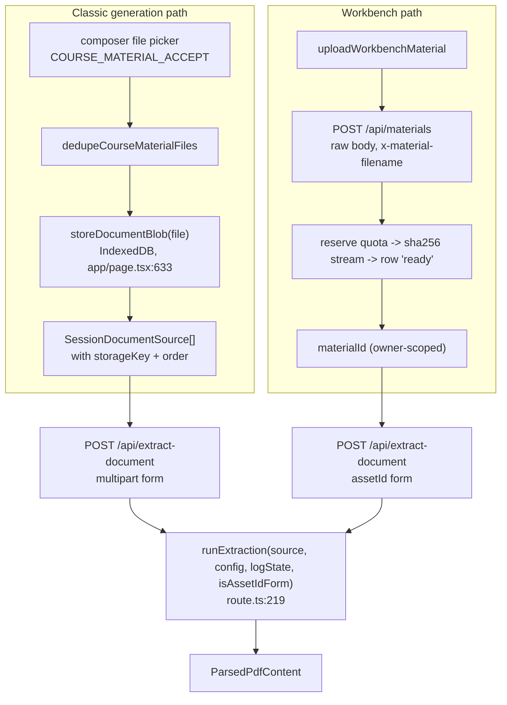
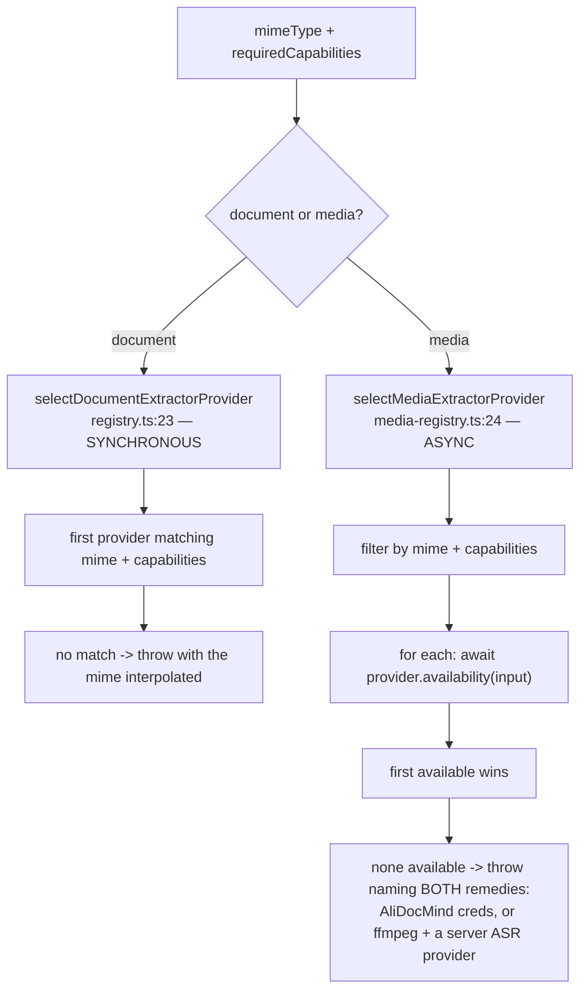
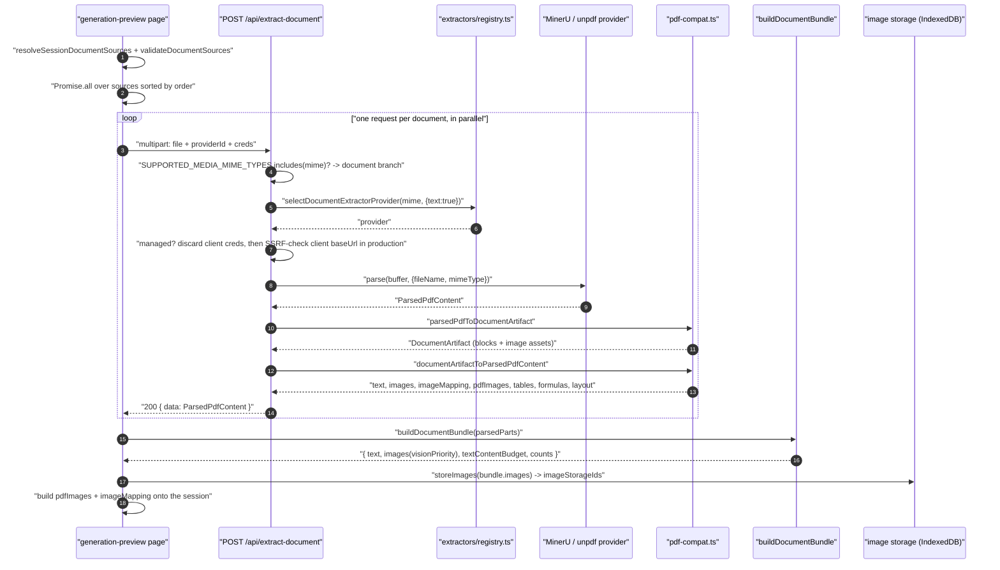
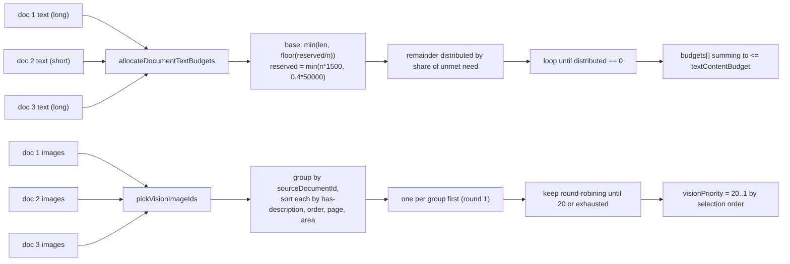
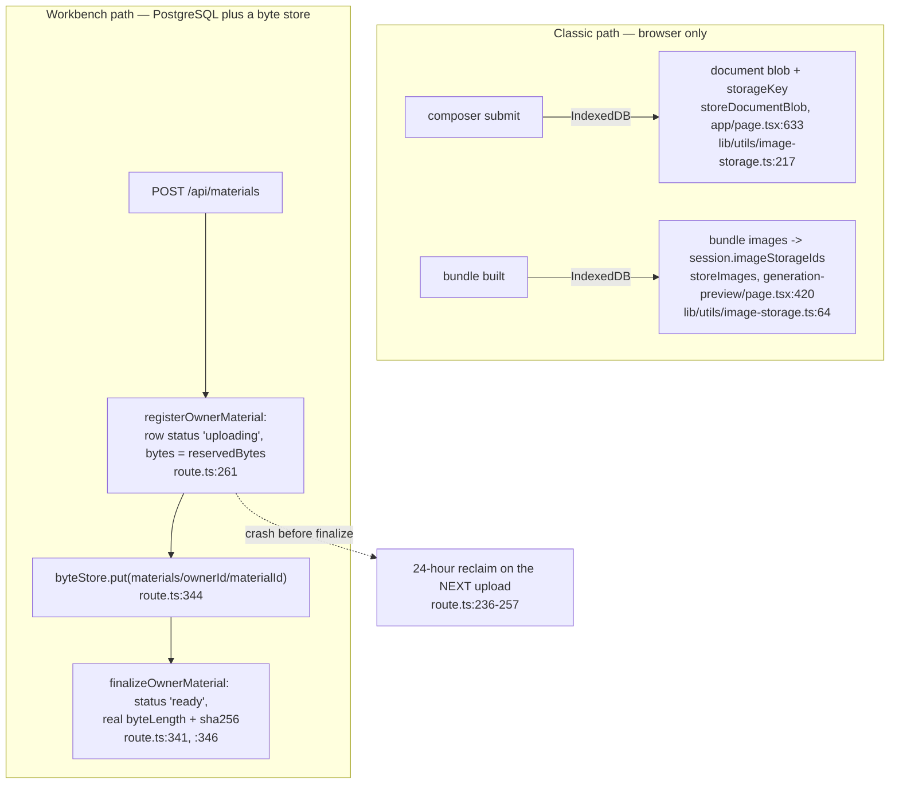
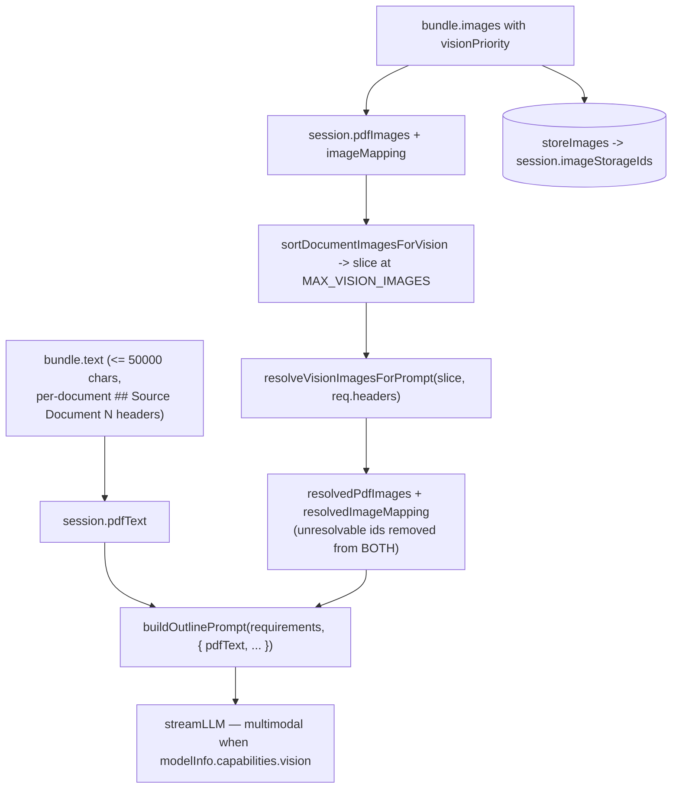

# 03 — Document to classroom

Upload → extraction → normalised material → the outline prompt. Everything a
learner's `.pdf`, `.pptx`, `.docx` or `.mp4` goes through before a single model
token is spent, and where the byte, character and image budgets bite.

**Sources:** `app/api/materials/route.ts`, `app/api/extract-document/route.ts:219`,
`lib/document/extractors/registry.ts`, `lib/document/extractors/media-registry.ts`,
`lib/document/extractors/manifest.ts:60`, `lib/document/bundle.ts`,
`lib/document/pdf-compat.ts`, `lib/constants/generation.ts:7`, `:10`,
`app/generation-preview/page.tsx:327-429`,
`lib/server/agent-runtime/config.ts:46-55`;
`../appendix/research/generation-pipeline/03a-flows-ingestion-outline.md`,
`../appendix/research/generation-pipeline/02c-interfaces-ingestion.md`.

## Two upload doorways, one extraction core

`runExtraction` is the single shared body; `isAssetIdForm` exists only to swap
error messages, because the asset-id form must not echo caller-controlled text
back (`route.ts:214-217`, `:290-299`, `:336-344`).

## Byte and quota caps

| Cap | Value | Where |
| --- | --- | --- |
| Media (audio/video) upload | `agentRuntimeConfig.maxUploadBytes` (50 MiB default) | `lib/server/agent-runtime/config.ts:46` |
| Document / image upload | `min(maxDocumentBytes, maxUploadBytes)` (50 MiB default) | `app/api/materials/route.ts:70-73` |
| Active material records per owner | 100 | `config.ts:50` |
| Aggregate bytes per owner | 2 GiB | `config.ts:52-55` |
| Files per bundle | `MAX_DOCUMENT_BUNDLE_FILES = 5` | `lib/document/bundle.ts:4` |
| Total bundle bytes | `MAX_DOCUMENT_BUNDLE_TOTAL_SIZE_BYTES = 150 MiB` | `bundle.ts:5` |
| Bundle text characters | `MAX_PDF_CONTENT_CHARS = 50000` | `lib/constants/generation.ts:7` |
| Vision images per prompt | `MAX_VISION_IMAGES = 20` | `lib/constants/generation.ts:10` |

Both upload caps are enforced twice — on the declared `content-length` **and** on
the streamed body — because a declared length is a claim, not a fact
(`app/api/materials/route.ts:17-19`).

## Extractor selection

Registry insertion order **is** the auto-selection order. `selectDocumentExtractorProvider`
returns the first provider whose `supportedMimeTypes` contains the normalised
MIME and whose `capabilities` satisfy the request (`registry.ts:50`).

| Provider | Kind | MIME coverage | Extra capabilities | Async |
| --- | --- | --- | --- | --- |
| `plain-text` | document | `PLAIN_TEXT_MIMES` | text only | no |
| `unpdf` | document | `application/pdf` | + images | no |
| `mineru` (self-hosted) | document | `MINERU_SELFHOST_MIMES` | + tables, formulas, layout, OCR | no |
| `mineru-cloud` | document | `MINERU_CLOUD_MIMES` | same as above | **yes** |
| `alidocmind` | document | `ALIDOCMIND_MIMES` | same as above | **yes** |
| `alidocmind` | media | `ALIDOCMIND_MEDIA_MIMES` | transcript, keyframes, synopsis, OCR | **yes** |
| `local-ffmpeg` | media | `LOCAL_FFMPEG_MEDIA_MIMES` | transcript, keyframes (no synopsis, no OCR) | no |

Capability metadata is duplicated into a **browser-safe manifest**
(`lib/document/extractors/manifest.ts:60`) whose header states the ordering
invariant: *insertion order IS the auto-selection order and must stay identical
to the registry's provider order … so client-side expected-extractor resolution
picks the same provider the server would.* That mirror exists so client pages
never pull `sharp` or `@alicloud` into the bundle.

The two selectors differ in one important way:

Media selection probes **credential availability at call time**, which is why an
AliDocMind-less deployment silently falls through to `local-ffmpeg` rather than
failing.

## Sequence — a `.pptx` plus a `.pdf` become one bundle

## Hop table — the media divergence

An `.mp4` takes the same route but a different branch. Only the differing hops:

| # | Where | Call | Effect |
| --- | --- | --- | --- |
| 6a | `app/api/extract-document/route.ts:230` | `SUPPORTED_MEDIA_MIME_TYPES.includes(mimeType)` | media branch |
| 6b | `route.ts:235-247` | a document-only `providerId` for a media MIME | 400 naming the media-capable options, instead of an opaque 500 downstream |
| 6c | `route.ts:248-254` | `mediaManaged` = not `local-ffmpeg` **and** `alidocmind` is server-configured | managed ⇒ client AK/SK discarded, server creds resolved from env **or** YAML |
| 6d | `route.ts:258-263` | client `baseUrl` SSRF-checked, **production only** | `validateUrlForSSRF` ⇒ 403 `INVALID_URL` |
| 6e | `route.ts:264` | `extractMedia({buffer, fileName, fileSize, mimeType, config})` | registry walks providers, `availability()` decides |
| 6f | `route.ts:287` | `mediaArtifactToText(artifact)` | `## Synopsis` / `## Transcript` with `[MM:SS]` markers / `## Keyframes` |
| 6g | `route.ts:292-300` | empty-text guard | **422, never an empty 200** — "returning empty text as 200 would silently generate from nothing" |
| 6h | `route.ts:301-312` | wrap into `ParsedPdfContent` with `images: []`, `pageCount: 0` | media rejoins the identical downstream path |

## `buildDocumentBundle`: three budgets in one pass

`buildDocumentBundle(parts, options?)` (`bundle.ts:181`) does four things, in
this order, and each one matters downstream.

| Step | What | Where |
| --- | --- | --- |
| 1 | Sort by `source.order`, then renumber every image id to `doc_<order>_img_<n>` and rewrite the same ids inside the text with a word-boundary regex | `bundle.ts:187-209`, `replaceImageIds` at `:36` |
| 2 | Compute `framingChars` from the per-document section headers, subtract from `maxChars` to get `textContentBudget` | `:211-215` |
| 3 | `allocateDocumentTextBudgets(lengths, budget)` — reserve `min(n × 1500, 40 % of maxChars)` split evenly, then distribute the remainder **proportionally to unmet need**, iterating until nothing more can be placed | `:72-109` |
| 4 | Flatten all images, renumber globally to `img_1..N`, then `pickVisionImageIds` round-robins across source documents so no single document monopolises the 20 vision slots | `:221-243`, `:127-163` |

Short documents are protected by the reserved floor; long documents get the
surplus. A document whose text is shorter than its base share never wastes
budget, because `budgets` is `min(length, basePerDocument)`.

## Data shape at each boundary

| Boundary | Type | Declared in |
| --- | --- | --- |
| upload → route | raw request body + `content-type` + `x-material-filename` | `app/api/materials/route.ts:11-19` (no JSON envelope) |
| route → extractor | `ExtractSource { fileName, fileSize, mimeType, buffer }` | `app/api/extract-document/route.ts` |
| extractor → compat | `DocumentArtifact` (blocks + image assets) or `MediaArtifact` | `lib/document/types.ts` |
| compat → response | `ParsedPdfContent { text, images, metadata{pageCount,fileName,fileSize,mimeType,parser} }` | `lib/document/pdf-compat.ts` |
| response → bundle | `ParsedDocumentPart { source, text, rawTextLength, pageCount?, images }` | `lib/document/bundle.ts:15` |
| bundle → session | `DocumentBundleResult { text, images(+visionPriority), textContentBudget, totalRawTextLength, totalImageCount, visionImageCount }` | `bundle.ts:23` |
| session → outline prompt | `pdfText`, `pdfImages: PdfImage[]`, `imageMapping` | `lib/types/generation.ts` |

`ParsedPdfContent` is the *lingua franca*: five document extractors, two media
extractors, and both upload doorways all converge on it. That is why the media
branch bothers to synthesise `images: []` / `pageCount: 0` rather than defining
its own response shape.

Note the `DocumentArtifact` ↔ `ParsedPdfContent` round trip at
`route.ts` hops 11-12: the artifact model is built and then immediately
flattened back. The richer artifact contract exists but nothing downstream of
this route consumes it.

## Persistence points

The two doorways persist to different tiers, and only the workbench one leaves
anything server-side.

| Write | Tier | Lifecycle |
| --- | --- | --- |
| document blobs | IndexedDB | keyed by `storageKey`, referenced from `SessionDocumentSource`; removed by `deleteDocumentBlob`. A missing blob fails the run (`page.tsx:355-357`) |
| bundle images | IndexedDB | `storeImages(bundle.images)` → `session.imageStorageIds`; survives the reload of `/generation-preview` |
| owner material row | PostgreSQL `owner_material` | exactly two statuses, `OWNER_MATERIAL_STATUSES = ['uploading', 'ready']` (`lib/persistence/owner-materials.ts:30`). The reservation is quota-checked on both `maxMaterialsPerOwner` (100) and `maxMaterialBytesPerOwner` (2 GiB) before a byte is read |
| material bytes | byte store object `materials/<ownerId>/<materialId>` | key is recorded by the reservation **before** the write, so a crash after `put` still leaves a durable pointer (`route.ts:338-340`) |

Three ordering decisions here are load-bearing, and each is stated in the code:

- **Reserve before measure.** When an intermediary strips `Content-Length`, the
  reservation takes the *per-file maximum*, "so an unmeasured stream can never
  bypass the owner byte quota; finalize shrinks the reservation to its actual
  size" (`route.ts:224-229`). Every early exit — oversized stream, empty body,
  body exceeding its declared length — calls `abandonOwnerMaterial`
  (`route.ts:309`, `:316`, `:327`) so the reservation is not leaked.
- **`sha256` is computed on the finalize path only.** An `uploading` row's digest
  is null by construction; "finalized ready rows always carry a digest"
  (`owner-materials.ts:51`).
- **Bytes are deleted before their reservation.** The 24-hour reclaim
  (`STALE_UPLOAD_AGE_MS`, `owner-materials.ts:218`) removes each stale object
  first and deletes the row only after that, "so a failure here keeps the
  reservation for the next pass instead of losing the pointer to its bytes"
  (`route.ts:231-234`). The sweep is **lazy** — it runs inside the next upload,
  so an owner who never uploads again keeps their crash leftovers, and their
  quota stays consumed.

Extraction output itself is **never persisted**. `ParsedPdfContent` lives in the
response body and then in the session object; re-running the flow re-extracts and
re-pays the extractor cost. The material row carries only an `extraction:
{ status: 'idle' }` marker (`route.ts:271`), not the extracted text.

## Failure and degradation

| Failure | Posture | Where |
| --- | --- | --- |
| Unknown `providerId` supplied | **fail the request** — 400 `Unknown document extractor provider: <id>` | `route.ts:318-324` |
| Supplied provider does not support the MIME | **degrade** — `provider = undefined`, fall back to auto-selection | `route.ts:326` |
| No extractor for the MIME at all | **fail the request** — 400; interpolated MIME on multipart, generic on the asset-id form | `route.ts:335-344` |
| Self-hosted MinerU with no base URL and no cloud fallback | **fail the request** — 422 naming both remedies | `route.ts:355`, `:375` |
| Media artifact with no transcript / keyframes / synopsis | **fail the request** — 422 | `route.ts:292-300` |
| One document of several fails | **fail the whole run** — the client uses `Promise.all` (`app/generation-preview/page.tsx:340`) | no per-document degradation exists |
| Blob missing from IndexedDB | **fail the run** — `t('generation.courseMaterialLoadFailed')` | `page.tsx:355-357` |
| Image id present in text but not in the mapping | **degrade** — unresolvable ids are dropped from both the prompt text and the attachments | `app/api/generate/scene-outlines-stream/route.ts:383` |

The `Promise.all` at `page.tsx:340` is the sharpest edge in this flow: attach
five documents, and the slowest-and-flakiest one decides whether any of them
reach the model.

## Where extracted material actually lands in the prompt

Vision resolution happens **before** prompt assembly on purpose: the mapping
that reaches the template names only ids whose bytes were actually resolved, so
a `[see attached]` reference in the prompt text can never promise an attachment
the request does not carry (`route.ts:383`).

## Open questions

- `MAX_VISION_IMAGES` / `MAX_PDF_CONTENT_CHARS` exist as two unpinned copies —
  one in `lib/constants/generation.ts`, one inside `@openmaic/generation`. No
  test asserts they agree.
- `sortDocumentImagesForVision` is duplicated between `lib/document/bundle.ts:165`
  and the generation package. Divergence would silently change which images a
  vision model sees.
- The `ExtractionResult` / `ExtractionError` contracts and the document transform
  framework in `lib/document/` are not reached by any generation path traced
  here; their intended consumer is unclear.

## Related

- [`02-topic-to-classroom.md`](./02-topic-to-classroom.md) — what happens after the bundle exists.
- [`12-trust-boundaries-in-flight.md`](./12-trust-boundaries-in-flight.md) — the upload and extractor-egress crossings.
- `../06-generation-pipeline/index.md` — extractor component structure.
