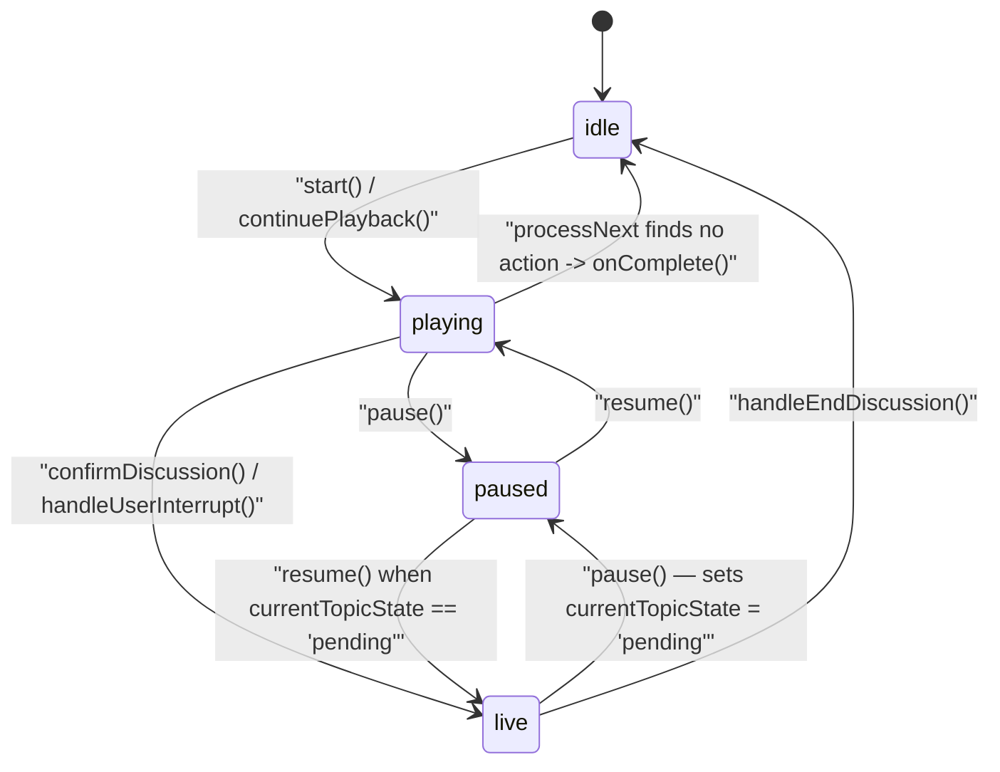
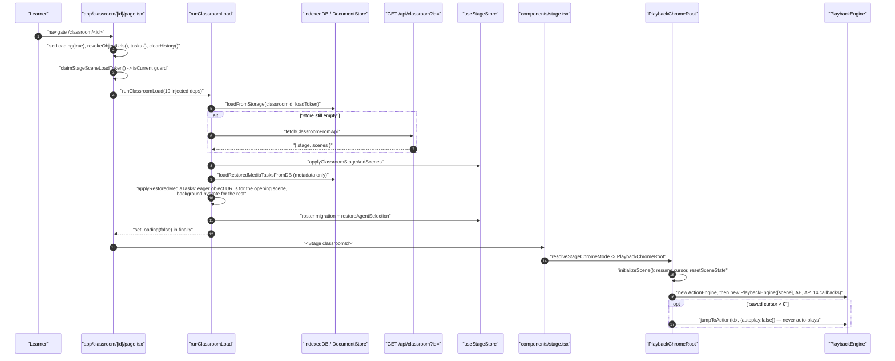
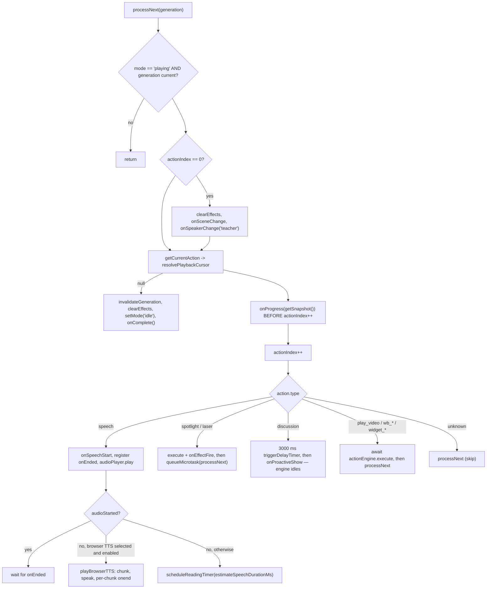
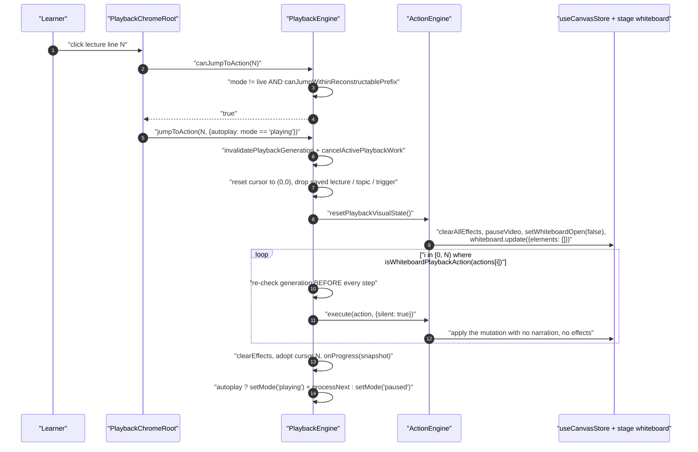
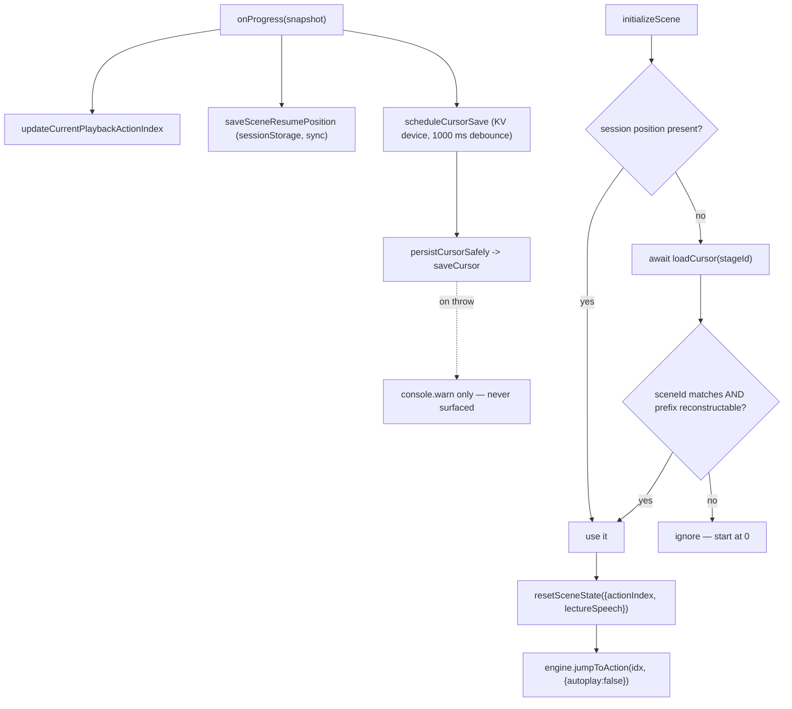

# 04 — Playing one scene

From "the learner pressed play" to "the last action of the scene has run".
Covers the four independent advance mechanisms, the cancellation discipline, TTS
in both authored and live form, whiteboard replay on seek, and the two resume
persistence layers.

**Sources:** `lib/playback/engine.ts`, `lib/playback/action-navigation.ts`,
`lib/playback/action-resume.ts`, `lib/playback/cursor.ts`,
`lib/action/engine.ts:178`, `lib/choreography/timing.ts`,
`components/edit/PlaybackChromeRoot.tsx`, `lib/classroom/load-classroom.ts`,
`lib/audio/tts-providers.ts:207`, `app/api/generate/tts/route.ts`;
`../appendix/research/classroom-runtime/03a-flows-playback.md`,
`../appendix/research/classroom-runtime/03b-flows-scenes-and-pbl.md`,
`../appendix/research/media-audio-video/03a-flows-audio-media.md`.

## The state machine, verbatim from the source

`PlaybackEngine`'s own header comment (`lib/playback/engine.ts:7-24`) draws the
machine. `EngineMode` has exactly four values.

## Cold open: what has to happen before play is even possible

The load token (`claimStageSceneLoadToken`) is the guard that makes a fast
back-and-forward navigation safe: every write inside `runClassroomLoad` is gated
on `isCurrent()`, which combines the React effect's own currency with the token's.

## Advance: four clocks, one at a time

There is **no single clock**. Whichever mechanism is live owns the advance, and
each one re-checks the generation counter before it fires.

| Mechanism | Trigger condition | Where the advance fires |
| --- | --- | --- |
| Pre-generated audio | `audioPlayer.play(audioId, legacyUrl)` resolved `true` | `audioPlayer.onEnded` callback, `engine.ts:589-595` |
| Browser-native TTS | no audio **and** `ttsEnabled` **and** `ttsProviderId === 'browser-native-tts'` **and** `isTTSProviderEnabled(...)` **and** `window.speechSynthesis` | per-chunk `onend` → `playBrowserTTSChunk`, `engine.ts:785-793` |
| Reading timer | no audio, and browser TTS not selected/enabled | `setTimeout(estimateSpeechDurationMs(text, {speed}))`, `engine.ts:601-614` |
| Awaited `ActionEngine.execute` | any `play_video`, `wb_*` or `widget_*` action | `await` returns, then `processNext(generation)`, `engine.ts:733-741` |

`spotlight` and `laser` are fire-and-forget: they advance through
`queueMicrotask` rather than recursing synchronously, "to avoid stack overflow
from deep synchronous recursion when many consecutive spotlight/laser actions
appear in sequence" (`engine.ts:669-676`).

`onProgress` fires **before** `actionIndex++` on purpose (`engine.ts:576-579`):
the snapshot points at the action about to run, so a restore replays that action
rather than skipping it — the right behaviour for a speech line the learner only
half heard.

## Cancellation: one monotonic counter, checked everywhere

`playbackGeneration` (`engine.ts:96`) is bumped by
`invalidatePlaybackGeneration()` (`:494`). Every async continuation captures the
generation it was scheduled under and calls `isCurrentGeneration(generation)`
(`:499`) before touching state. Callers that bump it: `pause()`,
`jumpToAction()`, `handleUserInterrupt()`, `confirmDiscussion()`,
`handleEndDiscussion()`, and `processNext`'s own completion path.

Two ordering decisions are deliberate and easy to break:

| Decision | Where | Why |
| --- | --- | --- |
| `setMode` runs **before** `audioPlayer.stop()` / `cancelBrowserTTS()` | `engine.ts:440` onward (`handleUserInterrupt`) | `cancel()` can fire `onend` synchronously; if the mode were still `playing`, that handler would advance the cursor |
| Browser TTS pause **cancels** instead of pausing | `engine.ts:242-248` | `speechSynthesis.pause()`/`resume()` is broken on Firefox; remaining chunks are stashed in `browserTTSPausedChunks` and re-spoken from the current chunk on resume (`:280-286`) |

`pause()` also stashes the *remaining* reading-timer milliseconds
(`speechTimerRemaining - (Date.now() - speechTimerStart)`, `engine.ts:232-235`)
and skips all audio work entirely when `currentTrigger` is set — a paused
ProactiveCard has no active speech to freeze (`:241`).

## Seek: admission is a static property of the action prefix

`jumpToAction` is refused unless the target is admissible. The predicate has two
halves and both must hold (`action-navigation.ts:65-78`):

1. The **target** must be a `speech` action, and no action in `[0, target)` may
   be one of `play_video`, `discussion`, `widget_highlight`, `widget_setState`,
   `widget_annotation`, `widget_reveal` (`UNSAFE_ACTION_TYPES`, `:16-23`).
2. The **current** prefix `[0, currentActionIndex)` must be equally clean.

Plus `mode !== 'live'` (`engine.ts:177`). A scene containing a single
`play_video` before its narration is therefore permanently unseekable past that
point, by design: those actions have side effects the engine cannot reconstruct.

`{silent: true}` short-circuits `speech`, `spotlight`, `laser`, `discussion`,
`play_video` and every `widget_*` at the top of `ActionEngine.execute`
(`lib/action/engine.ts:215-225`), so only whiteboard mutations actually run
during a replay. Note the auto-open behaviour survives silence: any `wb_*` that
is not `wb_open`/`wb_close` still calls `ensureWhiteboardOpen(options)`
(`:228-230`).

## TTS: two entirely different paths

```mermaid
flowchart TD
  subgraph auth["Authored narration (generation time)"]
    A1["SpeechAction.audioId"] --> A2["Dexie audioFiles.get(id)"]
    A2 --> A3["AudioPlayer.play -> HTMLAudioElement"]
    A3 --> A4["onEnded -> processNext"]
  end
  subgraph live["Live conversation (playback time)"]
    L1["StreamBuffer TextItem segment"] --> L2["sealLastText -> onSegmentSealed(messageId, partId, text, agentId)"]
    L2 --> L3["useDiscussionTTS: resolveVoiceForAgent(agentId)"]
    L3 --> L4["POST /api/generate/tts"]
    L4 --> L5["data:audio/<fmt>;base64,... -> new Audio(url)"]
    L5 --> L6["playbackRate = playbackSpeed, volume = ttsMuted ? 0 : ttsVolume"]
    L6 --> L7["shouldHold() keeps the segment on screen until audio finishes"]
  end
  subgraph none["No audio at all"]
    N1["browser-native-tts selected AND enabled"] --> N2["SpeechSynthesisUtterance per sentence chunk"]
    N3["otherwise"] --> N4["estimateSpeechDurationMs reading timer"]
  end
```

Two things that look like the same concept and are not: an authored
`SpeechAction` with a pre-generated `audioId`, versus a live `StreamBuffer`
segment that gets sealed then TTS-queued. The only identifier in the tree
actually called "utterance" is `SpeechSynthesisUtterance` (`engine.ts:798`).

The live path holds a segment on screen via a `{holding, segmentDone}` protocol
between `StreamBuffer` and `useDiscussionTTS`, evaluated on every 30 ms tick —
detailed in [`05-roundtable-turn.md`](./05-roundtable-turn.md).

## Whiteboard during playback

Every whiteboard primitive is a `PPTElement`; there are no freehand strokes. On
the live playback path a `wb_*` action mutates the canvas store directly through
`ActionEngine`. The durable path — used by agent tools — appends a
`WhiteboardRuntimePayloadV1` record and projects the folded state back:

| # | Hop | Where |
| --- | --- | --- |
| 1 | caller builds `{ payloadVersion: 1, operationId, operation }` | `lib/whiteboard/runtime/types.ts:62` |
| 2 | `service.append({stageId, expectedLastSeq, payload})` under `withRuntimeStorageSharedLock` | `lib/whiteboard/runtime/store.ts:174`, `:188` |
| 3 | `foldWhiteboardRuntimeRecords` (`lib/whiteboard/runtime/fold.ts:170`) replays from seq 0 with envelope validation (`:181-199`) and digest idempotency: a repeated `operationId` whose `sha256Canonical` digest matches is skipped, a mismatching one throws `WHITEBOARD_RUNTIME_OPERATION_CONFLICT` | `fold.ts:200-206` |
| 4 | same `operationId` + same digest ⇒ `{replayed: true}`; same id, different digest ⇒ conflict | `store.ts:158` |
| 5 | `before.lastSeq !== expectedLastSeq` ⇒ `RuntimeAppendConflictError` | `store.ts:214` |
| 6 | **dry-run** `applyWhiteboardRuntimeOperation` before persisting | `fold.ts:51` |
| 7 | `appendRecord(..., {expectedLastSeq})`, then a post-commit re-fold verifying `committedSeq` | `store.ts:237`, `:270-274` |
| 8 | `refreshWhiteboardRuntimeProjection(stageId, minimumLastSeq?)` with three staleness guards | `lib/whiteboard/runtime/browser-projection.ts:8` |

The dry run at step 6 exists so a no-op (clearing an already-empty board) or a
validation failure never writes a record.

## Timing constants shared with the video exporter

`lib/choreography/timing.ts` holds these literally, so the app engine and the
exporter cannot drift. The module is machine-fenced pure by a dedicated ESLint
block (`eslint.config.mjs`).

| Constant | Value | Meaning |
| --- | --- | --- |
| `EFFECT_AUTO_CLEAR_MS` | 5000 | spotlight/laser lifetime |
| `DISCUSSION_TRIGGER_DELAY_MS` | 3000 | dwell before the ProactiveCard appears |
| `DISCUSSION_AUTO_SKIP_MS` | 5000 | card countdown before auto-skip |
| `MAX_VIDEO_WAIT_MS` | 300000 | ceiling on a `play_video` await |
| `WB_OPEN_MS` / `WB_DRAW_MS` / `WB_EDIT_MS` / `WB_DELETE_MS` / `WB_CLOSE_MS` | 2000 / 800 / 600 / 300 / 700 | whiteboard beat durations |
| `WIDGET_MS` | 300 | widget action beat |

The exporter models the unattended discussion beat as
`DISCUSSION_TRIGGER_DELAY_MS + DISCUSSION_AUTO_SKIP_MS` = 8000 ms of dwell,
which is exactly the auto-skip path.

## Data shape at each boundary

| Boundary | Type | Declared in |
| --- | --- | --- |
| `GET /api/classroom?id=` → loader | `ClassroomPayload { stage, scenes }`, wrapped as `apiSuccess({ classroom })` | `lib/classroom/load-classroom.ts:32`; route at `app/api/classroom/route.ts:72` |
| page → load pipeline | `RunClassroomLoadArgs<TMediaTasks>` — 19 injected dependencies, no globals | `lib/classroom/load-classroom.ts:56-92` |
| authored narration → audio element | `SpeechAction.audioId` → `AudioFileRecord { id, stageId?, blob, duration?, format, text, voice }` from Dexie `audioFiles` | `lib/utils/database.ts:127` |
| live TTS response | `apiSuccess({ audioId, base64, format })`, assembled client-side into a `data:audio/<format>;base64,…` URL | `app/api/generate/tts/route.ts:157-161` |
| engine → chrome, once per action | `PlaybackSnapshot { sceneIndex, actionIndex, consumedDiscussions, sceneId? }` | `lib/playback/types.ts:5` |
| chrome → `sessionStorage` | `StoredActionResumePosition { actionIndex, actionId, actionType }` inside `{ version: 1, scenes: Record<sceneId, …> }` under key prefix `openmaic:playback-action-resume` | `lib/playback/action-resume.ts:4`, `:15`, `:20` |
| chrome → KV device cursor | `PlaybackCursor { sceneId, actionIndex, updatedAt }` under `playback-cursor:<stageId>` | `lib/playback/cursor.ts:11`, `:36` |
| agent tool → durable whiteboard | `WhiteboardRuntimePayloadV1 { payloadVersion, operationId, operation }`, where `operation` is one of **five** `WhiteboardRuntimeOperationV1` variants | `lib/whiteboard/runtime/types.ts:62`, `:55-60` |
| folded whiteboard → browser | `FoldedWhiteboardRuntimeState { sessionId, whiteboard, lastSeq }` | `lib/whiteboard/runtime/types.ts:68` |
| action → `ActionEngine` | `Action` (`EngineMode` is a separate 4-value union) | `packages/@openmaic/dsl/src/action.ts:235`, `lib/playback/types.ts:18` |

Two asymmetries this makes visible. The resume record stores `actionId` **and**
`actionType` alongside the index, which is what lets restore validate that the
scene has not been re-authored under it — the KV cursor stores only
`sceneId`/`actionIndex`, which is why it needs the extra
`canJumpWithinReconstructablePrefix` check on read. And the two audio paths never
share a type: an authored `AudioFileRecord` carries a `Blob` and a `duration`, the
live path carries base64 with neither, so nothing on the live path can be seeked.

## Persistence points during playback

Two layers, with an explicit precedence.

| Layer | Scope | Written when | Read when |
| --- | --- | --- | --- |
| `sessionStorage` action-resume | per tab, per stage, per scene | synchronously on every `onProgress` (`PlaybackChromeRoot.tsx:769`) | first, at `initializeScene` (`:682`) — **wins** |
| KV `device` cursor | per device, per stage, last-write-wins | debounced 1000 ms (`PlaybackChromeRoot.tsx:326-336`) | only when there is no session position (`:692`) |

The device cursor is accepted only if `cursor.sceneId === currentScene.id` **and**
`canJumpWithinReconstructablePrefix(actions, 0, cursor.actionIndex)` — a saved
position behind an unseekable prefix is discarded rather than replayed wrongly.

`saveSceneResumePosition` also *clears* the stored position in two cases
(`PlaybackChromeRoot.tsx:352-366`): the index is past the end of the scene, or
the current action is a non-speech action whose prefix crossed an unsafe action.

Consumed-discussion state is deliberately **not** durable: the legacy Dexie
`playbackState` row's cursor half migrates, its `consumedDiscussions` array does
not, "because playback learner state is front-end ephemeral UX; a re-shown
discussion card auto-skips, so durability buys nothing" (`cursor.ts:96-101`).

## Failure modes

| Failure | Effect | Where |
| --- | --- | --- |
| `audioPlayer.play` rejects | logged, falls back to `scheduleReadingTimer()` | `engine.ts:650-654` |
| Speech action with empty text | routed straight to the reading timer, never to browser TTS — an empty `SpeechSynthesisUtterance` does not reliably fire `onend` in Chromium and would hang the slide | `engine.ts:616-621`, `:764-767` |
| Browser TTS chunk longer than ~15 s | pre-empted by sentence-level chunking; Chrome silently cuts long utterances and never fires `onend` | `engine.ts:752-768` |
| Cursor save throws | `console.warn`, playback continues | `PlaybackChromeRoot.tsx:319-321` |
| Corrupt legacy cursor timestamp | falls back to "now" and deletes the legacy row, rather than re-throwing forever and silently disabling resume | `cursor.ts:119-124` |
| Scene switch mid-speech | `sceneEpochRef.current++` discards stale `onLiveSpeech` / `onThinking` microtasks from the previous scene's buffer | `PlaybackChromeRoot.tsx:655`, `:1745` |
| Unknown action type | skipped, `processNext` continues | `engine.ts:743-746` |

## Open questions

- `app/classroom/[id]/page.tsx` runs its **own** copy of the load pipeline and
  does not import `ClassroomSurface`; the evidence pack records that the two
  copies have already diverged. Which is authoritative is not stated anywhere.
- Animation descriptors in `lib/choreography` are hand-transcribed mirrors of the
  React overlays, consumed only by the exporter and a schema test — nothing
  proves the mirror still matches what playback renders.

## Related

- [`05-roundtable-turn.md`](./05-roundtable-turn.md) — what happens once the engine reaches `live`.
- [`08-export-video.md`](./08-export-video.md) — the exporter that consumes these same timing literals.
- `../08-classroom-runtime/index.md` — component structure of the engine, buffer and chrome.
