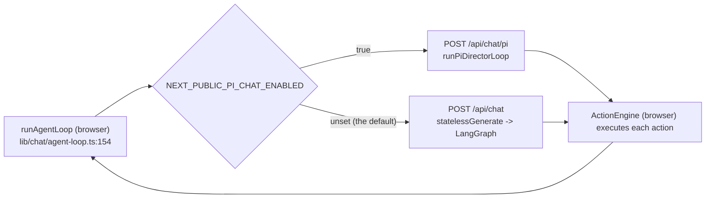
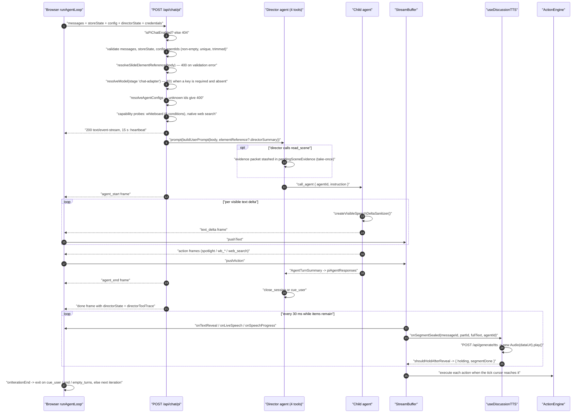
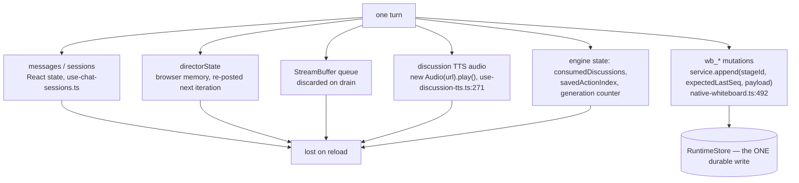
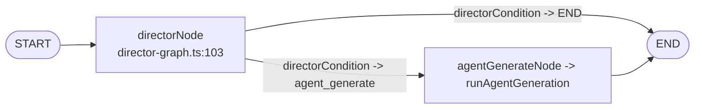
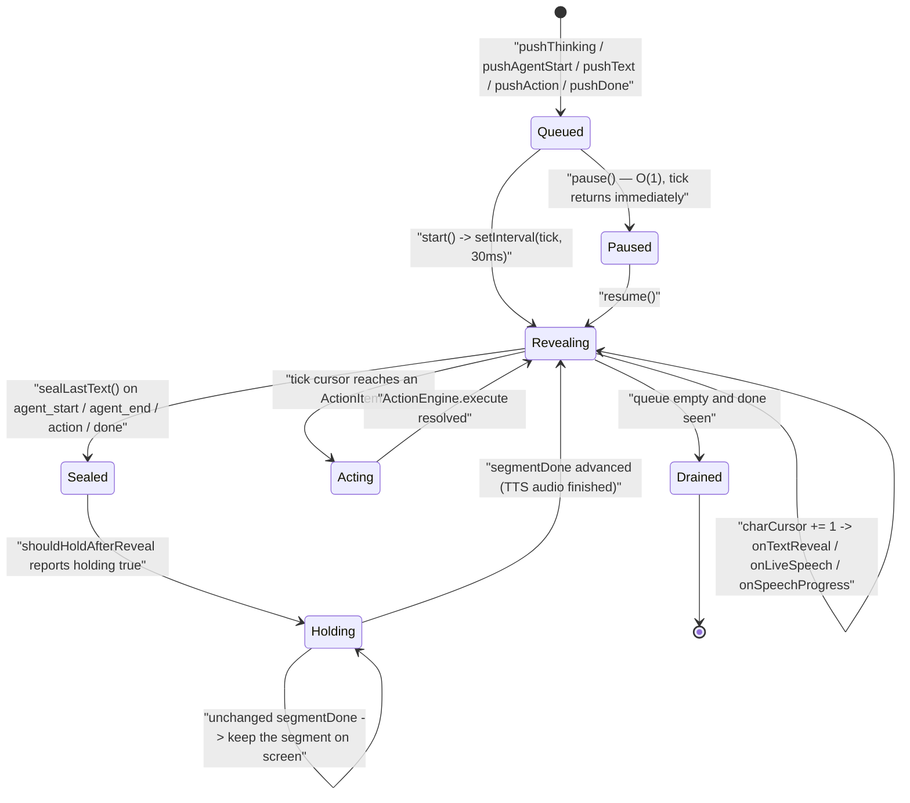
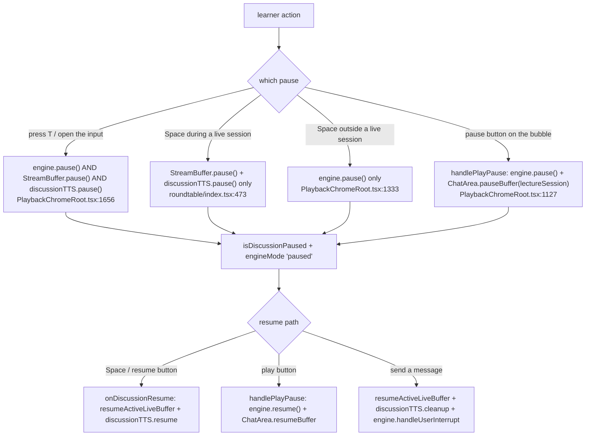

# 05 — One multi-agent turn

A learner interrupts, or an authored `discussion` action fires. What follows is
one HTTP request, a director agent, at most one child agent per director tool
call, a paced reveal loop, per-segment TTS, and a decision about whether to
resume the lecture.

**Sources:** `app/api/chat/pi/route.ts`, `lib/chat/pi/director-loop.ts`,
`lib/chat/pi/config.ts`, `lib/chat/agent-loop.ts`,
`lib/orchestration/director-graph.ts`, `lib/buffer/stream-buffer.ts`,
`lib/playback/engine.ts`, `lib/playback/auto-resume.ts`,
`components/edit/PlaybackChromeRoot.tsx`, `lib/action/engine.ts`;
[`../appendix/research/agent-runtime/03b-flows-classroom-and-external.md`](docs/appendix/research/agent-runtime/03b-flows-classroom-and-external.md),
[`../appendix/research/classroom-runtime/03a-flows-playback.md`](docs/appendix/research/classroom-runtime/03a-flows-playback.md).

## Two runtimes, one browser loop

The in-class agent runtime is **stateless server-side**. The browser owns the
loop and re-posts full state each iteration ([`lib/chat/agent-loop.ts:154`](lib/chat/agent-loop.ts#L154)); the
server keeps nothing between requests.

`NEXT_PUBLIC_PI_CHAT_ENABLED` is commented out in `.env.example`, so the
**LangGraph path is the shipped default** and the Pi path is opt-in. Both are
live code.

## Sequence — the Pi director path

## Hop table — request-side gates and bounds

| # | Where | Call | Bound / effect |
| --- | --- | --- | --- |
| 1 | [`app/api/chat/pi/route.ts:43`](app/api/chat/pi/route.ts#L43) | `isPiChatEnabled()` | 404 `Pi chat runtime is disabled` |
| 2 | [`route.ts:56-66`](app/api/chat/pi/route.ts#L56-L66) | `messages` array, `storeState`, `config.agentIds` present | 400 `MISSING_REQUIRED_FIELD` |
| 3 | [`route.ts:70`](app/api/chat/pi/route.ts#L70) | `resolveSlideElementReference(body)` | `ElementReferenceValidationError` ⇒ 400 |
| 4 | [`route.ts:79-90`](app/api/chat/pi/route.ts#L79-L90) | `agentIds` non-empty, all trimmed non-empty strings, no duplicates | 400 |
| 5 | [`route.ts:98-107`](app/api/chat/pi/route.ts#L98-L107) | `resolveModel({ stage: 'chat-adapter', … })` | a routed `chat-adapter` stage's thinking config wins over the client's |
| 6 | [`route.ts:109-111`](app/api/chat/pi/route.ts#L109-L111) | `isProviderKeyRequired(providerId) && !resolvedApiKey` | 401 `MISSING_API_KEY` |
| 7 | [`route.ts:113-129`](app/api/chat/pi/route.ts#L113-L129) | `resolveAgentConfigs(body)` | request `agentConfigs` override the registry; unknown ids ⇒ 400 |
| 8 | [`route.ts:147-148`](app/api/chat/pi/route.ts#L147-L148) | `getPiMaxAgentTurns` / `getPiMaxActionsPerAgent` | clamped to 6 and 8 — default **equals** max ([`lib/chat/pi/config.ts:5-8`](lib/chat/pi/config.ts#L5-L8)), so a client cannot raise them |
| 9 | [`route.ts:164-187`](app/api/chat/pi/route.ts#L164-L187) | whiteboard capability probe | needs **all six**: native child mode, `piEnableWhiteboardTools`, an agent declaring a `wb_*` action, a valid stage id, `NEXT_PUBLIC_PERSISTENCE === '1'`, `DATABASE_URL` **and** `PERSISTENCE_DEV_TOKEN`, plus a trimmed `learnerKey` from `authenticatePersistenceHeaders` |
| 10 | [`route.ts:188-203`](app/api/chat/pi/route.ts#L188-L203) | `resolveClassroomWebSearchConfig` | native child only; bad config ⇒ 400 |
| 11 | [`route.ts:132-140`](app/api/chat/pi/route.ts#L132-L140) | `TransformStream` + `send: SendEvent` writing `data: <json>\n\n` | plus a 15 s `:heartbeat` (`:210-221`) |
| 12 | [`director-loop.ts:118-129`](lib/chat/pi/director-loop.ts#L118-L129) | `createCallLlmStreamFn({ source: 'pi-chat-director' })` + `createDirectorCompactionRuntime` | native pi compaction, disposed in a `finally` ([`:250-252`](lib/chat/pi/director-loop.ts#L250-L252)) |
| 13 | [`director-loop.ts:131-208`](lib/chat/pi/director-loop.ts#L131-L208) | four director tools built | `read_scene`, `call_agent`, `close_session`, `cue_user` — nothing else |
| 14 | [`director-loop.ts:238`](lib/chat/pi/director-loop.ts#L238) | `afterToolCall` terminal barrier | `sessionClosed \|\| userCued \|\| directorToolCalls >= maxDirectorToolCalls` |
| 15 | [`director-loop.ts:256-258`](lib/chat/pi/director-loop.ts#L256-L258) | post-loop backstop | content exists but neither `close_session` nor `cue_user` fired ⇒ the loop cues the user itself |
| 16 | [`director-loop.ts:260-282`](lib/chat/pi/director-loop.ts#L260-L282) | terminal `done` frame | carries `directorState { turnCount, agentResponses, whiteboardLedger }` for the next iteration |

Two guards worth naming, and they are **not** symmetric. `closeSession` refuses
when `sessionClosed || userCued` (`:112`), so cue-then-close cannot happen.
`cueUser` checks only `userCued` (`:106`) — it is idempotent against a second cue
but does **not** consult `sessionClosed`, so close-then-cue is not blocked in the
tool itself. What stops it is the `afterToolCall` barrier at `:238`, which returns
`terminate: true` once `sessionClosed` is set, and the post-loop backstop at
`:256` which correctly tests both flags before cueing.

The `whiteboardLedger` returned in `directorState` is **only this turn's**
mutations (`:274-279`): cross-turn board state rides in `storeState`'s
request-start snapshot, and child prompts replay only the current-turn ledger.
Persisting the historical ledger "just inflated session state and follow-up
payloads without being read back".

## Data shape at each boundary

| Boundary | Type | Declared in |
| --- | --- | --- |
| browser → `POST /api/chat/pi` (and `POST /api/chat`) | `StatelessChatRequest` — `messages`, `storeState { stage, scenes, outlines?, currentSceneId, mode, whiteboardOpen, whiteboardManualVisibilityRevision?, quizResults? }`, `config`, `directorState?` | [`lib/types/chat.ts:320`](lib/types/chat.ts#L320) |
| carried-forward turn state | `DirectorState { turnCount, agentResponses, whiteboardLedger }` — its own docstring: *"Client-maintained — backend is stateless"* | [`lib/types/chat.ts:303`](lib/types/chat.ts#L303) |
| child agent turn → director context | `AgentTurnSummary { agentId, agentName, contentPreview, actionCount, whiteboardActions, actionWarnings? }`, accumulated into `piAgentResponses` | [`lib/orchestration/types.ts:34`](lib/orchestration/types.ts#L34) |
| server → browser SSE frames (`opts.send`) | `StatelessEvent` — a **9-variant** discriminated union: `agent_start`, `agent_end`, `text_delta`, `action`, `thinking`, `whiteboard` (3 inner kinds), `cue_user`, `done`, `error` | [`lib/types/chat.ts:435`](lib/types/chat.ts#L435); the terminal `done` payload is assembled at [`director-loop.ts:260-282`](lib/chat/pi/director-loop.ts#L260-L282) |
| SSE frame → paced queue | `BufferItem` — **8** kinds: `AgentStartItem`, `AgentEndItem`, `TextItem` (growable `text` plus a `sealed` flag), `ActionItem`, `ThinkingItem`, `CueUserItem`, `DoneItem`, `ErrorItem` | [`lib/buffer/stream-buffer.ts:84`](lib/buffer/stream-buffer.ts#L84) |
| `ActionItem` → `ActionEngine` | `Action` | union at [`packages/@openmaic/dsl/src/action.ts:235`](packages/@openmaic/dsl/src/action.ts#L235); `execute(action, options)` at [`lib/action/engine.ts:214`](lib/action/engine.ts#L214) |
| whiteboard tool → durable record | `WhiteboardRuntimePayloadV1` | [`lib/whiteboard/runtime/types.ts:62`](lib/whiteboard/runtime/types.ts#L62) |

Two things this table makes visible. `StatelessEvent` **is** a shared exported
union — unlike flow 02's outline stream — so the Pi and LangGraph paths emit the
same wire contract. But the `action` frame's `params` is
`Record<string, unknown>`, and the browser turns it into an `Action` by an
unchecked cast: `{ id: data.actionId, type: data.actionName, ...data.params } as
Action` (`components/chat/use-chat-sessions.ts:1020-1024`). The `Action` union is
never validated at this boundary; a malformed action reaches
`ActionEngine.execute` and falls through its `switch`.

## Persistence points

A roundtable turn persists **almost nothing**, which is the notable fact given
that flow 06 persists everything.

| What | Durability | Evidence |
| --- | --- | --- |
| the request itself | **none server-side** — `StatelessChatRequest`'s docstring is *"All state is sent from the client on each request"*; the browser re-posts full state per iteration | [`lib/types/chat.ts:316-319`](lib/types/chat.ts#L316-L319), [`lib/chat/agent-loop.ts:154`](lib/chat/agent-loop.ts#L154) |
| `directorState` / `whiteboardLedger` | browser memory only, and the ledger carries **only this turn's** mutations | [`director-loop.ts:271-279`](lib/chat/pi/director-loop.ts#L271-L279) |
| transcript | React state in `setSessions`; no route writes it | `components/chat/use-chat-sessions.ts` |
| discussion TTS audio | ephemeral — the response URL is handed straight to `new Audio(...)`, never written to Dexie. Contrast flow 02, which stores an `AudioFileRecord` | [`lib/hooks/use-discussion-tts.ts:271`](lib/hooks/use-discussion-tts.ts#L271) |
| whiteboard mutations | **durable.** `createWhiteboardRuntimeService` appends a record per operation, partitioned by `stageId` + `learnerKey`, idempotent on a `sha256Canonical(payload)` digest, with `expectedLastSeq` optimistic concurrency (`WHITEBOARD_RUNTIME_OPERATION_CONFLICT` / `RuntimeAppendConflictError`) | [`lib/whiteboard/runtime/store.ts:170`](lib/whiteboard/runtime/store.ts#L170), [`:158-168`](lib/whiteboard/runtime/store.ts#L158-L168), [`:214-216`](lib/whiteboard/runtime/store.ts#L214-L216) |

The whiteboard path is durable only when all six probe conditions of hop 9 hold.
Fail any one and the tools are simply absent from the turn ([`route.ts:183-185`](app/api/chat/pi/route.ts#L183-L185)
degrades with a `log.warn`), so the same learner action is durable or vaporous
depending on deployment config, with nothing in the stream saying which. That
durable record is the one this flow shares with
[`04-scene-playback.md`](docs/11-data-flows/04-scene-playback.md).

## The LangGraph path, for contrast

`POST /api/chat` → `statelessGenerate` ([`lib/orchestration/stateless-generate.ts:392`](lib/orchestration/stateless-generate.ts#L392))
→ `createOrchestrationGraph()` ([`lib/orchestration/director-graph.ts:484`](lib/orchestration/director-graph.ts#L484)) →
`graph.stream(initialState, {streamMode:'custom'})`.

**One director→agent cycle per request, by topology.** The multi-turn discussion
a learner sees is produced entirely by the browser loop re-posting.
`statelessGenerate` reassembles `directorState` itself from the frames it
observes, rather than receiving it as structured output.

## Learner interruption, hop by hop

| # | Where | Call |
| --- | --- | --- |
| 1 | [`roundtable/index.tsx:414`](components/roundtable/index.tsx#L414) | `handleToggleInput()` → `onInputActivate()` |
| 2 | [`PlaybackChromeRoot.tsx:1656`](components/edit/PlaybackChromeRoot.tsx#L1656) | during a `qa`/`discussion` session: `pauseActiveLiveBuffer()`, `discussionTTS.pause()`, `setIsDiscussionPaused(true)`; and when `engineMode` is `playing`/`live`: `engine.pause()` |
| 3 | [`engine.ts:222`](lib/playback/engine.ts#L222) | `pause()` stashes `speechTimerRemaining`, or saves browser-TTS chunks and cancels, or pauses the audio element — skipped entirely if `currentTrigger` is set |
| 4 | [`roundtable/index.tsx:403`](components/roundtable/index.tsx#L403) | `handleSendMessage()` → `showLocalUserMessage(text)` (a 3 s local bubble) → `onMessageSend(text)` |
| 5 | [`PlaybackChromeRoot.tsx:1587-1602`](components/edit/PlaybackChromeRoot.tsx#L1587-L1602) | `setIsDiscussionPaused(false)`, `resumeActiveLiveBuffer()`, `discussionTTS.cleanup()` — **before** `sendMessage` creates the next buffer, because `livePausedRef` is sticky and would be inherited |
| 6 | [`PlaybackChromeRoot.tsx:1619`](components/edit/PlaybackChromeRoot.tsx#L1619) | `engineMode ∈ {playing, live, paused}` ⇒ `engine.handleUserInterrupt(msg)`. `paused` is included deliberately: step 2 already paused the engine while the learner typed |
| 7 | [`engine.ts:440`](lib/playback/engine.ts#L440) | bump generation → save `savedActionIndex = max(0, actionIndex - 1)` **only if not already saved** → clear `triggerDelayTimer` → `currentTopicState = 'active'` → `setMode('live')` **before** stopping audio → `onUserInterrupt(text)` |
| 8 | [`PlaybackChromeRoot.tsx:860`](components/edit/PlaybackChromeRoot.tsx#L860) | `sendMessageWithElementReference(text, pendingInterruptElementReferenceRef.current)` → SSE request |

Step 7's `actionIndex - 1` is what makes the interrupted line replay on resume,
not the line after it.

## Presentation pacing: the 30 ms tick

`StreamBuffer` (`lib/buffer/stream-buffer.ts`) is the only pacing source in the
system — its header states the invariant: *ONE source of pacing (this tick loop)
— no double typewriter.* Defaults are `tickMs = 30`, `charsPerTick = 1`
(`:208-209`).

An `ActionItem` fires **only when the tick cursor reaches it**, after the
preceding text has been revealed — so a `wb_draw_text` never lands before the
sentence introducing it.

`sealLastText()` is called *before* `pushAgentEnd`/`pushAgentStart`
(`:218`, `:224`, `:264`, `:288`), which is what guarantees a segment boundary
exists at every speaker change for `onSegmentSealed` to fire on.

## Three pause semantics, all simultaneously reachable

This is the sharpest complexity in the classroom runtime: three components each
own a *different* pause, and all three can be active at once.

## Authored `discussion` action: the unattended path

| # | Where | Behaviour |
| --- | --- | --- |
| 1 | [`engine.ts:680-686`](lib/playback/engine.ts#L680-L686) | already in `consumedDiscussions` ⇒ recurse immediately, zero dwell |
| 2 | [`engine.ts:687-696`](lib/playback/engine.ts#L687-L696) | `agentId` set but not selected ⇒ `markDiscussionConsumed` then recurse |
| 3 | [`engine.ts:706-713`](lib/playback/engine.ts#L706-L713) | `setTimeout(DISCUSSION_TRIGGER_DELAY_MS = 3000)`; the callback re-checks generation **and** `mode === 'playing'` |
| 4 | [`engine.ts:710-711`](lib/playback/engine.ts#L710-L711) | `currentTrigger = trigger`; `onProactiveShow(trigger)`. The engine now idles with **no timer running** |
| 5 | [`PlaybackChromeRoot.tsx:822`](components/edit/PlaybackChromeRoot.tsx#L822) | when `trigger.agentId` is absent, the trigger object is **mutated in place** with `pickStudentAgent()` so `confirmDiscussion` reads the same object |
| 6 | [`components/chat/proactive-card.tsx:96`](components/chat/proactive-card.tsx#L96) | countdown of `DISCUSSION_AUTO_SKIP_MS = 5000` in 50 ms steps, `onSkip()` at zero — both the countdown and the auto-skip are gated on `mode === 'playback'`; in `autonomous` mode the card waits indefinitely |
| 7a | [`engine.ts:354`](lib/playback/engine.ts#L354) (`confirmDiscussion`) | bump generation → consume the id → save the cursor **as-is** (discussions are authored *after* their speech) → `currentTopicState = 'active'` → `setMode('live')` → `onDiscussionConfirmed(question, prompt, agentId)` |
| 7b | [`engine.ts:385`](lib/playback/engine.ts#L385) (`skipDiscussion`) | consume the id → `onProactiveHide` → `processNext(generation)` when still `playing` |

## Auto-resume after the session ends

| # | Where | Step |
| --- | --- | --- |
| 1 | [`PlaybackChromeRoot.tsx:1794`](components/edit/PlaybackChromeRoot.tsx#L1794) | session end → `onStopSession(payload)` → `handleSessionStop` |
| 2 | [`PlaybackChromeRoot.tsx:495`](components/edit/PlaybackChromeRoot.tsx#L495) | `engine.hasLectureInterruption()` is read **first**, because `handleEndDiscussion` clears the saved position |
| 3 | [`PlaybackChromeRoot.tsx:451`](components/edit/PlaybackChromeRoot.tsx#L451) | `doSessionCleanup()`: `manualStopRef = true` → `engine.handleEndDiscussion()` → flash → `discussionTTS.cleanup()` → `resetLiveState()` |
| 4 | [`engine.ts:399`](lib/playback/engine.ts#L399) | bump generation, `clearEffects()`, `currentTopicState = 'closed'`, `setWhiteboardOpen(false)`, `restoreSavedLectureState()`, `onDiscussionEnd()`, `setMode('idle')` |
| 5 | [`lib/playback/auto-resume.ts:37`](lib/playback/auto-resume.ts#L37) | `shouldAutoResumeLecture({source, endReason, hadLectureInterruption, engineMode, isExhausted, playbackCompleted})` |
| 6 | [`PlaybackChromeRoot.tsx:519-532`](components/edit/PlaybackChromeRoot.tsx#L519-L532) | eligible ⇒ `await chatAreaRef.startLecture(engine.getCurrentSceneId())`, then **re-check** `engineRef.current === engine` and `engine.getMode() === 'idle'`; on either failure `endSession(sessionId)`; otherwise `engine.continuePlayback()` |

Step 6's double re-check exists because `startLecture` is async: the engine may
have been rebuilt (scene switch) or moved out of `idle` while it awaited.

## Failure modes

| Failure | Posture | Where |
| --- | --- | --- |
| Model needs a key, none resolved | 401 before any stream opens | [`route.ts:109-111`](app/api/chat/pi/route.ts#L109-L111) |
| Persistence init throws during the whiteboard probe | **degrade** — `log.warn`, the turn runs with no whiteboard tools | [`route.ts:183-185`](app/api/chat/pi/route.ts#L183-L185) |
| Client sends `maxAgentTurns: 50` | clamped to 6 | [`lib/chat/pi/config.ts:5-6`](lib/chat/pi/config.ts#L5-L6) |
| Director never calls `cue_user` or `close_session` | post-loop backstop cues the user | [`director-loop.ts:256-258`](lib/chat/pi/director-loop.ts#L256-L258) |
| Request aborted mid-loop | `opts.signal.aborted` ⇒ return **before** the `done` frame; the browser sees a truncated stream | [`director-loop.ts:254`](lib/chat/pi/director-loop.ts#L254) |
| A child agent produces no visible text | `agentHadContent` stays false; `cue_user` is refused by `canCueUser` and the loop exits on `empty_turns` | [`director-loop.ts:100-102`](lib/chat/pi/director-loop.ts#L100-L102), [`:204-205`](lib/chat/pi/director-loop.ts#L204-L205) |
| `read_scene` returns a non-`ok` status | `afterToolCall` marks the result `isError` so the model sees the failure rather than trusting stale evidence | [`director-loop.ts:220-243`](lib/chat/pi/director-loop.ts#L220-L243) |

## Open questions

- Both chat runtimes ship and the flagged-off one (Pi) has the newer capability
  surface. No document in the tree states the migration plan or which the
  classroom is expected to use in production.
- `Roundtable` is 2189 lines and purely presentational with 57 props; turn-taking
  is decided entirely server-side. Whether any prop is dead was not audited here.
- Whether a director that emits `close_session` **and** `cue_user` in one
  assistant message can execute both is not decidable from this repository. It
  turns on whether `afterToolCall` returning `terminate: true` (`:238`) prevents
  the remaining tool calls of the same batch from running, which is
  `@earendil-works/pi-agent-core` behaviour, not ours. `cueUser` (`:106`) does not
  guard on `sessionClosed`, so nothing in this repo makes it impossible.
  Confirming it needs a run against the installed pi version.

## Related

- [`04-scene-playback.md`](docs/11-data-flows/04-scene-playback.md) — the lecture state the turn interrupts and returns to.
- [`06-edit-with-ai.md`](docs/11-data-flows/06-edit-with-ai.md) — the *other* agent runtime, durable and server-owned.
- [`../05-agent-runtime/index.md`](docs/05-agent-runtime/index.md) — component structure of both runtimes and the shared pi harness.
