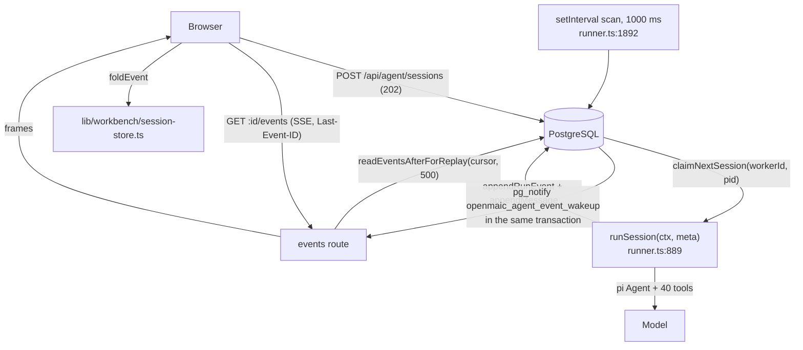
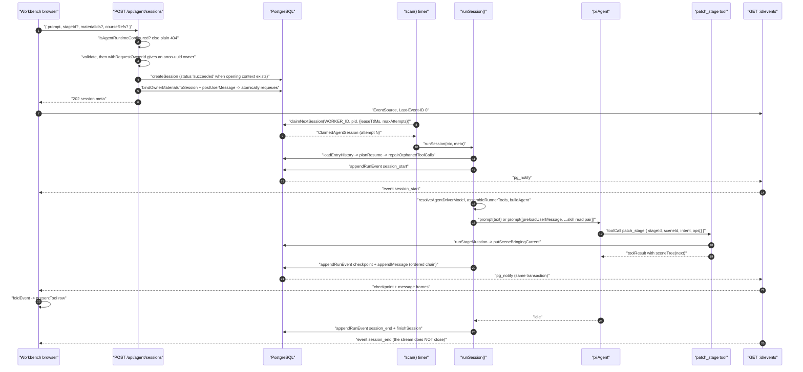
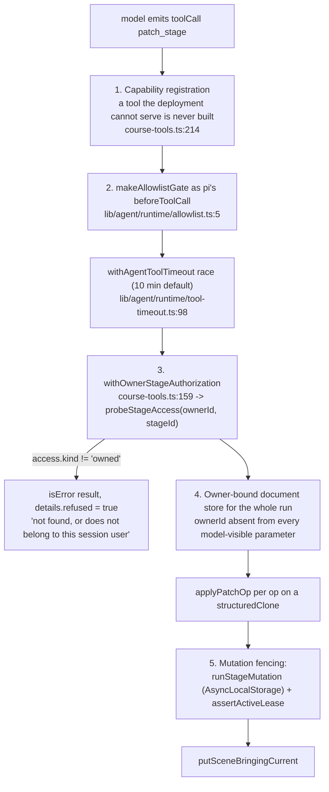
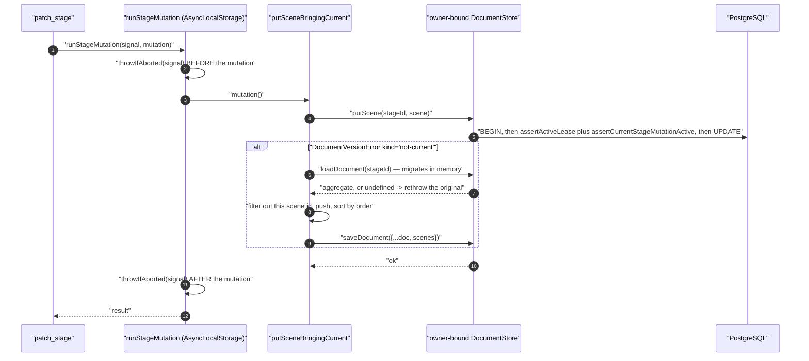
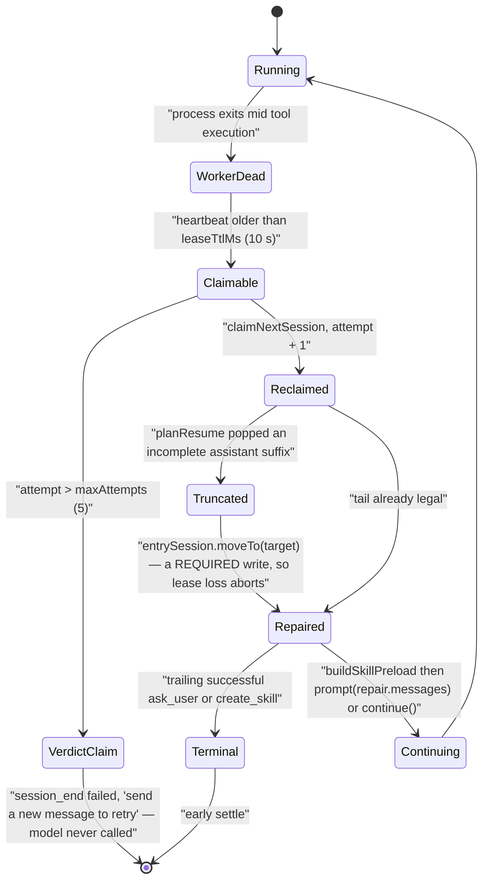

# 06 — A natural-language edit becomes DSL mutations

"Make the second bullet bolder and fix the formula" arrives as prose and leaves
as typed JSON-Pointer operations on one `Scene`. This flow traces the durable
agent runtime end to end: session creation, the claim, the model turn, the write
with its five authorisation layers, the durable event, and the browser fold.

**Sources:** `app/api/agent/sessions/route.ts`,
`app/api/agent/sessions/[id]/events/route.ts`,
`lib/server/agent-runtime/runner.ts:889`, `:1861`,
`lib/server/agent-runtime/dsl-tools.ts:771`,
`lib/server/agent-runtime/course-edit/apply.ts`,
`lib/server/agent-runtime/course-edit/element-schema.ts`,
`lib/server/agent-runtime/course-tools.ts:159`, `:204`,
`lib/server/agent-runtime/mutation-fence.ts`,
`lib/server/agent-runtime/document-writes.ts`,
`lib/agent-runtime/stage-writer-tools.ts`, `lib/agent-runtime/lifecycle.ts:37`,
`lib/agent/runtime/allowlist.ts:5`, `lib/agent/runtime/tool-timeout.ts:98`,
`lib/agent/runtime/build-agent.ts:77-82` (where the timeout wrapper and the
allowlist gate are actually installed),
`lib/server/agent-runtime/event-notify-bus.ts`, `lib/workbench/session-store.ts`;
`../appendix/research/agent-runtime/03-flows.md`,
`../appendix/research/dsl-renderer-editor/03-flows.md`.

## What makes this runtime different

PostgreSQL — not a client connection — is the authority for claims, leases, event
ordering, cancellation and recovery. The browser can close its tab mid-turn and
the edit still lands. That property costs the whole apparatus below.

## Sequence — prompt to rendered card

## Hop table — session creation

| # | Where | Call | Effect |
| --- | --- | --- | --- |
| 1 | `app/api/agent/sessions/route.ts:38` | `isAgentRuntimeConfigured()` | off ⇒ plain-text 404, byte-identical to "not yours" and "absent" |
| 2 | `route.ts:42-47` | `req.json()` | parse failure ⇒ 400 `INVALID_REQUEST 'invalid JSON body'` |
| 3 | `route.ts:49-56` | `existingCourse`/`stageId` coherence, `isValidClassroomId` | 400 |
| 4 | `route.ts:58-69` | `prompt` required, ≤ `MAX_SESSION_TEXT_LENGTH` = 100000 | 400 |
| 5 | `route.ts:70-79` | `materialIds` shape, deduped, ≤ 20, no blanks | 400 |
| 6 | `route.ts:92` | `withRequestOwnerId(req, handler)` → `resolveRequestOwnerId` | reads or mints the `anonymous_id` UUIDv4 cookie, returns `anon:<uuid>`; the `Set-Cookie` rides **every** response, including the catch-all 500 |
| 7 | `route.ts:99-131` | explicit `body.skill` → `findSkill(id, ownerId)`; else `inferSkillIdFromPrompt(prompt, ownerId)` | an explicit miss lists installed ids; an unknown inferred `/handle` is silently "no skill" |
| 8 | `route.ts:139-149` | `store.createSession({…, status?})` | **`status: 'succeeded'` when the session has opening context**, so the runner cannot claim it before that context is durable |
| 9 | `route.ts:156-167` | `bindOwnerMaterialsToSession` then `store.postUserMessage(..., {expectedOwnerId})` | atomically requeues the session |
| 10 | `route.ts:177-180` | `SessionMaterialBindingError` | `softDeleteSession` then 404 `'Not found'` — a compensating write |

Step 8 is the trick that makes an otherwise racy two-step creation safe: the row
exists but is terminal, so no worker can pick it up mid-setup.

## Five authorisation layers on one write

Nothing about the write path trusts the model. The layers compose; each is
independently sufficient to stop a bad call.

Plus a sixth, scheduling-level control: every stage writer carries
`executionMode: 'sequential'`. The list is a single shared registry,
`STAGE_WRITER_TOOL_NAMES` (`lib/agent-runtime/stage-writer-tools.ts:20`) — nine
names — consumed by three places at once: the server scheduler, the workbench
fold's write-ownership arming, and `rename_stage`'s separate marking in the
curriculum toolset. A consistency test pins the relation.

That registry's header states why readers are excluded: *ownership's side effect
is dropping the user's own pending edits, so a `read_stage` must never take it.*

## Hop table — one `patch_stage` call

| # | Where | Call | Rejection message shape |
| --- | --- | --- | --- |
| 1 | `dsl-tools.ts:778` | `params.intent.trim()` | `'intent must not be blank'` |
| 2 | `dsl-tools.ts:779-783` | `loadCourse(deps, stageId)`, `resolveCoursePath(doc, target)` | the resolver's own message |
| 3 | `dsl-tools.ts:784-790` | `resolved.kind === 'scene'` required | `'patch_stage target must be /scenes/<order\|sceneId>'` |
| 4 | `dsl-tools.ts:791-810` | `structuredClone(scene)`, then `applyPatchOp` per op; **first failure aborts the whole batch** | `'patch_stage rejected at op N: …'` with `details.failedOp` |
| 5 | `course-edit/apply.ts:381-394` | `patch` path must start `/canvas/`; `set` needs a value, `remove` must not carry one; per-op media-placeholder check | `'slide patch path must start with /canvas/ …'` |
| 6 | `apply.ts:395-404` | `decodePointer` (`~0`/`~1` escapes checked) then `applyPointer` | out-of-bounds and non-canonical array indices rejected |
| 7 | `apply.ts:361-375` | `elementIdentityIssue(before, after)` | canvas id change, duplicate ids, added/removed/renamed id, or a changed element `type` ⇒ `'use add_element/delete_element'` |
| 8 | `apply.ts:407-408` | `validateSlideCanvas(next.canvas)` — closed TypeBox, `additionalProperties: false` at every level | `'patch rejected: <issue>; <issue>'` |
| 9 | `apply.ts:409-419` | any element whose `latex` changed gets its KaTeX `html` snapshot re-rendered, or deleted when rendering returns `null` | side effect, not a rejection |
| 10 | `dsl-tools.ts:819-826` | **final-state** placeholder guard on `JSON.stringify(next)` | catches a placeholder assembled *across* ops, which every per-op check misses by construction |
| 11 | `dsl-tools.ts:827-834` | `validationError(next)` → `validateAppScene` → the DSL's `validateScene` | `'patch_stage rejected after op N: resulting scene fails structure validation (…)'` |
| 12 | `dsl-tools.ts:836-838` | `runStageMutation(signal, () => putSceneBringingCurrent(store, stageId, next))` | persistence failure returns an `isError` result, not a throw |
| 13 | `dsl-tools.ts:846-854` | `deps.onCheckpoint({tool, stageId, sceneId, order, title, sceneType, detail})` | emits `LIFECYCLE.checkpoint` |
| 14 | `dsl-tools.ts:855-860` | success result carries `sceneTree(next)` and `ops: opDetails` | the UI renders from `details`, never from the tool's prose |

Step 10 is the one to remember. The comment at `dsl-tools.ts:811-818` is explicit:
per-op checks *"inspect each op's payload in ISOLATION — a batch can assemble a
complete read-only placeholder across several ops (e.g. two `str_replace` calls
that each carry only a fragment). That bypasses every per-op check, so the whole
batch is re-checked HERE."*

## `add_element` identity: the server owns ids

`patch` can never change identity. Adding one goes through `add_element`
(`apply.ts:430-465`), which:

- refuses an element carrying an `id` — *"the server assigns element identity"*;
- runs `validateElementInput` (a separate closed schema for complete id-less elements);
- accepts `afterId` **xor** `index`, never both;
- mints `el-<nanoid(8)>`, re-rolling on collision (`:459-460`).

## Two independent schema layers, on purpose

| Layer | What it checks | Where |
| --- | --- | --- |
| **Closed TypeBox mirror** | per-element partial patches with `additionalProperties: false` at every level; one `*ElementPatch` per DSL variant, plus `SlideElementInputSchema` and `SlideCanvasSchema` | `lib/server/agent-runtime/course-edit/element-schema.ts` |
| **DSL structural validators** | scene- and action-level shape, reached through `validateAppScene` | `packages/@openmaic/dsl/src/validate.ts` |

The TypeBox layer's header states it mirrors `@openmaic/dsl`'s `slides.ts`
*exactly* — a hand-maintained mirror, and the acknowledged fragility of this
design.

## Persistence: `putSceneBringingCurrent` and its two-transaction window

The `not-current` fallback exists because *"marking the whole document current
off one scene write would strand [the other scenes] below the migrate-on-read
line"* (`document-writes.ts:5-30`). Its accepted limitation is stated in place:
reload → splice → save spans **two transactions**, so a concurrent writer's scene
committed in that window is pruned. Cross-session server writers are excluded by
the per-stage lease; the remaining competitor is the browser autosave, which
already replaces the whole document last-writer-wins. The window is one-shot per
document.

`runStageMutation` (`mutation-fence.ts:10`) checks the abort signal *before and
after* the mutation and carries it into the transaction via `AsyncLocalStorage`,
so `assertCurrentStageMutationActive()` can reject from inside the store without
threading a signal parameter through every layer.

## Durable event → browser card

| # | Where | Step |
| --- | --- | --- |
| 1 | `runner.ts:1363` | `emit(LIFECYCLE.checkpoint, info)` |
| 2 | `runner.ts:983`, `:960` | `snapshotEventDataForLog` → `enqueue` → `store.appendRunEvent` |
| 3 | `lib/server/agent-runtime/store.ts:76` | store hook `onSessionEventAppended` → `notifyDurableAgentEvent(tx, {kind:'session', sessionId})` **in the same transaction** |
| 4 | commit | PostgreSQL emits `NOTIFY openmaic_agent_event_wakeup` (`event-notify-bus.ts:31`) |
| 5 | `app/api/agent/sessions/[id]/events/route.ts:282` | the route's `subscribeAgentEventWakeup` callback → `requestPoll()` |
| 6 | `events/route.ts:210`, `:157` | `store.readEventsAfterForReplay(id, cursor, 500)` → `writePage` |
| 7 | `runner.ts:1533-1535` | the tool-result `message_end` deletes the pending in-flight entry **only after** the fenced append succeeded |
| 8 | `lib/workbench/use-workbench-session.ts:243` | `onAny` folds the frame into the session store |
| 9 | `components/workbench/chat/tool-presentation.ts:271` | `presentTool(...)` builds the collapsed row from the tool's `details`, **never** its prose |

Step 3 is what makes the notification exactly-as-durable as the event: if the
transaction rolls back, no wakeup fires. The 25 s heartbeat and the 5 s poll
(10 s once terminal) are the backstops when a NOTIFY is lost.

The SSE stream **does not close at `session_end`** — a deliberate choice so a
follow-up message on the same session keeps the same connection.

## Crash and resume: tool execution is at-least-once

`repairOrphanedToolCalls` (`tool-call-integrity.ts:109`) materialises a
provider-safe **read-time** view: existing results moved next to their assistant
frame, unwind frames dropped, missing results synthesised as
`interruptedToolResult`. The consequence, stated at `resume.ts:33-37`: tool
execution is at-least-once, **so every tool must be idempotent.** `putScene` is
idempotent on `(stageId, sceneId)`, and `generate_scene` derives its scene id
from the outline entry rather than minting one.

On the resume path the turn text comes from the **durable `user_message` row**,
never from the compaction view (`runner.ts:1704-1706`) — the compaction view is
lossy by design and would silently change the turn's constraint target.

## Cancel

| # | Where | Step |
| --- | --- | --- |
| 1 | `app/api/agent/sessions/[id]/cancel/route.ts:16` | owner check; 409 `SESSION_ALREADY_TERMINAL` if already terminal |
| 2 | `cancel/route.ts:39` | `store.requestCancel(id)` — **durable only**; the route writes no event |
| 3 | store hook `onCancelRequested` | `notifyDurableAgentEvent` in the same transaction |
| 4 | `runner.ts:1133`, `:1121` | the shared wakeup fires → `checkCancel()` → `getCancelRequestedAt(id)` |
| 5 | `runner.ts:1126-1128` | `cancelled = true`; `abort.abort()` |
| 6 | `runner.ts:1557`, `tool-timeout.ts:158-164` | `agent.abort()`; the in-flight tool's derived signal rejects with `AgentToolAbortedError` |
| 7 | `runner.ts:1540`, `:1746` | `queueInterruptedToolResults()` appends receipts for still-pending calls |
| 8 | `runner.ts:1766-1781` | `status = 'cancelled'`, error suppressed, `finishSession(..., consumeCancelRequestedAt)` |
| 9 | `runner.ts:1786-1788` | `requeueIfUndelivered` is deliberately **skipped** for a cancelled settle |

The 5 s `cancelPoll` (`runner.ts:1138`) bounds worst-case cancel latency when the
NOTIFY is lost.

## Failure modes

| Failure | Posture | Where |
| --- | --- | --- |
| Runtime not configured | plain-text 404, no existence oracle | `route.ts:38`, `route-response.ts:36-40` |
| Foreign `stageId` | `isError` tool result with `details.refused`, flow stops — **the model is told, the run continues** | `course-tools.ts:174-185` |
| Any op invalid | whole batch rejected, nothing persisted | `dsl-tools.ts:795-801` |
| Lease lost mid-write | `AgentSessionLeaseLostError` → `markLeaseLost` | fenced at `runner.ts:1304-1309` |
| Attempt cap exceeded | verdict-only claim: `session_end failed` **without calling the model** | `runner.ts:305`, `:1070-1088` |
| Material binding fails at creation | compensating `softDeleteSession`, then 404 | `route.ts:177-180` |
| Store read fails 3× on the SSE tail | `caught_up {degraded: true}` frame, stream stays open | `events/route.ts:140-155`, `:197` |

## Open questions

- `probeStageAccess` returns `owned` only for the *anonymous cookie* owner. Every
  owner id in the system is `anon:`-prefixed because no call site supplies
  `authenticatedOwnerId` — so clearing a cookie orphans a course with no recovery
  path traced here.
- The TypeBox mirror in `element-schema.ts` and `@openmaic/dsl`'s `slides.ts` are
  kept in sync by hand. No generated artefact or test enforces the equality.

## Related

- [`07-export-pptx.md`](./07-export-pptx.md) — the other consumer of the same `Slide` contract.
- [`11-concurrency-and-backpressure.md`](./11-concurrency-and-backpressure.md) — where `executionMode: 'sequential'` and `maxConcurrent` actually bite.
- `../05-agent-runtime/index.md` — tool catalogue and the pi harness integration.
- `../07-dsl-renderer-editor/index.md` — the DSL contract and the human editor path.
