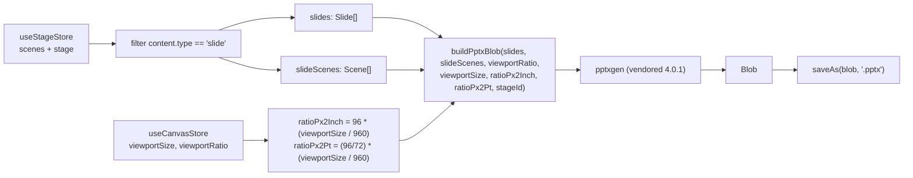
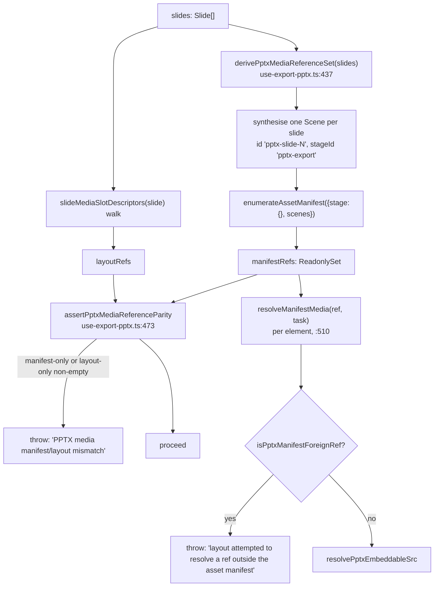
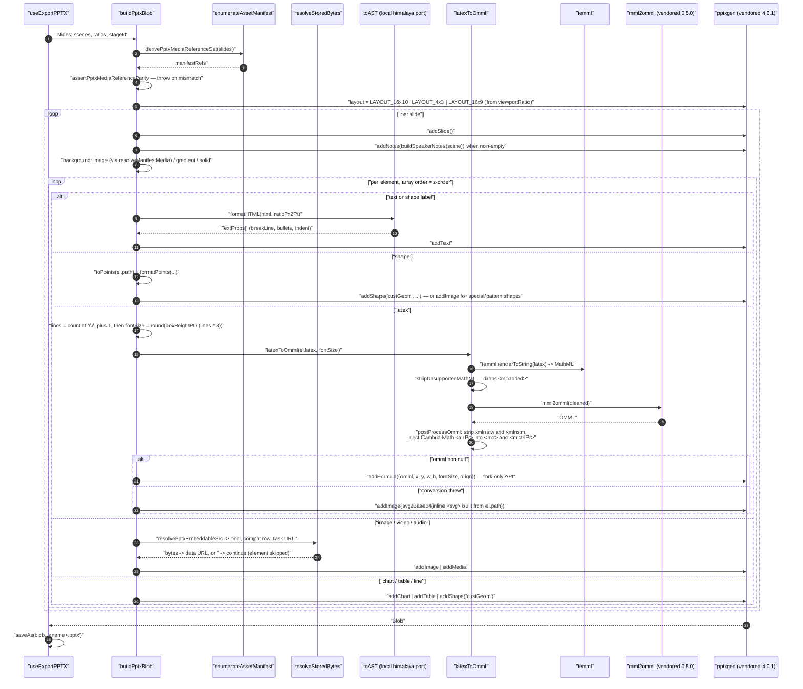
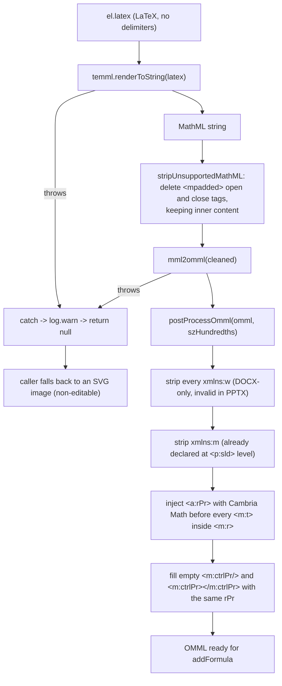

# 07 — Export to `.pptx`

`Slide[]` → OOXML bytes, entirely in the browser, through a vendored
`pptxgenjs` fork. Traces the per-element branch, the two parity assertions that
guard media resolution, the LaTeX→OMML path, and the nine things the export
silently drops or degrades.

**Sources:** `lib/export/use-export-pptx.ts`, `lib/export/latex-to-omml.ts`,
`lib/export/html-parser/index.ts`, `lib/export/svg-path-parser.ts`,
`packages/pptxgenjs` (v4.0.1, `slide.ts:253`, `gen-objects.ts:669`),
`packages/mathml2omml` (v0.5.0), `packages/@openmaic/dsl/src/asset-manifest.ts`,
`lib/media/resolve-stored-bytes.ts`;
`../appendix/research/dsl-renderer-editor/03-flows.md`.

## Container: browser only, no server hop

Interactive (`html`), quiz and PBL scenes have **no `.pptx` representation at
all** — `buildPptxBlob` only ever sees slide canvases (`use-export-pptx.ts:1313-1314`).
The resource-pack ZIP variant is the path for interactive content, and it is the
only export that accepts a deck with zero slide scenes (`requireSlides = false`,
`:1321`).

## Two guards run before the first element is written

`buildPptxBlob` opens by pinning the document's media scope twice
(`use-export-pptx.ts:508-509`).

Why both: element iteration is *necessary* for coordinates, z-order and video
binding selection, but "it may not introduce or omit a media role relative to the
manifest" (`:468-472`). The per-ref guard has one deliberate escape hatch —
a generated task's own `objectUrl` or a poster URL is runtime metadata rather
than a document ref, so `isPptxManifestForeignRef` admits `task?.objectUrl === ref`
(`:460-466`).

## Sequence — per element

## Hop table

| # | Where | Call | Notes |
| --- | --- | --- | --- |
| 1 | `use-export-pptx.ts:1320-1342` | `withExportGuard(action, requireSlides)` | re-entrancy guard on `exportingRef`; `slides.length === 0` ⇒ warning toast; the action runs inside a `setTimeout(…, 100)` so the spinner paints first |
| 2 | `:1310-1311` | ratio derivation | `ratioPx2Inch = 96 × (viewportSize / 960)`, `ratioPx2Pt = (96/72) × (viewportSize / 960)` — 960 is the reference deck width in px |
| 3 | `:506` | `new pptxgen()` | the vendored fork, `packages/pptxgenjs` |
| 4 | `:508-509` | manifest derivation + parity assertion | throws, does not degrade |
| 5 | `:524-526` | `pptx.layout` from `viewportRatio` | `0.625` ⇒ 16x10, `0.75` ⇒ 4x3, anything else ⇒ 16x9 |
| 6 | `:533-537` | `addNotes(buildSpeakerNotes(scene))` | speaker notes come from the scene's actions, not the canvas |
| 7 | `:540-549` | background | image resolved through `resolveManifestMedia`; a missing generated background "stays empty instead of leaking an opaque ref to pptxgen" |
| 8 | `:410-429` | `resolvePptxEmbeddableSrc(ref, task, stageId)` | opaque ref ⇒ `resolveStoredBytes` with `resolutionGating: true`, `loadCompatRow: true`, `taskUrlFallback: true`; concrete address ⇒ resolves to itself through the state machine |
| 9 | `:1040-1044` | LaTeX font-size **estimate** | `lines = (latex.match(/\\\\/g) \|\| []).length + 1`, `fontSize = round((height / ratioPx2Pt) / (lines × 3))` — estimated from line-break count, never measured |
| 10 | `:1046-1055` | `pptxSlide.addFormula(...)` | exists only in the fork (`packages/pptxgenjs/src/slide.ts:253` → `gen-objects.ts:669`) |
| 11 | `:1056-1097` | SVG fallback | inline `<svg>` built from `el.path`, `svg2Base64`, `addImage`; `continue` when `svg2Base64` returns falsy |
| 12 | `:1119-1127` | media base64-isation | `fetch(resolvedSrc)`; a non-OK response **throws** and the element is skipped by the enclosing catch |
| 13 | `:1139-1142` | extension guessing | URL extension → `el.ext` → `mp4` for video / `mp3` for audio |
| 14 | `:1150-1169`, `:1172-1179` | video cover | the declared poster first (via the same resolver), else a first-frame canvas capture from an off-document `<video>` |
| 15 | `:1357` | `saveAs(blob, '<stage.name \|\| "slides">.pptx')` | `file-saver` |

## Data shape at each boundary

| Boundary | Type | Declared in |
| --- | --- | --- |
| store → export | `Scene[]` filtered to `content.type === 'slide'` | `packages/@openmaic/dsl/src/stage.ts` |
| export input | `Slide` (10-variant `PPTElement` union) | `packages/@openmaic/dsl/src/slides.ts` |
| media scope | `ReadonlySet<string>` of manifest refs | derived at `use-export-pptx.ts:437` |
| resolved media | data URL (`data:<mime>;base64,…`) | `blobToDataUrl` |
| text | `pptxgen.TextProps[]` | produced by `formatHTML` → `toAST` |
| formula | OMML `<m:oMath>` XML string, or `null` | `lib/export/latex-to-omml.ts:70` |
| output | `Blob` (OOXML `.pptx`) | `pptxgen` |

Units: the DSL is in **px**; PPTX wants **inches** for geometry and **points**
for type. Every coordinate divides by `ratioPx2Inch`, every font size by
`ratioPx2Pt`.

## The OMML path in detail

`buildMathRPr` (`latex-to-omml.ts:25`) hardcodes the Cambria Math typeface with
its panose string, because "PowerPoint requires Cambria Math font" for math runs.
`szHundredths` is `fontSize × 100` — OOXML sizes are hundredths of a point.

## What the export drops

| Dropped / degraded | Evidence |
| --- | --- |
| LaTeX becomes a **static image** whenever `temml` or `mathml2omml` throws | `latex-to-omml.ts:77-80` returns `null`; fallback at `use-export-pptx.ts:1056` |
| MathML `<mpadded>` spacing is discarded before OMML conversion | `latex-to-omml.ts:11-19` |
| LaTeX font size is **estimated** from `\\` count, never measured | `use-export-pptx.ts:1040-1043` |
| `special` shapes (paths using commands beyond L/Q/C/A) become images | flagged by the DSL's `slides.ts`; the importer sets the flag at `transformParsedToSlides.ts:991` |
| An unresolvable media ref makes the element **skipped entirely** (`continue`) | `use-export-pptx.ts:1114` |
| `blob:` and remote URLs cannot survive — everything is re-fetched to base64, so an offline or CORS-blocked asset is lost | `:1116-1127` |
| Extension guessing falls back to `mp4` / `mp3` when neither the URL nor `el.ext` says otherwise | `:1142` |
| Interactive / quiz / PBL scenes have no representation | `buildPptxBlob` receives `Slide[]` only, `:1313-1314` |
| Whiteboard content is not exported | `Stage.whiteboard` is outside the slide walk |

Step 12's behaviour is worth spelling out: an image whose `fetch` returns 404 is
dropped **silently from the deck** — no toast, no placeholder, no diagnostic in
the file. The resource-pack path is the one that reports `failedAssetUrls`
(`:1295`).

## Failure modes

| Failure | Posture | Where |
| --- | --- | --- |
| Manifest and layout walks disagree | **fail the export** — `throw`, caught by `withExportGuard` into a generic `export.exportFailed` toast | `:473-492` |
| A ref outside the manifest reaches resolution | **fail the export** — `throw` | `:517-519` |
| Zero slide scenes | refused before starting, with `export.noSlides` | `:1323-1326` |
| Export already in flight | second click ignored | `:1322` |
| LaTeX conversion fails and there is no `el.path` | element produces **nothing at all** | `:1056` is an `else if` |
| `svg2Base64` returns falsy | `continue` — element skipped | `:1082` |
| Poster fetch non-OK | `log.warn`, fall through to first-frame capture | `:1160-1167` |

Every failure inside `buildPptxBlob` collapses to one toast. The specific throw
message reaches only `log.error` (`:1333`).

## Open questions

- The two vendored forks each carry a single local delta (`addFormula`/OMML in
  pptxgenjs 4.0.1; a one-character upstream fix in mathml2omml 0.5.0). Nothing in
  the export path records the upstream-tracking plan.
- LaTeX `fontSize` estimation divides by `lines × 3` while the comment above it
  derives `lines × 1.5`. The factor-of-two discrepancy between comment and code
  (`:1039` vs `:1043`) is not explained anywhere.

## Related

- [`08-export-video.md`](./08-export-video.md) — the other export, which *does* carry interactive scenes.
- [`06-edit-with-ai.md`](./06-edit-with-ai.md) — the writer side of the same `Slide` contract.
- `../07-dsl-renderer-editor/index.md` — the element union, the importer, and the vendored forks.
- `../13-dependencies/index.md` — fork provenance and licences.
