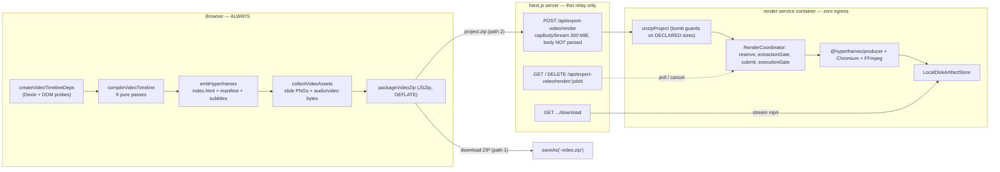
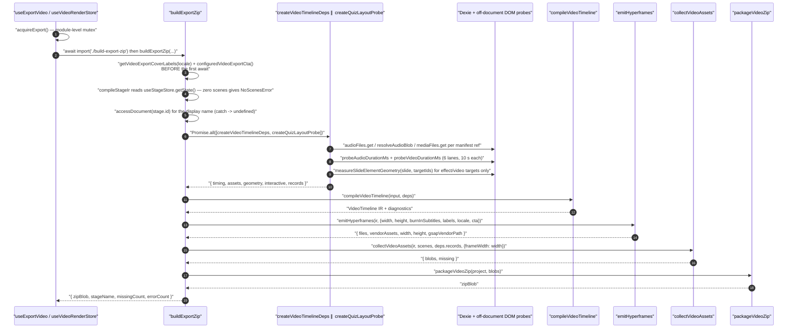
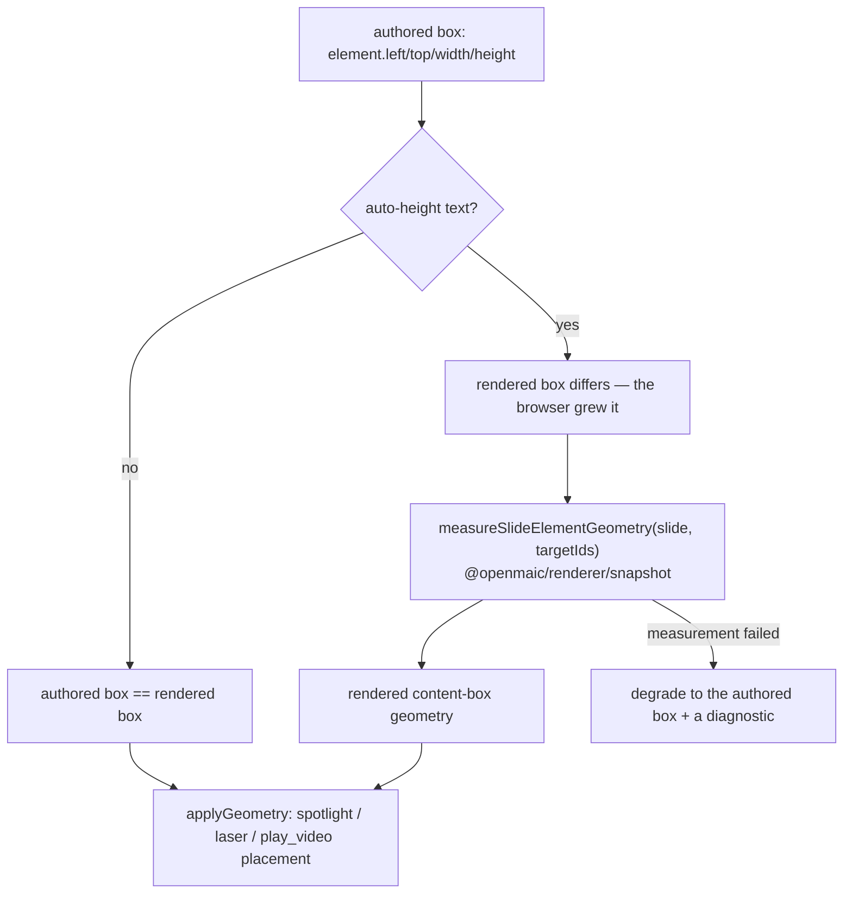
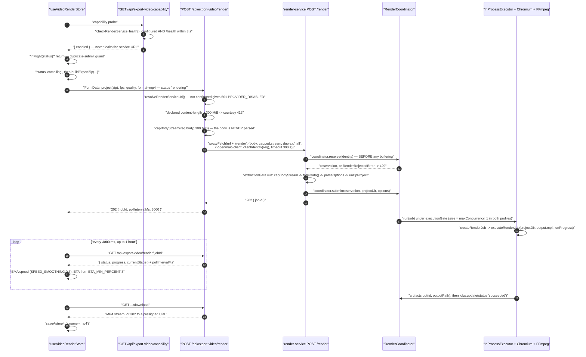
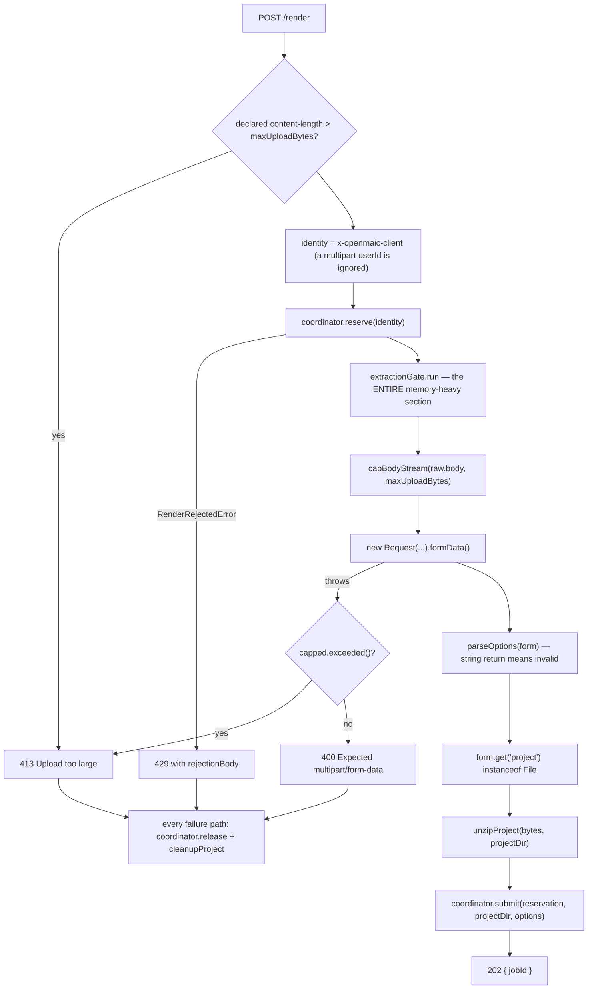
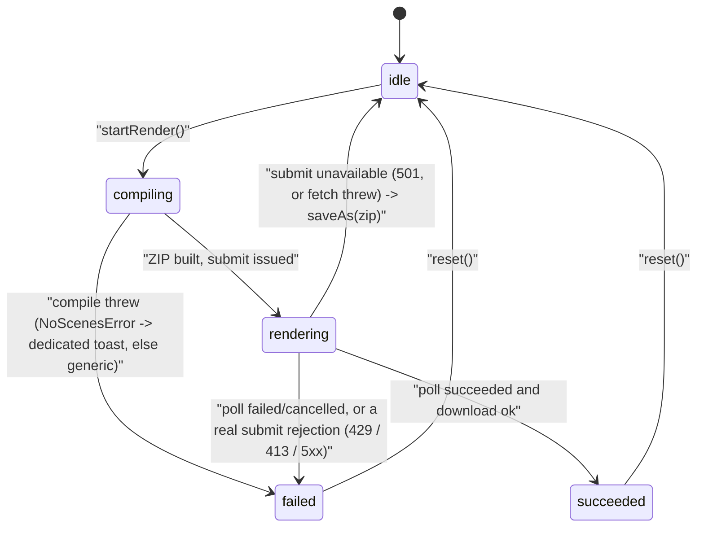

# 08 — Export to video

Two flows sharing a prefix: a self-contained Hyperframes project ZIP, and the
same ZIP handed to `render-service` for MP4 encoding. Traces the nine-pass pure
compiler, the impure/pure split that ESLint enforces, the relay's streaming
bound, the container's ZIP-bomb guards, and the fail-closed egress lockdown.

**Sources:** `lib/video-export-app/build-export-zip.ts`,
[`lib/video-export/compile.ts:152`](lib/video-export/compile.ts#L152), [`lib/video-export/ir.ts:373`](lib/video-export/ir.ts#L373),
[`lib/video-export/deps.ts:61`](lib/video-export/deps.ts#L61), [`lib/video-export/emit-hyperframes/index.ts:1229`](lib/video-export/emit-hyperframes/index.ts#L1229),
`lib/video-export-app/{timeline-deps,collect,package-zip}.ts`,
[`lib/store/video-render.ts:121`](lib/store/video-render.ts#L121), `app/api/export-video/render/route.ts`,
`app/api/export-video/capability/route.ts`, [`render-service/src/main.ts:252`](render-service/src/main.ts#L252),
[`render-service/src/unzip.ts:31`](render-service/src/unzip.ts#L31), `render-service/src/render-coordinator.ts`,
`render-service/docker-entrypoint.sh`;
[`../appendix/research/media-audio-video/03b-flows-video-export.md`](docs/appendix/research/media-audio-video/03b-flows-video-export.md).

## The split, and why it is where it is



`buildExportZip`'s header states the reason plainly: both `useExportVideo` and
the render store call it *"so the two paths can never drift"*
([`build-export-zip.ts:11-13`](lib/video-export-app/build-export-zip.ts#L11-L13)). Only frame capture and encoding move to the
service.

## Purity is machine-enforced

| Code | Runs where | Enforcement |
| --- | --- | --- |
| `lib/choreography/**`, `lib/video-export/**` | Node **and** browser | ESLint `no-restricted-syntax` / `no-restricted-imports`: no `@/…` alias, no React/DOM/GSAP/motion, no `import()`/`require()`, plus a depth-specific relative-import allowlist |
| `lib/video-export-app/**` | Browser only (`'use client'`) | Dexie, `document.createElement('video'\|'audio'\|'canvas')`, `URL.createObjectURL`, `@openmaic/renderer/snapshot` |
| emitted `index.html` | Chromium inside the container, **offline** | the ZIP is self-contained; `iptables OUTPUT DROP` blocks everything but loopback and established replies |

This is why the DI surface ([`lib/video-export/deps.ts:61`](lib/video-export/deps.ts#L61)) is **synchronous**:
`TimingProbe`, `AssetSource`, `GeometryProbe`, `QuizLayoutProbe`. All the async
work is done before the compiler runs, in `lib/video-export-app`.

## Sequence — ZIP build



The label pinning at [`build-export-zip.ts:147-148`](lib/video-export-app/build-export-zip.ts#L147-L148) is deliberate: *"compiling the
IR takes seconds (Dexie probes, off-screen measurement), and the learner may
switch the UI language while it runs. Reading the labels here pins one export to
one locale instead of whichever language happened to win the race."*

## The nine compiler passes, in order

Every pass is pure and the order is load-bearing ([`compile.ts:152-202`](lib/video-export/compile.ts#L152-L202)).

| # | Pass | What it does |
| --- | --- | --- |
| 0 | `resolveAvailableVideos` | pre-resolves `play_video` presence through the `AssetSource`, **before** dwell is fixed, so an unavailable video gets a 0 ms dwell rather than blocking for up to `MAX_VIDEO_WAIT_MS` and shifting every later action |
| 1 | `normalizeScenes` | deterministic order + action validation |
| 2 | `buildTimelineOptions` | adapts `TimingProbe` into the choreography option shape |
| 3 | `buildTimeline` | index→time expansion folded into per-scene buckets + subtitle cues |
| 4 | `applyVisuals` | turns authored quiz/PBL data into whole-scene static covers |
| 5 | `applyInteractiveHtml` | promotes successfully prepared interactive pages to a first-class base |
| 6 | `reflowQuizTimelines` | compiler-added quiz tails shift every later absolute timestamp, *including* the interactive bases from pass 5 |
| 7 | `applyGeometry` | resolves effect + video element placement, preferring measured content-box geometry; degrades to the authored box on a miss |
| 8 | `planAssets` | dedup + naming plan; stamps asset refs onto segments |
| 9 | `markUnsupported` | remaining unsupported scene families → markers + diagnostics |

Pass 6 exists purely because passes 4 and 5 can both change durations. Reordering
6 before 5 would leave interactive bases stamped with pre-reflow timestamps.

Output is the zod-authored `VideoTimeline` ([`lib/video-export/ir.ts:373`](lib/video-export/ir.ts#L373)), whose
TypeScript types are *inferred from the schema* rather than declared alongside
it — schema v4, 13 diagnostic codes.

## Why the geometry probe exists



Only elements that a spotlight, laser or `play_video` actually targets are
measured — an off-screen render per slide is expensive, so `compileSubtitles`
passes `skipGeometry` and skips it entirely ([`build-export-zip.ts:199-203`](lib/video-export-app/build-export-zip.ts#L199-L203)).

## Asset collection

`collectVideoAssets` iterates **only owning plan entries** (`present && !dedupOf`),
so a deduplicated ref is fetched once.

| Entry kind | Path |
| --- | --- |
| `frame` | `renderFrame` → `resolveGeneratedMedia` (swap placeholders for object URLs; `decodeFirstFramePosterUrl` when a video has no poster) → `slideToPng({width, pixelRatio: 1, backgroundColor: '#ffffff', format: 'blob'})` → `revoke()` in a `finally` |
| `audio` | `resolveBytes(record.blob, record.ossKey)` — local blob first, CDN URL second |
| `video` / `image` | `resolveStoredBytes` with `resolutionGating`, `compatRowCdnFallback`, `taskUrlFallback` |
| `html` | `records.interactiveHtml.content(assetId)` → a `text/html;charset=utf-8` blob |

Fonts (20 KaTeX faces plus Noto CJK/Cyrillic/Arabic, ~2.0 MiB) are prebuilt by
three `gen:video-export-*` scripts and shipped **inside** the ZIP, because the
render container has zero outbound network. GSAP is fetched from
`/vendor/gsap.min.js` and written at `project.gsapVendorPath`.

Resolutions: `720p` 1280×720, `1080p` 1920×1080, `4k` 3840×2160. FPS `[24, 30, 60]`,
qualities `['draft', 'standard', 'high']`.

## Data shape at each boundary

| Boundary | Type | Declared in |
| --- | --- | --- |
| impure → pure compiler | `TimingProbe`, `AssetSource`, `InteractiveHtmlSource`, `GeometryProbe`, `QuizLayoutProbe`, `CompileConfig` — all **synchronous** | [`lib/video-export/deps.ts:61`](lib/video-export/deps.ts#L61), [`:101`](lib/video-export/deps.ts#L101), [`:122`](lib/video-export/deps.ts#L122), [`:142`](lib/video-export/deps.ts#L142), [`:165`](lib/video-export/deps.ts#L165), [`:170`](lib/video-export/deps.ts#L170) |
| store → compiler | `CompilerScene` = `SceneCore &` `CompilerSceneContent` | [`deps.ts:50`](lib/video-export/deps.ts#L50), [`:38`](lib/video-export/deps.ts#L38) |
| compiler → emitter | `VideoTimeline` — the system contract. zod-authored, TS types **inferred** from the schema (`z.infer`), `VIDEO_TIMELINE_VERSION = 4`, 13 diagnostic codes | [`lib/video-export/ir.ts:373`](lib/video-export/ir.ts#L373) (schema), [`:414`](lib/video-export/ir.ts#L414) (type), [`:35`](lib/video-export/ir.ts#L35) (version) |
| emitter → packager | `EmittedProject { files: EmittedFile[], vendorAssets: EmittedVendorAsset[], width, height, compositionId, totalDurationMs, gsapVendorPath }` | [`lib/video-export/emit-hyperframes/index.ts:175`](lib/video-export/emit-hyperframes/index.ts#L175), [`:54`](lib/video-export/emit-hyperframes/index.ts#L54), [`:60`](lib/video-export/emit-hyperframes/index.ts#L60) |
| collector → packager | `CollectResult { blobs: Map<zipPath, Blob>, missing: string[] }` | [`lib/video-export-app/collect.ts:49`](lib/video-export-app/collect.ts#L49) |
| build → caller | `BuildExportZipResult { zipBlob, stageName, missingCount, errorCount }` — both paths return this identical shape | [`lib/video-export-app/build-export-zip.ts:39`](lib/video-export-app/build-export-zip.ts#L39) |
| browser → relay | `FormData` with a `project` ZIP `File` plus `fps` / `quality` / `format`; **never parsed** by the relay | [`app/api/export-video/render/route.ts:66-70`](app/api/export-video/render/route.ts#L66-L70) |
| relay → browser, on submit | `apiSuccess({ jobId, pollIntervalMs: 3000 }, 202)` | [`render/route.ts:99`](app/api/export-video/render/route.ts#L99) |
| relay → browser, on poll | `apiSuccess({ ...upstreamBody, pollIntervalMs: 3000 })` — the render-service body is **spread through as `Record<string, unknown>`**; the app declares no type for it | [`render/[jobId]/route.ts:24`](app/api/export-video/render/[jobId]/route.ts#L24), `:29` |
| poll body, as the client reads it | `JobStatusResponse { jobId, status: 'queued'\|'running'\|'succeeded'\|'failed'\|'cancelled', progress?, currentStage?, error?, done? }` | [`lib/store/video-render.ts:71`](lib/store/video-render.ts#L71) |
| render options | `RenderOptions` / `ResolvedOptions` (`Required<RenderOptions>`) — the store always holds concrete values | [`video-render.ts:53`](lib/store/video-render.ts#L53), [`:62`](lib/store/video-render.ts#L62) |

`VideoTimeline` is the one boundary in this flow with a **runtime-validated**
contract: the IR is parsed against `VideoTimelineSchema`, so a compiler bug
surfaces at the schema rather than inside Chromium. The job-status boundary is the
opposite extreme — the relay is deliberately opaque, and `JobStatusResponse`
exists only client-side as an unverified assertion about what `render-service`
sends. Nothing fails loudly if the two drift.

## Sequence — MP4 render



## Hop table — the relay's guarantees

| # | Where | Behaviour |
| --- | --- | --- |
| 1 | [`app/api/export-video/render/route.ts:47-50`](app/api/export-video/render/route.ts#L47-L50) | unconfigured service ⇒ **501** so the client can degrade |
| 2 | `:56-59` | declared `content-length` > `MAX_UPLOAD_BYTES` (300 MiB) ⇒ courtesy 413. The comment is explicit that this is *only* for honest clients |
| 3 | `:61-64` | non-multipart or missing body ⇒ 400 |
| 4 | `:70` | `capBodyStream(req.body, MAX_UPLOAD_BYTES)` — the real bound, counted on actual bytes |
| 5 | `:66-69` | the body is **deliberately not parsed**: identity comes from the header, so there is nothing to strip, and re-parsing would defeat the streaming bound |
| 6 | `:33-38` | `clientIdentity(req)` honours `x-forwarded-for` / `x-real-ip` **only** when `TRUST_PROXY_HEADERS === 'true'`; otherwise every caller collapses to the single `'direct'` bucket — "a conservative shared limit rather than a spoofable one" |
| 7 | `:74-84` | `proxyFetch(..., { duplex: 'half', signal: AbortSignal.timeout(300_000) })` |
| 8 | `:87-97` | status mapping: upstream 429 ⇒ 429 `RATE_LIMITED`, 413 ⇒ 413 `INVALID_REQUEST`, anything else ⇒ 502 `UPSTREAM_ERROR` |
| 9 | `:100-104` | a cap trip surfaces as a fetch error and is translated to 413 |

`maxDuration = 300` is sized for the *upload* over a slow link (a 300 MB body
needs ~40 Mbps to finish in 60 s), not for the render — which is async.

## Container-side admission and ZIP-bomb guards

The ordering in [`render-service/src/main.ts:252-331`](render-service/src/main.ts#L252-L331) is the interesting part:
**admission happens before buffering.**



*"Requests beyond the permit wait here with their body still unconsumed, so only
`maxConcurrentExtractions` bodies are buffered concurrently"* ([`main.ts:279-282`](render-service/src/main.ts#L279-L282)).

`unzipProject` ([`unzip.ts:31`](render-service/src/unzip.ts#L31)) enforces four limits **on declared sizes, before
any byte is decompressed**, plus a path check afterwards:

| Guard | Condition | Where |
| --- | --- | --- |
| entry count | `entryCount > config.maxEntries` | [`unzip.ts:42-44`](render-service/src/unzip.ts#L42-L44) |
| per-entry size | `file.originalSize > config.maxEntryBytes` | `:45-47` |
| compression ratio | `file.size > 0 && originalSize / size > config.maxCompressionRatio` | `:50-52` |
| total expansion | `expandedTotal > config.maxExpandedBytes` | `:53-56` |
| required entry | no `index.html` at root or any directory ⇒ `InvalidProjectError` | `:74-76` |
| path traversal | `relative(destRoot, target)` starting `..` ⇒ `InvalidProjectError` | `:80-84` |

Decompression uses fflate's **async** `unzip` so the inflate runs on a worker
thread and `/health` stays responsive during a large expansion (`:13-18`).

## Egress lockdown, fail-closed

`render-service/docker-entrypoint.sh` installs, as root with `CAP_NET_ADMIN`:

```
iptables -A OUTPUT -o lo -j ACCEPT
iptables -A OUTPUT -m state --state ESTABLISHED,RELATED -j ACCEPT
iptables -P OUTPUT DROP
```

then drops to the unprivileged `render` user via `setpriv`. IPv6 rules are
best-effort but default-drop when the stack is present, "so v6 can't be an
escape".

If the lockdown is requested (`RENDER_EGRESS_LOCKDOWN` defaults to `true`) and
cannot be installed — not root, no `iptables`, or the rules fail — the container
**exits non-zero**. The rationale is stated in the header: otherwise the app
"would advertise MP4 rendering while Chromium could reach the app", and `/health`
would still report healthy.

## Degradation: narrow on purpose



The silent ZIP fallback fires **only** when `submittedJobId == null` **and**
(`submitStatus === null` — fetch threw — **or** `submitStatus === 501`)
([`video-render.ts:245-259`](lib/store/video-render.ts#L245-L259)). A 429, 413 or 5xx surfaces the real error, *"so the
failure is honest and retryable"* rather than delivering a download nobody asked
for.

If the render had already started, the store fires
`DELETE /api/export-video/render/:jobId` before reporting failure, to free the
concurrency slot and scratch space (`:263-265`).

## Failure modes

| Failure | Posture | Where |
| --- | --- | --- |
| Zero scenes | `NoScenesError` → `export.videoNoScenes` toast | [`build-export-zip.ts:87-89`](lib/video-export-app/build-export-zip.ts#L87-L89) |
| `accessDocument` throws | **degrade** — `.catch(() => undefined)`, fall back to `stage.name` then `'classroom'` | `:91-92` |
| Audio duration probe times out (10 s) | **degrade** — the stored `duration` is the fallback | `timeline-deps.ts` |
| `ossKey`-only video record | unprobeable, so the compiler caps its dwell | [`timeline-deps.ts:382-389`](lib/video-export-app/timeline-deps.ts#L382-L389) |
| Geometry measurement fails | **degrade** to the authored box + a diagnostic | [`compile.ts:183-185`](lib/video-export/compile.ts#L183-L185) |
| Interactive page preparation fails | records a `failure` category; the scene falls back to a marker | `prepare-interactive-html.ts` |
| Some asset bytes missing | export still completes; `missingCount > 0` raises a warning toast | [`build-export-zip.ts:179`](lib/video-export-app/build-export-zip.ts#L179) |
| Invalid `NEXT_PUBLIC_VIDEO_EXPORT_CTA_DESTINATION` | warn **once**, CTA disabled | `:51-64` |
| Duplicate submit | ignored by `inFlight(get().status)` | [`video-render.ts:123`](lib/store/video-render.ts#L123) |
| Service configured but unreachable | capability probe reports `enabled: false`, so the menu offers only "Download ZIP" | [`app/api/export-video/capability/route.ts:13`](app/api/export-video/capability/route.ts#L13) |

## Open questions

- `executionGate` size equals `maxConcurrency`, fixed at 1 by both resource
  profiles. Nothing in the repo records the sizing rationale or what a second
  profile would need.
- The chunked execution path (`RENDER_CHUNK_EXECUTION=true`) over
  `@hyperframes/producer/distributed` ships but no committed config enables it.

## Related

- [`07-export-pptx.md`](docs/11-data-flows/07-export-pptx.md) — the other export path.
- [`04-scene-playback.md`](docs/11-data-flows/04-scene-playback.md) — the timing literals the exporter shares with playback.
- [`11-concurrency-and-backpressure.md`](docs/11-data-flows/11-concurrency-and-backpressure.md) — the probe lanes, the two gates, and the queue.
- [`12-trust-boundaries-in-flight.md`](docs/11-data-flows/12-trust-boundaries-in-flight.md) — the untrusted-archive and untrusted-HTML crossings.
- [`../09-media-and-export/index.md`](docs/09-media-and-export/index.md) — component structure of the compiler and emitter.
- [`../17-deployment-view/index.md`](docs/17-deployment-view/index.md) — how the two containers are wired.
