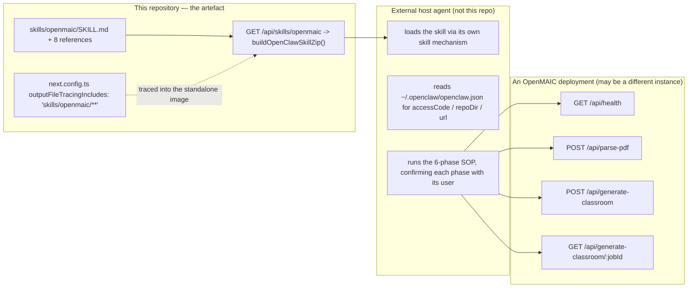
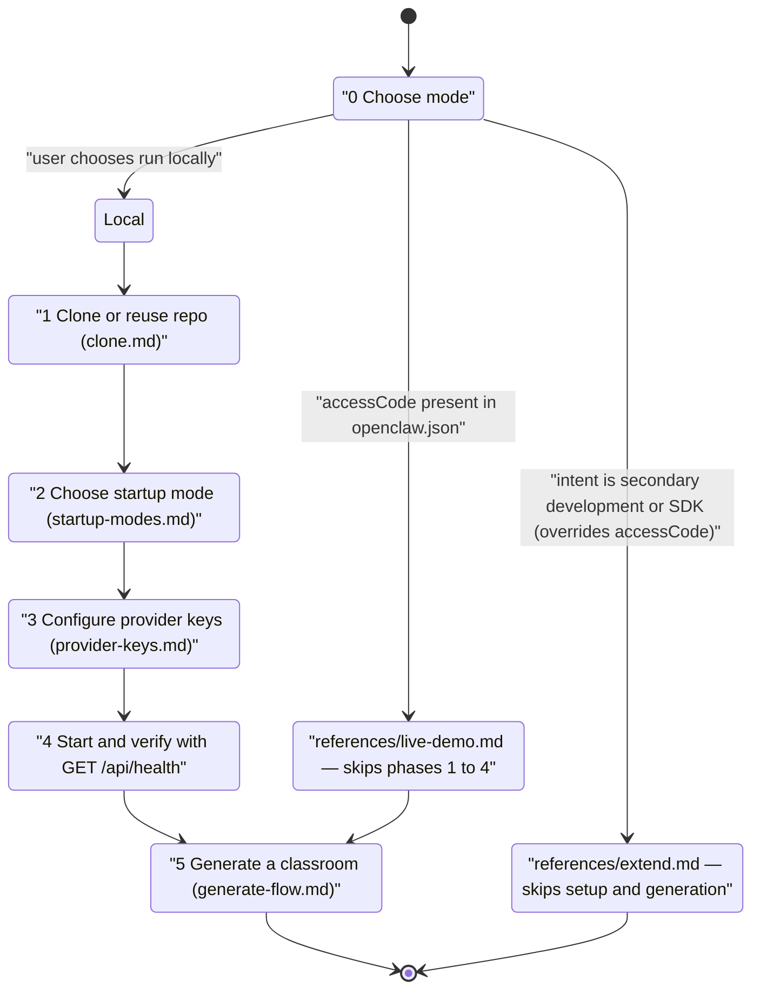
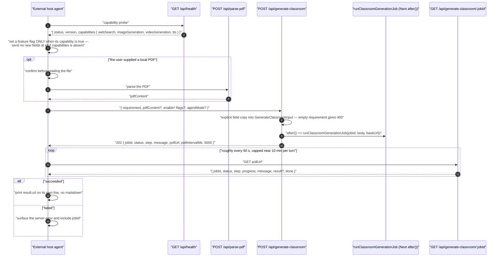
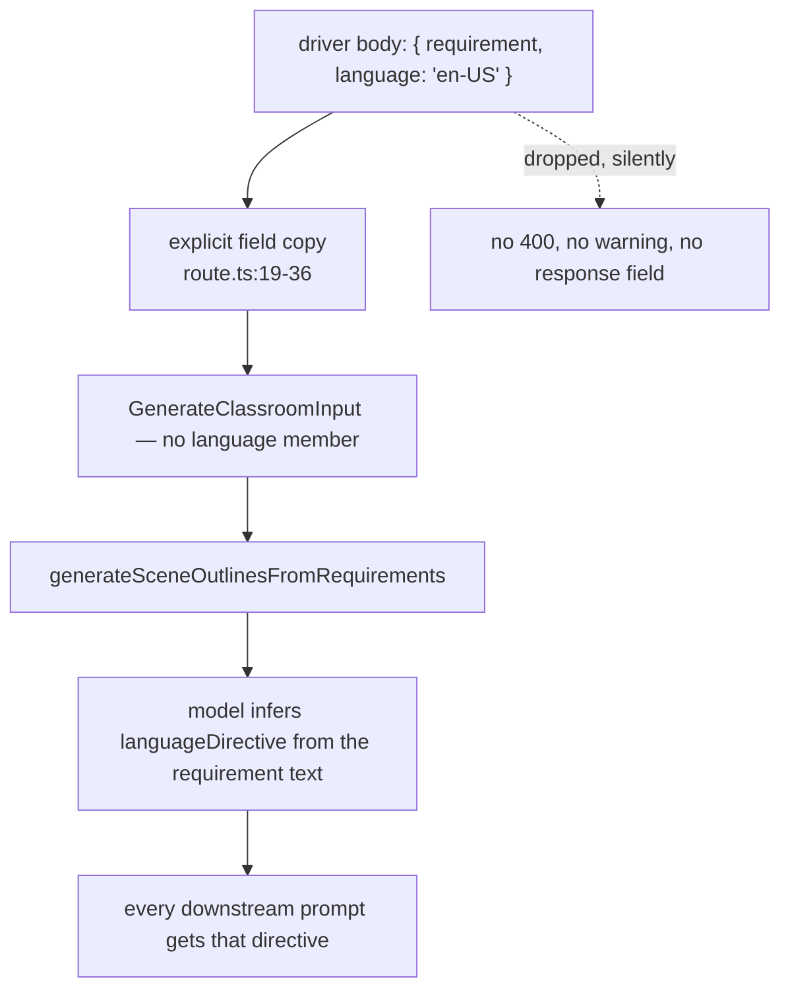
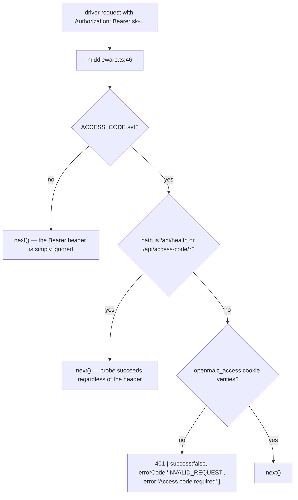

# 09 — An external agent workbench driving OpenMAIC

`skills/openmaic/` is **not consumed by any OpenMAIC runtime**. It is a skill for
somebody else's agent — an OpenClaw-style host — that drives an OpenMAIC
*deployment* over HTTP. This page traces that flow and records the two places
where the shipped contract and the shipped code disagree.

**Sources:** `skills/openmaic/SKILL.md` (104 lines) and its eight references,
`app/api/skills/[id]/route.ts`, `lib/server/skill-export.ts`,
`app/api/health/route.ts`, `app/api/generate-classroom/route.ts`,
`app/api/generate-classroom/[jobId]/route.ts`,
`lib/server/classroom-generation.ts:48-70`, `middleware.ts:60-85`;
`../appendix/research/agent-runtime/03b-flows-classroom-and-external.md`.

## Who is on which side of the boundary

The zip endpoint is gated on `isAgentRuntimeConfigured()`
(`app/api/skills/[id]/route.ts:24`) even though the skill itself has nothing to do
with the agent runtime — so a deployment without a `DATABASE_URL` cannot serve its
own driver skill.

## The SOP as a state machine

Six phases, confirmation-heavy, with two shortcut edges (`SKILL.md:52-96`).

The Extend edge explicitly **overrides** the `accessCode` shortcut: *"A returning
Live Demo user who now wants to do 二开 should be routed to extend, not silently
sent back to Live Demo"* (`SKILL.md:56`).

Two rules in the SOP are worth reading as design constraints on OpenMAIC itself,
not just as agent etiquette (`SKILL.md:18-23`):

- *"OpenMAIC classroom generation uses OpenMAIC server-side provider config."*
- *"This skill must not rely on any request-time model or provider overrides."*

Those hold: `lib/server/classroom-generation.ts` resolves its model through
`resolveModel({ stage: 'generate-classroom' })` with **no** client headers, and
`GenerateClassroomInput` has no model, key or base-URL member.

## Sequence — generation from outside

## Hop table: skill instruction vs repo reality

| # | Hop | Skill instruction | Repo reality |
| --- | --- | --- | --- |
| 1 | capability probe | `GET {url}/api/health`, read `capabilities` (`generate-flow.md`) | `app/api/health/route.ts:11-23` returns exactly those four booleans; each is true only when at least one **non-`disabled`** server provider exists (`:16-21`). No vendor is contacted. |
| 2 | optional PDF | `POST {url}/api/parse-pdf` first, then send `pdfContent` | `app/api/parse-pdf/route.ts` exists |
| 3 | submit | `POST {url}/api/generate-classroom` with `requirement` plus the optional flags | `app/api/generate-classroom/route.ts:19-36` accepts all of them **except `language`** — see below. 400 when `requirement` is empty (`:39-41`) |
| 4 | background work | not described | `after(() => runClassroomGenerationJob(...))` (`:48`) — the job outlives the response; `maxDuration = 30` bounds the *request*, not the job |
| 5 | poll | `GET {pollUrl}`; prefer ~60 s even though `pollIntervalMs` is 5000; never resubmit; cap active polling near 10 min per turn | `app/api/generate-classroom/[jobId]/route.ts` returns `{ jobId, status, …, pollUrl, pollIntervalMs }`; `done = status === 'succeeded' \|\| status === 'failed'` |
| 6 | finish | on `succeeded` use `result.classroomId` and `result.url`, printed as a bare URL on its own line | job steps are `initializing → researching → generating_outlines → generating_scenes → generating_media → generating_tts → persisting → completed` (`classroom-generation.ts:62-70`) |

## Two documented-vs-code discrepancies

### 1. `language` is documented but silently dropped

`skills/openmaic/references/generate-flow.md` documents:

> optional `language` (`"zh-CN"` | `"en-US"`, defaults to `"zh-CN"`) — any other
> value silently falls back to `"zh-CN"`

`GenerateClassroomInput` (`lib/server/classroom-generation.ts:48-60`) has eleven
members and **no `language`**. The route builds its input by explicit field copy
(`app/api/generate-classroom/route.ts:19-36`), so a `language` in the body is
dropped with no error and no warning. The generator derives a `languageDirective`
internally from the model's own inference instead.

Consequence: a driver that sets `language: "en-US"` gets whatever the model
infers from the requirement text, with a 200-shaped success and nothing in the
response indicating the field was ignored.

### 2. `Authorization: Bearer <access-code>` is not an auth mechanism here

`live-demo.md` and `generate-flow.md` both instruct the driver to send
`Authorization: Bearer <access-code>` on every request, and to treat a 401 as
"access code invalid".

The only access gate in this tree is `middleware.ts:60-85`: when `ACCESS_CODE` is
set, a request needs a valid HMAC-signed **`openmaic_access` cookie**, minted by
`POST /api/access-code/verify`. No code path anywhere reads an `Authorization`
header. `/api/health` and `/api/access-code/*` are the only allowlisted paths
(`middleware.ts:66-68`), so:

The health probe in phase 4 therefore **always succeeds** on a reachable
`ACCESS_CODE` deployment, and the very next call — `POST /api/generate-classroom`
— 401s. The skill's own error taxonomy ("On failure (401): access code is
invalid") reads that as a bad code.

*Inferred:* the hosted Live Demo at `open.maic.chat` terminates the Bearer header
at a gateway that is not in this repository. Nothing in the tree implements it.

## How the skill reaches the host

| # | Hop | Where |
| --- | --- | --- |
| 1 | host requests `GET /api/skills/openmaic` | `app/api/skills/[id]/route.ts:23` |
| 2 | `isAgentRuntimeConfigured()` gate | `:24` — off ⇒ plain-text 404 |
| 3 | `isSafeSkillId(id)` | `:26` — invalid ⇒ 400 `'Invalid skill id'` |
| 4 | `id === 'openmaic'` special case, before the builtin and owner lookups | `:28-31` |
| 5 | `buildOpenClawSkillZip()` | `lib/server/skill-export.ts`; a falsy result ⇒ 404 |
| 6 | response headers | `application/zip`, `Content-Disposition: attachment; filename="openmaic-skill.zip"`, `Cache-Control: no-store` (`:16-21`) |
| 7 | the files must exist in the deployed image | `next.config.ts:5-11` `outputFileTracingIncludes` lists `skills/openmaic/**` and `skills/agent-runtime/**` |

Step 7 is the non-obvious one: without that tracing entry, a `standalone` build
would ship without the markdown and step 5 would return 404 on every deployment.

## Failure modes from the driver's point of view

| Failure | What the driver sees | Reality |
| --- | --- | --- |
| Agent runtime not configured | 404 on `GET /api/skills/openmaic` | the *skill download* is gated on an unrelated feature flag |
| `ACCESS_CODE` set, Bearer header sent | health 200, then 401 on generation | the header is never read; a cookie is required |
| `language` sent | 202, then a course in whatever language the model inferred | field dropped at `route.ts:19-36` |
| Capability reported true but the vendor key is wrong | 202, then the job fails during that phase | `/api/health` reflects configuration, not reachability |
| Provider misconfigured | job `failed` with the server error | the SOP forbids retrying with different parameters — it tells the user to fix server config (`generate-flow.md`) |
| Poll returns 5xx | driver waits ~60 s and retries the same `pollUrl` | correct: the job is not restarted |
| Job outlives the agent turn | driver reports `jobId` + `pollUrl` for a later turn | correct: `after()` keeps it running server-side |
| Two submits for one requirement | two independent jobs, two classrooms | nothing server-side deduplicates; the SOP's "do not submit another job" rule is the only guard |

## Open questions

- Whether `open.maic.chat` runs this repository unmodified. The Bearer-header
  contract implies a gateway or a fork; neither is in the tree.
- Whether the `language` field was removed from the server or never implemented.
  The reference doc describes a fallback behaviour ("any other value silently
  falls back to `zh-CN`") specific enough to suggest it once existed.
- Nothing tests the skill against the routes it documents. A route rename would
  break every external driver silently.

## Related

- [`02-topic-to-classroom.md`](./02-topic-to-classroom.md) — the headless job this flow triggers, in detail.
- [`01-boot-and-config.md`](./01-boot-and-config.md) — the access-code gate and `/api/health`.
- [`12-trust-boundaries-in-flight.md`](./12-trust-boundaries-in-flight.md) — the access-code crossing.
- `../12-api-reference/index.md` — the authoritative endpoint contracts.
