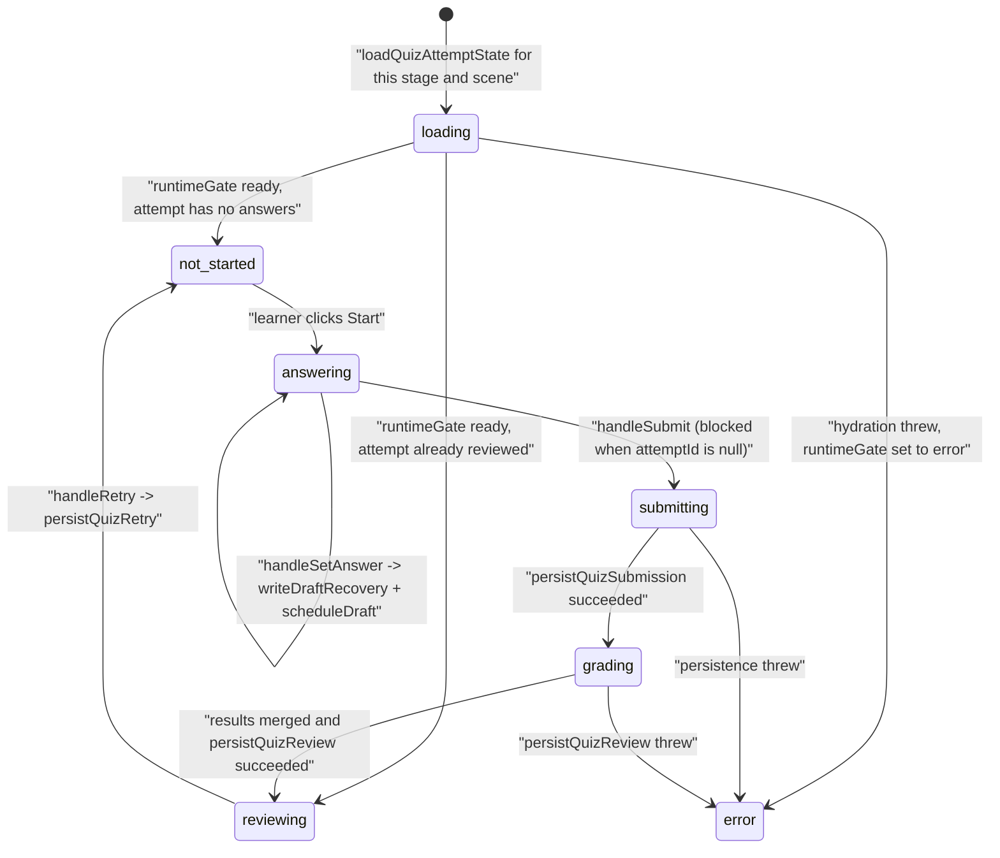
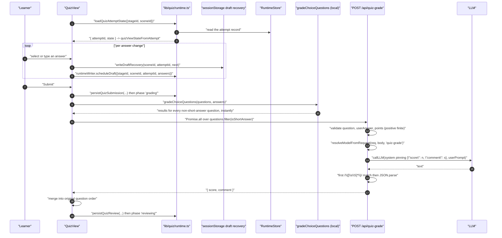
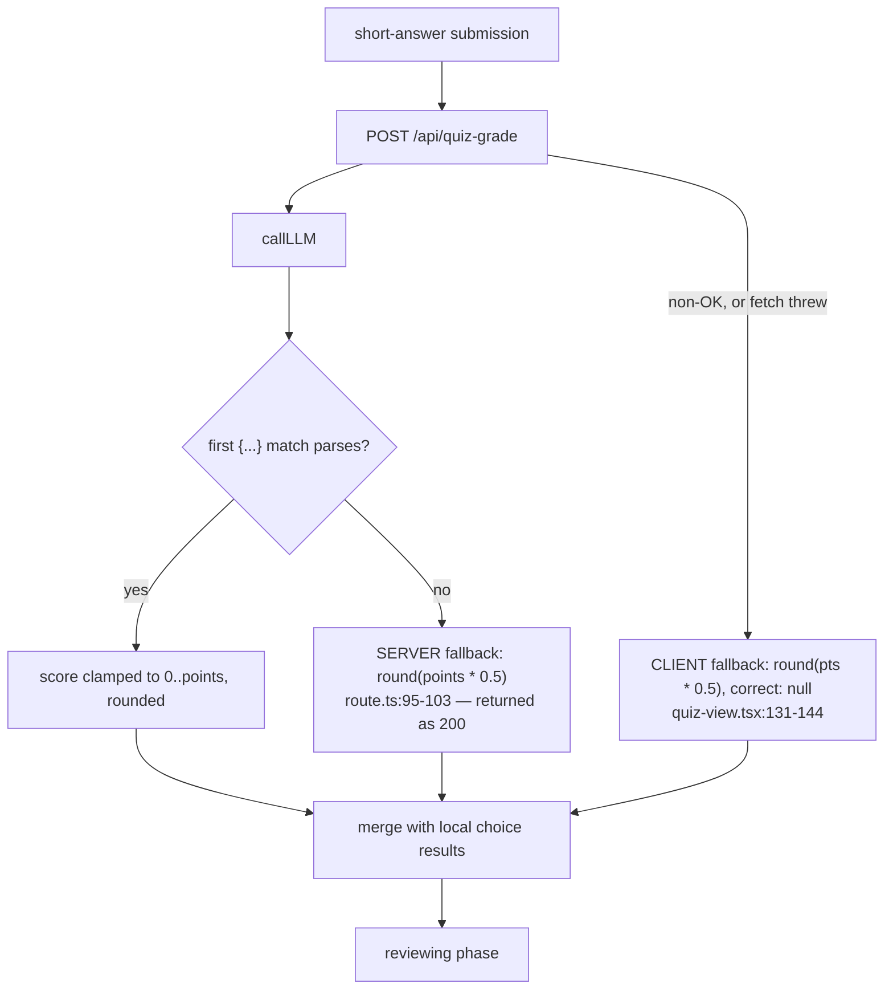
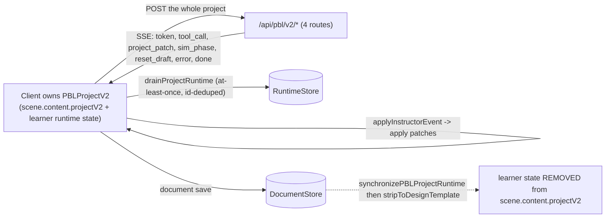
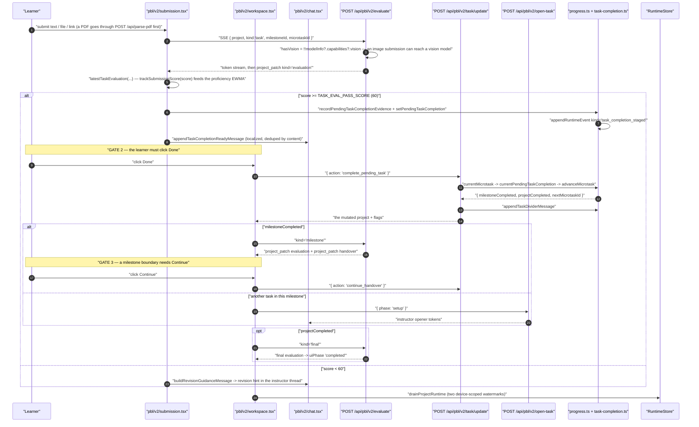
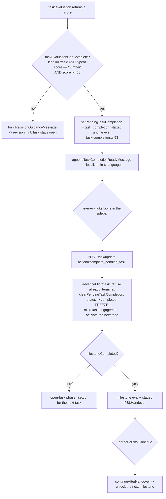

# 10 — Quiz attempt and PBL v2 task session

Two learner-assessment flows. The quiz is short and mostly local; the PBL v2
session is a stateless-server design where the client POSTs the whole project
and applies patches. Both are graded by an LLM at some point, and both have a
silent-fallback edge worth knowing.

**Sources:** `components/scene-renderers/quiz-view.tsx`, `lib/quiz/grading.ts`,
`lib/quiz/runtime.ts`, `lib/quiz/persistence.ts`, `lib/quiz/view-state.ts`,
`app/api/quiz-grade/route.ts`, `app/api/pbl/v2/task/update/route.ts`,
`app/api/pbl/v2/{open-task,evaluate,instructor,simulator}/route.ts`,
`lib/pbl/v2/api/sse.ts`, `lib/pbl/v2/agents/instructor.ts`,
`packages/@openmaic/generation/src/pbl/operations/kernel/task-completion.ts`,
`lib/pbl/v2/operations/kernel/progress.ts`, `lib/pbl/legacy/read.ts`;
`../appendix/research/classroom-runtime/03b-flows-scenes-and-pbl.md`,
`../appendix/research/generation-pipeline/03b-flows-scenes-and-quiz.md`.

## Flow A — quiz attempt to feedback

### Phase machine

Every phase transition is gated on persistence succeeding first. `handleSubmit`
returns immediately when `attemptId` is null (`quiz-view.tsx:783`), so a quiz
whose runtime never hydrated cannot be submitted at all.

### Sequence

### Hop table

| # | Where | Call | Notes |
| --- | --- | --- | --- |
| 1 | `quiz-view.tsx:727` | `loadQuizAttemptState({stageId, sceneId})` | a throw sets `runtimeGate: 'error'` and the quiz is unusable, not silently local |
| 2 | `quiz-view.tsx:763-780` | `handleSetAnswer` | writes **two** places: a `sessionStorage` recovery key and a debounced `RuntimeStore` draft |
| 3 | `quiz-view.tsx:782-794` | `handleSubmit` | `persistQuizSubmission` **before** phase `grading` — grading never runs on unpersisted answers |
| 4 | `lib/quiz/grading.ts:34` | `gradeChoiceQuestions(questions, answers)` | exact set comparison via `arraysEqual` (order-insensitive, sorted); `earned = correct ? points : 0` |
| 5 | `lib/quiz/grading.ts:29` | `isShortAnswer(q)` | classification is by **`type === 'short_answer'` only** — "an unanswered choice question (empty `answer`) is still a choice question and must not be re-routed to AI grading. `hasAnswer` does not override the type" |
| 6 | `quiz-view.tsx:807-811` | `Promise.all` over the short-answer questions | fully parallel, one request each; no concurrency bound |
| 7 | `app/api/quiz-grade/route.ts:37-44` | validation | missing `question`/`userAnswer` ⇒ 400; `points` must be a positive finite number ⇒ 400 |
| 8 | `route.ts:55-69` | prompt | two hardcoded variants selected by `language === 'zh-CN'`; the system prompt pins `{"score": <0..points>, "comment": …}` |
| 9 | `route.ts:88-94` | parse | first `{…}` regex match, then `JSON.parse`; score clamped to `[0, points]` and rounded |
| 10 | `route.ts:95-103` | **fallback** | any parse failure ⇒ `score = round(points × 0.5)` with a generic comment, returned as a **200 success** |
| 11 | `quiz-view.tsx:123-130` | client-side clamp | re-clamps to `[0, pts]`; `correct = earned >= pts * 0.8` |
| 12 | `quiz-view.tsx:131-144` | client-side fallback | a non-OK response or a throw also yields `round(pts * 0.5)`, with `correct: null` and a "grading service unavailable" comment |
| 13 | `quiz-view.tsx:826-838` | `persistQuizReview` then `setResults` + phase `reviewing` | a persistence failure sets `runtimeGate: 'error'` and the results are **not** shown |

### Two independent 50 % fallbacks

The server-side one is the sharper edge: it returns HTTP 200 with a
plausible-looking score, so neither the client nor the learner can distinguish
"the model graded this at 50 %" from "the model's output was unparseable". The
client-side fallback at least sets `correct: null` and says so in the comment.

The distinction matters because the two thresholds interact: `correct` is
`earned >= pts * 0.8`, and a 50 % fallback therefore always reports *incorrect*
on a question the learner may have answered perfectly.

## Flow B — a PBL v2 task session

### The stateless-server contract

`PBLSSEEvent` (`lib/pbl/v2/api/sse.ts:168`) is the **only formally typed SSE
event union in the whole HTTP surface** — seven variants, six `project_patch`
kinds. Every other stream in OpenMAIC agrees by convention.

`createSSEResponse` (`:211`) adds a 15 s `: keepalive` heartbeat and
`X-Accel-Buffering: no`, and guarantees that a generator throw still emits an
`error` frame followed by `done` before closing (`:265-273`).

### Sequence — submission to the next task

### The three-gate completion chain

Task completion is deliberately **not** something the instructor agent can do.

The instructor agent has exactly **two** non-advance tools —
`record_observation` and `adjust_difficulty` — and cannot advance a task at all
(`lib/pbl/v2/agents/instructor.ts`). Tools are attached only when
`phase === 'instructing' && !scenarioPrepStage` (`instructor.ts:1500`).

`setPendingTaskCompletion` preserves the original `createdAt` when re-staging the
same microtask (`task-completion.ts:63-71`), so a re-evaluation does not restart
the clock. `appendTaskCompletionReadyMessage` dedupes by exact content match on
the same `microtaskId` (`:131-134`), which is also why
`TASK_COMPLETION_READY_TEXTS` is a precomputed set of all six localizations
(`:104-112`) — so a language switch mid-session cannot produce a duplicate.

### `/api/pbl/v2/task/update`: five actions, zero LLM

| Action | Precondition | Effect |
| --- | --- | --- |
| `start` | `microtaskId` present | `startMicrotask(project, id)` |
| `continue_handover` | a pending handover exists | `continueAfterHandover`; 400 `'No pending handover to consume.'` otherwise |
| `complete_pending_task` | an active microtask **and** a matching `pendingTaskCompletion` | `advanceMicrotask(project, id, pending.reason, pending.assessment ?? {})` + `appendTaskDividerMessage` |
| `enter_scenario` | `project.scenario` set **and** the active milestone's `scenarioStage === 'prep'` | completes the prep microtask, seals the milestone, then consumes the handover in one call — no LLM, no milestone eval |
| `complete_act` | `project.scenario` set | `completeRoleplayAct(project, 'act_completed_by_learner')` — completes the whole roleplay milestone at once; per-beat achievement is scored later by the final evaluator |

Both scenario actions are *strictly gated* so "it can never affect ordinary
projects" (`route.ts:118-119`, `:147-148`). `maxDuration = 60` despite no LLM
call.

## Persistence points

| Point | Store | Written when |
| --- | --- | --- |
| Quiz draft recovery | `sessionStorage` (`quizDraft:` / `quizAnswers:` / `quizResults:` / `quizAttemptId:` prefixes, `lib/quiz/persistence.ts:19-22`) | synchronously on every answer change |
| Quiz attempt | `RuntimeStore` via `createQuizAttemptWriter` | debounced draft, then on submit and on review; flushed on unmount (`quiz-view.tsx:717-721`) |
| PBL runtime events | `RuntimeStore` via `drainProjectRuntime` | at-least-once, id-deduped, behind two device-scoped watermarks |
| PBL document | `DocumentStore` | `synchronizePBLProjectRuntime` then `stripToDesignTemplate` — learner state is **removed** from `scene.content.projectV2` before the save |

That last row is the design's load-bearing separation: the *document* holds the
project template, the *runtime store* holds one learner's progress through it.

## Failure modes

| Failure | Posture | Where |
| --- | --- | --- |
| Quiz runtime hydration throws | `runtimeGate: 'error'` — the quiz refuses to run rather than grading unpersistably | `quiz-view.tsx:736-739` |
| `persistQuizSubmission` throws | phase stays `submitting`, `runtimeGate: 'error'` | `quiz-view.tsx:789-792` |
| `persistQuizReview` throws | results computed but **not displayed**; `runtimeGate: 'error'` | `quiz-view.tsx:831-835` |
| LLM grading output unparseable | **silent 50 %**, HTTP 200 | `app/api/quiz-grade/route.ts:95-103` |
| `/api/quiz-grade` returns 5xx | client-side 50 % with `correct: null` and an explicit comment | `quiz-view.tsx:131-144` |
| PBL: no active microtask | `error NO_ACTIVE_MICROTASK` + `done` frame | `lib/pbl/v2/agents/instructor.ts:1306` |
| PBL: instructor generator throws | `createSSEResponse` emits `error` then `done` before closing | `lib/pbl/v2/api/sse.ts:265-273` |
| PBL: `advanceMicrotask` refuses | 400 `'Could not complete task: <error>'` | `app/api/pbl/v2/task/update/route.ts:91-93` |
| PBL: client aborts | `signal` listener calls `safeClose()`; the generator is abandoned | `sse.ts:237-246` |
| Legacy PBL project | read-time upgrade to a synthetic v2 project for rendering, **never persisted back** — progress on an upgraded v1 project is lost from the document | `lib/pbl/legacy/read.ts` |

## Open questions

- The 50 % grading fallback (`quiz-grade/route.ts:96-103`) has **no test
  coverage** according to the generation-pipeline evidence pack, and no telemetry
  distinguishes it from a real 50 % score.
- `correct = earned >= pts * 0.8` (`quiz-view.tsx:126`) is a hardcoded threshold
  that appears nowhere else and is not configurable per question.
- The legacy-PBL upgrade path is read-only-reachable but the write side is
  absent; whether any deployment still holds v1 projects is unknown from the tree.

## Related

- [`04-scene-playback.md`](./04-scene-playback.md) — how a `quiz` or `pbl` scene is reached, and why auto-advance refuses to leave one.
- [`02-topic-to-classroom.md`](./02-topic-to-classroom.md) — how quiz questions and PBL projects are generated.
- `../08-classroom-runtime/index.md` — the PBL v2 component structure and its scenario model.
