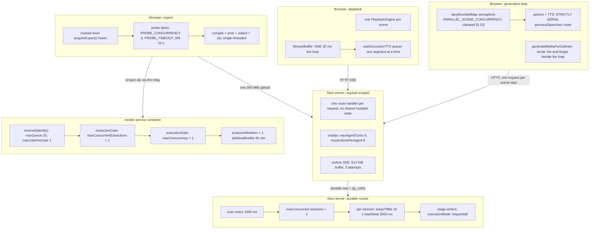
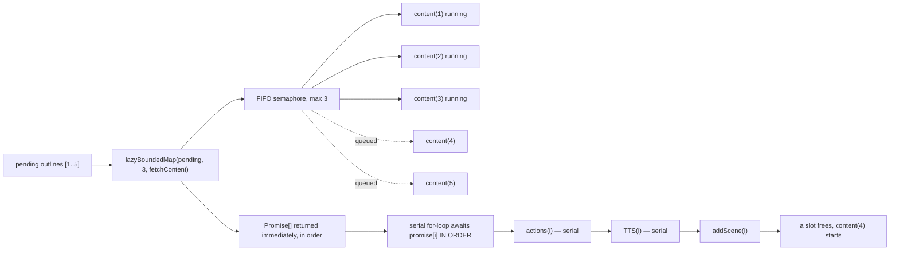
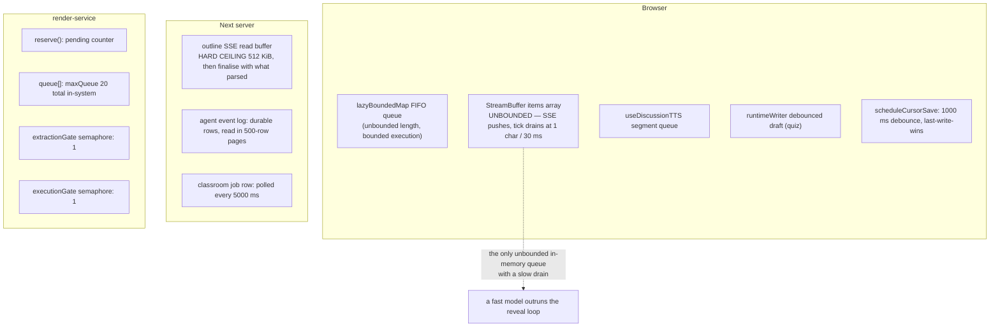
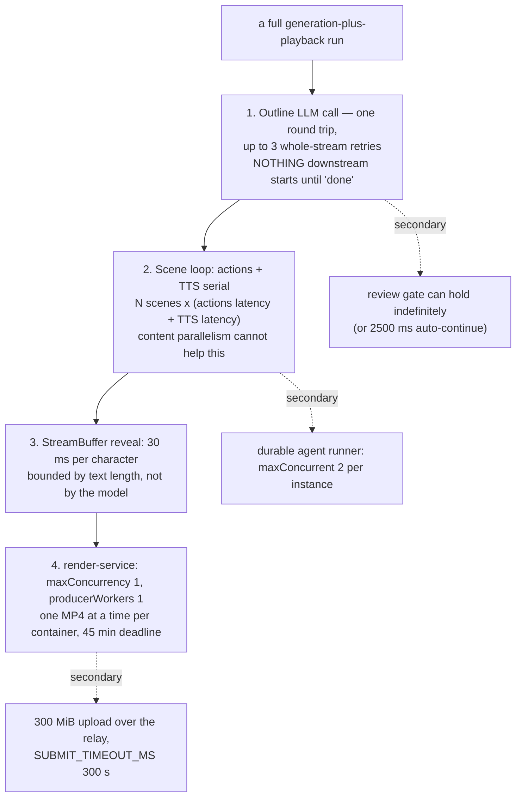
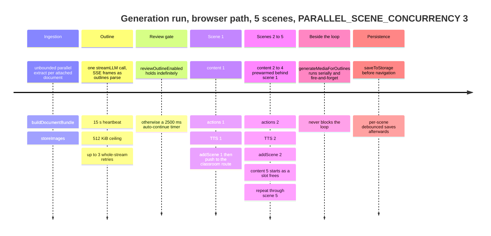
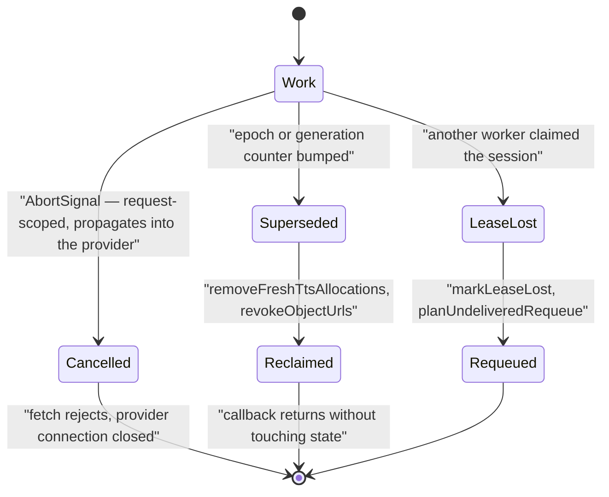

# 11 — Concurrency, serialisation, and backpressure

Where parallelism exists, where it is deliberately forbidden, which queues and
buffers absorb bursts, and which four places actually bottleneck a real run.

**Sources:** `lib/utils/concurrency.ts`, [`lib/hooks/use-scene-generator.ts:686-760`](lib/hooks/use-scene-generator.ts#L686-L760),
[`lib/server/provider-config.ts:1112`](lib/server/provider-config.ts#L1112), `lib/server/agent-runtime/config.ts`,
[`lib/server/agent-runtime/runner.ts:1861`](lib/server/agent-runtime/runner.ts#L1861),
`lib/agent-runtime/stage-writer-tools.ts`,
[`app/api/agent/sessions/[id]/events/route.ts:52-60`](app/api/agent/sessions/[id]/events/route.ts#L52-L60),
[`lib/buffer/stream-buffer.ts:206-212`](lib/buffer/stream-buffer.ts#L206-L212), [`lib/video-export-app/timeline-deps.ts:112-114`](lib/video-export-app/timeline-deps.ts#L112-L114),
`render-service/src/{render-coordinator,resource-profile,config}.ts`,
`lib/chat/pi/config.ts`, `app/api/generate/scene-outlines-stream/route.ts`.

## Concurrency domains

Six domains. Nothing crosses a domain boundary without a queue, a semaphore or a
durable row in between.

## The parallelism primitive

`lazyBoundedMap` ([`lib/utils/concurrency.ts:47`](lib/utils/concurrency.ts#L47)) is the no-barrier primitive that
makes the generation pipeline's pipelining possible:

- returns one promise per item **immediately, in input order**, without awaiting;
- each item acquires a slot on a FIFO counting semaphore before `fn` runs;
- the caller may `await` in any order, and each resolves as soon as *its* work
  finishes while later items keep running;
- `limit` is clamped to `[1, items.length]`, so a raw or oversized value is safe;
- `shouldContinue` is checked **when an item reaches the front of the queue** —
  once false, the remaining items resolve to `undefined` without running `fn`.

`mapWithConcurrency` (`:68`) is the barrier form, and the doc comment tells you to
prefer the lazy one when results can be consumed incrementally.

Effect: scene 1 paints after `content(1) + actions(1) + TTS(1)` — the same
latency as the fully serial loop — while `content(2..3)` run hidden behind scene
1's actions and TTS.

## What is serialised, and why

| Serialised thing | Where | Reason, from the source |
| --- | --- | --- |
| Scene **actions** and **TTS** | [`use-scene-generator.ts:698-706`](lib/hooks/use-scene-generator.ts#L698-L706) | preserve the `previousSpeeches` chain and the pause-on-failure UX |
| Media generation | [`lib/media/media-orchestrator.ts:41`](lib/media/media-orchestrator.ts#L41) | serial loop over tasks; runs beside the scene loop, never blocking it |
| Agent stage writers | [`lib/agent-runtime/stage-writer-tools.ts:20`](lib/agent-runtime/stage-writer-tools.ts#L20) → `executionMode: 'sequential'` | "so parallel writers cannot clobber each other (a consistency test pins the relation)" |
| SSE event polling on the agent tail | [`events/route.ts:260-272`](app/api/agent/sessions/[id]/events/route.ts#L260-L272) | `tick()` reschedules only after the previous poll **settles**, so a NOTIFY storm cannot stack reads |
| The 30 ms reveal loop | [`stream-buffer.ts:206-212`](lib/buffer/stream-buffer.ts#L206-L212) | "ONE source of pacing (this tick loop) — no double typewriter" |
| `render-service` execution | [`resource-profile.ts:26-30`](render-service/src/resource-profile.ts#L26-L30) | `maxConcurrency: 1` and `maxConcurrentExtractions: 1` in **both** profiles |
| Asset collector passes | [`asset-collector-schedule.ts:149-153`](lib/persistence/asset-collector-schedule.ts#L149-L153) | "a pass slower than the interval must not stack on itself; the next tick finds this one still running and skips" |
| Agent runner claim scan | [`runner.ts:1866-1868`](lib/server/agent-runtime/runner.ts#L1866-L1868) | `if (scanning \|\| ctx.shuttingDown) return` |
| Whiteboard runtime append | [`lib/whiteboard/runtime/store.ts:174`](lib/whiteboard/runtime/store.ts#L174) | the whole append runs under `withRuntimeStorageSharedLock` |

## What runs in parallel

| Parallel thing | Bound | Where |
| --- | --- | --- |
| Document extraction | **unbounded** — `Promise.all` over every attached source | [`app/generation-preview/page.tsx:340`](app/generation-preview/page.tsx#L340) |
| Scene content fetches | `PARALLEL_SCENE_CONCURRENCY`, clamped `[0, 10]` server-side, re-clamped twice more client-side | [`lib/server/provider-config.ts:1112`](lib/server/provider-config.ts#L1112), [`use-scene-generator.ts:689-695`](lib/hooks/use-scene-generator.ts#L689-L695) |
| Short-answer quiz grading | **unbounded** — `Promise.all` over every short-answer question | [`components/scene-renderers/quiz-view.tsx:807-811`](components/scene-renderers/quiz-view.tsx#L807-L811) |
| Audio + video duration probes | `PROBE_CONCURRENCY = 6`, each with a `PROBE_TIMEOUT_MS = 10_000` watchdog | [`lib/video-export-app/timeline-deps.ts:112-114`](lib/video-export-app/timeline-deps.ts#L112-L114) |
| Importer media uploads | `createConcurrencyLimiter(6)` | `packages/@openmaic/importer/src/import-pipeline/transformParsedToSlides.ts` |
| DI deps + quiz layout probe | 2-way `Promise.all` | [`build-export-zip.ts:95`](lib/video-export-app/build-export-zip.ts#L95) |
| Durable agent sessions | `maxConcurrent = 2` per application instance | [`lib/server/agent-runtime/config.ts:17`](lib/server/agent-runtime/config.ts#L17) |
| Render jobs per identity | `maxJobsPerUser = 1` (`RENDER_MAX_JOBS_PER_USER`) | `render-service/src/config.ts` |

The two **unbounded** rows are the ones to watch. Five attached documents means
five concurrent extractor calls, and a twelve-question short-answer quiz means
twelve concurrent LLM calls with no rate limiting anywhere in `app/api/**`.

## Queues and buffers, by location

`StreamBuffer` is worth naming precisely: SSE deltas append to `items` with no
cap, while the tick loop reveals **one character per 30 ms** (`charsPerTick = 1`,
`tickMs = 30`). A 2000-character agent turn therefore takes 60 seconds of
wall-clock reveal regardless of how fast the model produced it. The `shouldHold`
protocol adds *more* delay on top when TTS audio is still playing.

That is a deliberate presentation choice, not a bug — but it means the buffer is
the largest latency contributor in a live turn, and it is not tunable from any
env var found in the tree.

## Where the real bottlenecks are

Ranked by what a staff engineer would actually measure:

1. **The outline call is a hard barrier.** It is one LLM request whose output the
   whole run depends on. Parallelising scenes cannot start before it resolves,
   and a zero-outline parse restarts the *entire* stream (up to 3 attempts).
2. **Actions + TTS serialisation dominates a multi-scene course.** With content
   parallelism on, the loop's wall-clock time is
   `Σ(actions_i + tts_i)` plus one `content_1`. Raising
   `PARALLEL_SCENE_CONCURRENCY` beyond ~3 buys almost nothing because the serial
   tail is unchanged.
3. **The 30 ms reveal loop** caps live-turn throughput at ~33 characters/second
   of visible text, independent of the model.
4. **`render-service` is single-slot by construction.** Both resource profiles
   pin `maxConcurrency: 1`, `maxConcurrentExtractions: 1`, `producerWorkers: 1`
   ([`resource-profile.ts:26-30`](render-service/src/resource-profile.ts#L26-L30)). Concurrency there is a deployment-count
   decision, not a config one.

## Backpressure, per boundary

| Boundary | Mechanism | On overload |
| --- | --- | --- |
| Browser → scene-content route | the semaphore itself — at most `n` requests in flight | requests queue client-side; the server sees at most `n` |
| Browser → `/api/quiz-grade` | **none** | every short-answer question fires at once |
| Browser → `/api/extract-document` | **none** | every attached document fires at once |
| Client → agent SSE tail | serialised polling + NOTIFY wakeup coalescing | a burst of events collapses into one 500-row page read |
| Client → render relay | `capBodyStream(req.body, 300 MiB)` | the stream aborts; the relay translates it to 413 |
| Relay → render-service | `coordinator.reserve(identity)` **before** buffering | 429 with `queue_full` or `per_identity_limit`; the body is never read |
| render-service internal | `extractionGate` then `executionGate` | requests wait with their body **unconsumed**, so only `maxConcurrentExtractions` bodies are buffered at once |
| Any route | **no rate limiting exists anywhere in `app/api/**`** | nothing |

The render-service ordering is the only place in the system that gets admission
control right: reserve → gate → buffer → extract → submit, with every failure
path releasing the reservation and cleaning the project directory
([`main.ts:322-330`](render-service/src/main.ts#L322-L330)).

## Timeline of a generation run

Illustrative shape, with real constants. Wall-clock values depend on the model.

## Cancellation and epoch discipline

Three different cancellation mechanisms, one per domain. Confusing them is the
most common source of "why did this stale callback fire" bugs.

| Mechanism | Domain | Semantics |
| --- | --- | --- |
| `AbortController` / `AbortSignal` | HTTP requests, LLM streams, tool calls | standard; `AbortSignal.any([callerSignal, timeout(...)])` in `generateTTS` |
| `generationEpoch` (Zustand counter) | the generation loop | a stage switch bumps it; every step re-checks and reclaims fresh TTS allocations before breaking |
| `playbackGeneration` (instance counter) | `PlaybackEngine` | 20 guard call sites; every async continuation captures its generation and checks `isCurrentGeneration` |
| `sceneEpochRef` | `PlaybackChromeRoot` | discards stale `onLiveSpeech` / `onThinking` microtasks from the previous scene's buffer |
| `loadToken` | classroom load | `claimStageSceneLoadToken()` + `isCurrentStageSceneLoadToken` gate every write in `runClassroomLoad` |
| PG lease | durable agent runtime | `leaseTtlMs = 10_000`, heartbeat 2000 ms; a lost lease throws `AgentSessionLeaseLostError` from inside the transaction |

The counters are used *instead of* `AbortController` in the browser because the
work being cancelled is not a single request — it is a chain of state writes
across many awaits, and a counter check is cheaper and impossible to forget to
plumb through a callback.

## Open questions

- No committed configuration sets `PARALLEL_SCENE_CONCURRENCY`,
  `OPENMAIC_AGENT_RUNTIME_MAX_CONCURRENT`, or `RENDER_MAX_JOBS_PER_USER` above
  their defaults, so the tuned values for a real deployment are unknown.
- `StreamBuffer`'s `tickMs` and `charsPerTick` are constructor options
  ([`stream-buffer.ts:208-209`](lib/buffer/stream-buffer.ts#L208-L209)) but no caller found in this trace overrides them,
  and no env var reaches them.
- The two unbounded `Promise.all` fan-outs (document extraction, quiz grading)
  have no recorded rationale — unlike the scene loop, whose comment explains
  exactly why the knob is server-side ("many deployments use API keys with low
  per-key concurrency quotas, where a bursty default would surface as 429s",
  [`provider-config.ts:1108-1110`](lib/server/provider-config.ts#L1108-L1110)).

## Related

- [`02-topic-to-classroom.md`](docs/11-data-flows/02-topic-to-classroom.md) — the loop these bounds govern.
- [`06-edit-with-ai.md`](docs/11-data-flows/06-edit-with-ai.md) — leases and sequential writers in context.
- [`08-export-video.md`](docs/11-data-flows/08-export-video.md) — the render-service gates in their flow.
- [`../15-cross-cutting/index.md`](docs/15-cross-cutting/index.md) — rate limiting, retries and timeouts as cross-cutting concerns.
