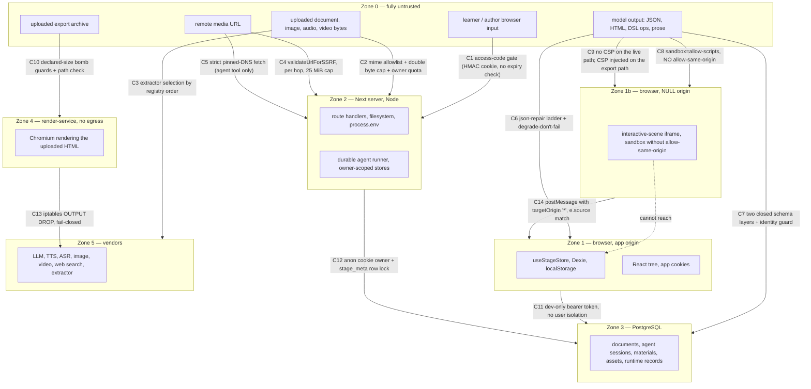
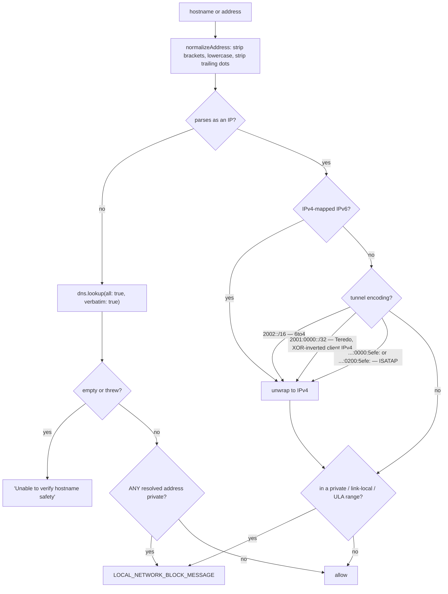
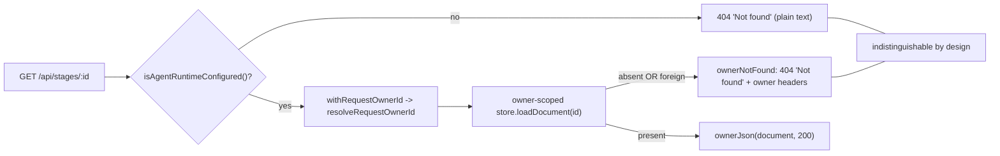
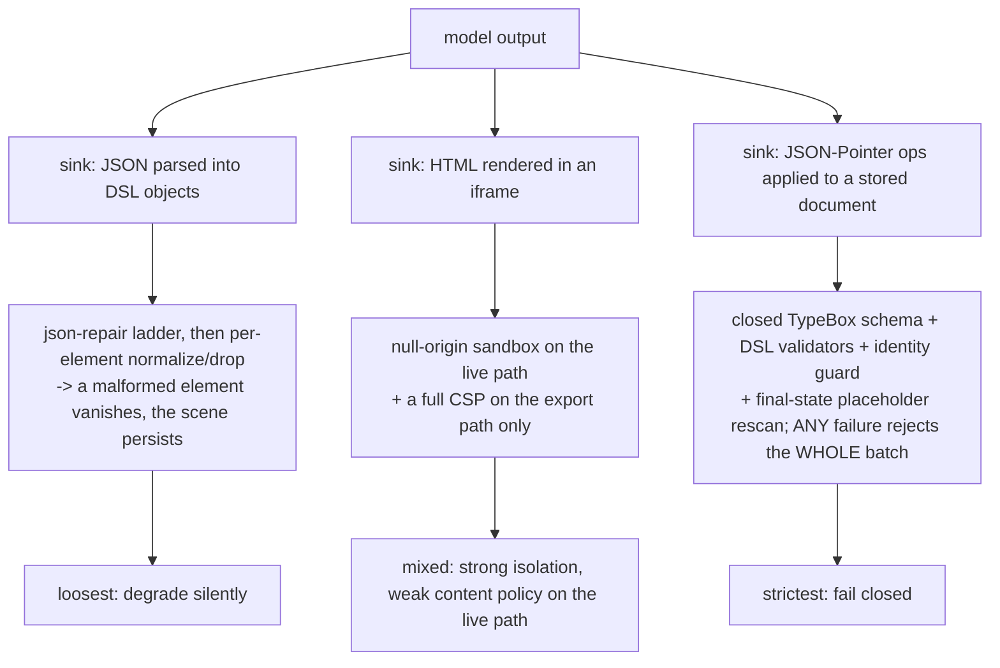
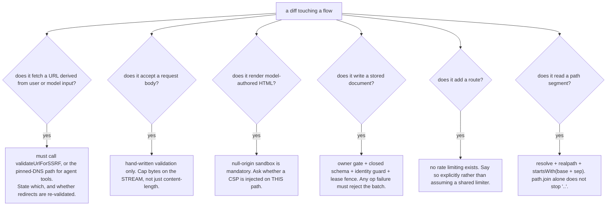

# 12 — Trust boundaries in flight

Every point where untrusted bytes cross into a privileged context, and the
control applied at that crossing — or the fact that none is. Ordered by zone, not
by severity, so it can be walked against a diff.

**Sources:** `middleware.ts`, `lib/server/ssrf-guard.ts`,
`lib/server/agent-runtime/fetch-url.ts`, `lib/server/api-response.ts`,
`lib/server/agent-runtime/{owner,with-owner,route-response}.ts`,
`lib/server/resolve-model.ts`, `lib/persistence/server-auth.ts`,
`app/api/persistence/[...path]/route.ts`, `app/api/materials/route.ts`,
`app/api/classroom-media/[classroomId]/[...path]/route.ts`,
`app/api/proxy-media/route.ts`, [`lib/media/comfyui-workflows.ts:49`](lib/media/comfyui-workflows.ts#L49),
`components/scene-renderers/InteractiveIframeHost.tsx`,
[`lib/video-export-app/prepare-interactive-html.ts:30-35`](lib/video-export-app/prepare-interactive-html.ts#L30-L35),
`lib/server/agent-runtime/course-edit/apply.ts`,
`render-service/src/{unzip,main}.ts`, `render-service/docker-entrypoint.sh`,
[`next.config.ts:38-56`](next.config.ts#L38-L56);
[`../appendix/research/api-surface/02b-interfaces-egress-body-sse.md`](docs/appendix/research/api-surface/02b-interfaces-egress-body-sse.md).

## Trust zones

## Crossing catalogue

| ID | Crossing | Control | Where | Gap |
| --- | --- | --- | --- | --- |
| C1 | any request → route handler | `ACCESS_CODE` HMAC cookie, verified with `crypto.subtle` | [`middleware.ts:18-44`](middleware.ts#L18-L44), [`:71-82`](middleware.ts#L71-L82) | the embedded timestamp is **never compared to now**, so a signed token never expires server-side; only the cookie's 7-day `maxAge` bounds it. The HMAC key **is** the shared code, so any holder can mint a token. Page requests pass through by design. |
| C2 | uploaded bytes → material store | mime normalised and validated against the workbench policy (415), per-class byte cap enforced on the declared `content-length` **and** the streamed bytes (413), owner count/byte quota (429), sha256 finalisation, full compensation on every failure branch | [`app/api/materials/route.ts:11-31`](app/api/materials/route.ts#L11-L31), [`:70-73`](app/api/materials/route.ts#L70-L73) | filename is sanitised to a bare basename and truncated to 512 chars ([`:82-93`](app/api/materials/route.ts#L82-L93)) but is otherwise attacker-controlled display text |
| C3 | uploaded bytes → extractor vendor | managed provider ⇒ client credentials discarded, server creds resolved; client `baseUrl` SSRF-checked **only when `NODE_ENV === 'production'`** | [`app/api/extract-document/route.ts:258-263`](app/api/extract-document/route.ts#L258-L263), [`:386`](app/api/extract-document/route.ts#L386) | in development the client can point the extractor at any host |
| C4 | remote media URL → server fetch | `validateUrlForSSRF` on the initial URL **and on every redirect hop** (max 5), 25 MiB cap on the declared *and* realised size, 4xx forwarded verbatim, 5xx collapsed to 502 | [`app/api/proxy-media/route.ts:33`](app/api/proxy-media/route.ts#L33), [`:54-57`](app/api/proxy-media/route.ts#L54-L57), [`:67-75`](app/api/proxy-media/route.ts#L67-L75) | uses bare `fetch`, not `proxyFetch`; and `ALLOW_LOCAL_NETWORKS` short-circuits the guard entirely (see C4a) |
| C4a | the SSRF off-switch | `validateUrlForSSRF` returns `null` when `ALLOW_LOCAL_NETWORKS` is `'true'` or `'1'`, before the host, `isPrivateIP` and DNS checks — the URL-parse and http/https checks still run | [`lib/server/ssrf-guard.ts:265-269`](lib/server/ssrf-guard.ts#L265-L269), checks that survive at [`:255-263`](lib/server/ssrf-guard.ts#L255-L263) | one **global** switch disables the guard for all thirteen calling routes, and the block message advertises it to the caller ([`:246-247`](lib/server/ssrf-guard.ts#L246-L247)) |
| C5 | agent-tool URL → server fetch | the hardened path: `normalizeUrlForStrictFetch` (http/https only, no userinfo, ports 80/443 only) then `createPinnedFetchAgent` + `lookupAllThenPin` + `assertSafeLookupAddresses` pin the *classified* DNS answer set into the undici connection, and every redirect is re-normalised | [`ssrf-guard.ts:55-70`](lib/server/ssrf-guard.ts#L55-L70), [`fetch-url.ts:129-171`](lib/server/agent-runtime/fetch-url.ts#L129-L171), [`:450`](lib/server/agent-runtime/fetch-url.ts#L450), [`:463-475`](lib/server/agent-runtime/fetch-url.ts#L463-L475) | this is the only DNS-rebinding-safe path; the 13 `validateUrlForSSRF` callers are TOCTOU-vulnerable by construction |
| C6 | model JSON → client state | `parseJsonResponse` plus a 4-attempt repair ladder; malformed slide elements dropped individually; unmapped image ids remove their element; zero parsed actions fall back to a canned `Action` list | [`packages/@openmaic/generation/src/json-repair.ts:43`](packages/@openmaic/generation/src/json-repair.ts#L43), [`:177`](packages/@openmaic/generation/src/json-repair.ts#L177) | degrade-don't-fail means a partially-hallucinated scene can persist silently |
| C7 | model DSL ops → document | five authorisation layers plus a closed TypeBox mirror (`additionalProperties: false` everywhere), the DSL structural validators, an element-identity guard, and a **final-state** media-placeholder rescan of the serialised scene | [`course-edit/apply.ts:361-419`](lib/server/agent-runtime/course-edit/apply.ts#L361-L419), [`dsl-tools.ts:819-834`](lib/server/agent-runtime/dsl-tools.ts#L819-L834) | the TypeBox mirror is hand-maintained against `@openmaic/dsl`'s `slides.ts`; nothing generated or tested enforces the equality |
| C8 | model HTML → browser | `sandbox="allow-scripts allow-forms allow-popups"` — **`allow-same-origin` deliberately omitted**, so the document is in a unique null origin and cannot reach cookies, `localStorage` or the parent DOM | [`InteractiveIframeHost.tsx:145-155`](components/scene-renderers/InteractiveIframeHost.tsx#L145-L155), [`:281`](components/scene-renderers/InteractiveIframeHost.tsx#L281) | `allow-popups` is granted; a hostile page can open a window |
| C9 | model HTML → CSP | the **export** path injects `default-src 'none'; connect-src 'none'; worker-src 'none'; frame-src 'none'; object-src 'none'; base-uri 'none'` (with `'unsafe-inline'`/`'unsafe-eval'` for scripts) and disables `Worker`/`SharedWorker` | [`prepare-interactive-html.ts:30-52`](lib/video-export-app/prepare-interactive-html.ts#L30-L52) | **no CSP is injected on the live classroom path.** The only app CSP is `frame-ancestors` ([`next.config.ts:38-56`](next.config.ts#L38-L56)) — there is no `default-src`, `script-src` or `connect-src` on any app response |
| C10 | uploaded archive → container filesystem | four limits enforced on **declared** sizes before any byte is decompressed (entry count, per-entry bytes, compression ratio, total expansion), a required `index.html`, and a `relative()` path-escape check on every write | [`render-service/src/unzip.ts:38-58`](render-service/src/unzip.ts#L38-L58), [`:74-84`](render-service/src/unzip.ts#L74-L84) | — |
| C11 | browser → persistence HTTP surface | `PERSISTENCE_DEV_TOKEN` bearer plus a client-supplied `x-learner-key` | `lib/persistence/server-auth.ts` | **documented as providing no isolation**: the token is compiled into the public bundle, so "anyone who can load the page can read and write EVERY learner partition and all documents by supplying an arbitrary `x-learner-key`". All assets collapse into one `'shared'` principal |
| C12 | request → owner-scoped document | `resolveRequestOwnerId` mints/reads an `anonymous_id` UUIDv4 cookie ⇒ `anon:<uuid>`; every **stage-scoped** operation is fenced on a `stage_meta` row lock — `FOR UPDATE` for writes, `FOR SHARE` for reads — with four named refusals (`foreign` / `tombstoned` / `reserved-document` / `unclaimed`); `readGated` turns any of them into `null` rather than leaking existence | [`owner.ts:52-64`](lib/server/agent-runtime/owner.ts#L52-L64); fence entry [`owner-bound-document-store.ts:187-192`](lib/persistence/owner-bound-document-store.ts#L187-L192), the four throws at [`:196`](lib/persistence/owner-bound-document-store.ts#L196), [`:199`](lib/persistence/owner-bound-document-store.ts#L199), [`:207`](lib/persistence/owner-bound-document-store.ts#L207), [`:210`](lib/persistence/owner-bound-document-store.ts#L210); read degradation [`:120-127`](lib/persistence/owner-bound-document-store.ts#L120-L127) | the fence is keyed on `operation.stageId` ([`:187`](lib/persistence/owner-bound-document-store.ts#L187)), so the folder-library operations that carry no stage id — `createFolder`, `renameFolder`, `deleteFolder` ([`:142`](lib/persistence/owner-bound-document-store.ts#L142), [`:156`](lib/persistence/owner-bound-document-store.ts#L156), [`:163`](lib/persistence/owner-bound-document-store.ts#L163)) — take no row lock at all. The `foreign` refusal is also write-only ([`:195`](lib/persistence/owner-bound-document-store.ts#L195) tests `mode !== 'read'`), so ownership is enforced on reads by the `unclaimed`/`tombstoned` branches, not by an owner comparison. `resolveRequestOwnerId` accepts an `authenticatedOwnerId` parameter that **no call site anywhere supplies**, so every owner id is `anon:`-prefixed. Clearing a cookie orphans the course |
| C13 | container → network | `iptables -A OUTPUT -o lo -j ACCEPT`, `-m state --state ESTABLISHED,RELATED -j ACCEPT`, `-P OUTPUT DROP`, then `setpriv` to an unprivileged user. IPv6 default-drops when present | `render-service/docker-entrypoint.sh` | **fail-closed**: not root, no `iptables`, or a rule failure ⇒ exit non-zero, because otherwise `/health` would advertise a healthy but unisolated service |
| C14 | iframe → parent | `e.source !== iframeRef.current?.contentWindow` rejects, then `d.__maicInteractive !== true` rejects, then a `kind` switch | [`InteractiveIframeHost.tsx:207-225`](components/scene-renderers/InteractiveIframeHost.tsx#L207-L225) | origin cannot be checked (null origin), so `e.source` identity is the only binding; the host sends with `targetOrigin: '*'` ([`:177`](components/scene-renderers/InteractiveIframeHost.tsx#L177)) |
| C15 | client model headers → provider | `resolveModelFromRequest` reads `x-model` / `x-api-key` / `x-base-url` / `x-provider-type`; a `MODEL_ROUTES` entry for the stage **wins and discards the client credentials**; a client base URL is SSRF-checked **only in production** | header reads in `resolveModelFromHeaders` ([`lib/server/resolve-model.ts:162-175`](lib/server/resolve-model.ts#L162-L175)), wrapped by `resolveModelFromRequest` ([`:183`](lib/server/resolve-model.ts#L183)); route-wins precedence [`:63-65`](lib/server/resolve-model.ts#L63-L65); production-only base-URL check [`:105-110`](lib/server/resolve-model.ts#L105-L110) | in development a client base URL reaches the fetch unchecked |
| C16 | client workflow id → filesystem | three layers: `isComfyuiWorkflowFilename` rejects `/`, `\`, `..` and requires a `.json` name containing `comfyui` or `workflow`; membership in `listComfyuiWorkflowFilenames()`; and `path.resolve(filePath).startsWith(resolve(publicDir) + sep)` | [`lib/media/comfyui-workflows.ts:49-55`](lib/media/comfyui-workflows.ts#L49-L55), [`:101-104`](lib/media/comfyui-workflows.ts#L101-L104), [`comfyui-image-adapter.ts:174`](lib/media/adapters/comfyui-image-adapter.ts#L174) | — |
| C17 | classroom-media path → filesystem | per-segment traversal validation, `path.resolve` against the classroom dir, then **`fs.realpath`** and a `startsWith(resolvedBase + path.sep)` check so a symlink cannot escape | [`app/api/classroom-media/[classroomId]/[...path]/route.ts:51-70`](app/api/classroom-media/[classroomId]/[...path]/route.ts#L51-L70) | — |
| C18 | any `/api/*` request → rate limiting | **none exists anywhere in `app/api/**`** | — | the only per-identity limit in the tree is `render-service`'s `maxJobsPerUser`, and even that collapses to one `'direct'` bucket unless `TRUST_PROXY_HEADERS=true` |

## The SSRF classifier, in detail

The flow below is `validateUrlForSSRF`'s host decision
([`lib/server/ssrf-guard.ts:271-301`](lib/server/ssrf-guard.ts#L271-L301)) with its range test, `isPrivateIP` ([`:178`](lib/server/ssrf-guard.ts#L178)),
inlined. `isPrivateIP` is not a naive RFC1918 check: it un-maps IPv4-in-IPv6 and
additionally unwraps three tunnel encodings to test the **embedded** IPv4.

`isPrivateIP` is **only** a range classifier: it tests neither `ipaddr.js`
`range()` nor any metadata denylist. Both of those live on the agent `fetch_url`
strict path:

| Denied | By | Reached from |
| --- | --- | --- |
| anything whose `range()` is not `unicast` — multicast, broadcast, every reserved block | `assertSafeIp` ([`ssrf-guard.ts:44-51`](lib/server/ssrf-guard.ts#L44-L51)) | `normalizeUrlForStrictFetch:81`, `assertSafeLookupAddresses` |
| `169.254.169.254`, `100.100.100.200`, `fd00:ec2::254` | `assertSafeIp` reading `CLOUD_METADATA_ADDRESSES` (`:46`) | same |
| the hostname `metadata.google.internal` | `normalizeUrlForStrictFetch` reading `CLOUD_METADATA_HOSTNAMES` (`:74`) | agent `fetch_url` only |

`validateUrlForSSRF` calls none of the three, so C4/C15 and the other
`validateUrlForSSRF` crossings get no metadata check. `169.254.169.254` and
`fd00:ec2::254` are still blocked for them, but only as link-local and ULA inside
`isPrivateIP` (`:192`, `:209`); `100.100.100.200` is in no `isPrivateIP` range and
passes.

## Per-route SSRF divergence

Sibling routes apply different strictness. This is the surprise most likely to
bite a reviewer.

| Route | Check | Redirect policy |
| --- | --- | --- |
| `/api/generate/tts` | always, on a client `ttsBaseUrl` | n/a |
| `/api/transcription` | **only when `NODE_ENV === 'production'`** | n/a |
| `/api/azure-voices` | always | `redirect: 'manual'`; any 3xx ⇒ 403 `REDIRECT_NOT_ALLOWED` |
| `/api/proxy-media` | initial URL **and** each of ≤5 hops | manual, re-validated per hop |
| Qwen voice-clone audio download | a strict host regex, **not** the shared guard | `redirect: 'error'`; http upgraded to https; `MAX_AUDIO_RESPONSE_BYTES` enforced |
| agent `fetch_url` tool | `normalizeUrlForStrictFetch` + pinned-DNS agent | manual, every hop re-normalised, `MAX_REDIRECTS` enforced |
| `RENDER_SERVICE_URL` | deliberately **not** guarded — operator config meant to point at an internal host | n/a |

## The no-existence-oracle posture

26 route files (37 call sites) gate on `isAgentRuntimeConfigured()` and answer a **byte-identical
plain-text 404** for three distinct conditions: the feature is off, the resource
is not yours, the resource does not exist. The reason is stated at
[`lib/server/agent-runtime/route-response.ts:36-40`](lib/server/agent-runtime/route-response.ts#L36-L40).

`withRequestOwnerId` guarantees the minted `Set-Cookie` rides **every** response
including the catch-all 500 ([`with-owner.ts:20-23`](lib/server/agent-runtime/with-owner.ts#L20-L23)), so an owner identity is never
lost to an error.

## Model output as an attack surface

Three distinct sinks, three distinct controls. The important observation is that
they are *not* uniform.

The asymmetry is defensible — a dropped slide element is a cosmetic loss, a bad
document write is corruption — but it means the same model output is treated as
"repair it" in one path and "reject the batch" in another.

## Untrusted data that never gets validated

Recorded here because absence of a control is a finding, not an omission.

| Data | Where it enters | Consequence |
| --- | --- | --- |
| `sessionStorage['generationSession']` | written by `/`, read by `/generation-preview` | not schema-validated; normalised defensively but a hand-edited value reaches the pipeline |
| `sessionStorage['generationParams']` | written by `/generation-preview`, read by `/classroom/[id]` | **untyped and never cleared**; a stale entry from a previous run is read on the next classroom load |
| `sessionStorage['workbench.launchPrompt']` | legacy launch-link path | not validated |
| Route bodies generally | every route in `app/api/**` | validation is **entirely hand-written**; `zod` is a project dependency and is used in **zero** route files |
| Error envelope shape | 48 of 69 routes use `apiError`/`apiSuccess` | **five** different error-envelope shapes exist across the surface, plus bare bodies with no envelope at all, so a client cannot parse failures uniformly — enumerated at [`../12-api-reference/09-conventions.md`](docs/12-api-reference/09-conventions.md) §"Error envelopes: five shapes" |

## What a reviewer should check on a diff

## Open questions

- Whether any deployment sets `ALLOW_LOCAL_NETWORKS=true`. It is a single global
  off-switch for thirteen routes and there is no per-route override.
- Whether `open.maic.chat` terminates its `Authorization: Bearer` contract at a
  gateway that also adds a CSP, rate limiting, or real user identity — none of
  which exist in this tree. See [`09-external-workbench.md`](docs/11-data-flows/09-external-workbench.md).
- `middleware.ts` — the only auth gate in the system — has **no test**, and its
  signed timestamp is never checked for age.

## Related

- [`01-boot-and-config.md`](docs/11-data-flows/01-boot-and-config.md) — the access-code gate in its request flow.
- [`03-document-to-classroom.md`](docs/11-data-flows/03-document-to-classroom.md) — the upload and extractor crossings in context.
- [`08-export-video.md`](docs/11-data-flows/08-export-video.md) — the archive and egress-lockdown crossings in context.
- [`../15-cross-cutting/index.md`](docs/15-cross-cutting/index.md) — the same controls organised as concerns rather than crossings.
- [`../14-code-quality/index.md`](docs/14-code-quality/index.md) — the validation-consistency and envelope-shape findings.
