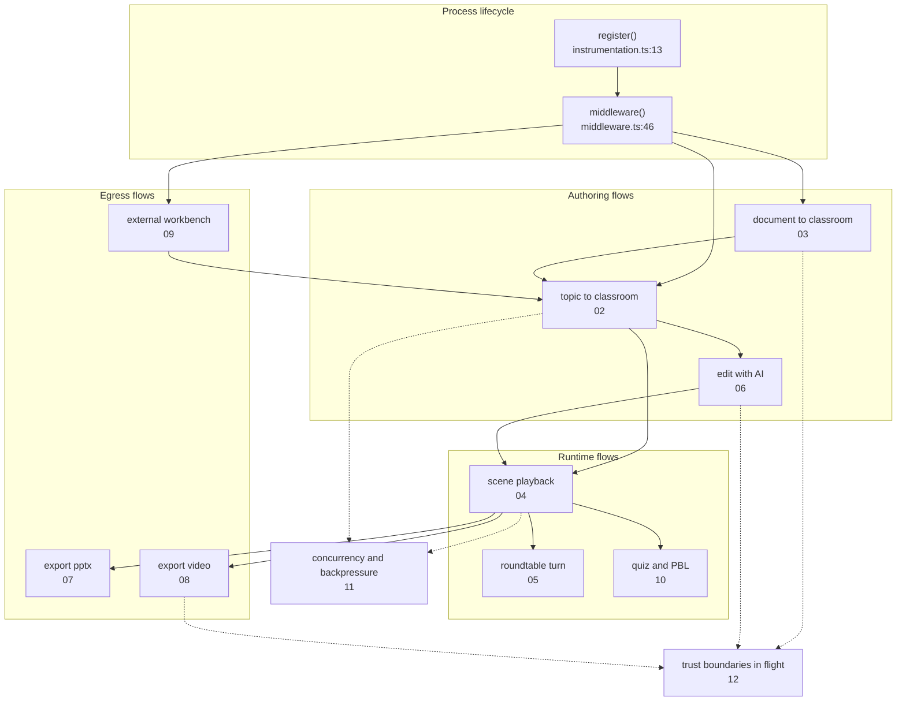
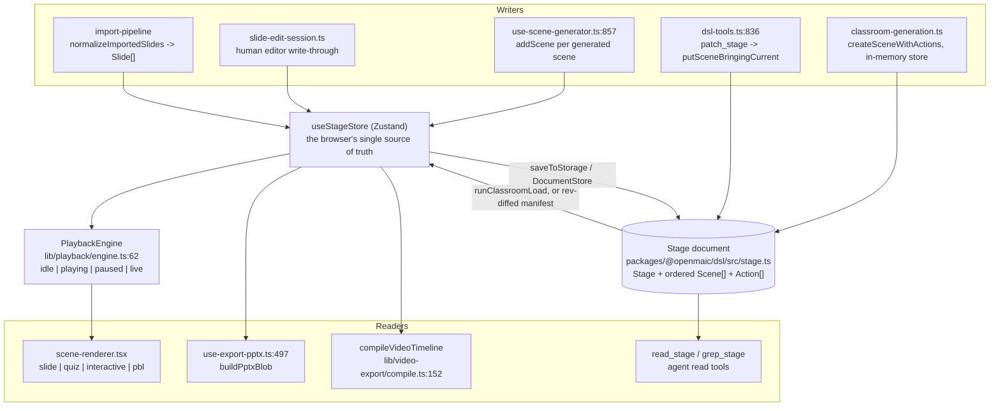

# Process View (4+1): End-to-End Data Flows

This topic traces what actually happens, hop by hop, when a request enters
OpenMAIC. The component topics (`../03-app-and-api/` … `../10-persistence-and-state/`)
describe *structure*; this one describes *behaviour over time* — who calls whom,
in what order, on which thread or process, and what the payload looks like at
each boundary.

**Sources:** the flow chapters of every evidence pack — [`../appendix/research/generation-pipeline/03a-flows-ingestion-outline.md`](docs/appendix/research/generation-pipeline/03a-flows-ingestion-outline.md),
[`../appendix/research/generation-pipeline/03b-flows-scenes-and-quiz.md`](docs/appendix/research/generation-pipeline/03b-flows-scenes-and-quiz.md),
[`../appendix/research/agent-runtime/03-flows.md`](docs/appendix/research/agent-runtime/03-flows.md),
[`../appendix/research/agent-runtime/03b-flows-classroom-and-external.md`](docs/appendix/research/agent-runtime/03b-flows-classroom-and-external.md),
[`../appendix/research/classroom-runtime/03a-flows-playback.md`](docs/appendix/research/classroom-runtime/03a-flows-playback.md),
[`../appendix/research/classroom-runtime/03b-flows-scenes-and-pbl.md`](docs/appendix/research/classroom-runtime/03b-flows-scenes-and-pbl.md),
[`../appendix/research/media-audio-video/03a-flows-audio-media.md`](docs/appendix/research/media-audio-video/03a-flows-audio-media.md),
[`../appendix/research/media-audio-video/03b-flows-video-export.md`](docs/appendix/research/media-audio-video/03b-flows-video-export.md),
[`../appendix/research/api-surface/03-flows.md`](docs/appendix/research/api-surface/03-flows.md),
[`../appendix/research/persistence-storage-state/03-flows.md`](docs/appendix/research/persistence-storage-state/03-flows.md),
[`../appendix/research/dsl-renderer-editor/03-flows.md`](docs/appendix/research/dsl-renderer-editor/03-flows.md),
[`../appendix/research/app-shell-and-routing/03-flows.md`](docs/appendix/research/app-shell-and-routing/03-flows.md) — each re-verified
against the code it cites before being written up here.

## Who this is for

A staff engineer who has read [`../02-container-view/index.md`](docs/02-container-view/index.md) and now needs to
answer operational questions: *where does this payload get validated?*, *what
happens if the model returns garbage at step 4?*, *which of these calls is on
the request thread and which survives the response?*, *what is the blast radius
of a lost lease?*

## Reading conventions used throughout

- **Hop tables** name a real `file:line` and a real function per step. If a step
  has no citable symbol, the cell says so.
- **Data shape at each boundary** sections give the *type name* and where it is
  declared, not a re-typed interface. The DSL contract lives in
  [`../07-dsl-renderer-editor/index.md`](docs/07-dsl-renderer-editor/index.md).
- Failure rows distinguish three postures the codebase actually uses:
  **degrade** (drop the bad part, keep going), **fail the unit** (this scene /
  this turn dies, the run survives), **fail the run**.
- "Inferred:" prefixes anything not directly readable from source.

## Topic overview

The chaining is the point: nothing in this system is a single request. Every
user-visible outcome is a chain of independently-failing steps.

## The three convergence points

Thirteen flows, three places they all meet. Knowing these three makes the rest
of this topic navigable.

Every flow in this topic is a path from a writer, through one or more of those
three, to a reader. `Stage` is the only thing that survives a process restart;
`useStageStore` is the only thing the UI reads; `PlaybackEngine` is the only
thing that advances time.

## Section files

| File | What it covers |
| --- | --- |
| [`00-index-of-flows.md`](docs/11-data-flows/00-index-of-flows.md) | The flow catalogue: every flow, its trigger, its containers, its page, and how the flows chain. |
| [`01-boot-and-config.md`](docs/11-data-flows/01-boot-and-config.md) | Cold start: `register()`, warn-only config validation, the two runners, the LISTEN bus, readiness, and the SIGTERM drain. |
| [`02-topic-to-classroom.md`](docs/11-data-flows/02-topic-to-classroom.md) | The primary authoring flow: free text becomes a persisted Stage with narrated Scenes. Both the browser loop and the headless job. |
| [`03-document-to-classroom.md`](docs/11-data-flows/03-document-to-classroom.md) | Upload, extraction (5 document + 2 media extractors), the multi-document bundle, and how bundle output enters the outline prompt. |
| [`04-scene-playback.md`](docs/11-data-flows/04-scene-playback.md) | One scene played: the four advance clocks, TTS, whiteboard replay, resume persistence, seek admission. |
| [`05-roundtable-turn.md`](docs/11-data-flows/05-roundtable-turn.md) | One multi-agent turn: director → child agent → actions, learner interruption, and the three pause semantics. |
| [`06-edit-with-ai.md`](docs/11-data-flows/06-edit-with-ai.md) | A natural-language edit becomes typed DSL ops on a slide, through the durable agent runtime and two schema layers. |
| [`07-export-pptx.md`](docs/11-data-flows/07-export-pptx.md) | `Slide[]` to `.pptx` bytes through the vendored pptxgenjs fork, including the OMML formula path and what the export drops. |
| [`08-export-video.md`](docs/11-data-flows/08-export-video.md) | Classroom to Hyperframes ZIP, then the render-service handoff to MP4. |
| [`09-external-workbench.md`](docs/11-data-flows/09-external-workbench.md) | An outside host agent driving a deployment over HTTP via `skills/openmaic`, and the two contract discrepancies. |
| [`10-quiz-and-pbl.md`](docs/11-data-flows/10-quiz-and-pbl.md) | Quiz attempt → grading → feedback, and a PBL v2 task session from submission to next milestone. |
| [`11-concurrency-and-backpressure.md`](docs/11-data-flows/11-concurrency-and-backpressure.md) | What runs in parallel, what is serialised and why, where the queues and buffers sit, and the real bottlenecks. |
| [`12-trust-boundaries-in-flight.md`](docs/11-data-flows/12-trust-boundaries-in-flight.md) | Every crossing where untrusted bytes enter a privileged context, and the control applied — or its absence. |

## Related topics

- [`../03-app-and-api/index.md`](docs/03-app-and-api/index.md) — route inventory and the shared response helpers these flows use.
- [`../05-agent-runtime/index.md`](docs/05-agent-runtime/index.md) — the two agent runtimes whose *structure* flows 05, 06 and 09 exercise.
- [`../06-generation-pipeline/index.md`](docs/06-generation-pipeline/index.md) — the stage-by-stage generation components flows 02 and 03 drive.
- [`../08-classroom-runtime/index.md`](docs/08-classroom-runtime/index.md) — the playback components flow 04 and 05 drive.
- [`../09-media-and-export/index.md`](docs/09-media-and-export/index.md) — TTS, whiteboard and the export compiler behind flows 07 and 08.
- [`../12-api-reference/index.md`](docs/12-api-reference/index.md) — per-endpoint request/response detail; this topic deliberately does not repeat it.
- [`../15-cross-cutting/index.md`](docs/15-cross-cutting/index.md) — the cross-cutting concerns flow 12 audits per-crossing.
- [`../18-decisions/index.md`](docs/18-decisions/index.md) — why the hops are arranged this
  way; flows 05, 06 and 09 are decision 01 in motion, and flow 08 is decisions 03 and 04.
- [`../glossary.md`](docs/glossary.md) — the canonical vocabulary these traces use.
- [`../README.md`](docs/README.md) — the documentation set root.
