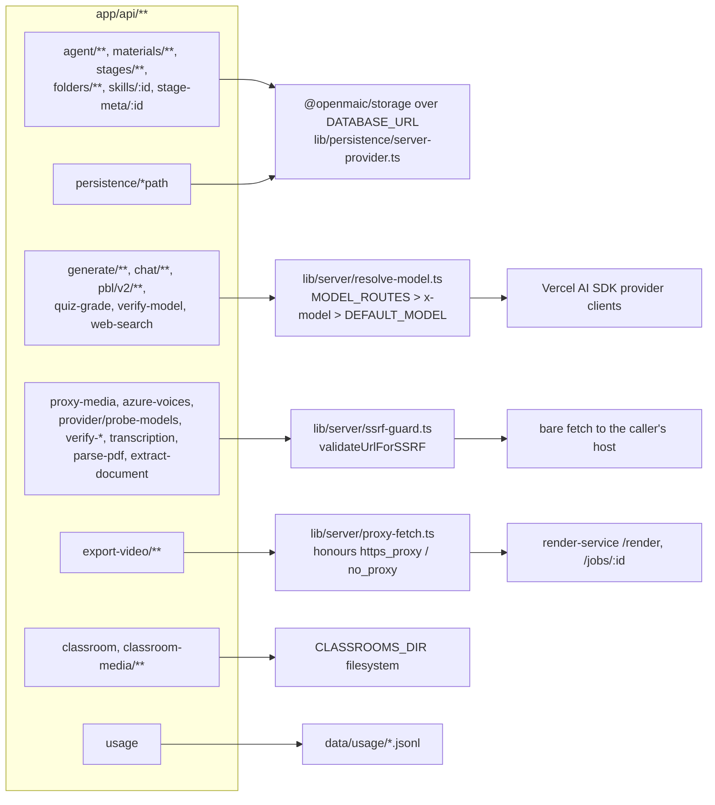

# The complete route enumeration

Every `route.ts` file under `app/api/`, one row per file, with the method
handlers it exports. This is the index; the group files carry request/response
detail.

**Sources:** enumeration of `app/api/**/route.ts` via
`git ls-files 'app/api' | grep 'route.ts$'`; per-file scan for
`export const runtime`, `export const maxDuration`, `export const dynamic`, and
exported `GET|POST|PUT|PATCH|DELETE` symbols; gate scan for
`isAgentRuntimeConfigured`, `withRequestOwnerId`, `resolveRequestOwnerId`,
`isPiChatEnabled`, `authenticatePersistence*`, `resolveStageAccess`,
`text/event-stream`, `createSSEResponse`, `validateUrlForSSRF`, `resolveModel*`.
Cross-checked against
[`../appendix/research/api-surface/00-overview.md`](docs/appendix/research/api-surface/00-overview.md).

## Counts

| Measure | Value |
| --- | --- |
| `route.ts` files | **69** |
| Exported method handlers | **86** — 31 `GET`, 44 `POST`, 2 `PUT`, 4 `PATCH`, 5 `DELETE` |
| Total lines in route files | 9435 |
| `export const runtime = 'nodejs'` | 29 |
| No `runtime` declaration (Node.js default) | 40 |
| `export const runtime = 'edge'` | **0** |
| `export const maxDuration` declared | 24 (values 30, 60, 120, 300) |
| `export const dynamic = 'force-dynamic'` | 5 |
| Routes emitting `text/event-stream` | 10 (6 hand-rolled, 4 via `createSSEResponse`) |
| Routes streaming bytes | 2 (`classroom-media`, `export-video/render/[jobId]/download`) |
| Route files referencing `isAgentRuntimeConfigured()` | 26 — 25 as a hard gate, plus `agent/runtime` which *reports* it |
| Routes resolving an anonymous cookie owner | 25 — 22 via `withRequestOwnerId`, 3 via `resolveRequestOwnerId` directly (the SSE routes) |
| Routes calling `validateUrlForSSRF` | 13 |
| Routes calling `resolveModel*` | 13 |
| Routes with any rate limiting | **0** |

## Route domains

```mermaid
flowchart TD
  MW["middleware.ts<br/>ACCESS_CODE HMAC cookie gate<br/>allowlist: /api/access-code/*, /api/health"]

  subgraph Agent["Agent control plane — 14 routes, all runtime=nodejs except chat/*"]
    A1["agent/sessions (+ /:id, /:id/messages,<br/>/:id/cancel, /status)"]
    A2["agent/sessions/:id/events (SSE)<br/>agent/owner-events (SSE)"]
    A3["agent/skills (+ /:id)<br/>agent/runtime"]
    A4["chat, chat/pi (SSE)<br/>chat/pi/whiteboard-visibility"]
    A5["skills/:id — skill zip download"]
  end

  subgraph Gen["Generation — 6 routes"]
    G1["generate/scene-outlines-stream (SSE)"]
    G2["generate/scene-content<br/>generate/scene-actions<br/>generate/agent-profiles"]
    G3["generate-classroom (+ /:jobId)"]
  end

  subgraph Docs["Course documents — 10 routes, runtime=nodejs"]
    D1["stages (+ /:id, /:id/manifest, /:id/scenes)"]
    D2["stages/:id/freshness (SSE)"]
    D3["stages/:id/{status,publish,unpublish,<br/>generation-complete}"]
    D4["stage-meta/:stageId"]
  end

  subgraph Ingest["Ingestion — 5 routes"]
    I1["extract-document<br/>parse-pdf"]
    I2["materials (+ /:id)"]
    I3["transcription"]
  end

  subgraph Live["Classroom + PBL — 8 routes"]
    C1["classroom<br/>classroom-media/:classroomId/*path (bytes)"]
    C2["pbl/v2/{instructor,open-task,evaluate,<br/>simulator} (SSE)"]
    C3["pbl/v2/task/update<br/>quiz-grade"]
  end

  subgraph Media["Media + export — 12 routes"]
    M1["generate/{tts,voice,image,video}"]
    M2["export-video/{capability,render,<br/>render/:jobId,render/:jobId/download}"]
    M3["proxy-media, azure-voices,<br/>comfyui-workflows, web-search"]
  end

  subgraph Prov["Providers + metering — 7 routes"]
    P1["server-providers<br/>provider/probe-models"]
    P2["verify-model<br/>verify-{image,video,pdf}-provider"]
    P3["usage"]
  end

  subgraph Infra["Persistence + auth + ops — 7 routes"]
    N1["persistence/*path (5 methods)"]
    N2["folders (+ /:id, /members)"]
    N3["access-code/{verify,status}"]
    N4["health"]
  end

  MW --> Agent
  MW --> Gen
  MW --> Docs
  MW --> Ingest
  MW --> Live
  MW --> Media
  MW --> Prov
  MW --> Infra

  Agent --> PG[("PostgreSQL<br/>@openmaic/storage")]
  Docs --> PG
  Ingest --> PG
  N1 --> PG
  N2 --> PG
  Gen --> LLM["LLM providers<br/>via lib/server/resolve-model.ts"]
  Live --> LLM
  M1 --> Vendor["TTS / image / video vendors"]
  M2 --> RS["render-service<br/>RENDER_SERVICE_URL"]
  M3 --> Web["arbitrary user URLs<br/>guarded by ssrf-guard.ts"]
  Prov --> LLM
  C1 --> FS[("CLASSROOMS_DIR on disk")]
  P3 --> FS2[("data/usage/*.jsonl")]
```

## Every route

Handler paths in the last column are relative to `app/api/`. Gate legend:
`mw` = access-code middleware only (the baseline for every row);
`rt` = `isAgentRuntimeConfigured()` → plain-text 404 when off;
`own` = anonymous `anonymous_id` cookie owner;
`dev` = `PERSISTENCE_DEV_TOKEN` bearer + client `x-learner-key`;
`sa` = `stage_meta` tenancy read; `flag` = a feature flag other than `rt`.

| Path | Methods | Runtime | maxDur | Gate | Streams | Purpose | Handler |
| --- | --- | --- | --- | --- | --- | --- | --- |
| `/api/access-code/status` | GET | default | — | (allowlisted) | — | Is the access code enabled, and is this cookie valid | `access-code/status/route.ts` |
| `/api/access-code/verify` | POST | default | — | (allowlisted) | — | Mint the `openmaic_access` HMAC cookie | `access-code/verify/route.ts` |
| `/api/agent/owner-events` | GET | nodejs | 300 | rt, own | SSE | Owner-wide durable event tail with resync/owner-merge signalling | `agent/owner-events/route.ts` |
| `/api/agent/runtime` | GET | nodejs | — | mw | — | Two-field capability probe: flag on vs fully configured | `agent/runtime/route.ts` |
| `/api/agent/sessions` | POST, GET | nodejs | — | rt, own | — | Create a durable agent session; list this owner's sessions | `agent/sessions/route.ts` |
| `/api/agent/sessions/status` | GET | nodejs | — | rt, own | — | Sparse `{sessionId: status}` map | `agent/sessions/status/route.ts` |
| `/api/agent/sessions/[id]` | GET, PATCH | nodejs | — | rt, own | — | Read session meta; set a manual title override | `agent/sessions/[id]/route.ts` |
| `/api/agent/sessions/[id]/cancel` | POST | nodejs | — | rt, own | — | Make a cancel request durable; the lease holder writes the terminal event | `agent/sessions/[id]/cancel/route.ts` |
| `/api/agent/sessions/[id]/messages` | POST | nodejs | — | rt, own | — | Post a user turn with material/element/course references | `agent/sessions/[id]/messages/route.ts` |
| `/api/agent/sessions/[id]/events` | GET | nodejs | 300 | rt, own | SSE | The session event log with `Last-Event-ID` replay; never closes at `session_end` | `agent/sessions/[id]/events/route.ts` |
| `/api/agent/skills` | GET, POST | nodejs | — | rt, own | — | List installed skills; upload a `.md` or `.zip` skill (1 MiB cap) | `agent/skills/route.ts` |
| `/api/agent/skills/[id]` | GET, DELETE | nodejs | — | rt, own | — | Read a skill's `SKILL.md`; delete an owner skill (`usk_` prefix only) | `agent/skills/[id]/route.ts` |
| `/api/azure-voices` | POST | default | 30 | mw | — | Proxy Azure's `cognitiveservices/voices/list` with a caller key | `azure-voices/route.ts` |
| `/api/chat` | POST | default | 60 | mw | SSE | Stateless multi-agent classroom chat (LangGraph director) | `chat/route.ts` |
| `/api/chat/pi` | POST | default | 300 | flag (`isPiChatEnabled`), dev (optional) | SSE | Pi director loop with whiteboard/web-search capability probes | `chat/pi/route.ts` |
| `/api/chat/pi/whiteboard-visibility` | POST | nodejs | — | dev | — | Settle a pending whiteboard visibility query | `chat/pi/whiteboard-visibility/route.ts` |
| `/api/classroom` | POST, GET | default | — | mw | — | Persist / read a published classroom bundle under `CLASSROOMS_DIR` | `classroom/route.ts` |
| `/api/classroom-media/[classroomId]/[...path]` | GET | default | — | mw | bytes | Serve classroom media/audio with HTTP Range support | `classroom-media/[classroomId]/[...path]/route.ts` |
| `/api/comfyui-workflows` | GET | default | — | mw | — | List ComfyUI workflow files; degrades to `{workflows: []}` on any error | `comfyui-workflows/route.ts` |
| `/api/export-video/capability` | GET | default (force-dynamic) | — | mw | — | Is the render service configured **and** healthy | `export-video/capability/route.ts` |
| `/api/export-video/render` | POST | default | 300 | mw | body in | Forward a multipart export archive to the render service (300 MiB cap) | `export-video/render/route.ts` |
| `/api/export-video/render/[jobId]` | GET, DELETE | default (force-dynamic) | — | mw | — | Poll / cancel a render job | `export-video/render/[jobId]/route.ts` |
| `/api/export-video/render/[jobId]/download` | GET | default (force-dynamic) | — | mw | bytes | Stream or 302-redirect the finished MP4 | `export-video/render/[jobId]/download/route.ts` |
| `/api/extract-document` | POST | nodejs | — | mw | — | Extract text/images from an uploaded file or a stored asset id | `extract-document/route.ts` |
| `/api/folders` | GET, POST | nodejs | — | rt, own | — | List / create course folders | `folders/route.ts` |
| `/api/folders/[id]` | PATCH, DELETE | nodejs | — | rt, own | — | Rename a folder; delete with `?mode=ungroup\|remove` | `folders/[id]/route.ts` |
| `/api/folders/members` | POST | nodejs | — | rt, own | — | Move a stage into a folder or to the root | `folders/members/route.ts` |
| `/api/generate-classroom` | POST | default | 30 | mw | — | Create a headless generation job; work continues in `after()` | `generate-classroom/route.ts` |
| `/api/generate-classroom/[jobId]` | GET | default (force-dynamic) | — | mw | — | Poll a generation job | `generate-classroom/[jobId]/route.ts` |
| `/api/generate/agent-profiles` | POST | default | 120 | mw | — | LLM-generate teacher/student agent profiles with avatars and voices | `generate/agent-profiles/route.ts` |
| `/api/generate/image` | POST | default | 300 | mw | — | Generate an image through one of eight providers | `generate/image/route.ts` |
| `/api/generate/scene-actions` | POST | default | 60 | mw | — | Generate the Action playback script and assemble the complete scene | `generate/scene-actions/route.ts` |
| `/api/generate/scene-content` | POST | default | 300 | mw | — | Generate one scene's typed content (slide/quiz/interactive/pbl) | `generate/scene-content/route.ts` |
| `/api/generate/scene-outlines-stream` | POST | default | 300 | mw | SSE | Stream the course outline as it is parsed out of the model stream | `generate/scene-outlines-stream/route.ts` |
| `/api/generate/tts` | POST | default | 30 | mw | — | Synthesise narration; returns base64 audio in JSON | `generate/tts/route.ts` |
| `/api/generate/video` | POST | default | 300 | mw | — | Generate a video clip through a video provider | `generate/video/route.ts` |
| `/api/generate/voice` | POST | default | 30 | mw | — | Register / delete a cloned TTS voice, provider-neutral | `generate/voice/route.ts` |
| `/api/health` | GET | default | — | (allowlisted) | — | Liveness plus a capability report | `health/route.ts` |
| `/api/materials` | GET, POST | nodejs | — | rt, own | — | List session materials; raw-body upload with per-class byte caps | `materials/route.ts` |
| `/api/materials/[id]` | GET | nodejs | — | rt, own | — | Read one material's metadata within an owned session | `materials/[id]/route.ts` |
| `/api/parse-pdf` | POST | default | — | mw | — | Legacy multipart PDF parse; **no size cap** | `parse-pdf/route.ts` |
| `/api/pbl/v2/evaluate` | POST | default | 300 | mw | SSE | Evaluate a task / milestone / final deliverable | `pbl/v2/evaluate/route.ts` |
| `/api/pbl/v2/instructor` | POST | default | 300 | mw | SSE | One instructor-agent turn over a client-supplied project | `pbl/v2/instructor/route.ts` |
| `/api/pbl/v2/open-task` | POST | default | 300 | mw | SSE | Greeting / setup turn that opens a microtask | `pbl/v2/open-task/route.ts` |
| `/api/pbl/v2/simulator` | POST | default | 300 | mw | SSE | Scenario simulator turn | `pbl/v2/simulator/route.ts` |
| `/api/pbl/v2/task/update` | POST | default | 60 | mw | — | Pure, LLM-free project mutation over five actions | `pbl/v2/task/update/route.ts` |
| `/api/persistence/[...path]` | GET, POST, PUT, PATCH, DELETE | nodejs | — | own (`/documents*`) or dev | — | Mount `@openmaic/storage`'s Node HTTP handler behind a `ServerResponse` shim | `persistence/[...path]/route.ts` |
| `/api/provider/probe-models` | POST | default | — | mw | — | Fetch and filter a provider's model list | `provider/probe-models/route.ts` |
| `/api/proxy-media` | POST | default | 60 | mw | — | Server-side fetch of a user URL, 25 MiB cap, re-validated per redirect hop | `proxy-media/route.ts` |
| `/api/quiz-grade` | POST | default | — | mw | — | LLM short-answer grading; silently awards 50 % on a parse failure | `quiz-grade/route.ts` |
| `/api/server-providers` | GET | default | — | mw | — | Full server provider inventory for the settings store | `server-providers/route.ts` |
| `/api/skills/[id]` | GET | nodejs | — | rt, own | — | Download a skill as a `.zip` | `skills/[id]/route.ts` |
| `/api/stage-meta/[stageId]` | GET | nodejs (force-dynamic) | — | rt, own, sa | — | Ownership / publication sidecar; never returns `ownerId` | `stage-meta/[stageId]/route.ts` |
| `/api/stages` | GET, POST | nodejs | — | rt, own | — | List / create course documents | `stages/route.ts` |
| `/api/stages/[id]` | GET, PATCH, PUT, DELETE | nodejs | — | rt, own | — | Read / rename / whole-document save / delete a course | `stages/[id]/route.ts` |
| `/api/stages/[id]/freshness` | GET | nodejs | 300 | rt, own | SSE | Emit `stage_freshness` only when the document `rev` changes | `stages/[id]/freshness/route.ts` |
| `/api/stages/[id]/generation-complete` | POST | nodejs | — | rt, own, sa | — | Mark generation finished via a narrow owner-scoped `UPDATE` | `stages/[id]/generation-complete/route.ts` |
| `/api/stages/[id]/manifest` | GET | nodejs | — | rt, own | — | Trigger-maintained `{rev, scenes:[{id,order,rev}]}` | `stages/[id]/manifest/route.ts` |
| `/api/stages/[id]/publish` | POST | nodejs | — | rt, own, sa | — | Set `is_public` true — **unreachable**, see `02b` | `stages/[id]/publish/route.ts` |
| `/api/stages/[id]/scenes` | GET | nodejs | — | rt, own | — | Batch-read up to 200 scenes by `?ids=` | `stages/[id]/scenes/route.ts` |
| `/api/stages/[id]/status` | GET | nodejs | — | rt, sa | — | Deliberately unauthenticated `{isPublic, publishedAt}` | `stages/[id]/status/route.ts` |
| `/api/stages/[id]/unpublish` | POST | nodejs | — | rt, own, sa | — | Set `is_public` false — **unreachable**, see `02b` | `stages/[id]/unpublish/route.ts` |
| `/api/transcription` | POST | default | 60 | mw | — | ASR over a multipart audio field; **no size cap** | `transcription/route.ts` |
| `/api/usage` | GET | default | — | mw | — | Deployment-wide usage aggregation from `data/usage/*.jsonl` | `usage/route.ts` |
| `/api/verify-image-provider` | POST | default | 30 | mw | — | Connectivity probe for an image provider | `verify-image-provider/route.ts` |
| `/api/verify-model` | POST | default | — | mw | — | Real one-shot `callLLM` probe with a friendly error rewrite | `verify-model/route.ts` |
| `/api/verify-pdf-provider` | POST | default | — | mw | — | Three-branch credential probe (AliDocMind / MinerU Cloud / self-hosted) | `verify-pdf-provider/route.ts` |
| `/api/verify-video-provider` | POST | default | — | mw | — | Connectivity probe for a video provider | `verify-video-provider/route.ts` |
| `/api/web-search` | POST | default | — | mw | — | Search through one of nine backends, with optional LLM query rewrite | `web-search/route.ts` |

## Outbound dependency map

## Things the table cannot show

- **Ports of entry are not uniform.** Fourteen routes take their model/provider
  configuration from *headers*: ten read `x-model`, `x-api-key`, `x-base-url` and
  `x-provider-type` through `resolveModelFromRequest` (`generate/agent-profiles`,
  `generate/scene-actions`, `generate/scene-content`,
  `generate/scene-outlines-stream`, the four `pbl/v2` LLM routes, `quiz-grade`,
  `web-search`), and four read provider/model headers directly
  (`generate/image` and `verify-image-provider` — `x-image-provider`,
  `x-image-model`; `generate/video` and `verify-video-provider` —
  `x-video-provider`, `x-video-model`). The rest take it from the JSON body. See
  [`09-conventions.md`](docs/12-api-reference/09-conventions.md). Three other request headers are not
  model configuration at all: `persistence/[...path]` takes its principal from
  `x-learner-key` ([`lib/persistence/server-auth.ts:59`](lib/persistence/server-auth.ts#L59)), and `materials` reads
  `x-material-filename` and `x-request-id`.
- **Two routes are dead code in the shipped build.**
  `stages/[id]/publish` and `stages/[id]/unpublish` reject any owner id starting
  with `anon:`, and no call site anywhere supplies an authenticated owner id, so
  every owner id starts with `anon:`
  ([`lib/server/agent-runtime/owner.ts:52-64`](lib/server/agent-runtime/owner.ts#L52-L64), [`app/api/stages/[id]/publish/route.ts:26-31`](app/api/stages/[id]/publish/route.ts#L26-L31)).
- **`lib/api/*` is not part of this surface** despite the name. It is an
  in-process stage-store toolkit (`lib/api/stage-api.ts`) imported by no route
  file.

Next: [`01-agent-and-chat.md`](docs/12-api-reference/01-agent-and-chat.md).
