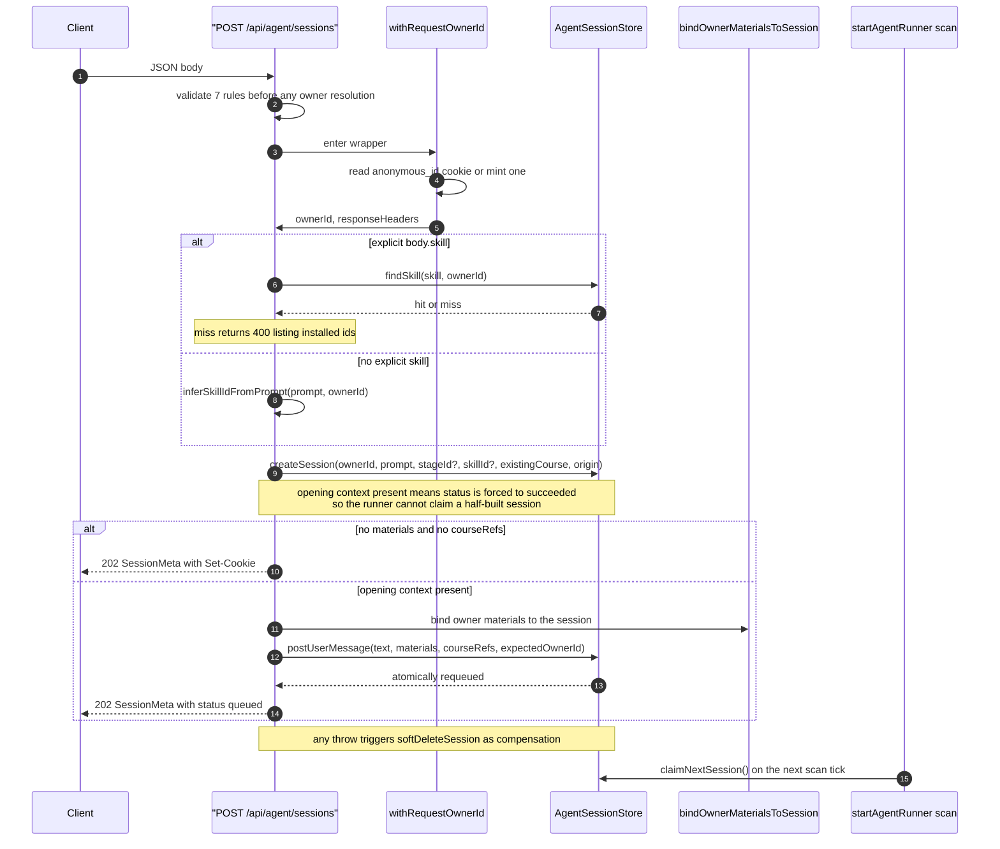
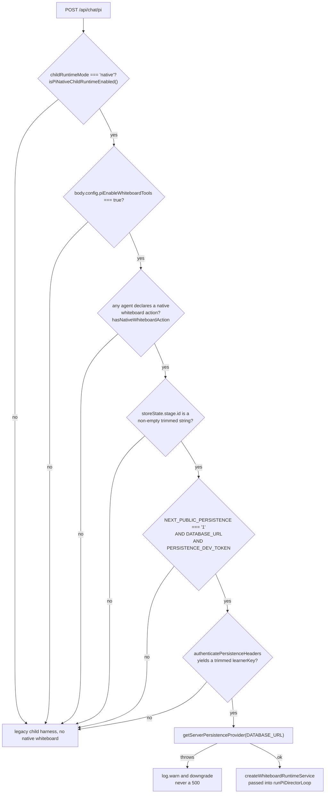

# Agent runtime, chat, and skills

Fourteen routes: the ten-file `agent/**` control plane for the durable
background runtime, the three `chat/**` routes for the in-class stateless
runtime, and `skills/[id]` which serves a skill as a `.zip`. These are two
unrelated execution models that happen to share a directory prefix.

**Sources:** `app/api/agent/**/route.ts`, `app/api/chat/**/route.ts`,
`app/api/skills/[id]/route.ts`,
`lib/server/agent-runtime/{owner,with-owner,limits,skills,store,session-materials}.ts`,
`lib/persistence/server-auth.ts`, `lib/config/feature-flags.ts`; evidence
[`../appendix/research/api-surface/01b-modules-routes-a-to-e.md`](../appendix/research/api-surface/01b-modules-routes-a-to-e.md),
[`../appendix/research/agent-runtime/`](../appendix/research/agent-runtime/00-overview.md).

## The group at a glance

```mermaid
flowchart TD
  Browser["Workbench client<br/>lib/workbench/session-store.ts"]
  Learner["Classroom client<br/>lib/chat/agent-loop.ts"]

  subgraph CP["agent/** control plane — every file: runtime='nodejs' + isAgentRuntimeConfigured()"]
    RT["GET /api/agent/runtime<br/>{enabled, runtimeEnabled}"]
    LS["POST + GET /api/agent/sessions"]
    ST["GET /api/agent/sessions/status"]
    SD["GET + PATCH /api/agent/sessions/:id"]
    CA["POST /api/agent/sessions/:id/cancel"]
    MS["POST /api/agent/sessions/:id/messages"]
    EV["GET /api/agent/sessions/:id/events (SSE)"]
    OE["GET /api/agent/owner-events (SSE)"]
    SK["GET + POST /api/agent/skills"]
    SKI["GET + DELETE /api/agent/skills/:id"]
    ZIP["GET /api/skills/:id (application/zip)"]
  end

  subgraph IC["chat/** in-class runtime — stateless, request-scoped"]
    CH["POST /api/chat (SSE)<br/>LangGraph director"]
    PI["POST /api/chat/pi (SSE)<br/>pi director loop"]
    WV["POST /api/chat/pi/whiteboard-visibility"]
  end

  Store[("AgentSessionStore<br/>@openmaic/storage over DATABASE_URL")]
  Runner["startAgentRunner()<br/>instrumentation.ts:49 — separate process-wide timer"]
  LLM["resolveModel() → Vercel AI SDK"]
  WBS["createWhiteboardRuntimeService()<br/>PgRuntimeStore"]

  Browser --> RT
  Browser --> LS
  Browser --> SD
  Browser --> MS
  Browser --> CA
  Browser --> EV
  Browser --> OE
  Browser --> SK
  Learner --> CH
  Learner --> PI
  Learner --> WV

  LS --> Store
  ST --> Store
  SD --> Store
  CA --> Store
  MS --> Store
  EV --> Store
  OE --> Store
  SK --> Store
  SKI --> Store
  Store <--> Runner
  CH --> LLM
  PI --> LLM
  PI --> WBS
  WV --> WBS
```

The control-plane routes never run an agent. They write to the store; a
`setInterval` installed by `instrumentation.ts:49` claims sessions out of it.
That is why `POST /api/agent/sessions` answers `202` and not `200`.

## `agent/**` — the durable control plane

Every one of the ten files opens with the same two lines:
`export const runtime = 'nodejs'` and
`if (!isAgentRuntimeConfigured()) return new Response('Not found', { status: 404 })`
(`app/api/agent/sessions/route.ts:23`, `:38-40`). `agent/runtime` is the sole
exception — it *reports* the flag instead of gating on it, by necessity
(`app/api/agent/runtime/route.ts:18-25`).

| Route | Method | Request | Success | Errors |
| --- | --- | --- | --- | --- |
| `/api/agent/runtime` | GET | — | `200 {enabled, runtimeEnabled}` | none |
| `/api/agent/sessions` | POST | `{prompt?, stageId?, skill?, existingCourse?, materialIds?, courseRefs?}` | `202 <SessionMeta>` (plus `status:'queued'` and echoed `courseRefs` when opening context existed) | 400 `MISSING_REQUIRED_FIELD`/`INVALID_REQUEST`; 404 plain text on a material-binding failure |
| `/api/agent/sessions` | GET | — | `200 [<SessionMeta>, …]` — **a bare array, no envelope** | — |
| `/api/agent/sessions/status` | GET | — | `200 {"<sessionId>": "<status>"}` | — |
| `/api/agent/sessions/[id]` | GET | — | `200 <SessionMeta>` | 404 plain text |
| `/api/agent/sessions/[id]` | PATCH | `{title: string \| null}` | `200 {title}` | 400 `MISSING_REQUIRED_FIELD` (missing own `title` key), 400 `INVALID_REQUEST`, 404 |
| `/api/agent/sessions/[id]/cancel` | POST | — | `202 {id, cancelRequested:true}` | `409 {code:'SESSION_ALREADY_TERMINAL', status, error}`; 404 |
| `/api/agent/sessions/[id]/messages` | POST | `{text?, materialIds?, elementRefs?, courseRefs?}` | `202 {id, message:{seq,text,delivery}, elementRefsAccepted, courseRefsAccepted}` | 400 ×7; 404; **403 `Forbidden`** on `AgentSessionAccessError` |
| `/api/agent/sessions/[id]/events` | GET | `Last-Event-ID` header or `?lastEventId=` | `200 text/event-stream` | 404 plain text |
| `/api/agent/owner-events` | GET | `Last-Event-ID` header or `?lastEventId=` | `200 text/event-stream` | 404 plain text |
| `/api/agent/skills` | GET | — | `200 [{id, name, title?, description, hasConstraints, source}]` | — |
| `/api/agent/skills` | POST | `multipart/form-data` field `file` (`.zip` → `parseUserSkillZip`, else markdown) | `201 {id, name, title, description, hasConstraints:false, source:'user'}` | 400 plain text (no file); **413 plain text** over 1 048 576 bytes; `409 {error:'duplicate'\|'quota', message}`; `400 {error:<code>\|'invalid-upload', message}` |
| `/api/agent/skills/[id]` | GET | — | `200 {id, content}` | 404 plain text |
| `/api/agent/skills/[id]` | DELETE | — | `204` | **405** `'Built-in skills cannot be deleted.'` unless the id starts with `usk_`; 404 |
| `/api/skills/[id]` | GET | — | `200 application/zip`, `Content-Disposition: attachment; filename="<id>-skill.zip"`, `Cache-Control: no-store` | 400 `'Invalid skill id'`; 404 plain text |

### Validation ordering is load-bearing

`POST /api/agent/sessions` runs every **owner-independent** body check before
`withRequestOwnerId` (`route.ts:49-90`, wrapper enters at `:92`). The reason is
stated in the file: a rejected request must not mint an anonymous cookie
partition. The one body field that cannot be checked there is `skill`, because
resolving it needs the `ownerId` — see below. Concretely:

| Rule | Line |
| --- | --- |
| `existingCourse` requires `stageId` | `route.ts:51-53` |
| `existingCourse` `stageId` must pass `isValidClassroomId` | `:54-56` |
| `prompt` required (defaulted to `stageId` for `existingCourse`) | `:58-62` |
| `prompt.length <= MAX_SESSION_TEXT_LENGTH` (100 000, `lib/server/agent-runtime/limits.ts:9`) | `:63-69` |
| `materialIds` must be a string array; deduped; `<= 20`; no blanks | `:70-79` |
| `existingCourse` rejects attachments outright | `:80-86` |
| `decodeCourseRefs` must return `ok` | `:87-90` |

Inside the wrapper, an explicit `body.skill` is resolved with
`findSkill(id, ownerId)`; a miss returns a 400 that **lists the installed skill
ids** (`:100-116`). With no explicit skill, `inferSkillIdFromPrompt` reads a
`/handle` out of the prompt text and is deliberately forgiving — an
unrecognised handle means "no skill", never an error (`:117-131`).

### Session creation, end to end

### The two SSE tails

Both build their `ReadableStream` by hand and share a design: cursor from
`Last-Event-ID`, serialised polling, a NOTIFY wakeup registered *before* the
first read, and a named `caught_up` frame.

| Property | `sessions/[id]/events` | `owner-events` |
| --- | --- | --- |
| Poll interval | 5 000 ms, 10 000 ms when terminal (`:52-57`) | 30 000 ms (`:25`) |
| Heartbeat | `: ping` / 25 000 ms (`:58`, `:275-278`) | `: ping` / 25 000 ms (`:26`, `:271-300`) |
| Cursor type | `number` (`:89`) | `bigint` (`parseLastEventId`, `:30-37`) |
| Backlog page | 500 (`:60`) | 500 (`:28`) |
| First frame | `: replaying from event <id>` comment (`:274`) | — |
| Named events | `caught_up` + every store event `type` (`:142`, `:161`) | `caught_up` (`:114`), `resync_required` (`:155`), `owner_moved` (`:286`), plus every store event `type` (`:168`) |
| Frame shape | `id:` + `event:` + `data:` with an injected `phase: 'live' \| 'backlog'` (`:161-167`) | same (`:168-174`) |
| Degrade signal | `caught_up {degraded:true}` after 3 consecutive read failures | same (`:136`) |
| Extra signal | — | `resync_required {reason:'cursor_ahead'\|'too_far_behind'}` when the cursor is ahead of `readMaxId` or more than 1 000 events behind (`:142-161`) |
| Extra signal | — | `owner_moved {newOwnerId, action:'reconnect'}` from `store.readRetirement` on the heartbeat, then close (`:276-292`) |
| Headers | `text/event-stream; charset=utf-8`, `no-cache, no-transform`, `keep-alive` (`:296-298`) | identical (`:319-321`) |
| Closes at `session_end`? | **No.** A terminal session only slows polling. | n/a |

Two subtleties worth carrying in your head:

- Owner resolution happens **before** the session lookup (`events/route.ts:77`,
  lookup at `:79`) so a missing session and a foreign session return
  byte-identical 404s — same status, same body, same `Set-Cookie`. The comment
  at `:68-76` states this is deliberate: the session UUID must not be an
  existence oracle.
- `tick()` reschedules only after the previous poll *settles*
  (`events/route.ts:260-272`). Two concurrent polls would share the cursor,
  emit duplicate frames, and the slower one would rewind the cursor.

## `chat/**` — the in-class stateless runtime

The browser owns the loop. Each request carries the full conversation and store
state; the server runs one pass and streams events back.

| Route | Gate | Body requirements | Response |
| --- | --- | --- | --- |
| `POST /api/chat` | access-code only, `maxDuration = 60` | `messages` array, `storeState`, non-empty `config.agentIds` (`:55-65`) | `200 text/event-stream`, `data: <StatelessEvent>` frames, `:heartbeat` every 15 s |
| `POST /api/chat/pi` | `isPiChatEnabled()` else `404 INVALID_REQUEST` (`:43-45`), `maxDuration = 300` | as above plus per-agent resolution (`:79-129`) | `200 text/event-stream`; adds the `ELEMENT_REFERENCE_ACCEPTED_HEADER` when a slide element reference was accepted (`:291`) |
| `POST /api/chat/pi/whiteboard-visibility` | `authenticatePersistenceHeaders` first, else `401 INVALID_CREDENTIALS` (`:32-35`) | exact-shape `{queryId, stageId, visibility}` | `204`; `404` carried in an `apiError` when no query is pending (`:53`) |

Model resolution for both chat routes is
`resolveModel({modelString: body.model, stage: 'chat-adapter', apiKey, baseUrl, providerType, thinkingConfig: body.thinkingConfig ?? body.thinking})`
(`chat/route.ts:72-81`, `chat/pi/route.ts:98-107`). If
`isProviderKeyRequired(providerId) && !resolvedApiKey`, both return
`401 MISSING_API_KEY`. Thinking defaults to `{mode:'disabled', enabled:false}`
for low-latency chat (`chat/route.ts:127-130`).

`chat/pi` validates harder than `chat`: `agentIds` must be a non-empty array of
unique, trimmed, non-empty strings (`:79-90`), and every id must resolve through
`resolveAgentConfigs` or the route names the unresolved ones in the 400
(`:113-129`).

### `chat/pi`'s six-condition native whiteboard probe

Every failed condition degrades silently to the non-native path
(`chat/pi/route.ts:164-187`). A persistence initialisation failure is a
`log.warn`, never an error response — a whiteboard is optional, the lesson is
not.

### Error posture of the streaming chat routes

Both routes return `200` the moment headers are flushed, so a mid-stream
failure cannot change the status. They write a
`data: {"type":"error","data":{"message":…}}` frame and close
(`chat/route.ts:174-185`, `chat/pi/route.ts:274-282`). Only a failure *before*
the stream opens yields `500 INTERNAL_ERROR` with the raw error message
(`chat/route.ts:201-205`).

## Notes and caveats

- **`agent/skills/[id]` GET drops the owner cookie on its 404.** The response is
  built without `responseHeaders` (`app/api/agent/skills/[id]/route.ts:22`),
  unlike every other 404 in the family. Harmless today, but it breaks the
  invariant `withRequestOwnerId` exists to enforce.
- **`POST /api/agent/skills` uses a fifth error envelope**: `{error, message}`
  where `error` is the `UserSkillError` code (`:87-97`). Neither `apiError` nor
  `ownerNotFound`.
- **`messages` returns `403 Forbidden`** on `AgentSessionAccessError`
  (`messages/route.ts:116-118`) — the one place in `agent/**` that breaks the
  no-existence-oracle rule, though it is only reachable *after* the ownership
  pre-check at `:29` has already passed.
- **`/api/skills/[id]` resolves in three tiers** before touching the owner store:
  the literal id `'openmaic'` → `buildOpenClawSkillZip()`, a builtin →
  `buildBuiltinSkillZip(id)`, else an owner skill inside `withRequestOwnerId`
  (`:28-48`). `isSafeSkillId(id)` runs before the id is interpolated into
  `Content-Disposition` (`:26`, `:18`).
- **No rate limit anywhere in this group.** `POST /api/agent/sessions` and
  `POST /api/agent/sessions/[id]/messages` both queue LLM work for the cost of
  one HTTP request.

## Open questions

- `resolveRequestOwnerId` accepts an `authenticatedOwnerId` parameter that no
  call site supplies (`lib/server/agent-runtime/owner.ts:52-56`). The comments at
  `events/route.ts:68-76` and `owner-events/route.ts:42-47` both say a future auth
  integration "must thread" it through. Which auth integration, and on what
  timeline, is not recorded in the repo.
- `PATCH /api/agent/sessions/[id]` is the only mutation on session meta. Whether
  the store enforces a title length bound inside
  `normalizeSessionTitleOverride` was not traced here.

Next: [`02-generation.md`](./02-generation.md).
