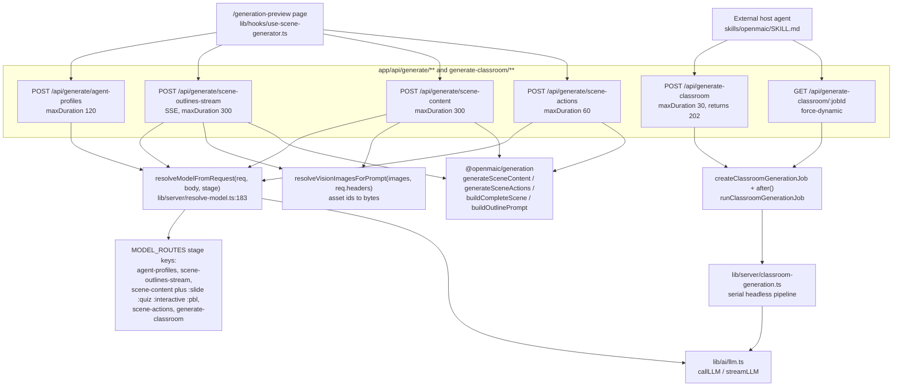
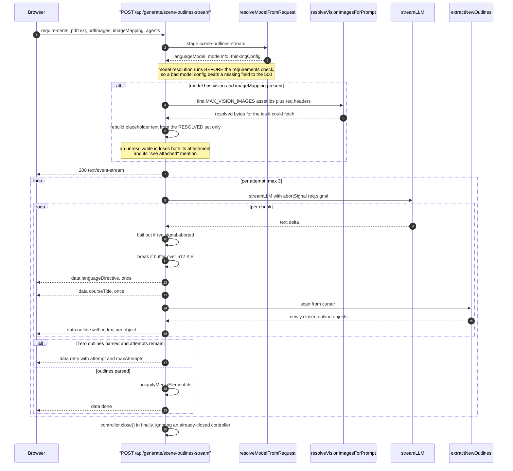
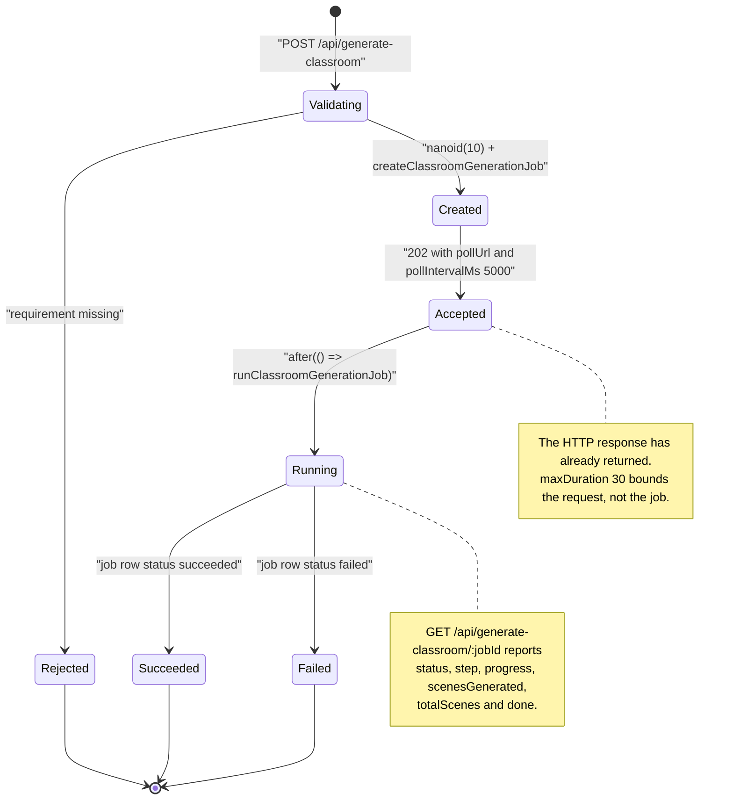

# Generation endpoints

Six routes: the four LLM steps the browser calls while building a course
(`generate/agent-profiles`, `generate/scene-outlines-stream`,
`generate/scene-content`, `generate/scene-actions`) and the headless
`generate-classroom` job pair. All six are unauthenticated beyond the
access-code middleware and all six resolve their model per request.

The owner-scoped course-document routes that persist the result live in
[`02b-stages-and-stage-meta.md`](docs/12-api-reference/02b-stages-and-stage-meta.md); the media
generators (`generate/{tts,voice,image,video}`) live in
[`05-media-and-export.md`](docs/12-api-reference/05-media-and-export.md).

**Sources:** `app/api/generate/{agent-profiles,scene-outlines-stream,scene-content,scene-actions}/route.ts`,
`app/api/generate-classroom/route.ts`, `app/api/generate-classroom/[jobId]/route.ts`,
`lib/server/{resolve-model,model-routes,llm-error-response}.ts`,
`lib/persistence/resolve-vision-images.ts`; evidence
[`../appendix/research/api-surface/01c-modules-routes-f-to-p.md`](docs/appendix/research/api-surface/01c-modules-routes-f-to-p.md),
[`../appendix/research/generation-pipeline/`](docs/appendix/research/generation-pipeline/00-overview.md).

## The group and its outbound calls



## Route reference

| Route | Method | maxDuration | Required body | Success | Error mapping |
| --- | --- | --- | --- | --- | --- |
| `/api/generate/agent-profiles` | POST | 120 | `stageInfo.name`, `languageDirective`, non-empty `availableAvatars` (`:147-159`) | `200 {success:true, agents:[{id,name,role,persona,avatar,color,priority,voiceConfig?,voiceDesign?}]}` (`:344-360`) | `400 MISSING_REQUIRED_FIELD`; `500 PARSE_FAILED` on unparseable JSON (`:292`); `500 GENERATION_FAILED` when fewer than 2 agents or `teacherCount !== 1` (`:296-313`); `500 INTERNAL_ERROR` otherwise |
| `/api/generate/scene-outlines-stream` | POST | 300 | `requirements` (`:302-304`) | `200 text/event-stream` — see the event table below | `500 INTERNAL_ERROR` only *before* the stream opens; after that an `{type:'error'}` frame |
| `/api/generate/scene-content` | POST | 300 | `outline`, non-empty `allOutlines`, `stageId` (`:91-103`) | `200 {success:true, content, effectiveOutline}` (`:355`) | `400 MISSING_REQUIRED_FIELD`; `500 GENERATION_FAILED` when the generator returns falsy (`:346-350`); everything else through `llmApiError(error)` (`:361`) |
| `/api/generate/scene-actions` | POST | 60 | `outline`, non-empty `allOutlines`, `content`, `stageId` (`:68-83`) | `200 {success:true, scene, previousSpeeches}` (`:187`) | `400 MISSING_REQUIRED_FIELD`; `500 GENERATION_FAILED` when `buildCompleteScene` returns null (`:175`); else `llmApiError(error)` |
| `/api/generate-classroom` | POST | 30 | `requirement` (`:39-41`) | `202 {success:true, jobId, status, step, message, pollUrl, pollIntervalMs:5000}` (`:50-60`) | `400 MISSING_REQUIRED_FIELD`; `500 INTERNAL_ERROR` with the raw message in `details` |
| `/api/generate-classroom/[jobId]` | GET | — | — | `200 {success:true, jobId, status, step, progress, message, pollUrl, pollIntervalMs:5000, scenesGenerated, totalScenes, result, error, done}` (`:31-44`) | `400 INVALID_REQUEST` on a malformed id; `404 INVALID_REQUEST 'Classroom generation job not found'`; `500 INTERNAL_ERROR` |

### Per-stage model routing

Each route pins itself to an `LlmStage` key so an operator can route it to a
different model via the `MODEL_ROUTES` JSON env var. `scene-content` builds a
**composite** key from the outline type and falls back to the base key when the
composite is unrouted ([`scene-content/route.ts:110`](app/api/generate/scene-content/route.ts#L110)):

```
const stage = outline.type ? `scene-content:${outline.type}` : 'scene-content';
```

| Route | Stage key(s) |
| --- | --- |
| `generate/agent-profiles` | `agent-profiles` |
| `generate/scene-outlines-stream` | `scene-outlines-stream` |
| `generate/scene-content` | `scene-content:slide` / `:quiz` / `:interactive` / `:pbl`, falling back to `scene-content` |
| `generate/scene-actions` | `scene-actions` |
| `generate-classroom` (inside the job, not the route) | `generate-classroom` |

A **routed** stage discards the client's `x-api-key`, `x-base-url` and
`x-provider-type` so a pinned provider can never be built with another
provider's credentials ([`lib/server/resolve-model.ts:56-81`](lib/server/resolve-model.ts#L56-L81)).

### Headers these routes read

| Header | Route(s) | Effect |
| --- | --- | --- |
| `x-model`, `x-api-key`, `x-base-url`, `x-provider-type` | all four `generate/*` | model resolution when the stage is unrouted ([`lib/server/resolve-model.ts:168-172`](lib/server/resolve-model.ts#L168-L172)) |
| `x-image-generation-enabled`, `x-video-generation-enabled` | `scene-outlines-stream` | selects the media prompt snippets (`:405-407`) |
| `x-user-locale` | `scene-content` | `targetLanguage` for the generator (`:322`, `:332`) |

## `scene-outlines-stream` — the most interesting route in the group

716 lines, the largest handler in the surface. It parses outline objects out of
a partial JSON stream and emits each one as soon as it closes.

### SSE events

Frames are `data:`-only — **no `event:` field**, so an `EventSource` consumer
reads them all through `onmessage` and discriminates on the JSON `type`.

| `type` | Payload | Emitted |
| --- | --- | --- |
| `languageDirective` | `{data: string}` | once, as soon as the key appears in the first 8 KiB (`:552-559`) |
| `courseTitle` | `{data: string}` | once, same head-bound scan (`:564-571`) |
| `outline` | `{data: SceneOutline, index: number}` | per complete top-level object found by `extractNewOutlines` |
| `retry` | `{attempt, maxAttempts}` | before each retry (`:626-631`, `:650-655`) |
| `done` | `{outlines, languageDirective, courseTitle?, taskEngineMode}` | exactly once on success (`:665-672`) |
| `error` | `{error: string}` | when all attempts produced zero outlines, or on a pre-stream throw inside `start` (`:678-689`) |

### Performance and safety invariants

| Invariant | Mechanism | Line |
| --- | --- | --- |
| Directive/title scan is O(1) per chunk | head-bound to the first 8192 bytes; the keys can only appear in the wrapper head | `:57`, `:91` |
| Outline scan is O(n) over the whole stream, not O(n²) | `extractNewOutlines(buffer, scanFrom)` resumes from a cursor between array elements | `:117-130` |
| Heap cannot grow unbounded | `MAX_OUTLINE_STREAM_BYTES = 512 * 1024`; the read **stops** and finalises with what parsed | `:486`, `:543-548` |
| Title survives a late emission | one full-buffer regex, run once after the stream, only if the head scan found nothing | `:102-105`, `:604-609` |
| Retries do not burn on a disconnect | `req.signal.aborted` checked per chunk and inside the catch before retrying | `:536-539`, `:636-639` |
| The upstream LLM request dies with the client | `abortSignal: req.signal` passed into `streamLLM` | `:504`, `:511` |
| Heartbeat | `:heartbeat\n\n` every 15 000 ms | `:460`, `:469` |
| Attempt budget | `MAX_STREAM_RETRIES = 2`, so 3 attempts; all parse state reset per attempt | `:482`, `:519-526` |

### One request, traced



## Vision degradation, shared by two routes

`scene-outlines-stream` and `scene-content` both pre-resolve asset ids to bytes
before prompt assembly, and both drop what they cannot resolve. The mechanics
differ:

| | `scene-outlines-stream` | `scene-content` |
| --- | --- | --- |
| Slice | resolved once from the original `visionSlice`, never re-sliced (`:351-397`) | resolve-with-refill loop |
| Aggregate bound | none beyond the 512 KiB buffer | `VISION_RESOLUTION_BUDGET_MS = 15_000` (`:49`) |
| Failure fuse | none | `MAX_CONSECUTIVE_UNRESOLVABLE_VISION_IMAGES = 3` — a resolved candidate resets the streak (`:57`) |
| Shift-in risk | impossible by construction; the comment at `:389-397` explains why | the refill re-slices, so every dropped id is stripped from `imageMapping` **and** `assignedImages` |
| On failure | fewer images, one warn, never a failed request | same |

## `generate-classroom` — the job pattern

The only route in the surface that returns before its work starts.



Two details worth noting. First, `POST` copies fields out of the raw body
**field by field**, not with a spread (`:19-36`) — 10 named optional fields plus
`requirement`, so an unknown key cannot reach `GenerateClassroomInput`. Second,
neither route is owner-scoped: the 10-character `nanoid` is the only capability
protecting a job, and `pollUrl` is built from `buildRequestOrigin(req)`.

## Notes and caveats

- **No rate limiting.** Every route here starts an LLM call for one unauthenticated
  HTTP request. `scene-outlines-stream` can start three.
- **`llmApiError` is used by exactly two routes** (`scene-content`,
  `scene-actions`). It walks `APICallError` / `RetryError` / `cause` /
  `lastError` chains for an HTTP status and maps 429 to `RATE_LIMITED`, anything
  else to `UPSTREAM_ERROR` ([`lib/server/llm-error-response.ts:24-63`](lib/server/llm-error-response.ts#L24-L63)), so retry
  semantics survive without leaking provider bodies. The other four generation
  routes return raw error messages in `error` or `details`.
- **`agent-profiles` validates the model's output, not just the request.** Fewer
  than two agents or a teacher count other than one is a `500 GENERATION_FAILED`
  (`:296-313`). Voices are resolved only from the *advertised* list, and the
  teacher's voice is force-bound to the user's global narrator voice
  (`:321-340`).
- **Body types are declaration-only.** Every route does
  `await req.json() as RequestBody` and hand-checks the two or three fields it
  needs. `zod` is installed and imported by no route file.

## Open questions

- `taskEngineMode` rides in the `done` frame (`scene-outlines-stream:670`) but is
  not part of any documented event contract; where the client consumes it was not
  traced here.
- `progress`, `scenesGenerated` and `totalScenes` on the job projection come from
  the job row written by `runClassroomGenerationJob`; the exact step vocabulary
  lives in `lib/server/classroom-job-store.ts` and was not enumerated for this
  reference.

Next: [`02b-stages-and-stage-meta.md`](docs/12-api-reference/02b-stages-and-stage-meta.md).
