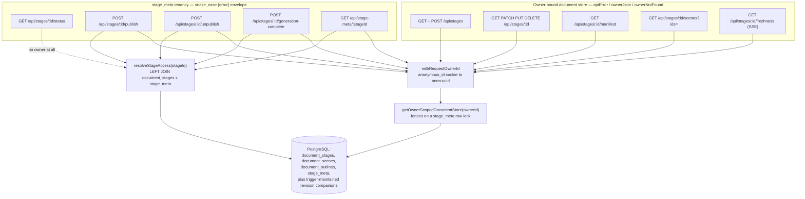
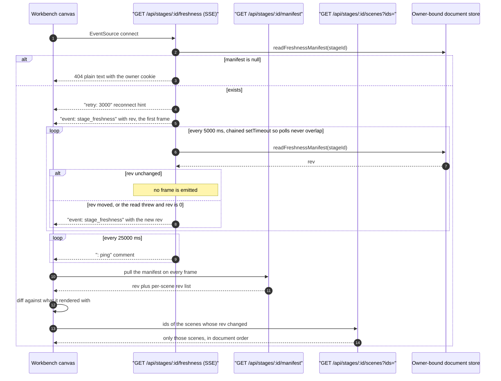

# Course documents: `stages/**` and `stage-meta`

Ten routes over the owner-scoped course document store. Nine files under
`app/api/stages/`, plus the `stage-meta/[stageId]` tenancy sidecar. Every one
declares `runtime = 'nodejs'` and gates on `isAgentRuntimeConfigured()`.

Two distinct access paths coexist here: the **owner-bound document store**
(`getOwnerScopedDocumentStore(ownerId)`), which enforces ownership inside its
own transactions, and the **`stage_meta` tenancy read** (`resolveStageAccess`),
which reports publication state. They use different error envelopes.

**Sources:** `app/api/stages/**/route.ts`, `app/api/stage-meta/[stageId]/route.ts`,
`lib/server/agent-runtime/{owner-scoped-documents,route-response,stage-limits}.ts`,
`lib/server/stage-access.ts`, `lib/persistence/stage-meta.ts`; evidence
[`../appendix/research/api-surface/01c-modules-routes-f-to-p.md`](../appendix/research/api-surface/01c-modules-routes-f-to-p.md),
[`../appendix/research/persistence-storage-state/`](../appendix/research/persistence-storage-state/00-overview.md).

## The two access paths

## Route reference — the document store

| Route | Method | Request | Success | Errors |
| --- | --- | --- | --- | --- |
| `/api/stages` | GET | — | `200 {stages: [...]}` (`route.ts:41`) | 404 plain text (gate) |
| `/api/stages` | POST | `{name, description?}` | `201 {stage:{id,name,description?,createdAt,updatedAt,sceneCount:0}}` (`:101-114`) | `400 INVALID_REQUEST` (bad JSON, non-object body, non-string `description`); `400 MISSING_REQUIRED_FIELD` (blank `name`); `400 INVALID_REQUEST` over `STAGE_NAME_MAX_LENGTH` = 120 |
| `/api/stages/[id]` | GET | — | `200 <MaicDocument>` = `{stage, scenes, outline}` (`[id]/route.ts:73`) | 404 plain text `ownerNotFound` |
| `/api/stages/[id]` | PATCH | `{name}` | `200 {success:true, name}` (`:113`) | `400 INVALID_REQUEST` (bad JSON, blank/over-120 name); 404; `mapSaveError` |
| `/api/stages/[id]` | PUT | `{stage:{id,…}, scenes:[…], outline?}` | `200 {success:true}` (`:175`) | `400 INVALID_REQUEST` on a body that is not `{stage:{id:string}, scenes:array}`; `400` when `stage.id !== <path id>`; 404 if the document does not already exist; `mapSaveError` |
| `/api/stages/[id]` | DELETE | — | `200 {ok:true}` — **always**, idempotent, no 404 (`:186-187`) | 404 plain text (gate only) |
| `/api/stages/[id]/manifest` | GET | — | `200 {rev, scenes:[{id, order, rev}]}` (`manifest/route.ts:34-36`) | 404 |
| `/api/stages/[id]/scenes` | GET | `?ids=a,b,c` | `200 {scenes:[…]}` in document order (`scenes/route.ts:78-79`) | `400 INVALID_REQUEST 'empty_scene_ids'`; `400 INVALID_REQUEST 'too_many_scene_ids'` with `details: "limit 200, requested N"`; 404 |
| `/api/stages/[id]/freshness` | GET | — | `200 text/event-stream` | 404 before the stream opens |

### `mapSaveError` — the store-failure translation

`app/api/stages/[id]/route.ts:46-62` is the only error mapper of its kind in the
surface:

| Store error | Response |
| --- | --- |
| `DocumentNotFoundError` | `ownerNotFound` → 404 plain text |
| `DocumentVersionError` | `400 INVALID_REQUEST 'document was written by a newer client; reload before saving'`, `details` = the store message |
| any other `Error` whose message starts with `@openmaic/storage:` | `400 INVALID_REQUEST 'invalid stage document'`, `details` = the store message |
| anything else | **rethrown** — becomes the `withRequestOwnerId` catch-all 500 |

### Query-parameter hardening on `scenes`

`?ids=` is split on commas, trimmed, blanks dropped, deduped, and then filtered
by `isQueryableSceneId` — an id containing `\0` or a lone surrogate is **dropped**,
because such an id can never match a stored row and would make the driver throw
on comparison (`scenes/route.ts:41-59`). Over 200 ids is a 400, *not* a silent
truncation: truncating would drop scenes the client believes it fetched
(`:63-70`, rationale at `:16-20`).

## Route reference — the `stage_meta` sidecar

These five use `{error: '<snake_case>'}` bodies, not `apiError`.

| Route | Method | Owner required | Success | Errors |
| --- | --- | --- | --- | --- |
| `/api/stages/[id]/status` | GET | **no owner resolved at all** | `200 {isPublic, publishedAt}` (`status/route.ts:37`) | `404 {error:'not_found'}`; `500 {error:'internal_error'}` |
| `/api/stage-meta/[stageId]` | GET | yes (for the `isOwner` boolean) | `200 {isOwner, isPublic, publishedAt, generationComplete, source}` (`:57-67`) | `404 {error:'not_found'}`; `500 {error:'internal_error'}` |
| `/api/stages/[id]/publish` | POST | yes, **non-anonymous** | `200 {success:true, publishedAt, name}` — idempotent when already public (`publish/route.ts:41-46`) | `401 {error:'login_required'}` for any `anon:` owner; `404 {error:'not_found'}`; `403 {error:'forbidden'}`; `500` |
| `/api/stages/[id]/unpublish` | POST | yes, **non-anonymous** | `200 {success:true}` (`unpublish/route.ts:44`) | same ladder |
| `/api/stages/[id]/generation-complete` | POST | yes | `200 {ok:true}` (`generation-complete/route.ts:48`) | `404 {error:'not_found'}` (absent, tombstoned, **or an untouched row**); `403 {error:'forbidden'}`; `500` |

### `publish` / `unpublish` are unreachable in the shipped build

Both refuse an owner id starting with `anon:`
(`publish/route.ts:26-31`, `unpublish/route.ts:25-30`). `resolveRequestOwnerId`
returns `` `anon:${uuid}` `` unless its optional `authenticatedOwnerId` argument
is supplied (`lib/server/agent-runtime/owner.ts:52-64`), and **no call site
anywhere passes it**. Therefore every owner id is `anon:`-prefixed and both
routes always answer `401 {error:'login_required'}`. The comment at
`publish/route.ts:1-7` explains the intent: a published course is a durable
public artifact and needs a real account.

### Fail-closed tombstones

`resolveStageAccess` returns `null` when `deletedAt !== null`
(`lib/server/stage-access.ts:132`), so a deleted course is indistinguishable
from one that never existed. `stage-meta` documents why this matters: the
endpoint is reachable by any visitor, so leaking `{isPublic:true}` for a
tombstoned course would be a public oracle for "this id used to be a course"
(`stage-meta/[stageId]/route.ts:11-18`). The same file states that `ownerId` is
never returned, because it would be a stable cross-course identifier for the
author (`:19-23`).

## The workbench freshness loop

`freshness` (push) plus `manifest` (diff) plus `scenes` (narrow re-fetch) is one
mechanism, deliberately split across three endpoints.

The frame's `rev` is informational, never authoritative — the contract is "pull
the manifest on every frame" (`freshness/route.ts:90-94`). A read failure emits
`rev: 0` rather than a terminal state, because a stage can always be written
again.

## Cross-cutting behaviour in this group

| Behaviour | Where | Why |
| --- | --- | --- |
| Body validation runs **before** `withRequestOwnerId` | `stages/route.ts:53-77`, `[id]/route.ts:81-98`, `:121-144` | a malformed request must not mint an anonymous cookie partition |
| Owner id never appears in a path or query | whole family | it is derived from the cookie; `stage-meta` states this explicitly |
| Foreign and missing are byte-identical | `ownerNotFound(headers)` → plain-text `404 'Not found'` (`lib/server/agent-runtime/route-response.ts:36-41`) | the stage id must not be an existence oracle |
| Runtime gate answers the same 404 as "not yours" | every file's first two lines | "off", "misconfigured", "not yours" and "absent" are one response |
| Stage ids are minted server-side | `` `stage-${randomBytes(9).toString('base64url')}` `` (`stages/route.ts:30-32`) | a client cannot choose an id; `PUT` is existence-gated so it cannot mint one either |
| The server owns `updatedAt` | `PATCH` `:108`, `PUT` `:170` | keeps the trigger-maintained `rev` and the freshness signal honest |
| `DELETE` is idempotent | `[id]/route.ts:186-187` | `{ok:true}` for an id that never existed, and for one already deleted — it is idempotent *over existence*, which is the point. Not unconditional: the runtime gate at `:184` answers plain-text 404 first, and a throw from `deleteDocument` becomes a plain-text 500 in `withRequestOwnerId`'s catch (`with-owner.ts:20-23`) |

## Notes and caveats

- **`stages/[id]/status` resolves no owner.** It is the only route in the family
  that skips `withRequestOwnerId` entirely (`status/route.ts:21-26`), documented
  as intentional at `:7`: any caller holding the stage id may read its public flag.
  Consequence: it also mints no cookie, so a first-time visitor gets no
  `anonymous_id` from this call.
- **`PUT` validates the envelope, the store validates the content.** The route
  checks only `stage.id: string` and `Array.isArray(scenes)` (`:131-144`); every
  element/scene shape is validated inside `saveDocument` and surfaces as
  `400 'invalid stage document'` with the store message in `details`.
- **`generation-complete` returns 404 for an untouched row** (`:43-45`) even
  though the ownership check already passed — a narrow `UPDATE` that matches
  nothing means the outline no longer exists to repair.
- **Three envelopes in ten routes.** `apiError` (pre-owner validation),
  plain-text `ownerNotFound`, and `{error:'snake_case'}`. See
  [`09-conventions.md`](./09-conventions.md).
- **No rate limiting, no pagination on `GET /api/stages`.** `listDocuments()`
  returns every document the owner has.

## Open questions

- `source` in the `stage-meta` response is typed `'document'` only
  (`lib/server/stage-access.ts:29`, assigned at `:113`) and the route says the client must not
  branch on it. Whether a second source is planned is not recorded.
- `getOwnerScopedDocumentStore` fences on a `stage_meta` row lock with four named
  refusals (`foreign` / `tombstoned` / `reserved-document` / `unclaimed`) per the
  persistence evidence pack. Which HTTP status each refusal produces was not
  traced end to end here — reads degrade to `null` (hence 404), but the mapping
  for writes goes through `mapSaveError`'s rethrow path.

Next: [`03-documents-and-materials.md`](./03-documents-and-materials.md).
