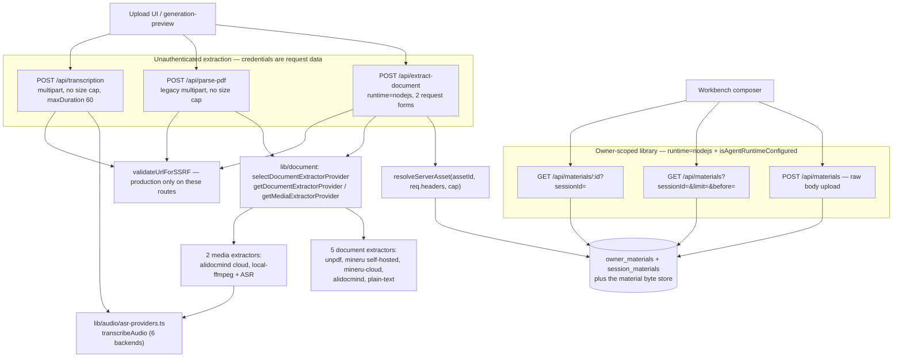
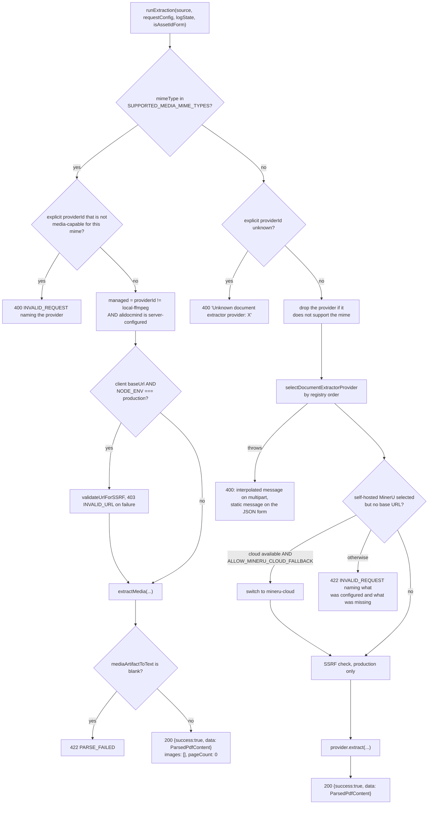
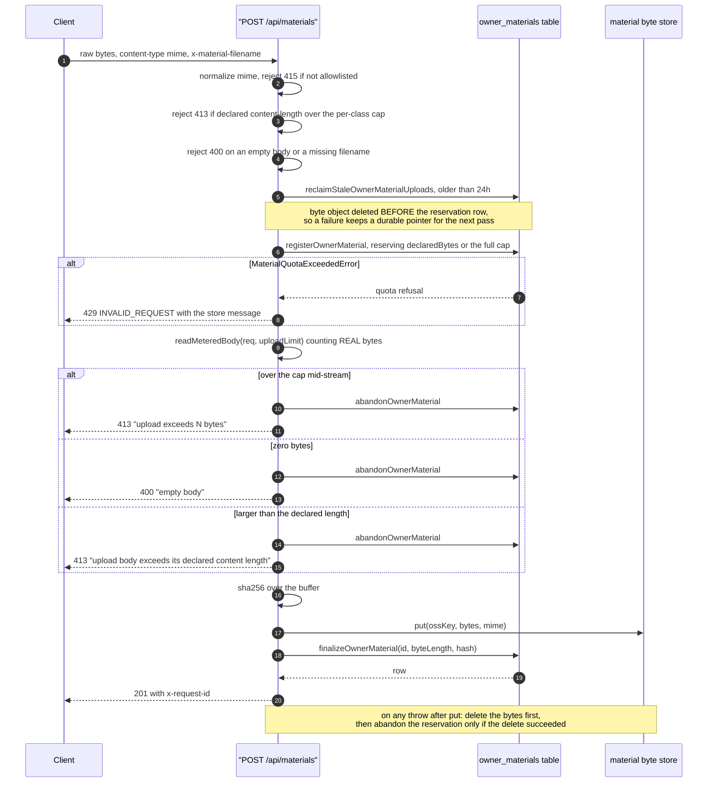

# Document ingestion and the material library

Five routes that turn bytes into text: `extract-document` (the current path),
`parse-pdf` (the legacy path it superseded), `transcription` (ASR), and the two
`materials` routes that hold an owner's durable upload library.

They split cleanly on identity: `materials/**` is owner-scoped and
runtime-gated; the other three are unauthenticated beyond the access-code
middleware and treat the caller's credentials as request data.

**Sources:** `app/api/extract-document/route.ts` (659 lines),
`app/api/parse-pdf/route.ts`, `app/api/transcription/route.ts`,
`app/api/materials/route.ts` (416 lines), `app/api/materials/[id]/route.ts`,
`lib/constants/generation.ts`, `lib/server/agent-runtime/config.ts`,
`lib/workbench/material-upload-policy.ts`,
`lib/persistence/resolve-server-asset.ts`; evidence
[`../appendix/research/api-surface/01b-modules-routes-a-to-e.md`](../appendix/research/api-surface/01b-modules-routes-a-to-e.md),
[`../appendix/research/generation-pipeline/`](../appendix/research/generation-pipeline/00-overview.md).

## The group

## `POST /api/extract-document`

`runtime = 'nodejs'` (`:31`) because the asset-id form reads from PostgreSQL. No
`maxDuration`. Two request forms, discriminated on `content-type` (`:451`,
`:497`); anything else is a 400 that **echoes the received content type**
(`:625-631`).

### Multipart form (`multipart/form-data`)

| Field | Type | Notes |
| --- | --- | --- |
| `file` or `pdf` | File | `pdf` is the legacy name; either is accepted (`:456`) |
| `providerId` | string | optional; `undefined` means auto-select by registry order |
| `apiKey`, `baseUrl` | string | ignored when the provider is server-managed |
| `accessKeyId`, `accessKeySecret` | string | AliDocMind AK/SK |

Checks, in order: file present → `400 MISSING_REQUIRED_FIELD`;
`normalizeDocumentMimeType({mimeType, fileName})` must resolve → `400` naming
the file (`:474-480`); `size <= MAX_EXTRACT_DOCUMENT_FILE_SIZE_BYTES`
(50 MiB, `lib/constants/generation.ts:16`) → `413` (`:481-489`). The route's
comment states this form's observable behaviour is frozen for backward
compatibility (`:442-444`).

### JSON asset-id form (`application/json`)

Body `AssetIdExtractRequest`: `assetId` plus the seven optional strings in
`ASSET_ID_EXTRACT_STRING_FIELDS` (`fileName`, `mimeType`, `providerId`,
`apiKey`, `baseUrl`, `accessKeyId`, `accessKeySecret`, `:64-73`).

| Failure | Status / code |
| --- | --- |
| unparseable JSON | `400 INVALID_REQUEST 'Invalid JSON body for asset-id extraction.'` |
| body is `null`, an array, or a scalar | `400 INVALID_REQUEST` — generic, checked before any field access (`:514-516`) |
| `assetId` missing or not a non-empty string | `400 MISSING_REQUIRED_FIELD` |
| any of the seven fields present but not a string | `400 INVALID_REQUEST` — **generic; the offending value is never echoed** (`:524-529`) |
| `resolveServerAsset` throws | `500 INTERNAL_ERROR` with a fixed message; the real error is logged only (`:538-548`) |
| `resolution.status === 'unconfigured'` | `503 INVALID_REQUEST` |
| `'unauthenticated'` | `401 UNAUTHENTICATED` |
| `'missing'` | `404 ASSET_NOT_FOUND` |
| `'too_large'` | `413 INVALID_REQUEST` — the recorded length exceeded the cap **before** any bytes were materialised (`:570-580`) |

### Shared extraction (`runExtraction`, `:219-438`)

Two deliberate asymmetries between the forms, both documented in the code:

- **Error text.** The JSON form never echoes caller-controlled input. Its
  catch-all returns a fixed `500 PARSE_FAILED 'The course material could not be
  parsed. Please try again later.'`; multipart still returns `error.message`
  (`:642-652`). Same for the registry-selection 400 (`:341-349`) and the blank
  media artifact 422 (`:292-300`).
- **Provider pre-validation.** `validateJsonPathProvider(providerId, mimeType)`
  pre-blocks an unknown or media-incompatible provider on the JSON form with a
  static message, so the shared path's echoing 400s are unreachable from it
  (`:600-601`).

`sanitizeLogValue` strips `\r` and `\n` from caller-controlled log values
(`:657-659`). This is the only log-injection defence in the whole HTTP surface.

**A self-hosted extractor never silently becomes a cloud one.** The MinerU
Cloud fallback requires the explicit operator opt-in
`ALLOW_MINERU_CLOUD_FALLBACK`, default off; otherwise the request fails loudly
with a 422 naming exactly what to configure (`:364-384`).

## `POST /api/parse-pdf` — the legacy path

| Property | Value |
| --- | --- |
| Runtime | default, no `maxDuration` |
| Content type | must include `multipart/form-data`, checked on the header (`:20-27`) |
| Fields | `pdf` (required), `providerId`, `apiKey`, `baseUrl` |
| Provider default | `'unpdf'` when the client omits it (`:40`) |
| Managed providers | client `apiKey`/`baseUrl` discarded (`:45-46`) |
| SSRF | `validateUrlForSSRF(clientBaseUrl)` **only when `NODE_ENV === 'production'`** (`:47-52`) |
| Size cap | **none** — the whole file is buffered with `arrayBuffer()` (`:61-62`) |
| Hardcoded mime | `'application/pdf'` regardless of the uploaded type (`:69`) |
| Success | `200 {success:true, data: ParsedPdfContent}` with `fileName`/`fileSize` merged into metadata |
| Errors | `400 INVALID_REQUEST`, `400 MISSING_REQUIRED_FIELD`, `403 INVALID_URL`, `500 PARSE_FAILED` with the raw message |

Prefer `extract-document` for anything new: it supports non-PDF documents and
media, caps the upload, and has the asset-id form.

## `POST /api/transcription`

`maxDuration = 60`, runtime default. `multipart/form-data` with fields `audio`
(required), `providerId`, `modelId`, `language`, `apiKey`, `baseUrl`
(`:23-32`).

Gate ladder, in order:

1. `audio` present → else `400 MISSING_REQUIRED_FIELD` (`:34-36`).
2. `providerId || resolveServerASRProviderId()`; neither → `400 MISSING_PROVIDER
   'No enabled ASR provider is configured'` (`:40-44`). The comment is explicit:
   never guess a vendor.
3. `isServerProviderDisabled('asr', id)` → `403 PROVIDER_DISABLED` — server
   precedence over any client key (`:50-52`).
4. `isServerConfiguredProvider('asr', id)` → managed, so the client
   `apiKey`/`baseUrl` are dropped (`:55-56`).
5. Client base URL SSRF-checked **only in production** (`:57-62`).
6. `resolveASRModel(id, modelId)` — an allowlisted client model wins, otherwise
   the first server-pinned entry (`:70`).

Success `200 {success:true, text}`. Failure
`500 TRANSCRIPTION_FAILED 'Transcription failed'` with the raw message in
`details` (`:87-93`). **No size cap on this route either.**

## `materials` — the owner's durable library

| Route | Method | Request | Success | Errors |
| --- | --- | --- | --- | --- |
| `/api/materials` | GET | `?sessionId=` (required), `?limit=` 1…200, `?before=` keyset cursor | `200 {materials:[…]}` newest first (`:134-138`) | `400 MISSING_REQUIRED_FIELD`; `400 INVALID_REQUEST 'limit must be an integer between 1 and 200'`; 404 plain text |
| `/api/materials` | POST | **raw body**; `content-type` is the MIME type; `x-material-filename` is the display name; `x-request-id` optional | `201 {materialId, originalName, bytes, mime, extraction}` (`:353-362`) | see below |
| `/api/materials/[id]` | GET | `?sessionId=` (required) | `200 {material: <publicMaterialView>}` (`:42`) | `400 MISSING_REQUIRED_FIELD`; 404 plain text |

`POST` is deliberately **not** multipart. Every response — success, rejection,
and the catch-all 500 — carries `x-request-id` (`:363`, `:166`, `:392`).

### Upload limits

| Limit | Value | Source |
| --- | --- | --- |
| Media MIME cap | `agentRuntimeConfig.maxUploadBytes`, default 50 MiB, env `OPENMAIC_AGENT_MAX_UPLOAD_BYTES` | `lib/server/agent-runtime/config.ts:46` |
| Everything else | `min(maxDocumentBytes, maxUploadBytes)`, both default 50 MiB | `route.ts:70-73`, `config.ts:48` |
| Materials per owner | 100, env `MATERIALS_MAX_COUNT_PER_OWNER` | `config.ts:50` |
| Total bytes per owner | 2 GiB, env `MATERIALS_MAX_TOTAL_BYTES_PER_OWNER` | `config.ts:52-55` |
| List page ceiling | 200 | `route.ts:77` |
| Filename length | 512 chars after `basename` | `route.ts:91` |

`x-material-filename` is percent-decoded (failure preserved verbatim), `\` is
normalised to `/`, `basename` is taken, and the result is trimmed and truncated
(`:82-93`). `x-request-id` is echoed only if it matches
`/^[A-Za-z0-9._:-]{1,128}$/`, else a UUID is minted (`:95-98`).

### The upload lifecycle and its compensations

The reservation trick matters: when an intermediary strips `Content-Length`, the
route reserves the **full per-file maximum** so an unmeasured stream cannot slip
past the owner byte quota, then shrinks the reservation at finalisation
(`:224-229`).

### Structured logging

Every branch logs through `context()`, which emits `requestId`, `phase`,
`materialId`, `mime`, `declaredBytes`, `receivedBytes`, `durationMs`
(`:154-163`). `phase` walks
`feature_gate → validate_request → reclaim_stale_uploads → reserve_material → store_bytes`.
This is the most observable route in the surface.

## Notes and caveats

- **`materials/[id]` exposes no DELETE.** The file states why: the underlying
  session-material store has no delete operation yet (`materials/[id]/route.ts:10-13`).
- **Two of these five routes have no upload cap at all.** `parse-pdf` and
  `transcription` both `arrayBuffer()`/`formData()` the whole body. Only
  `extract-document` (50 MiB) and `materials` (per-class, byte-counted) bound it.
- **SSRF strictness differs.** All three extraction routes gate the client base
  URL check on `NODE_ENV === 'production'`; `generate/tts` does not. See
  [`09-conventions.md`](./09-conventions.md).
- **`extract-document` is the only route that sanitises log values.** Every other
  route interpolates caller-controlled strings into log lines unchanged.
- **No rate limiting.** `POST /api/materials` is bounded by the per-owner quota,
  which is the closest thing to a rate limit in the surface — and it caps
  *storage*, not request frequency.

## Open questions

- `resolveServerAsset` returns a five-state union; the `'unauthenticated'` state
  maps to `401`, which implies a credential path into the asset store, but which
  credential (the persistence dev token? the anonymous owner?) was not traced from
  the route.
- `publicMaterialView` versus `publicMaterial` — the list/detail routes use the
  former and the upload success path the latter (`materials/route.ts:352`,
  `[id]/route.ts:42`). Whether the two projections are field-identical was not
  verified.

Next: [`04-classroom-and-pbl.md`](./04-classroom-and-pbl.md).
