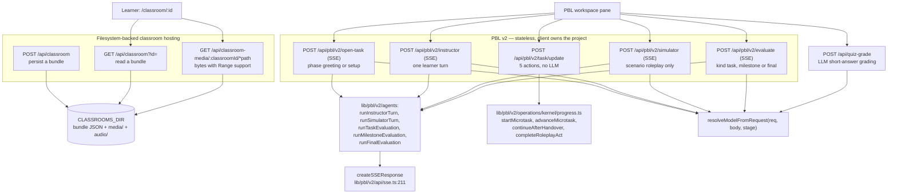
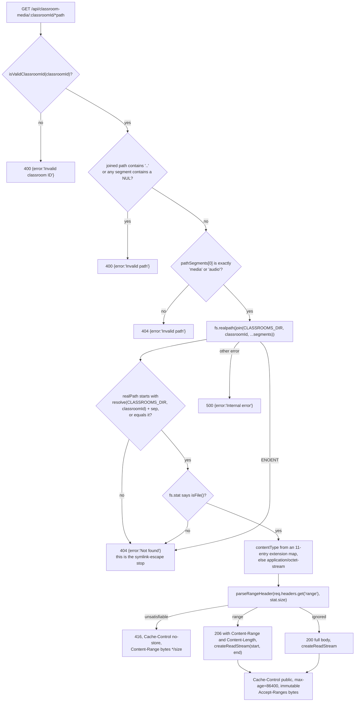
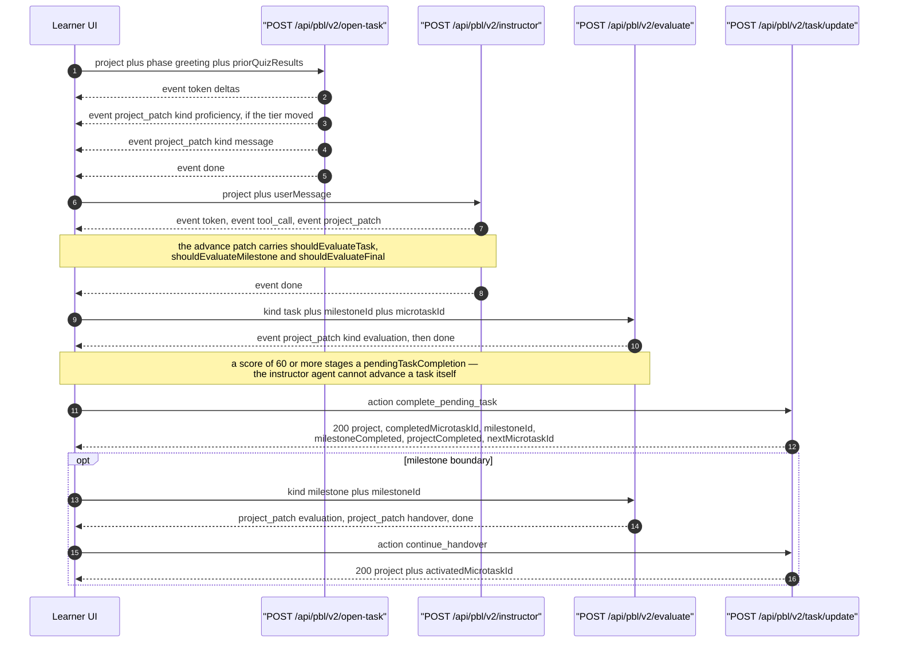

# Classroom hosting, PBL v2, and quiz grading

Eight routes. Two serve a published classroom off the filesystem
(`classroom`, `classroom-media/**`), five run the PBL v2 project-based-learning
runtime (`pbl/v2/**`), and `quiz-grade` grades a short answer with an LLM.

None of them is owner-scoped. `classroom` and `classroom-media` treat the
classroom id as the capability; the PBL routes are fully stateless — the client
posts the entire `PBLProjectV2` on every call and applies the returned patches.

**Sources:** `app/api/classroom/route.ts`,
`app/api/classroom-media/[classroomId]/[...path]/route.ts`,
`app/api/pbl/v2/{instructor,open-task,evaluate,simulator,task/update}/route.ts`,
`app/api/quiz-grade/route.ts`, `lib/pbl/v2/api/sse.ts`,
`lib/server/{classroom-storage,http-range}.ts`; evidence
[`../appendix/research/api-surface/01c-modules-routes-f-to-p.md`](docs/appendix/research/api-surface/01c-modules-routes-f-to-p.md),
[`../appendix/research/classroom-runtime/`](docs/appendix/research/classroom-runtime/00-overview.md).

## The group



## `classroom` — persist and read a published bundle

| Method | Request | Success | Errors |
| --- | --- | --- | --- |
| POST | `{stage, scenes}` | `201 {success:true, id, url}` (`:36`) | `400 MISSING_REQUIRED_FIELD 'Missing required fields: stage, scenes'`; `500 INTERNAL_ERROR 'Failed to store classroom'` with the raw message in `details` |
| GET | `?id=` | `200 {success:true, classroom}` (`:72`) | `400 MISSING_REQUIRED_FIELD` (no `id`); `400 INVALID_REQUEST 'Invalid classroom id'`; `404 INVALID_REQUEST 'Classroom not found'`; `500 INTERNAL_ERROR` |

The id is `stage.id || randomUUID()` (`:31`) and the bundle is written under
`CLASSROOMS_DIR` by `persistClassroom({id, stage:{...stage, id}, scenes}, baseUrl)`
where `baseUrl` comes from `buildRequestOrigin(request)` (`:32-34`).

**There is no owner scoping and no auth beyond the access-code middleware.** Any
caller who knows a classroom id can read it; any caller can create one. `GET`
validates the id with `isValidClassroomId` before touching the filesystem
(`:63`), which is what keeps `readClassroom` from being a path-traversal
primitive.

## `classroom-media/[classroomId]/[...path]` — byte serving

The most carefully guarded filesystem route in the surface. Four independent
layers, in order:



Details worth carrying:

- The 416 is **deliberately uncached** (`Cache-Control: no-store`, `:88-95`): an
  `immutable` 416 would poison shared and browser caches and break later valid
  requests for the same URL.
- Both success paths go through `toWebStream(createReadStream(...))` (`:27-38`)
  so a large video never enters process memory. `cancel()` destroys the fs
  stream.
- Multi-range requests are not supported — `parseRangeHeader` returns single
  byte ranges only ([`lib/server/http-range.ts:1-18`](lib/server/http-range.ts#L1-L18)).
- MIME comes from a fixed 11-entry map (`:10-22`), not from sniffing.
- This route uses a **fourth** error envelope: `{error: '<Human Message>'}` in
  Title Case, unrelated to `apiError` and to the `snake_case` shape used by
  `stages/[id]/status`.

## `pbl/v2/**` — five routes over one wire format

All five parse JSON, validate, and (except `task/update`) resolve a model and
return `createSSEResponse(generator, {signal: req.signal})`.

| Route | maxDuration | Stage key | Required body | Notes |
| --- | --- | --- | --- | --- |
| `POST /api/pbl/v2/instructor` | 300 | `pbl-v2-runtime:instructor` | `project`, non-blank `userMessage` (`:46-51`) | `phase` defaults to `'instructing'`; `applyRequestLocaleToProject(req, body.project)` mutates the client's project in place (`:63`) |
| `POST /api/pbl/v2/open-task` | 300 | `pbl-v2-runtime:open-task` | `project`, `phase ∈ {'greeting','setup'}` (`:48-53`) | folds `priorQuizResults` into the adaptive engine **only** on `greeting` (`:71-80`); calls `runInstructorTurn` with an empty `userMessage` |
| `POST /api/pbl/v2/simulator` | 300 | `pbl-v2-runtime:simulator` | `project` (`:47-49`) | scenario-only; `phase` is `'greeting'` or, for anything else, `'instructing'` (`:60`); `runSimulatorTurn` gates and errors on a non-roleplay milestone |
| `POST /api/pbl/v2/evaluate` | 300 | `pbl-v2-runtime:evaluate` | `project`, `kind ∈ {'task','milestone','final'}`, plus `milestoneId`+`microtaskId` for `task` and `milestoneId` for `milestone` (`:65-80`) | three generators behind one route; the rationale for kind-as-body is at `:22-26` |
| `POST /api/pbl/v2/task/update` | 60 | — (no LLM) | `project`, `action` | pure switch over five actions; unknown action → `400 INVALID_REQUEST 'Unknown action: X'` (`:159-160`) |

A model-resolution throw becomes `400 INVALID_REQUEST` carrying the raw message
on all four LLM routes (e.g. [`evaluate/route.ts:85-88`](app/api/pbl/v2/evaluate/route.ts#L85-L88)) — not a 500.

### The wire format

`createSSEResponse` ([`lib/pbl/v2/api/sse.ts:211`](lib/pbl/v2/api/sse.ts#L211)) is the **only formally typed
streaming contract in the whole HTTP surface**.

| Property | Value |
| --- | --- |
| Frame | `event: <type>\ndata: <payload-without-type>\n\n` (`:185-188`) |
| Event union | `PBLSSEEvent` = `token` \| `tool_call` \| `project_patch` \| `sim_phase` \| `reset_draft` \| `error` \| `done` (`:168-175`) |
| Patch kinds | `message`, `advance`, `engagement_event`, `evaluation`, `handover`, `proficiency` |
| Terminal | exactly one `done` per stream (`:163-166`) |
| Heartbeat | `: keepalive` every 15 000 ms, overridable via `heartbeatMs` (`:192`, `:215`, `:258`) |
| Headers | `text/event-stream; charset=utf-8`, `no-cache, no-transform`, `keep-alive`, **`X-Accel-Buffering: no`** (`:280-288`) |
| Generator throw | emits an `error` frame with `code:'STREAM_ERROR'` **then** a `done` frame, then closes (`:265-273`) |
| Abort | `signal` removes its own listener and closes the controller exactly once via `safeClose` (`:225-246`) |
| Contract note | yielding an `error` event does **not** stop the generator — the caller must `return` (`:204-207`) |

`X-Accel-Buffering: no` appears on these four routes and nowhere else, even
though six other routes stream SSE.

### One PBL task cycle



### `task/update`'s five actions

| Action | Required | Success body | Refusals |
| --- | --- | --- | --- |
| `start` | `microtaskId` | `{project}` | `400` when `microtaskId` is absent |
| `continue_handover` | — | `{project, activatedMicrotaskId}` | `400 'No pending handover to consume.'` |
| `complete_pending_task` | — | `{project, completedMicrotaskId, milestoneId, milestoneCompleted, projectCompleted, nextMicrotaskId}` | `400` for no active microtask, no pending completion, or an `advanceMicrotask` failure carrying `adv.error` |
| `enter_scenario` | scenario project in a `scenarioStage === 'prep'` milestone | `{project, activatedMicrotaskId?}` | `400 'Not a scenario project.'`; `400 'No active scenario prep stage to advance.'` |
| `complete_act` | scenario project in a roleplay stage | `{project}` | `400 'Not a scenario project.'`; `400` with `r.error` |

Both scenario actions are hard-gated on `project.scenario` and the active
milestone's `scenarioStage` so they can never affect an ordinary project
(`:112-158`). Everything is returned wrapped in `apiSuccess`, so the real body is
`{success:true, project, …}`.

## `quiz-grade`

Runtime default, **no `maxDuration`**. Stage key `quiz-grade`.

| Check | Response |
| --- | --- |
| `question` and `userAnswer` both present | else `400 MISSING_REQUIRED_FIELD` (`:37-39`) |
| `points` truthy, finite, `> 0` | else `400 INVALID_REQUEST 'points must be a positive number'` (`:42-44`) |

The prompt is language-switched on `language === 'zh-CN'` (`:53-69`) and asks for
`{"score": <int>, "comment": "..."}`. The response is extracted with
`text.match(/\{[\s\S]*\}/)` and the score clamped to `[0, points]` (`:88-94`).

**On any parse failure the route silently awards 50 %** with a canned comment
(`:95-103`):

```ts
gradeResult = {
  score: Math.round(points * 0.5),
  comment: isZh ? '已作答，请参考标准答案。' : 'Answer received. Please refer to the standard answer.',
};
```

That is a grading-fidelity decision, not an error path: a learner never sees a
failed grade, and the caller cannot tell a real 50 % from a fallback 50 %.
Success is `200 {success:true, score, comment}`; a thrown error is
`500 INTERNAL_ERROR 'Failed to grade answer'`.

## Notes and caveats

- **The PBL routes mutate the caller's project object in place.**
  `applyRequestLocaleToProject(req, body.project)` and
  `applyQuizSignalsToProject(body.project, …)` both write into the parsed body.
  Harmless per-request, but it means the "stateless" claim is about *server*
  state only.
- **`quiz-grade`'s 50 % fallback has no test coverage** per the generation-pipeline
  evidence pack, and no way for the client to detect it.
- **Two hard-coded Chinese strings reach learners** from `quiz-grade` regardless
  of the course's `languageDirective`, keyed only on `language === 'zh-CN'`.
- **`classroom` POST is an unauthenticated filesystem write.** Combined with the
  absent rate limiting, a caller can fill `CLASSROOMS_DIR`.
- **`classroom-media` caches for a day and marks responses `immutable`.** A
  regenerated asset at the same path will not be re-fetched by a browser that has
  it cached.

## Open questions

- The three-gate task-completion chain (evaluation score ≥ 60 stages a
  `pendingTaskCompletion`, the learner clicks Done, a milestone boundary needs a
  Continue) is described in the classroom-runtime evidence pack. The threshold
  itself lives inside `lib/pbl/v2` and was not verified from the route layer.
- `sim_phase` and `reset_draft` are declared in `PBLSSEEvent` but which generator
  emits them was not traced here.

Next: [`05-media-and-export.md`](docs/12-api-reference/05-media-and-export.md).
