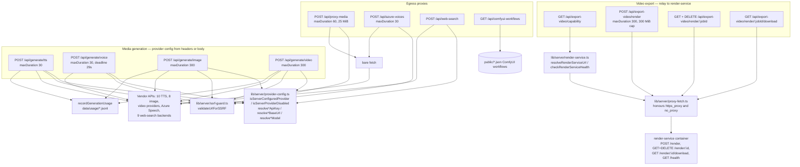
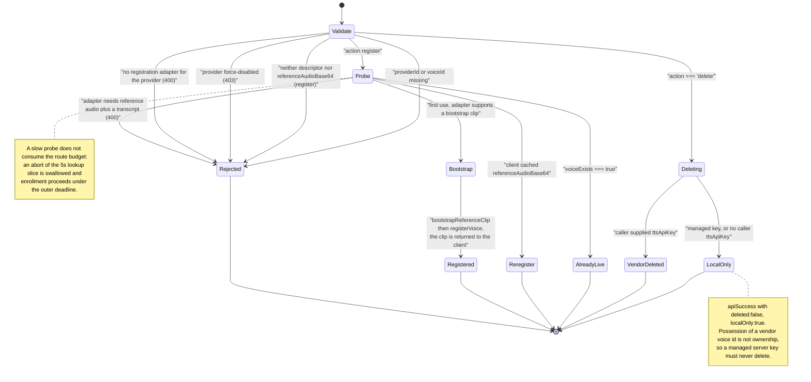
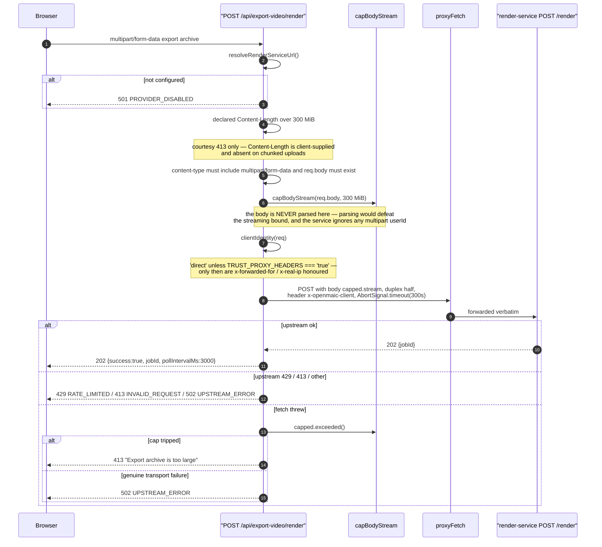

# Media generation, egress proxies, and video export

Twelve routes. Four generate media (`generate/{tts,voice,image,video}`), four
relay to the standalone render service (`export-video/**`), and four fetch
something on the caller's behalf (`proxy-media`, `azure-voices`, `web-search`,
`comfyui-workflows`).

The unifying property is egress on the caller's behalf. Six take provider
credentials as request data (`generate/{tts,voice,image,video}`, `azure-voices`,
`web-search`), and six make an outbound request to a host the caller can
influence — the four `generate/*` routes plus `proxy-media` (a caller-supplied
URL, no credentials) and `azure-voices`. Those six are exactly the callers of
`validateUrlForSSRF`; `lib/server/ssrf-guard.ts` is the boundary.

The other six do not reach a caller-chosen host. `web-search` accepts a client
`baseUrl` but allowlists it against `OFFICIAL_CLIENT_BASE_URLS` before use
(`lib/server/web-search-config.ts:74-77`). The four `export-video/**` routes take
no credentials at all and reach only the operator-configured `RENDER_SERVICE_URL`,
deliberately left un-guarded because it is *meant* to point at an internal service
(`lib/server/render-service.ts:25-39`). `comfyui-workflows` reads no request data
whatsoever — just local disk.

**Sources:** `app/api/generate/{tts,voice,image,video}/route.ts`,
`app/api/export-video/**/route.ts`, `app/api/proxy-media/route.ts`,
`app/api/azure-voices/route.ts`, `app/api/comfyui-workflows/route.ts`,
`app/api/web-search/route.ts`, `lib/server/{ssrf-guard,proxy-fetch,render-service,capped-stream,web-search-config}.ts`,
`lib/server/provider-config.ts`; evidence
[`../appendix/research/media-audio-video/`](../appendix/research/media-audio-video/00-overview.md),
[`../appendix/research/api-surface/01d-modules-routes-p-to-w.md`](../appendix/research/api-surface/01d-modules-routes-p-to-w.md).

## The group and its egress paths

## Media generation

All four share a gate ladder derived from `lib/server/provider-config.ts`:
**force-disabled beats any client selection**, and a *managed* (server-configured)
provider discards the client's `apiKey`/`baseUrl` rather than rejecting them.

| Route | Provider selection | Model | Client credentials | Success |
| --- | --- | --- | --- | --- |
| `generate/tts` | `body.ttsProviderId`, required | `resolveTTSModel(id, ttsModelId, ttsVoice)` — the model follows the voice (`:124`) | `ttsApiKey`, `ttsBaseUrl` in the body | `200 {success:true, audioId, base64, format}` — base64 in JSON, not a byte stream (`:157-161`) |
| `generate/voice` | `body.providerId`, required | `resolveQwenVoiceCloneModel()` for `qwen-tts`, else `resolveTTSModel` (`:141-145`) | `ttsApiKey`, `ttsBaseUrl` | `200 {success:true, voiceId, registered:true, referenceAudioBase64?, mimeType?}` |
| `generate/image` | header `x-image-provider`, else `resolveServerImageProviderId()` (`:54-55`) | header `x-image-model` allowlisted against server pins (`:93`) | headers `x-api-key`, `x-base-url` | `200 {success:true, result}` |
| `generate/video` | header `x-video-provider`, else the server default | header `x-video-model` (`:87`) | headers `x-api-key`, `x-base-url` | `200 {success:true, result}` |

### Error surfaces

| Condition | `tts` | `voice` | `image` | `video` |
| --- | --- | --- | --- | --- |
| missing required field | 400 `MISSING_REQUIRED_FIELD` | 400 | 400 (`prompt`) | 400 (`prompt`) |
| no provider resolvable | — (required) | — (required) | `400 MISSING_PROVIDER` | `400 MISSING_PROVIDER` |
| provider force-disabled | `403 PROVIDER_DISABLED` | `403` | `403` | `403` |
| SSRF on a client base URL | `403 INVALID_URL` — **unconditional** (`:97-102`) | `403` — **unconditional** (`:125-130`) | `403`, **production only** (`:70-75`) | `403`, **production only** (`:65-70`) |
| missing API key | `400 MISSING_API_KEY` when `provider.requiresApiKey` (`:113-119`) | — | `401 MISSING_API_KEY` when required (`:79-85`) | `401 MISSING_API_KEY` **unconditionally** (`:73-79`) |
| no model | — | — | `400 MISSING_MODEL`, skipped for catalog-less workflow providers (`:96-102`) | `400 MISSING_MODEL` |
| content filter | — | — | `400 CONTENT_SENSITIVE` on `SensitiveContent`/`sensitive information` in the message (`:125-128`) | same (`:123-126`) |
| typed failures | `429 RATE_LIMITED` (`TTSRateLimitError`); `QwenVoiceCloneError` → its own code and `httpStatus \|\| 502`; `QwenTTSError`; `TTSModelNotAllowedError` (`:167-178`) | `QwenVoiceCloneError`; `InvalidReferenceAudioError` → 400; deadline abort → `504 QWEN_VC_TIMEOUT` (`:237-245`) | — | — |
| catch-all | `500 GENERATION_FAILED` | `500 GENERATION_FAILED` | `500 INTERNAL_ERROR` | `500 INTERNAL_ERROR` |

Note the inconsistency: a missing API key is **400** on `tts` and **401** on
`image`/`video`. And `tts`/`voice` run the SSRF check unconditionally while
`image`/`video` gate it on `NODE_ENV === 'production'` — the surface's one
documented split in SSRF strictness.

Special cases worth knowing:

- `generate/tts` rejects `browser-native-tts` outright: it must be handled
  client-side (`:65-67`).
- VoxCPM auto-voice with neither a `voicePrompt` nor a `registeredVoiceId` is
  `400 VOXCPM_AUTO_VOICE_REQUIRES_CONTEXT` (`:81-92`).
- A Qwen clone voice forces `speed: 1` regardless of the requested speed
  (`:122`, `:129`).
- `generate/image` `maxDuration = 300` is sized to the ComfyUI adapter's 5-minute
  poll budget, with the reasoning written at `:37-41`.
- Usage metering is fire-and-forget (`void recordGenerationUsage(...)`) in
  characters for TTS, images for image, and **seconds of output** for video
  (`tts:146-152`, `image:113-119`, `video:111-117`).

### `generate/voice` — the idempotency ladder

The only route in the surface with an internal deadline separate from
`maxDuration`: `ROUTE_DEADLINE_MS = 29_000` with a `EXISTS_LOOKUP_SLICE_MS = 5_000`
slice for the existence probe (`:40-41`). `childSignal` composes the parent abort
with a timeout and removes its own listener (`:43-62`).

## `export-video/**` — relay to the render service

None of these four parses a render payload. They forward, poll, cancel, and
stream bytes.

| Route | Method | Unconfigured | Success | Upstream mapping |
| --- | --- | --- | --- | --- |
| `/api/export-video/capability` | GET | `{success:true, enabled:false}` | `200 {success:true, enabled}` — configured **and** `/health` responding | never leaks the service URL |
| `/api/export-video/render` | POST | `501 PROVIDER_DISABLED` (`:48-50`) | `202 {success:true, jobId, pollIntervalMs:3000}` | 429→`429 RATE_LIMITED`, 413→`413 INVALID_REQUEST`, else `502 UPSTREAM_ERROR` with the upstream `error` in `details` (`:87-97`) |
| `/api/export-video/render/[jobId]` | GET | `501` | `200 {success:true, ...upstreamJson, pollIntervalMs:3000}` | 404→404, else 502 (`:26-27`) |
| `/api/export-video/render/[jobId]` | DELETE | `501` | `200 {success:true, cancelled:true}` | upstream 404 treated as success — idempotent cancel (`:49-52`) |
| `/api/export-video/render/[jobId]/download` | GET | `501` | `302` to the upstream `Location`, **or** `200 video/mp4` streaming `upstream.body` | 404/409→that status, else 502 (`:45-48`) |

### `POST /api/export-video/render`, in detail

The 300 MiB cap is only the *route's* ceiling. `next.config.ts:36` sets
`experimental.proxyClientMaxBodySize: '200mb'` for every request, so on a proxied
or Vercel deployment the smaller number wins and 300 MiB is unreachable
([`09-conventions.md`](./09-conventions.md#size-limits),
[`../15-cross-cutting/04-threat-secrets-and-uploads.md`](../15-cross-cutting/04-threat-secrets-and-uploads.md)).

`x-openmaic-client` is the closest thing the surface has to rate limiting, and it
is enforced **downstream** in the render service, not here. The default collapses
every caller into one `'direct'` bucket rather than trusting a spoofable header
(`:33-38`).

The download route bounds **only the header fetch** with a 30 s timeout and clears
the timer once headers arrive, so a slow large MP4 is not truncated (`:30-37`).
`redirect: 'manual'` lets a presigned artifact URL be handed straight to the
browser (`:40-43`). `jobId` is interpolated unescaped into `Content-Disposition`
(`:57`) after being `encodeURIComponent`-escaped in the upstream path (`:34`).

## Egress proxies

### `POST /api/proxy-media`

The only route that re-validates **every** redirect hop.

| Property | Value |
| --- | --- |
| Body | `{url: string}`; non-string → `400 MISSING_REQUIRED_FIELD` (`:28-30`) |
| Initial guard | `validateUrlForSSRF(url)` → `403 INVALID_URL` (`:33-36`) |
| Redirects | manual loop, `MAX_REDIRECTS = 5`; each hop re-validated (`:38-58`); missing `Location` → `502 UPSTREAM_ERROR`; unparseable `Location` → `502 INVALID_URL`; over the hop budget → `502 TOO_MANY_REDIRECTS` |
| Transport | **bare `fetch`**, not `proxyFetch` (`:42`) |
| Upstream status | 4xx forwarded as-is (permanent, no retry); 5xx collapsed to 502 (`:60-65`) |
| Size cap | `MAX_PROXY_BYTES = 25 MiB` checked on `content-length` *and* on the materialised blob (`:67-75`) |
| Response | raw bytes, upstream `Content-Type`, explicit `Content-Length`, `Cache-Control: private, max-age=3600` (`:78-84`) |

The cap has a known ceiling: the blob is fully buffered, so a lying
`content-length` still costs memory up to the real size before the second check
fires.

### `POST /api/azure-voices`

Body `{apiKey, baseUrl}`, both required (`:20-26`). `validateUrlForSSRF(baseUrl)`
runs **unconditionally** — no `NODE_ENV` gate (`:29-32`). Fetches
`` `${baseUrl}/cognitiveservices/voices/list` `` with
`Ocp-Apim-Subscription-Key` and `redirect: 'manual'`; a 3xx becomes
`403 REDIRECT_NOT_ALLOWED` (`:43-45`). A non-OK upstream is forwarded **with the
upstream status** and the raw upstream body in `details` (`:47-55`). Success is
`200 {success:true, voices}`.

### `POST /api/web-search`

Runtime default, no `maxDuration`. Requires a non-blank `query` (`:55-57`).

Provider precedence, in code order:

1. `body.providerId` if it exists in `WEB_SEARCH_PROVIDERS`, else the server
   default, else `'tavily'` (`:59-63`).
2. **Override**: an operator-configured backend wins over a client choice that has
   no server config (`:67-77`).
3. `isServerProviderDisabled('webSearch', id)` → `403 PROVIDER_DISABLED`, checked
   *after* the override so a disabled client choice yields to the operator's
   backend (`:83-89`).

Credentials: managed providers drop the client key/baseUrl silently rather than
erroring; **SearXNG base URLs are always operator-only** regardless of managed
state (`:95-98`). `resolveWebSearchRouteBaseUrl` enforces an exact-match
allowlist of official provider base URLs and a throw becomes
`400 INVALID_REQUEST` (`:107-113`).

| Error | Status |
| --- | --- |
| missing key for a `requiresApiKey` provider | `400 MISSING_API_KEY`, naming the exact env var via `getWebSearchEnvKey` (`:100-106`, `:196-218`) |
| missing base URL for a `requiresBaseUrl` provider | `400 MISSING_REQUIRED_FIELD` with a provider-specific message (`:114-120`, `:189-194`) |
| anything thrown | `500 INTERNAL_ERROR` with the raw message |

`pdfText` is clamped to `SEARCH_QUERY_REWRITE_EXCERPT_LENGTH` at the boundary
(`:123`). The query-rewrite LLM (stage `web-search-query-rewrite`) is
**best-effort**: a model-resolution failure logs a warn and the raw requirement is
used (`:125-150`). `WEB_SEARCH_CLAUDE_MODELS` pins the Claude model over the
client's choice (`:169-171`). Success is
`200 {success:true, answer, sources, context, query, responseTime}`.

### `GET /api/comfyui-workflows`

23 lines. Returns `{workflows: await listComfyuiWorkflows()}`. On **any** error it
logs and returns `{workflows: []}` with status **200** (`:19-22`) — the only route
in the surface that converts a failure into an empty success. Note it does not use
`apiSuccess`, so there is no `success` field.

## Notes and caveats

- **`proxy-media` and `azure-voices` use bare `fetch`.** Only `export-video/**`
  and `render-service.ts` go through `proxyFetch`, so only those honour
  `https_proxy`/`no_proxy`.
- **`validateUrlForSSRF` short-circuits to `null` when `ALLOW_LOCAL_NETWORKS` is
  `'true'` or `'1'`** (`lib/server/ssrf-guard.ts:266-269`). That single env var
  disables the guard for all 13 routes that call it.
- **Check-then-fetch gap.** `validateUrlForSSRF` resolves DNS itself and the
  subsequent `fetch` resolves again, so a rebinding record can differ between the
  two. `proxy-media`'s per-hop re-validation narrows but does not close it.
- **`RENDER_SERVICE_URL` is deliberately not SSRF-guarded** — it is operator
  configuration, not caller input; the reasoning is written at
  `lib/server/render-service.ts:25-35`.
- **No rate limiting on any of these routes.** `generate/image` and
  `generate/video` each spend a vendor credit per unauthenticated request.

## Open questions

- The render service enforces a per-identity guard keyed on `x-openmaic-client`.
  Its actual limits live in `render-service/` and were not read for this
  reference — see [`../09-media-and-export/index.md`](../09-media-and-export/index.md).
- `generate/tts` returns base64 audio inside JSON. Whether that was chosen for
  caching, for the client's Dexie write path, or for provider-format uniformity is
  not recorded in the route.

Next: [`06-providers-and-verification.md`](./06-providers-and-verification.md).
