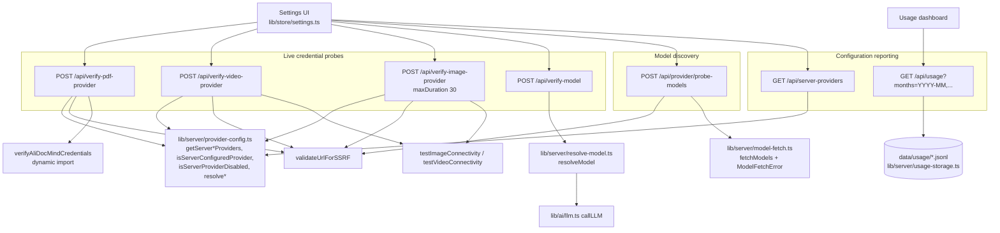
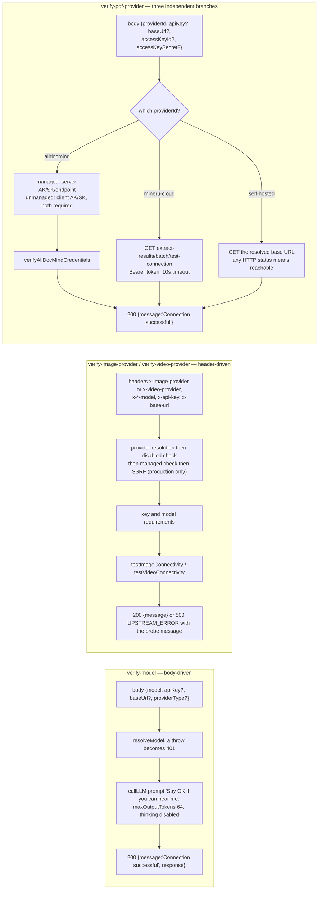
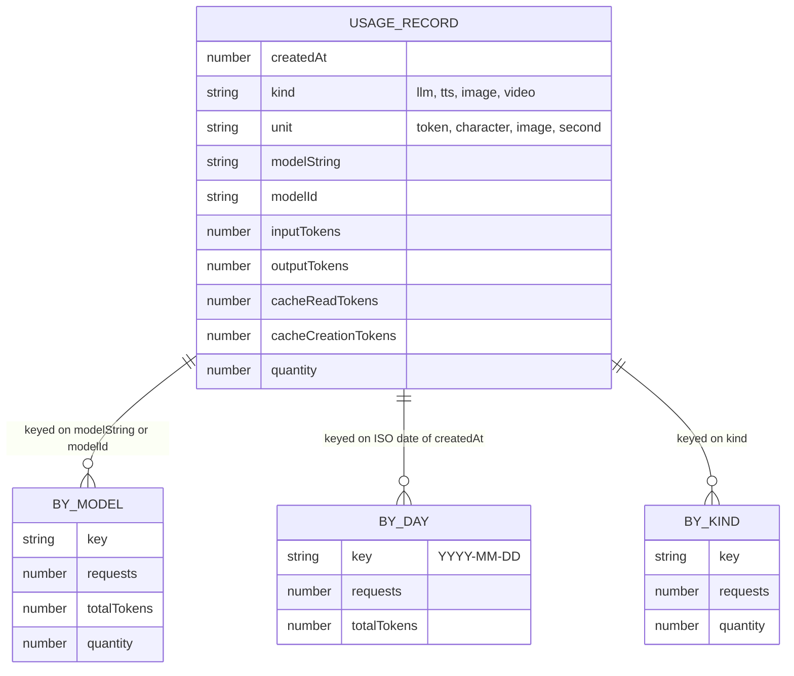

# Provider administration, verification probes, and usage

Seven routes that answer "what can this deployment do, and do these credentials
work". Two report configuration (`server-providers`, `usage`), one discovers
models (`provider/probe-models`), and four probe a live vendor endpoint
(`verify-model`, `verify-image-provider`, `verify-video-provider`,
`verify-pdf-provider`).

All seven are unauthenticated beyond the access-code middleware. None is
owner-scoped. `usage` is deployment-wide.

**Sources:** `app/api/{server-providers,usage}/route.ts`,
`app/api/provider/probe-models/route.ts`,
`app/api/verify-{model,image-provider,video-provider,pdf-provider}/route.ts`,
`lib/server/{provider-config,resolve-model,model-fetch,usage-storage,ssrf-guard}.ts`;
evidence
[`../appendix/research/api-surface/01d-modules-routes-p-to-w.md`](docs/appendix/research/api-surface/01d-modules-routes-p-to-w.md),
[`../appendix/research/ai-provider-layer/`](docs/appendix/research/ai-provider-layer/00-overview.md).

## The group

## `GET /api/server-providers`

38 lines. Returns the whole server provider inventory in one object
(`:18-29`):

| Field | Source |
| --- | --- |
| `providers` | `getServerProviders()` |
| `tts` | `getServerTTSProviders()` |
| `asr` | `getServerASRProviders()` |
| `pdf` | `getServerPDFProviders()` |
| `image` | `getServerImageProviders()` |
| `video` | `getServerVideoProviders()` |
| `webSearch` | `getServerWebSearchProviders()` |
| `generation.parallelSceneConcurrency` | `getParallelSceneConcurrency()` |

Wrapped in `apiSuccess`, so the body is `{success:true, providers, tts, …}`. Any
throw is `500 INTERNAL_ERROR` with the raw message.

This is the one-way settings sync: the client resets and re-applies
`isServerConfigured` / `serverModels` / `serverDisabled` from this response and
never sends user-entered keys back
(`lib/store/settings.ts`, per the persistence evidence pack). A failure is silent
on the client.

## `POST /api/provider/probe-models`

Discovers the chat models an OpenAI-compatible base URL exposes.

| Property | Value |
| --- | --- |
| Body | `{baseUrl, apiKey?, modelsUrl?}`; `baseUrl` required → `400 MISSING_REQUIRED_FIELD` |
| SSRF | **both** `baseUrl` and an explicit `modelsUrl` override are validated (`:33-36`); failure is `400 INVALID_REQUEST` carrying the guard's message — note this route returns 400, and does not use the `INVALID_URL` code at all. Every other route pairs a *guard rejection* with `403 INVALID_URL`; the one other departure is `proxy-media:52`, which reuses `INVALID_URL` at `502` for an unparseable redirect `Location` — a different condition, not a guard verdict |
| Filter | one regex drops non-chat ids: `/(tts\|asr\|whisper\|embedding\|rerank\|mineru\|image\|video\|voxcpm\|moderation)/i` (`:10`) |
| Success | `200 {success:true, models:[{id, ownedBy}], total, filtered}` (`:41-45`) |

`ModelFetchError` status mapping (`:47-59`):

| Upstream | Response |
| --- | --- |
| 3xx | `403 REDIRECT_NOT_ALLOWED` |
| 401 or 403 | `401 INVALID_REQUEST 'API key is invalid or expired'` |
| 404 | `404 INVALID_REQUEST 'This provider does not expose a model list'` — a deliberate UI signal to fall back to manual model entry |
| anything else | `502 INTERNAL_ERROR` with the fetch error's message |

Non-`ModelFetchError` throws are `500 INTERNAL_ERROR`.

## The four verification probes side by side

### `POST /api/verify-model`

77 lines, runtime default, **no `maxDuration`**. Body `{model, apiKey?, baseUrl?, providerType?}`;
`model` required (`:15-17`). No stage key is passed to `resolveModel`, so
`MODEL_ROUTES` cannot pin this probe — it verifies what the caller asked about.

A `resolveModel` throw becomes `401 INVALID_REQUEST` carrying the raw message
(`:29-35`). Then a real `callLLM` with prompt `'Say "OK" if you can hear me.'`,
`maxOutputTokens: 64`, thinking forced to `{mode:'disabled', enabled:false}`
(`:39-48`). Success is `200 {success:true, message:'Connection successful', response}`.

The catch block **string-matches the error message** and rewrites it (`:57-73`):

| Substring in `error.message` | Rewritten message |
| --- | --- |
| `401` or `Unauthorized` | `'API key is invalid or expired'` |
| `404` or `not found` | `'Model not found or API endpoint error'` |
| `429` | `'API rate limit exceeded, please try again later'` |
| `ENOTFOUND` or `ECONNREFUSED` | `'Cannot connect to API server, please check the Base URL'` |
| `timeout` | `'Connection timed out, please check your network'` |
| anything else | the raw message |

Always `500 INTERNAL_ERROR`, whatever the upstream status was. **This route has no
SSRF guard of its own** — it relies on `resolveModel`'s production-only check on a
client base URL ([`lib/server/resolve-model.ts:105-110`](lib/server/resolve-model.ts#L105-L110)).

### `verify-image-provider` and `verify-video-provider`

Header-driven and structurally identical to the matching `generate/*` route's gate
ladder, then a connectivity probe instead of a generation.

| Step | image | video |
| --- | --- | --- |
| `maxDuration` | 30, added so a stalled upstream cannot pin the function (`:34-37`) | **none declared** |
| Provider | `x-image-provider` else `resolveServerImageProviderId()`; neither → `400 MISSING_PROVIDER` | `x-video-provider` else `resolveServerVideoProviderId()` |
| Disabled | `403 PROVIDER_DISABLED` | `403` |
| Managed | client `x-api-key`/`x-base-url` dropped | same |
| SSRF | production only → `403 INVALID_URL` | production only |
| Key | `400 MISSING_API_KEY 'No API key configured'` when `provider.requiresApiKey` | `400 MISSING_API_KEY` **unconditionally** (`:62-64`) |
| Model | `400 MISSING_MODEL` unless the provider has no catalog (`:75-81`) | `400 MISSING_MODEL` (`:67-73`) |
| Probe failure | `500 UPSTREAM_ERROR` with `result.message` | same |
| Success | `200 {success:true, message}` | same |
| Catch | `500 INTERNAL_ERROR` with `` `Connectivity test error: ${err}` `` | same |

### `POST /api/verify-pdf-provider`

Three branches, each with its own credential story. The `mineru-cloud` and
self-hosted branches set `redirect: 'manual'` and answer
`403 REDIRECT_NOT_ALLOWED` on a 3xx (`:106-111`, `:154-159`). The `alidocmind`
branch does not — it delegates the HTTP call to `verifyAliDocMindCredentials`
(`lib/pdf/alidocmind-client.ts`), which sets no redirect policy.

| Branch | Credentials | Probe | Notable |
| --- | --- | --- | --- |
| `alidocmind` (`:30-78`) | managed → server AK/SK/endpoint only, ignoring client values; unmanaged → **client AK/SK only, never an env fallback** (`:46-49`) | `verifyAliDocMindCredentials` via dynamic import | a bare host is coerced to `https://` before the production-only SSRF check (`:58-61`); missing AK or SK → `400 MISSING_REQUIRED_FIELD`; server not configured while managed → `500 INTERNAL_ERROR`; a failed verify → `400 INVALID_CREDENTIALS` |
| `mineru-cloud` (`:81-128`) | `resolvePDFApiKey`, required → `400 MISSING_REQUIRED_FIELD` | `GET ${base}/extract-results/batch/test-connection` with `Bearer`, `AbortSignal.timeout(10000)` | **any status other than 3xx/401/403 is success**, including a 4xx "batch not found" (`:113-114`); 401/403 → `500 INTERNAL_ERROR 'Authentication failed: …'` |
| self-hosted (`:130-166`) | optional `Authorization: Bearer` when a key resolves | `GET` the resolved base URL, 10 s timeout | **even a 404 means reachable** — MinerU's FastAPI root has no route (`:161-162`); no base URL → `400 MISSING_REQUIRED_FIELD` |

The catch block does the same string-matching rewrite as `verify-model` for
`ECONNREFUSED`, `ENOTFOUND` and `timeout`/`TimeoutError`, then
`500 INTERNAL_ERROR` (`:167-184`).

## `GET /api/usage`

Aggregates the deployment-wide JSONL usage log. Runtime default, no `maxDuration`.

| Property | Value |
| --- | --- |
| Query | `?months=YYYY-MM,YYYY-MM` — split on commas and trimmed with **no format validation** (`:73-74`) |
| Backing store | `readUsageRecords({months})` over `data/usage/*.jsonl` |
| Success | `200 {success:true, totals:{requests, llmTokens}, byModel:[Bucket], byDay:[Bucket], byKind:[Bucket]}` (`:102-107`) |
| `Bucket` shape | `{key, kind, unit, requests, inputTokens, outputTokens, cacheReadTokens, cacheCreationTokens, totalTokens, quantity}` (`:13-26`) |
| Sorting | `byModel` by descending `requests`; `byDay` by ascending date key |
| Error | `500 INTERNAL_ERROR` with the raw message |

`totalTokens` is deliberately `inputTokens + outputTokens` and **excludes** cache
read/write counts, because for OpenAI-compatible providers `inputTokens` already
includes cached input; the cache fields stay as a separate breakdown (`:53-57`).
`quantity` carries the non-token unit — images, seconds, or characters — written by
the `recordGenerationUsage` calls in the media routes.

## Notes and caveats

- **`usage` is deployment-wide and unauthenticated** beyond the access-code
  middleware. Any caller who can reach the API can read every model, day and
  modality the deployment has spent on.
- **`byDay` buckets are labelled `'llm'`/`'token'` regardless of the records they
  contain** (`:95`) — `emptyBucket(dk, 'llm', 'token')` — so a day that only saw
  image generations still reports `kind:'llm'`. The per-day `quantity` is still
  summed correctly.
- **`?months=` is unvalidated.** `readUsageRecords` receives whatever the caller
  typed; the route does no `YYYY-MM` shape check.
- **`probe-models` returns 400 for an SSRF refusal**, where the other twelve
  SSRF callers return 403 with `INVALID_URL`. It also uses code
  `INVALID_REQUEST`, not `INVALID_URL`.
- **The four probes make real outbound calls.** `verify-model` spends tokens.
  There is no rate limiting, so a probe endpoint is also a credential-stuffing
  oracle against third-party vendors and a token-burn primitive against the
  operator's own managed key when a provider is server-configured.
- **`verify-model` collapses every upstream status to 500.** A caller cannot
  distinguish an invalid key from a network failure except by reading the
  human-readable `error` string.

## Open questions

- `provider/probe-models` filters model ids with one regex. A legitimately named
  chat model containing, say, `image` in its id (an image-understanding chat
  model) would be filtered out. Whether that has bitten anyone is not recorded.
- `getServerProviders()` and its six siblings are the whole capability contract
  for the settings store, but the exact per-provider record shape lives in
  `lib/server/provider-config.ts` and was not enumerated here — see
  [`../04-ai-provider-layer/index.md`](docs/04-ai-provider-layer/index.md).

Next: [`07-persistence-and-auth.md`](docs/12-api-reference/07-persistence-and-auth.md).
