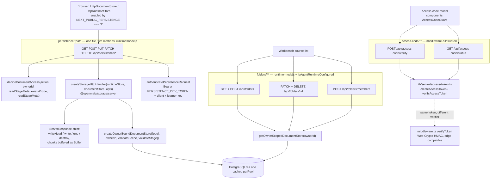
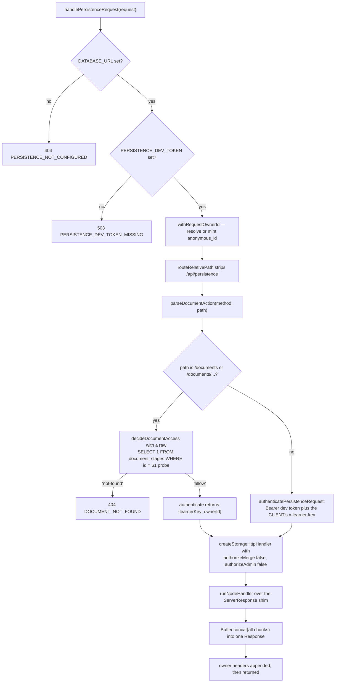
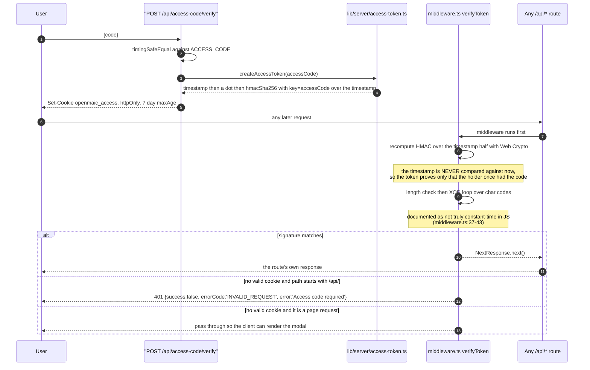

# Persistence catch-all, folders, and the access code

Six routes. `persistence/[...path]` mounts `@openmaic/storage`'s Node-style HTTP
handler behind a hand-written `ServerResponse` shim and answers all five methods.
The three `folders/**` routes organise course documents. The two
`access-code/**` routes are the only paths the auth middleware allowlists
besides `/api/health`.

**Sources:** `app/api/persistence/[...path]/route.ts` (329 lines),
`app/api/folders/{route.ts,[id]/route.ts,members/route.ts}`,
`app/api/access-code/{verify,status}/route.ts`,
`lib/server/access-token.ts`, `middleware.ts`,
`lib/persistence/{server-auth,document-access,owner-bound-document-store,server-provider}.ts`,
`lib/server/folder-name-errors.ts`, `lib/utils/folder-name-validation.ts`;
evidence
[`../appendix/research/api-surface/01d-modules-routes-p-to-w.md`](docs/appendix/research/api-surface/01d-modules-routes-p-to-w.md),
[`../appendix/research/persistence-storage-state/`](docs/appendix/research/persistence-storage-state/00-overview.md).

## The group

## `persistence/[...path]` — the embedded storage handler

All five method exports are one-line delegations to
`handlePersistenceRequest(request)` (`:325-329`).

### Configuration gates, before anything else

| Condition | Response |
| --- | --- |
| `DATABASE_URL` unset | `404 {error:{code:'PERSISTENCE_NOT_CONFIGURED', message:'server persistence not configured'}}` (`:272-274`) |
| `PERSISTENCE_DEV_TOKEN` unset | `503 {error:{code:'PERSISTENCE_DEV_TOKEN_MISSING', …}}` (`:275-281`) |
| handler construction throws | `500 {error:{code:'PERSISTENCE_INIT_FAILED', …}}` (`:312-321`) |

### Split authorization

Two different principals in one route (`:108-112`):

| Path prefix | Principal | Isolation |
| --- | --- | --- |
| `/documents*` | the server-resolved anonymous owner, used as `learnerKey` | real per-browser partitioning, plus the `stage_meta` fence inside `createOwnerBoundDocumentStore` |
| everything else (runtime, assets) | `authenticatePersistenceRequest(request)` — a `Bearer PERSISTENCE_DEV_TOKEN` check plus the client's own `x-learner-key` header | **none**; the comment at `:95-99` says the authenticator must be replaced before these routes carry production data, and [`lib/persistence/server-auth.ts:1-13`](lib/persistence/server-auth.ts#L1-L13) states the token is compiled into the browser bundle |

`authorizeMerge` and `authorizeAdmin` are hard-wired to `async () => false`
(`:113-114`).

### The `ServerResponse` shim

`@openmaic/storage` exports a Node `RequestListener`; a Next route handler must
return a `Response`. `runNodeHandler` (`:178-261`) bridges the two with an object
cast to `ServerResponse` implementing `headersSent`, `writeHead`, `write`, `end`
and `destroy`.

Three details that were bugs at some point and are now documented invariants:

- Chunks are buffered as `Buffer`, **never** as a string (`:183-191`). A handler
  may `end` with a `Uint8Array` that is not valid UTF-8; decoding it would replace
  every unpaired byte with U+FFFD.
- `write` exists because omitting it made any chunked handler a runtime
  `TypeError` that the `as unknown as ServerResponse` cast hid from the compiler
  (`:214-216`).
- `suppressesResponseBody` drops the body for `HEAD`, 204, 205 and 304
  (`:174-176`).

**The entire response is buffered in memory.** There is no streaming through this
route, so asset byte reads materialise fully before the `Response` is constructed
— which is part of why redirect egress exists.

### `ASSET_BYTE_EGRESS`

`configuredAssetByteEgress` accepts only `'redirect'`; `undefined`, `''` and
`'direct'` mean direct bytes, and anything else warns and falls back (`:43-49`).

`indirectEgressWithinGrace` then enforces a cross-component invariant
(`:63-77`): redirect egress is only enabled when
`resolveAssetCollectionGraceMs() >= DEFAULT_SIGNED_URL_TTL_SECONDS * 1000 * 10`.
A signed URL that outlives its object turns a valid read into an object-store
error. A too-short grace **degrades to direct egress with a loud warning** rather
than failing initialisation, because the asset backend is optional and its
misconfiguration must not take document and runtime traffic down with it.

## `folders/**`

Three files, all `runtime = 'nodejs'`, all gated on
`isAgentRuntimeConfigured()`, all using the `{error:{code, message}}` envelope
for failures and `ownerJson` for success.

| Route | Method | Request | Success | Errors |
| --- | --- | --- | --- | --- |
| `/api/folders` | GET | — | `200 {folders:[{...DocumentFolder, userKey: ownerId}]}`, ordered by `order` asc ([`app/api/folders/route.ts:59-63`](app/api/folders/route.ts#L59-L63)) | `500 FOLDER_LIST_FAILED` |
| `/api/folders` | POST | `{name}` | `200 {folder:{...DocumentFolder, userKey}}` (`:103`) | `400 INVALID_BODY`; `400 FOLDER_NAME_INVALID`; `400 FOLDER_NAME_EMPTY`; `400 FOLDER_NAME_TOO_LONG`; store refusals remapped by `folderNameErrorResponse`; `500 FOLDER_CREATE_FAILED` |
| `/api/folders/[id]` | PATCH | `{name}` | `200 {folder}` ([`app/api/folders/[id]/route.ts:85`](app/api/folders/[id]/route.ts#L85)) | same name codes; `409 FOLDER_NAME_DUPLICATE` from an explicit case-insensitive pre-check that excludes self (`:68-79`); `404 FOLDER_NOT_FOUND`; `500 FOLDER_RENAME_FAILED` |
| `/api/folders/[id]` | DELETE | `?mode=ungroup\|remove` | `200 {ok:true, removedStageIds}` (`:115`) | `404 FOLDER_NOT_FOUND`; `500 FOLDER_DELETE_FAILED` |
| `/api/folders/members` | POST | `{stageId, folderId: string \| null}` | `200 {ok:true}` ([`members/route.ts:59`](app/api/folders/members/route.ts#L59)) | `400 INVALID_BODY`; `400 MISSING_STAGE_ID`; `400 INVALID_FOLDER_ID`; `404 FOLDER_NOT_FOUND`; `500 FOLDER_MEMBER_FAILED` |

Behavioural notes:

- **`?mode` falls back silently.** Anything other than the literal `'remove'` —
  including a typo or an absent parameter — is treated as `'ungroup'`
  ([`app/api/folders/[id]/route.ts:104-105`](app/api/folders/[id]/route.ts#L104-L105)). `mode=remove` returns the captured member course ids
  so the caller can run its own cascade; the route does not delete courses.
- **Name validation is the shared display-width rule** from
  `lib/utils/folder-name-validation.ts` (full-width counts 2, half-width 1, ≤ 40),
  imported by both the route and the client dialogs so they cannot drift
  ([`app/api/folders/route.ts:14-16`](app/api/folders/route.ts#L14-L16)).
- **Duplicates are checked twice.** The pre-check is case-insensitive in
  application code; the store re-checks inside its owner-scoped transaction and
  the refusal is remapped onto the same machine codes by
  `folderNameErrorResponse` ([`app/api/folders/route.ts:105-112`](app/api/folders/route.ts#L105-L112), [`app/api/folders/[id]/route.ts:86-93`](app/api/folders/[id]/route.ts#L86-L93)).
- **`stageId` is a soft reference.** Membership is a pure `(owner, stage) → folder`
  organisation row; the server may delete a stage independently
  ([`members/route.ts:11-14`](app/api/folders/members/route.ts#L11-L14)).
- Body validation runs before `withRequestOwnerId` on `POST`/`PATCH`, same reason
  as everywhere else: a malformed request must not mint a cookie partition
  ([`app/api/folders/route.ts:72-75`](app/api/folders/route.ts#L72-L75)).

## `access-code/**`

The only two API paths, besides `/api/health`, that [`middleware.ts:66`](middleware.ts#L66)
allowlists.

### `POST /api/access-code/verify`

| Step | Behaviour |
| --- | --- |
| `ACCESS_CODE` unset | **succeeds unconditionally** with `200 {success:true, valid:true}` (`:7-10`) — matching the middleware pass-through |
| unparseable body | `400 INVALID_REQUEST 'Invalid JSON body'` |
| `body.code` falsy | `401 INVALID_REQUEST 'Invalid access code'` |
| comparison | `TextEncoder` + `timingSafeEqual` with a byte-length pre-check (`:23-28`) |
| success side effect | sets cookie `openmaic_access = createAccessToken(accessCode)`, `httpOnly`, `sameSite:'lax'`, `path:'/'`, `maxAge` 604 800 s (7 days), `secure` only in production (`:32-38`) |
| response | `200 {success:true, valid:true}` |

### `GET /api/access-code/status`

Returns `200 {success:true, enabled, authenticated}` where `enabled` is
`!!process.env.ACCESS_CODE` and `authenticated` verifies the cookie with
`verifyAccessToken` (`:6-16`). No side effects. When the access code is disabled,
`authenticated` is always `false`.

### The token

Properties of this scheme, all verifiable in 25 lines
(`lib/server/access-token.ts`):

- **The HMAC key *is* the access code.** There is no separate server secret.
- **The signed timestamp is never checked for age**, by either verifier. Cookie
  `maxAge` is the only expiry, and it is client-side. A captured token is valid
  until the operator changes `ACCESS_CODE`.
- **There is no per-user identity.** It is one shared password for the whole
  deployment; the anonymous `anonymous_id` cookie is an unrelated mechanism that
  provides partitioning, not authentication.
- Two implementations of the same verification exist: `verifyAccessToken` with
  `crypto.timingSafeEqual` on the hex buffers (Node), and `verifyToken` with a
  hand-rolled XOR loop over char codes (edge-compatible, [`middleware.ts:18-44`](middleware.ts#L18-L44)).

## Notes and caveats

- **`persistence/[...path]`'s non-document paths have no isolation.** The
  `x-learner-key` header is caller-supplied and the bearer token is public. Assets
  collapse to a single `'shared'` principal ([`lib/persistence/server-auth.ts:26`](lib/persistence/server-auth.ts#L26)).
  Both facts are stated in the source, not inferred here.
- **`folders/**` uses a second error envelope.** `{error:{code, message}}`, shared
  only with `persistence/[...path]`. Thirteen machine codes:
  `INVALID_BODY`, `FOLDER_NAME_INVALID`, `FOLDER_NAME_EMPTY`,
  `FOLDER_NAME_TOO_LONG`, `FOLDER_NAME_DUPLICATE`, `FOLDER_NOT_FOUND`,
  `MISSING_STAGE_ID`, `INVALID_FOLDER_ID`,
  `FOLDER_LIST_FAILED`, `FOLDER_CREATE_FAILED`, `FOLDER_RENAME_FAILED`,
  `FOLDER_DELETE_FAILED`, `FOLDER_MEMBER_FAILED`.
- **`GET /api/folders` returns a 500, not a 404, when the store fails**, unlike
  the `stages/**` family which degrades a missing document to
  `ownerNotFound`.
- **No rate limiting on `access-code/verify`.** It is a shared-password endpoint
  with unlimited attempts; the comparison is timing-safe but the attempt count is
  not bounded.

## Open questions

- `parseDocumentAction` and `decideDocumentAccess` implement the document
  authorization decision (`lib/persistence/document-access.ts`). The full action
  vocabulary and the four named refusals from
  `owner-bound-document-store.ts` (`foreign` / `tombstoned` / `reserved-document`
  / `unclaimed`) were not enumerated from the route layer — see
  [`../10-persistence-and-state/index.md`](docs/10-persistence-and-state/index.md).
- `APP_RUNTIME_PAYLOAD_VALIDATORS` is passed into the handler as
  `payloadValidators` (`:118`); which runtime record kinds it covers was not
  traced here.

Next: [`08-ops.md`](docs/12-api-reference/08-ops.md).
