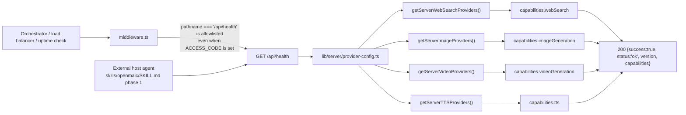
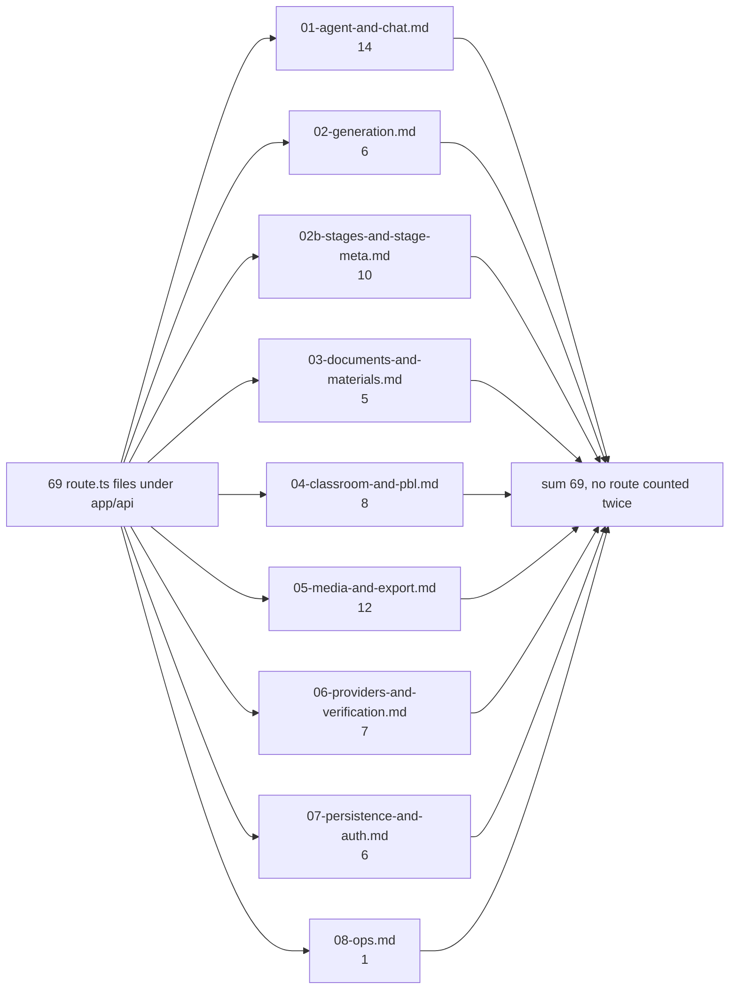

# Operational endpoints and the completeness audit

One route: `GET /api/health`. Plus the audit that proves every one of the 69
`route.ts` files under `app/api/` is documented somewhere in this topic.

**Sources:** `app/api/health/route.ts`, `middleware.ts:66`,
`lib/server/provider-config.ts`, and an enumeration of `app/api/**/route.ts`
cross-checked against the eight group files in this directory.

## `GET /api/health`

24 lines. Runtime default, no `maxDuration`, no `dynamic`. One of exactly three
paths the access-code middleware allowlists (`middleware.ts:66`), and the only
one of those three that is not part of the access-code flow — so it is the
liveness probe a container orchestrator or a reverse proxy can call without a
cookie.

```json
{
  "success": true,
  "status": "ok",
  "version": "<npm_package_version or 0.1.0>",
  "capabilities": {
    "webSearch": false,
    "imageGeneration": false,
    "videoGeneration": false,
    "tts": false
  }
}
```

| Field | Derivation |
| --- | --- |
| `status` | the literal `'ok'` — reaching the handler *is* the liveness signal (`:13`) |
| `version` | `process.env.npm_package_version \|\| '0.1.0'`, read **once at module load** (`:9`) |
| `capabilities.webSearch` | `Object.values(getServerWebSearchProviders()).some(info => !info.disabled)` (`:18`) |
| `capabilities.imageGeneration` | same over `getServerImageProviders()` (`:19`) |
| `capabilities.videoGeneration` | same over `getServerVideoProviders()` (`:20`) |
| `capabilities.tts` | same over `getServerTTSProviders()` (`:21`) |

A capability is `true` only when at least one provider is *enabled*.
Force-disabled providers (`disabled: true`) do not count — the comment at
`:16-17` ties this to the same server-precedence rule the `generate/*` and
`verify-*` routes enforce.

This route has **no** database check, no filesystem check, and no render-service
check. It cannot fail except by the process being dead or `provider-config`
throwing (which would surface as an unhandled 500, since there is no try/catch).



`skills/openmaic/SKILL.md` uses this endpoint as its capability probe before
driving a deployment over HTTP — the health response is the contract an outside
agent reads to decide whether TTS and image generation are worth requesting.

### The other two liveness surfaces are not here

| Surface | Where |
| --- | --- |
| Is the durable agent runtime usable? | `GET /api/agent/runtime` → `{enabled, runtimeEnabled}`, see [`01-agent-and-chat.md`](./01-agent-and-chat.md) |
| Is the render service usable? | `GET /api/export-video/capability` → `{enabled}`, which additionally probes the service's own `/health` with a 3 s timeout, see [`05-media-and-export.md`](./05-media-and-export.md) |

Neither is middleware-allowlisted, so both require the access-code cookie when
`ACCESS_CODE` is set.

## Completeness audit

Enumerated with `git ls-files 'app/api' | grep 'route.ts$'` → **69 files**.
Every file appears in exactly one group file below.



| # | Handler file (under `app/api/`) | Documented in |
| --- | --- | --- |
| 1 | `access-code/status/route.ts` | [`07`](./07-persistence-and-auth.md) |
| 2 | `access-code/verify/route.ts` | [`07`](./07-persistence-and-auth.md) |
| 3 | `agent/owner-events/route.ts` | [`01`](./01-agent-and-chat.md) |
| 4 | `agent/runtime/route.ts` | [`01`](./01-agent-and-chat.md) |
| 5 | `agent/sessions/[id]/cancel/route.ts` | [`01`](./01-agent-and-chat.md) |
| 6 | `agent/sessions/[id]/events/route.ts` | [`01`](./01-agent-and-chat.md) |
| 7 | `agent/sessions/[id]/messages/route.ts` | [`01`](./01-agent-and-chat.md) |
| 8 | `agent/sessions/[id]/route.ts` | [`01`](./01-agent-and-chat.md) |
| 9 | `agent/sessions/route.ts` | [`01`](./01-agent-and-chat.md) |
| 10 | `agent/sessions/status/route.ts` | [`01`](./01-agent-and-chat.md) |
| 11 | `agent/skills/[id]/route.ts` | [`01`](./01-agent-and-chat.md) |
| 12 | `agent/skills/route.ts` | [`01`](./01-agent-and-chat.md) |
| 13 | `azure-voices/route.ts` | [`05`](./05-media-and-export.md) |
| 14 | `chat/pi/route.ts` | [`01`](./01-agent-and-chat.md) |
| 15 | `chat/pi/whiteboard-visibility/route.ts` | [`01`](./01-agent-and-chat.md) |
| 16 | `chat/route.ts` | [`01`](./01-agent-and-chat.md) |
| 17 | `classroom-media/[classroomId]/[...path]/route.ts` | [`04`](./04-classroom-and-pbl.md) |
| 18 | `classroom/route.ts` | [`04`](./04-classroom-and-pbl.md) |
| 19 | `comfyui-workflows/route.ts` | [`05`](./05-media-and-export.md) |
| 20 | `export-video/capability/route.ts` | [`05`](./05-media-and-export.md) |
| 21 | `export-video/render/[jobId]/download/route.ts` | [`05`](./05-media-and-export.md) |
| 22 | `export-video/render/[jobId]/route.ts` | [`05`](./05-media-and-export.md) |
| 23 | `export-video/render/route.ts` | [`05`](./05-media-and-export.md) |
| 24 | `extract-document/route.ts` | [`03`](./03-documents-and-materials.md) |
| 25 | `folders/[id]/route.ts` | [`07`](./07-persistence-and-auth.md) |
| 26 | `folders/members/route.ts` | [`07`](./07-persistence-and-auth.md) |
| 27 | `folders/route.ts` | [`07`](./07-persistence-and-auth.md) |
| 28 | `generate-classroom/[jobId]/route.ts` | [`02`](./02-generation.md) |
| 29 | `generate-classroom/route.ts` | [`02`](./02-generation.md) |
| 30 | `generate/agent-profiles/route.ts` | [`02`](./02-generation.md) |
| 31 | `generate/image/route.ts` | [`05`](./05-media-and-export.md) |
| 32 | `generate/scene-actions/route.ts` | [`02`](./02-generation.md) |
| 33 | `generate/scene-content/route.ts` | [`02`](./02-generation.md) |
| 34 | `generate/scene-outlines-stream/route.ts` | [`02`](./02-generation.md) |
| 35 | `generate/tts/route.ts` | [`05`](./05-media-and-export.md) |
| 36 | `generate/video/route.ts` | [`05`](./05-media-and-export.md) |
| 37 | `generate/voice/route.ts` | [`05`](./05-media-and-export.md) |
| 38 | `health/route.ts` | **this file** |
| 39 | `materials/[id]/route.ts` | [`03`](./03-documents-and-materials.md) |
| 40 | `materials/route.ts` | [`03`](./03-documents-and-materials.md) |
| 41 | `parse-pdf/route.ts` | [`03`](./03-documents-and-materials.md) |
| 42 | `pbl/v2/evaluate/route.ts` | [`04`](./04-classroom-and-pbl.md) |
| 43 | `pbl/v2/instructor/route.ts` | [`04`](./04-classroom-and-pbl.md) |
| 44 | `pbl/v2/open-task/route.ts` | [`04`](./04-classroom-and-pbl.md) |
| 45 | `pbl/v2/simulator/route.ts` | [`04`](./04-classroom-and-pbl.md) |
| 46 | `pbl/v2/task/update/route.ts` | [`04`](./04-classroom-and-pbl.md) |
| 47 | `persistence/[...path]/route.ts` | [`07`](./07-persistence-and-auth.md) |
| 48 | `provider/probe-models/route.ts` | [`06`](./06-providers-and-verification.md) |
| 49 | `proxy-media/route.ts` | [`05`](./05-media-and-export.md) |
| 50 | `quiz-grade/route.ts` | [`04`](./04-classroom-and-pbl.md) |
| 51 | `server-providers/route.ts` | [`06`](./06-providers-and-verification.md) |
| 52 | `skills/[id]/route.ts` | [`01`](./01-agent-and-chat.md) |
| 53 | `stage-meta/[stageId]/route.ts` | [`02b`](./02b-stages-and-stage-meta.md) |
| 54 | `stages/[id]/freshness/route.ts` | [`02b`](./02b-stages-and-stage-meta.md) |
| 55 | `stages/[id]/generation-complete/route.ts` | [`02b`](./02b-stages-and-stage-meta.md) |
| 56 | `stages/[id]/manifest/route.ts` | [`02b`](./02b-stages-and-stage-meta.md) |
| 57 | `stages/[id]/publish/route.ts` | [`02b`](./02b-stages-and-stage-meta.md) |
| 58 | `stages/[id]/route.ts` | [`02b`](./02b-stages-and-stage-meta.md) |
| 59 | `stages/[id]/scenes/route.ts` | [`02b`](./02b-stages-and-stage-meta.md) |
| 60 | `stages/[id]/status/route.ts` | [`02b`](./02b-stages-and-stage-meta.md) |
| 61 | `stages/[id]/unpublish/route.ts` | [`02b`](./02b-stages-and-stage-meta.md) |
| 62 | `stages/route.ts` | [`02b`](./02b-stages-and-stage-meta.md) |
| 63 | `transcription/route.ts` | [`03`](./03-documents-and-materials.md) |
| 64 | `usage/route.ts` | [`06`](./06-providers-and-verification.md) |
| 65 | `verify-image-provider/route.ts` | [`06`](./06-providers-and-verification.md) |
| 66 | `verify-model/route.ts` | [`06`](./06-providers-and-verification.md) |
| 67 | `verify-pdf-provider/route.ts` | [`06`](./06-providers-and-verification.md) |
| 68 | `verify-video-provider/route.ts` | [`06`](./06-providers-and-verification.md) |
| 69 | `web-search/route.ts` | [`05`](./05-media-and-export.md) |

### Things deliberately excluded

| Excluded | Reason |
| --- | --- |
| `lib/api/*` (9 files, `stage-api*.ts`) | not HTTP. An in-process stage-store toolkit for AI agents (`createStageAPI(stageStore)`, `lib/api/stage-api.ts`); imported by no route file. |
| `middleware.ts` | not a route. Documented as the auth gate in [`07`](./07-persistence-and-auth.md) and [`09`](./09-conventions.md). |
| `render-service/src/main.ts` routes | a separate container with its own HTTP surface (`POST /render`, `GET`/`DELETE /render/:id`, `GET /render/:id/download`, `GET /health`). Reached only through `export-video/**`; see [`../09-media-and-export/index.md`](../09-media-and-export/index.md) and [`../17-deployment-view/index.md`](../17-deployment-view/index.md). |
| The six non-API page routes (`/`, `/generation-preview`, `/classroom/[id]`, `/workspace`, `/workbench/new`, `/eval/whiteboard`) | pages, not endpoints; see [`../03-app-and-api/index.md`](../03-app-and-api/index.md). |

### How to re-run this audit

```bash
git ls-files 'app/api' | grep 'route.ts$' | wc -l          # expect 69
git ls-files 'app/api' | grep 'route.ts$' | xargs wc -l    # expect 9435 total
```

Then diff the file list against the 69-row table above. Any new row must be added
to a group file *and* to that table; the count in
[`00-all-routes.md`](./00-all-routes.md) and in
[`index.md`](./index.md) must move with it.

Next: [`09-conventions.md`](./09-conventions.md).
