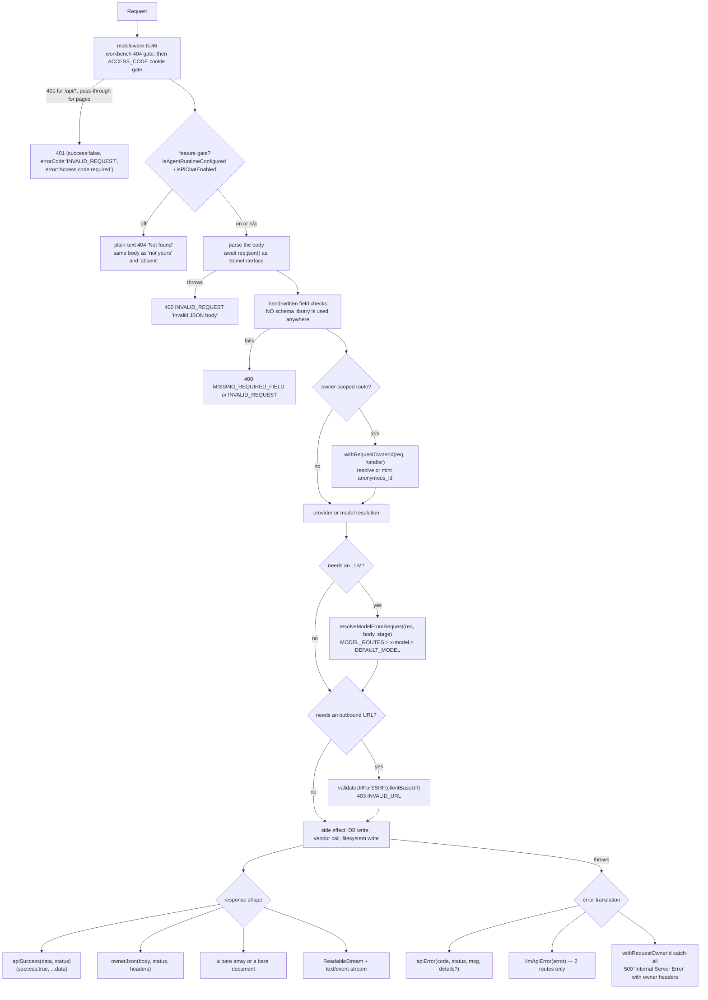
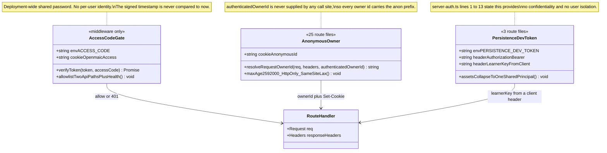
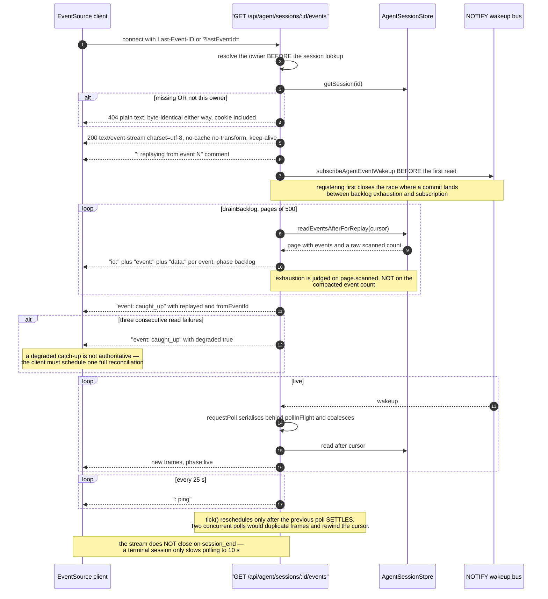

# Cross-cutting API conventions

What holds across all 69 route files, and where it does not. Read this before
adding a route: five error envelopes, three unrelated identity mechanisms, seven
SSE frame formats, no versioning, no idempotency keys, and zero rate limiting are
all deliberate-or-accidental facts you will inherit.

**Sources:** `lib/server/api-response.ts`,
`lib/server/agent-runtime/{owner,with-owner,route-response}.ts`,
`lib/server/{resolve-model,model-routes,ssrf-guard,capped-stream,http-range,llm-error-response}.ts`,
`lib/pbl/v2/api/sse.ts`, `middleware.ts`, `package.json`, and a scan of all 69
route files; evidence
[`../appendix/research/api-surface/02a-interfaces-envelope-identity-model.md`](../appendix/research/api-surface/02a-interfaces-envelope-identity-model.md),
[`../appendix/research/api-surface/02b-interfaces-egress-body-sse.md`](../appendix/research/api-surface/02b-interfaces-egress-body-sse.md).

## The conventional handler

Note the ordering rule that recurs in ten handlers across nine route files: **body validation runs before
`withRequestOwnerId`.** A malformed request must not mint an anonymous cookie
partition for a request that will not proceed
(`app/api/agent/sessions/route.ts:49-92`, `app/api/stages/route.ts:53-79`,
`app/api/folders/route.ts:72-99`).

## Error envelopes: five shapes

| Shape | Where | Files |
| --- | --- | --- |
| `{success:false, errorCode, error, details?}` | `apiError` / `ownerApiError` (`lib/server/api-response.ts:51`) | 45 route files (48 import `api-response`; `health`, `export-video/capability` and `access-code/status` use only `apiSuccess`) |
| `text/plain` body `"Not found"` with 404 | `ownerNotFound` plus every feature-gate 404 | 25 route files |
| `{error:{code, message}}` | `folders/**`, `persistence/[...path]` | 4 route files |
| `{error:'snake_case'}` | `stages/[id]/{status,publish,unpublish,generation-complete}`, `stage-meta/[stageId]` | 5 route files |
| `{error:'<code>', message}` and `{error:'Title Case'}` | `agent/skills` POST (`:87-97`); `classroom-media` (`:48`, `:54`, `:70`) | 2 route files |

Plus bare bodies with no envelope at all: `GET /api/agent/sessions` returns an
array (`:194`), `GET /api/agent/sessions/status` a plain map (`:18`),
`GET /api/stages/[id]` the raw document (`:73`), `GET /api/comfyui-workflows`
`{workflows}` with no `success` field (`:18`).

`apiSuccess` spreads the payload **next to** `success:true` — there is no `data`
wrapper, so a payload field named `success` would collide by design
(`lib/server/api-response.ts:68-69`).

`API_ERROR_CODES` has 36 entries (`:3-40`), a mix of generic (`INVALID_REQUEST`,
`UPSTREAM_ERROR`) and vendor-specific (`QWEN_VC_AUDIO_TOO_LARGE`,
`VOXCPM_AUTO_VOICE_REQUIRES_CONTEXT`).

A generic client cannot key on one error shape. The plain-text 404 is intentional
(`route-response.ts:36-40`); the `{error:{code,message}}` and
`{error:'snake_case'}` shapes exist only because those routes were ported from a
reference implementation (`app/api/folders/route.ts:46`,
`app/api/stages/[id]/status/route.ts:9`).

## Validation

**There is no schema validation anywhere in `app/api/**`.** `zod` is a direct
dependency at `^4.3.5` (`package.json`) and a scan of all 69 route files finds
zero references to it. Every route does
`await req.json() as SomeDeclaredInterface` and then hand-checks the fields it
cares about. The declared interfaces are compile-time only.

Quality of the hand-written checks varies enormously:

| Level | Example |
| --- | --- |
| exact-shape rejection of unknown keys | `chat/pi/whiteboard-visibility`'s `validBody` uses `Reflect.ownKeys` against a 3-key allowlist (`:11-29`) — the strictest validator in the surface |
| field-by-field allowlist copy | `generate-classroom` copies 11 named fields, never a spread (`:19-36`) |
| typed decode helpers | `decodeCourseRefs`, `decodeElementRefs`, `resolveSlideElementReference` return `{ok, error}` unions |
| bounded list checks | `materialIds` string-array + dedupe + `<= 20` + no blanks (`agent/sessions/route.ts:70-79`) |
| driver-hazard filtering | `stages/[id]/scenes` drops ids containing `\0` or a lone surrogate (`:41-59`) |
| generic-message discipline | `extract-document`'s JSON form never echoes the offending value (`:524-529`) |
| none | `usage`'s `?months=` is split on commas with no format check (`:73-74`) |

Two hardening habits worth copying:

- **Never echo caller input in an error when a static message will do.**
  `extract-document` maintains two message sets for exactly this reason
  (`:642-652`).
- **Sanitise before logging.** `sanitizeLogValue` strips CR/LF
  (`extract-document/route.ts:657-659`). It is the only log-injection defence in
  the surface; every other route interpolates caller strings into log lines
  unchanged.

## Identity: three mechanisms that do not compose

`withRequestOwnerId` guarantees the minted `Set-Cookie` rides **every** response
including the catch-all 500 (`with-owner.ts:18-23`). The reason is written down:
a 500 that dropped the cookie would silently make the client's retry a different
anonymous owner. Three routes call `resolveRequestOwnerId` directly because they
build streaming responses and cannot use the wrapper —
`agent/owner-events` (`:49`), `agent/sessions/[id]/events` (`:77`),
`stages/[id]/freshness` (`:50`).

## Model resolution

One helper, 13 routes. Precedence is `MODEL_ROUTES[stage]` > `x-model` header >
`DEFAULT_MODEL`, and the helper **refuses to invent a model** — it throws when
nothing resolves (`lib/server/resolve-model.ts:66-70`).

| Rule | Line |
| --- | --- |
| Headers read: `x-model`, `x-api-key`, `x-base-url`, `x-provider-type` | `resolve-model.ts:168-172` |
| Body read: `thinkingConfig` or legacy `thinking` | `:148-153` |
| A **routed** stage discards the client's key, base URL and provider type | `:56-81` |
| Provider-type mismatch against the registry throws | `:89-97` |
| `bedrock` requires server management | `:101-103` |
| SSRF on a client base URL: **`NODE_ENV === 'production'` only** | `:105-110` |
| Closed stage vocabulary: `LLM_STAGES`, 20 members, with composite keys falling back to their base | `lib/server/model-routes.ts:131-152` |

## Streaming

Ten routes stream SSE. Only four share a typed contract.

| Route | Frames | Named events | Heartbeat | `X-Accel-Buffering` |
| --- | --- | --- | --- | --- |
| `pbl/v2/{instructor,open-task,evaluate,simulator}` | `event:` + `data:` via `encodeEvent` | 7 typed kinds in `PBLSSEEvent` | `: keepalive` / 15 s | **`no`** |
| `chat` | `data:` only | none — the type is inside the JSON | `:heartbeat` / 15 s | — |
| `chat/pi` | `data:` only | none | `:heartbeat` / 15 s | — |
| `generate/scene-outlines-stream` | `data:` only | none | `:heartbeat` / 15 s | — |
| `agent/sessions/[id]/events` | `id:` + `event:` + `data:` | `caught_up` + every store event type | `: ping` / 25 s | — |
| `agent/owner-events` | `id:` + `event:` + `data:` | `caught_up`, `resync_required`, `owner_moved` | `: ping` / 25 s | — |
| `stages/[id]/freshness` | `retry:` then `event:` + `data:` | `stage_freshness` | `: ping` / 25 s | — |

Only the two `id:`-emitting streams (`agent/sessions/[id]/events`,
`agent/owner-events`) are resumable with a native `EventSource` and
`Last-Event-ID`. `stages/[id]/freshness` emits no `id:` and reads no cursor at all
(`app/api/stages/[id]/freshness/route.ts:106-112`) — a reconnect simply re-emits
the current `rev`, which is all a pure-optimisation stream needs. The three
`data:`-only streams require an `onmessage` handler plus a discriminator read out
of the JSON.

Plus two byte streams (`classroom-media` with Range support,
`export-video/render/[jobId]/download`) and one streamed request body
(`export-video/render`, forwarded with `duplex: 'half'`).

### The durable-stream protocol, traced

## Idempotency

There is no idempotency-key mechanism anywhere. What exists instead:

| Route | Idempotent? | How |
| --- | --- | --- |
| `DELETE /api/stages/[id]` | yes | always `{ok:true}`, no 404 (`:186-187`) |
| `DELETE /api/export-video/render/[jobId]` | yes | upstream 404 treated as success (`:49-52`) |
| `POST /api/stages/[id]/publish` | yes | already-public returns 200 with the existing `publishedAt` (`:41-46`) |
| `POST /api/folders/members` with `folderId: null` | yes | an absent membership already means unfiled (`:8-9`) |
| `POST /api/generate/voice` | yes, via a ladder | `voiceExists` → no-op; cached clip → re-register; else bootstrap (`:170-231`) |
| `POST /api/materials` | **no** | a retry creates a second material; the only protection is the 24-hour stale-upload reclaim |
| `POST /api/agent/sessions` | **no** | a retry creates a second session |
| `POST /api/agent/sessions/[id]/messages` | **no** | a retry posts a second turn |
| `POST /api/classroom` | **no** | a retry writes a second bundle unless `stage.id` is supplied |
| every `generate/*` | **no** | a retry spends a second LLM call |

`x-request-id` is accepted by exactly one route (`POST /api/materials`) and is
used for **log correlation only**, not deduplication (`:95-98`).

## Versioning

None, except one literal path segment.

| Fact | Detail |
| --- | --- |
| No version prefix | there is no `/api/v1`. The only version in a path is `app/api/pbl/v2/**`, and no `v1` exists beside it. |
| No `Accept` negotiation | no route reads `Accept` |
| No deprecation headers | no route emits `Sunset`, `Deprecation`, or a `Warning` header |
| Document versioning is in the payload, not the URL | `@openmaic/dsl` carries `dslVersion` (0.3.0) and `runtimeDslVersion` (0.1.0); `DocumentVersionError` surfaces as `400 'document was written by a newer client; reload before saving'` (`stages/[id]/route.ts:48-57`) |
| The routes *are* the contract | no OpenAPI document, no generated client |

## Size limits

| Limit | Value | Source | Enforced on |
| --- | --- | --- | --- |
| Next proxy client body | 200 MB | `next.config.ts:36` (`experimental.proxyClientMaxBodySize`) | **every** request body, before any handler runs |
| `MAX_SESSION_TEXT_LENGTH` | 100 000 chars | `lib/server/agent-runtime/limits.ts:9` | `prompt`, `text` |
| `STAGE_NAME_MAX_LENGTH` | 120 chars | `lib/server/agent-runtime/stage-limits.ts:9` | stage `name` |
| Folder name | display width ≤ 40 (full-width = 2) | `lib/utils/folder-name-validation.ts` | folder `name` |
| `materialIds` per request | 20 | `agent/sessions/route.ts:77` | array length |
| `MAX_MATERIAL_LIST_LIMIT` | 200 | `materials/route.ts:77` | `?limit=` |
| `MAX_BATCH_SCENE_IDS` | 200 | `stages/[id]/scenes/route.ts:33` | `?ids=` count |
| `MAX_EXTRACT_DOCUMENT_FILE_SIZE_BYTES` | 50 MiB | `lib/constants/generation.ts:16` | declared size *and* recorded asset length |
| `maxUploadBytes` / `maxDocumentBytes` | 50 MiB each, env-overridable | `lib/server/agent-runtime/config.ts:46-48` | **streamed bytes** via `readMeteredBody` |
| `maxMaterialsPerOwner` / `maxMaterialBytesPerOwner` | 100 / 2 GiB | `config.ts:50-55` | per-owner quota → **429** |
| Skill upload | 1 048 576 bytes | `agent/skills/route.ts:63` | buffered length → 413 |
| `MAX_PROXY_BYTES` | 25 MiB | `proxy-media/route.ts:67` | `content-length` *and* blob size |
| `MAX_UPLOAD_BYTES` (render) | 300 MiB | `export-video/render/route.ts:18` | **streamed bytes** via `capBodyStream` |
| `MAX_OUTLINE_STREAM_BYTES` | 512 KiB | `scene-outlines-stream/route.ts:486` | accumulated LLM output |
| `SEARCH_QUERY_REWRITE_EXCERPT_LENGTH` | see `lib/web-search` | `web-search/route.ts:123` | `pdfText` |
| Filename | 512 chars after `basename` | `materials/route.ts:91` | `x-material-filename` |

**The global 200 MB ceiling sits *below* the per-route maximum.** `next.config.ts`
sets `proxyClientMaxBodySize: '200mb'` for every request, so on a proxied or Vercel
deployment the 300 MiB `MAX_UPLOAD_BYTES` that `export-video/render` advertises is
unreachable — the proxy rejects the upload first. The two numbers were set
independently; see
[`../15-cross-cutting/04-threat-secrets-and-uploads.md`](../15-cross-cutting/04-threat-secrets-and-uploads.md)
for the full ladder.

**Two upload routes have no cap at all**: `parse-pdf` and `transcription` both
materialise the whole body.

## Timeouts

| Mechanism | Values |
| --- | --- |
| `export const maxDuration` | 24 routes: 30, 60, 120, 300. Advisory — self-hosted `next start` ignores it; it feeds Vercel's build adapter (`agent/sessions/[id]/events/route.ts:44-46`) |
| Internal route deadline | `generate/voice`: `ROUTE_DEADLINE_MS` 29 000 with a 5 000 ms lookup slice (`:40-41`) |
| Vision resolution budget | `scene-content`: 15 000 ms aggregate plus a 3-consecutive-failure fuse (`:49-57`) |
| Upstream fetch timeouts | render poll/cancel 15 000 ms; MP4 **header-only** 30 000 ms; render submit 300 000 ms; MinerU/self-hosted probes 10 000 ms; render-service health 3 000 ms |
| SSE poll cadence | 5 000 ms (session events, freshness), 10 000 ms terminal, 30 000 ms owner-events |
| SSE heartbeat | 15 000 ms (`chat`, `chat/pi`, outlines, PBL), 25 000 ms (agent streams, freshness) |
| Client-abort propagation | `req.signal` threaded into `streamLLM`, `callLLM`, the PBL generators, and `createSSEResponse` |

## What is missing on purpose, and what is missing by accident

| Gap | Assessment |
| --- | --- |
| **Zero rate limiting** in `app/api/**` | accident. The closest thing is `x-openmaic-client` forwarded to the render service, and the per-owner material quota. Every LLM, image, video and TTS route is a cost primitive with no per-caller ceiling. Whether it is also *unauthenticated* depends on deployment: `middleware.ts:60-61` returns `NextResponse.next()` before the cookie check when `ACCESS_CODE` is unset, which is the default, so an unconfigured deployment exposes them to any caller; with `ACCESS_CODE` set they sit behind the 401, and the cost ceiling is still absent. |
| No `Retry-After` header anywhere | accident; `429 RATE_LIMITED` is returned by `generate/tts` and `export-video/render` without one. |
| `ALLOW_LOCAL_NETWORKS` as one global SSRF off-switch | deliberate dev affordance with a wide blast radius: one env var disables the hostname and private-address checks at all 20 `validateUrlForSSRF` call sites, in 16 modules — the 13 route files below plus `lib/server/resolve-model.ts` and the two agent-runtime redirect loops (`ssrf-guard.ts:266-269`). |
| SSRF strictness differs between siblings | accident, in both directions. Unconditional (6 sites): `azure-voices:29`, `generate/tts:98`, `generate/voice:126`, `provider/probe-models:34`, and `proxy-media:33`/`:55` (initial URL and every redirect hop). Production-only (12 sites): `generate/image:71`, `generate/video:66`, `parse-pdf:48`, `transcription:58`, `extract-document:259`/`:387`, `verify-image-provider:58`, `verify-video-provider:53`, `verify-pdf-provider:59`/`:84`/`:133`, and `lib/server/resolve-model.ts:106`. The two non-route sites — `agent-runtime/generate-image.ts:111`, `generate-video.ts:155` — are unconditional. |
| The access-code token never expires server-side | accident. Neither verifier compares the signed timestamp to now. |
| Plain-text 404 for "off", "not yours" and "absent" | deliberate, stated at `route-response.ts:36-40`. |
| No OpenAPI artifact | deliberate by omission; this topic is the substitute. |
| No CORS headers on any route | consistent with a same-origin-only client. `next.config.ts` sets `X-Frame-Options` and CSP `frame-ancestors` only. |

## If you are adding a route

1. Declare `export const runtime = 'nodejs'` if you touch PostgreSQL, `node:fs`,
   or `node:crypto`. Do not declare `'edge'`; nothing in the repo does.
2. Gate on `isAgentRuntimeConfigured()` and return a **plain-text** 404 if the
   route reads the durable store.
3. Validate the body **before** entering `withRequestOwnerId`.
4. Use `apiError`/`apiSuccess` unless you are extending `folders/**` or the
   `stage_meta` family; do not invent a sixth envelope.
5. Use `ownerNotFound(headers)` for both "missing" and "not yours".
6. Route any caller-influenced URL through `validateUrlForSSRF`, and prefer
   unconditional over production-only.
7. Bound the body on **real bytes** (`capBodyStream` or a metered reader), not on
   `Content-Length`.
8. If you stream, emit `id:` and `event:` fields so `EventSource` can resume, and
   heartbeat at 25 s or less.
9. Pick an `LlmStage` key and add it to `LLM_STAGES` so an operator can pin the
   model.

## Open questions

- Whether the missing rate limiting is tracked anywhere (an issue, a roadmap
  entry) could not be determined from the repo.
- `SEARCH_QUERY_REWRITE_EXCERPT_LENGTH`'s numeric value lives in
  `lib/web-search` and was not read for this reference.
- `next.config.ts` sets response headers globally; whether any of them apply to
  `/api/*` responses (as opposed to page responses) was not verified from the
  route layer.

Back to [`index.md`](./index.md).
