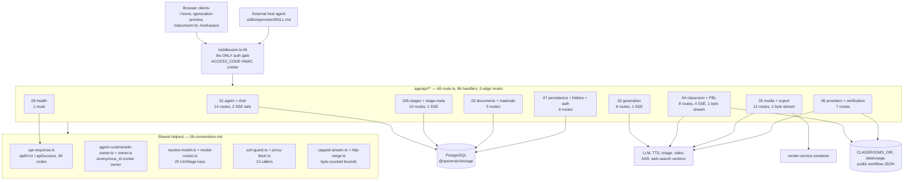

# API Reference: every HTTP endpoint

OpenMAIC exposes exactly one HTTP surface: the Next.js App Router route-handler
tree under `app/api/`. This topic documents **all 69 `route.ts` files and all 86
exported method handlers** — path, methods, runtime, streaming, gating, request
shape, response shape, error shapes, side effects, and limits.

Enumeration is the contract here. There is no OpenAPI document, no generated
client, and no version prefix anywhere except the literal path segment
`app/api/pbl/v2/**`. The route files *are* the specification.

**Sources:** `app/api/**/route.ts` (69 files, 9435 lines, measured with
`git ls-files 'app/api' | grep 'route.ts$' | xargs wc -l`), `middleware.ts`,
`lib/server/api-response.ts`, `lib/server/agent-runtime/{owner,with-owner,route-response}.ts`,
`lib/server/{resolve-model,model-routes,ssrf-guard,proxy-fetch,capped-stream,http-range,llm-error-response,stage-access,render-service,web-search-config}.ts`,
`lib/config/feature-flags.ts`, `lib/pbl/v2/api/sse.ts`,
`lib/persistence/server-auth.ts`; evidence pack
[`../appendix/research/api-surface/`](../appendix/research/api-surface/00-overview.md).

## Topic overview

## Who this is for

A staff engineer who needs to call, change, or audit an endpoint. Read
[`09-conventions.md`](./09-conventions.md) first if you are about to *add* a
route — it is the only place the cross-cutting rules (five error envelopes, three
identity mechanisms, seven SSE frame formats) are written down. Read
[`00-all-routes.md`](./00-all-routes.md) first if you are looking for one
endpoint.

## Ground facts that apply to the whole surface

| Fact | Evidence |
| --- | --- |
| 69 route files, 86 handlers: 31 `GET`, 44 `POST`, 2 `PUT`, 4 `PATCH`, 5 `DELETE` | enumeration in [`00-all-routes.md`](./00-all-routes.md) |
| **No route declares `runtime = 'edge'`.** 29 declare `'nodejs'`, 40 declare nothing (Node.js by default for App Router handlers) | per-file scan, [`00-all-routes.md`](./00-all-routes.md) |
| One auth gate fences the API surface, in `middleware.ts:60-85`. **No route file behind that gate re-checks it** — but the token has a second verifier, used by an allowlisted route: `access-code/status/route.ts:13` calls `verifyAccessToken` (`lib/server/access-token.ts:11`) precisely *because* the middleware skipped it | `middleware.ts:66` allowlists only `/api/access-code/*` and `/api/health`; the gate is itself conditional — `middleware.ts:60-61` returns early when `ACCESS_CODE` is unset |
| Zero rate limiting in `app/api/**`. The only quota-ish controls are per-owner material quotas and a client-identity header forwarded to the render service | [`09-conventions.md`](./09-conventions.md) |
| Validation is 100 % hand-written. `zod` is a direct dependency at `^4.3.5` and **no route file references it** | scan of all 69 files; [`09-conventions.md`](./09-conventions.md) |
| 10 routes emit `text/event-stream` (6 hand-rolled, 4 via `createSSEResponse`); 2 more stream bytes; 1 forwards a streamed request body | [`00-all-routes.md`](./00-all-routes.md) |
| Five distinct error-envelope shapes, plus bare-JSON responses with no envelope | [`09-conventions.md`](./09-conventions.md) |

## Section files

| File | Covers | Routes |
| --- | --- | --- |
| [`00-all-routes.md`](./00-all-routes.md) | The complete enumeration: one row per handler with path, method, runtime, gate, streaming, purpose, handler file | all 69 |
| [`01-agent-and-chat.md`](./01-agent-and-chat.md) | `agent/**` durable-session control plane, both SSE tails, `chat/**` in-class runtime, `skills/[id]` zip download | 14 |
| [`02-generation.md`](./02-generation.md) | `generate/{agent-profiles,scene-outlines-stream,scene-content,scene-actions}` and the `generate-classroom` job pair | 6 |
| [`02b-stages-and-stage-meta.md`](./02b-stages-and-stage-meta.md) | Owner-scoped course documents: `stages/**` (9 files) plus the `stage-meta/[stageId]` tenancy sidecar | 10 |
| [`03-documents-and-materials.md`](./03-documents-and-materials.md) | `extract-document`, `parse-pdf`, `materials` + `materials/[id]`, `transcription` | 5 |
| [`04-classroom-and-pbl.md`](./04-classroom-and-pbl.md) | `classroom`, `classroom-media/**` byte serving, the five `pbl/v2/**` routes, `quiz-grade` | 8 |
| [`05-media-and-export.md`](./05-media-and-export.md) | `generate/{tts,voice,image,video}`, `export-video/**` (4), `proxy-media`, `azure-voices`, `comfyui-workflows`, `web-search` | 12 |
| [`06-providers-and-verification.md`](./06-providers-and-verification.md) | `provider/probe-models`, `server-providers`, `verify-model`, `verify-{image,video,pdf}-provider`, `usage` | 7 |
| [`07-persistence-and-auth.md`](./07-persistence-and-auth.md) | `persistence/[...path]` catch-all, `folders/**` (3), `access-code/**` (2) | 6 |
| [`08-ops.md`](./08-ops.md) | `health`, plus the completeness audit proving every one of the 69 files is documented | 1 + audit |
| [`09-conventions.md`](./09-conventions.md) | Cross-cutting: error envelopes, validation posture, streaming protocol, idempotency, versioning, size/timeout limits | — |

Route-to-file assignment is exhaustive and non-overlapping; the audit table in
[`08-ops.md`](./08-ops.md) is the proof.

## Related topics

- [`../03-app-and-api/index.md`](../03-app-and-api/index.md) — the component view
  of the API layer: why the helpers are shaped the way they are.
- [`../11-data-flows/index.md`](../11-data-flows/index.md) — end-to-end flows
  that chain these endpoints.
- [`../05-agent-runtime/index.md`](../05-agent-runtime/index.md) — what happens
  behind `agent/**` after a session is claimed.
- [`../06-generation-pipeline/index.md`](../06-generation-pipeline/index.md) —
  what the `generate/**` routes delegate to.
- [`../15-cross-cutting/index.md`](../15-cross-cutting/index.md) — SSRF, secrets,
  logging, and the access-code posture in wider context.
- [`../README.md`](../README.md) — the documentation set root: how the seventeen
  topics relate, the reading paths, and the C4 / 4+1 model this reference sits in.
- [`../glossary.md`](../glossary.md) — the canonical vocabulary. Read the `stage`
  entry before the route tables: `LlmStage` in a request header selects a *model*,
  not a document.
- [`../18-decisions/02-no-schema-layer-at-the-http-edge.md`](../18-decisions/02-no-schema-layer-at-the-http-edge.md)
  — why these 86 handlers validate by hand, and why enumeration is the contract.
- [`../../README.md`](../../README.md) — the *project* README, one level further
  up: setup, env vars, Docker. A different document from the set root above.
