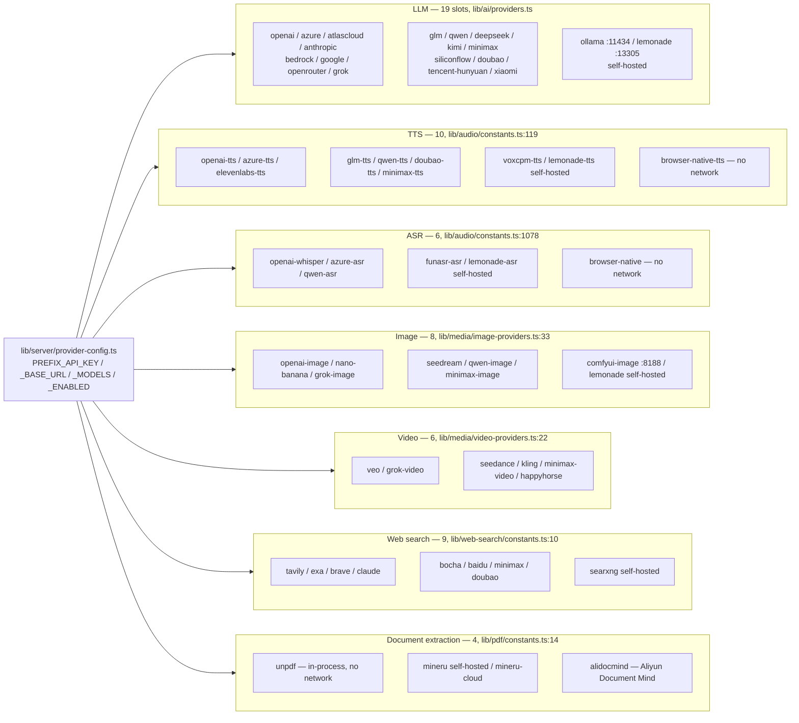
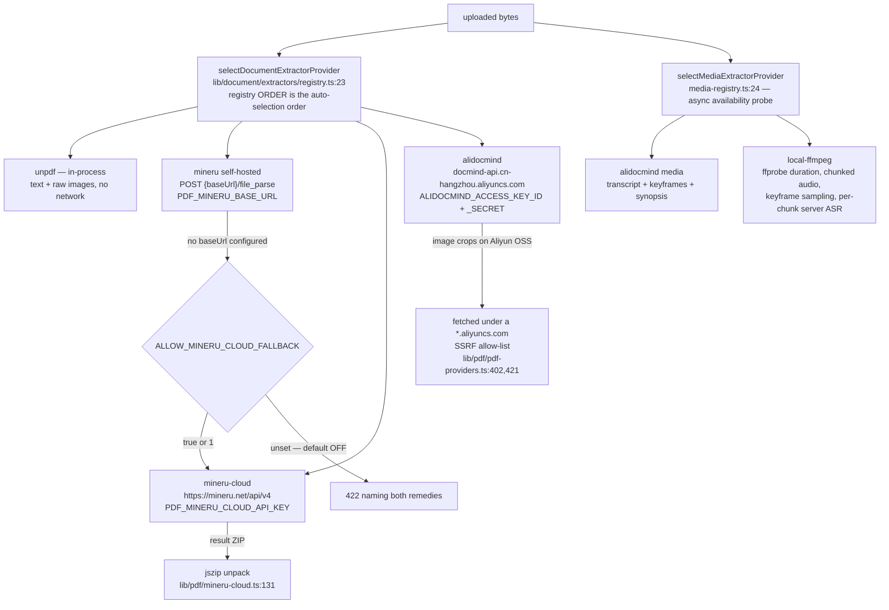
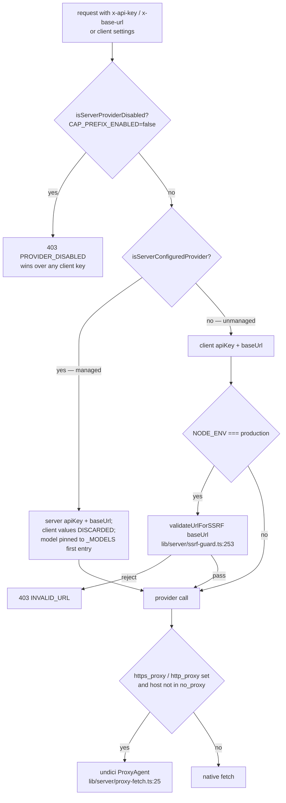
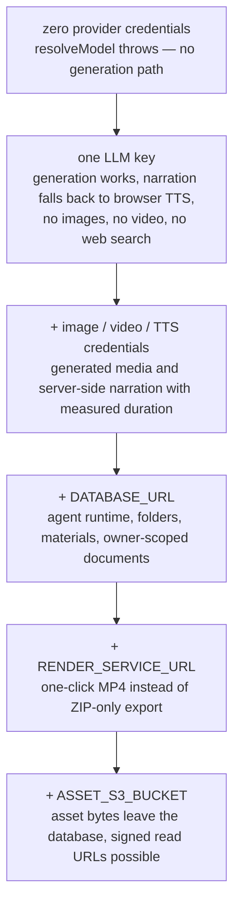

# External Services

Every network dependency OpenMAIC can reach: LLM gateways, speech, image and
video generation, web search, document extraction, object storage, and the two
first-party services (render service, PostgreSQL). For each: the adapter file,
the environment variables that light it up, whether it is required, and what
degrades without it.

**Sources:** `lib/ai/providers.ts`, `lib/server/provider-config.ts`,
`lib/audio/constants.ts`, `lib/media/image-providers.ts`,
`lib/media/video-providers.ts`, `lib/web-search/constants.ts`,
`lib/pdf/constants.ts`, `lib/pdf/pdf-providers.ts`,
`lib/document/extractors/local-media.ts`, `lib/persistence/asset-byte-store.ts`,
`lib/server/render-service.ts`, `lib/server/agent-runtime/agent-driver-model.ts`,
`app/api/web-search/route.ts`, `app/api/azure-voices/route.ts`,
`app/api/generate/image/route.ts`. Evidence:
[ai-provider-layer/04](../appendix/research/ai-provider-layer/04-dependencies-and-config.md),
[media-audio-video/04](../appendix/research/media-audio-video/04-dependencies-and-config.md),
[generation-pipeline/04](../appendix/research/generation-pipeline/04-dependencies-and-config.md).

## Capability to provider map

Nothing in this codebase is a single-provider integration. Every capability is a
registry keyed by a provider id, and every registry entry carries
`requiresApiKey`, a `defaultBaseUrl` and an env prefix. That is why the app runs
in a Chinese-network deployment with no Western SaaS reachable, and equally in a
fully air-gapped deployment with only self-hosted backends.

Provider ids and base URLs above are read from the registry literals: LLM
`lib/ai/providers.ts:76`–`:1540`, TTS/ASR `lib/audio/constants.ts:119` and
`:1078`, image `lib/media/image-providers.ts:33`, video
`lib/media/video-providers.ts:22`, web search `lib/web-search/constants.ts:10`,
document `lib/pdf/constants.ts:14`.

## LLM providers

Nineteen provider slots, five transport SDKs. Fourteen slots go through
`createOpenAI` from `@ai-sdk/openai`; `anthropic` and `minimax` through
`createAnthropic`; `google`, `azure` and `bedrock` through their own SDKs
(`lib/ai/providers.ts:29`–`:34`).

| Slot | Default base URL | Env prefix | Note |
| --- | --- | --- | --- |
| `openai` | `https://api.openai.com/v1` | `OPENAI_` | `:80` |
| `azure` | operator-supplied | `AZURE_OPENAI_` | URL normalised in `lib/ai/azure.ts:9` |
| `atlascloud` | `https://api.atlascloud.ai/v1` | `ATLASCLOUD_` | `:231` |
| `anthropic` | `https://api.anthropic.com/v1` | `ANTHROPIC_` | `:268` |
| `bedrock` | region-resolved | `BEDROCK_` | region from `BEDROCK_REGION`/`AWS_REGION`/`AWS_DEFAULT_REGION`, else `us-east-1` (`:1775`–`:1778`) |
| `google` | `https://generativelanguage.googleapis.com/v1beta` | `GOOGLE_` | `:488` |
| `glm` | `https://open.bigmodel.cn/api/paas/v4` | `GLM_` | Zhipu; `:626` |
| `qwen` | `https://dashscope.aliyuncs.com/compatible-mode/v1` | `QWEN_` | Alibaba DashScope; `:725` |
| `deepseek` | `https://api.deepseek.com/v1` | `DEEPSEEK_` | `:892` |
| `kimi` | `https://api.moonshot.cn/v1` | `KIMI_` | Moonshot; `:935` |
| `minimax` | `https://api.minimaxi.com/anthropic/v1` | `MINIMAX_` | Anthropic-compat suffix forced at `:1755` |
| `siliconflow` | `https://api.siliconflow.cn/v1` | `SILICONFLOW_` | `:1076` |
| `doubao` | `https://ark.cn-beijing.volces.com/api/v3` | `DOUBAO_` | Volcengine Ark; `:1140` |
| `openrouter` | `https://openrouter.ai/api/v1` | `OPENROUTER_` | `:1207` |
| `grok` | `https://api.x.ai/v1` | `GROK_` | `:1232` |
| `tencent-hunyuan` | `https://tokenhub.tencentmaas.com/v1` | `TENCENT_` / `TENCENT_HUNYUAN_` | two prefixes, one id (`LLM_ENV_MAP`, `lib/server/provider-config.ts:73`) |
| `xiaomi` | `https://api.xiaomimimo.com/v1` | `XIAOMI_` / `MIMO_` | two prefixes, one id |
| `ollama` | `http://localhost:11434/v1` | `OLLAMA_` | keyless; base URL alone activates it |
| `lemonade` | `http://localhost:13305/v1` | `LEMONADE_` | keyless |

**Required?** At least one, or the app cannot generate anything. Model selection
resolves `MODEL_ROUTES` stage route → `x-model` header → `DEFAULT_MODEL`, and
throws if all three are empty (`lib/server/resolve-model.ts:65`).

**One route is a hard contract.** The durable agent runtime requires an explicit
`MODEL_ROUTES` entry for the stage `maic-agent-driver`, with a provider-prefixed
model id, no `thinking.effort`, and a pi api of `openai-completions` or
`openai-responses` (`lib/server/agent-runtime/agent-driver-model.ts:6`, `:12`,
`:14`-`:45`). That is checked because `parseModelString` silently defaults a bare
model id to the `openai` provider (`:21`-`:23`).

The enforcement is split across two moments, and the boot one is *not* fatal.
`instrumentation.ts:28`-`:29` calls `validateServerConfig()`, which is
"warn-only, cheap, and non-throwing: a broken config never prevents the server
from starting" (`lib/server/config-validation.ts:199`-`:201`); its
`assertAgentDriverRouteConfig(getStageRoute(AGENT_DRIVER_STAGE))` call sits in a
`try`/`catch` that downgrades the error to a `[config]` warning
(`:192`-`:195`). `startAgentRunner()` "only installs a timer"
(`instrumentation.ts:46`-`:47`), so the process comes up healthy. The throw
lands per session, the first time the runner resolves the driver:
`runner.ts:1262` awaits `resolveAgentDriverModel()`
(`agent-driver-model.ts:83`), which re-runs the same assertion. A misconfigured
route therefore produces a running server whose agent sessions all fail.

## Speech: TTS and ASR

One dispatch function per direction: `generateTTS(config, text)`
(`lib/audio/tts-providers.ts:207`) and the ASR equivalent. Every call runs under
`AbortSignal.any([callerSignal, timeout])` (`ttsRequestSignal`,
`lib/audio/tts-providers.ts:178`), where the timeout is
`TTS_REQUEST_TIMEOUT_MS ?? 30_000` resolved at `:152`-`:158`.

| Provider | Kind | Prefix | Notes |
| --- | --- | --- | --- |
| `openai-tts` | saas | `TTS_OPENAI_` | |
| `azure-tts` | saas | `TTS_AZURE_` | SSML wire format; voice list enumerated by `GET /api/azure-voices`, which fetches `{baseUrl}/cognitiveservices/voices/list` behind the SSRF guard with `redirect: 'manual'` (`app/api/azure-voices/route.ts:30`, `:35`) |
| `glm-tts` | saas | `TTS_GLM_` | Zhipu BigModel |
| `qwen-tts` | saas | `TTS_QWEN_` | DashScope. Model follows voice: a cloned voice forces the VC model (`resolveTTSModelForVoice`, `lib/audio/constants.ts:107`), server-overridable via `TTS_QWEN_VOICE_CLONE_MODEL` (`lib/server/provider-config.ts:786`) |
| `doubao-tts` | saas | `TTS_DOUBAO_` | Volcengine Seed-TTS; undelimited concatenated JSON, split by `lib/audio/json-stream.ts` |
| `minimax-tts` | saas | `TTS_MINIMAX_` | hex-encoded audio payload |
| `elevenlabs-tts` | saas | `TTS_ELEVENLABS_` | |
| `voxcpm-tts` | self-hosted | `TTS_VOXCPM_` | three protocols behind one dispatcher (`generateVoxCPMTTS`, `lib/audio/tts-providers.ts:362`): vLLM-Omni `/v1/audio/speech` (`:473`), Python API `/tts/upload` (`:549`), nano-vLLM `/generate` (`:590`) |
| `lemonade-tts` | self-hosted | `TTS_LEMONADE_` | |
| `browser-native-tts` | none | `TTS_BROWSER_NATIVE_` (disable only) | `speechSynthesis`; the always-available floor |
| `openai-whisper`, `azure-asr`, `qwen-asr` | saas | `ASR_OPENAI_`, `ASR_AZURE_`, `ASR_QWEN_` | |
| `funasr-asr`, `lemonade-asr` | self-hosted | `ASR_FUNASR_`, `ASR_LEMONADE_` | |
| `browser-native` | none | `ASR_BROWSER_NATIVE_` (disable only) | |

**Degradation without any server TTS:** narration falls back to
`speechSynthesis` in the browser, which produces no `AudioFileRecord` and
therefore no measured duration — the playback engine switches to a per-sentence
`onend` clock instead of an audio-duration clock, and the video exporter has no
narration audio to place. See [09-media-and-export](../09-media-and-export/index.md).

## Image, video, web search

| Capability | Providers | Prefixes |
| --- | --- | --- |
| Image | `seedream` (Volcengine Ark), `openai-image`, `qwen-image` (DashScope), `nano-banana` (Gemini), `minimax-image`, `grok-image`, `comfyui-image`, `lemonade` | `IMAGE_SEEDREAM_`, `IMAGE_OPENAI_`, `IMAGE_QWEN_IMAGE_`, `IMAGE_NANO_BANANA_`, `IMAGE_MINIMAX_`, `IMAGE_GROK_`, `IMAGE_COMFYUI_` (disable only), `IMAGE_LEMONADE_` |
| Video | `seedance`, `kling` (`api-beijing.klingai.com`), `veo`, `minimax-video`, `grok-video`, `happyhorse` (DashScope) | `VIDEO_SEEDANCE_`, `VIDEO_KLING_`, `VIDEO_VEO_`, `VIDEO_MINIMAX_`, `VIDEO_GROK_`, `VIDEO_HAPPYHORSE_` |
| Web search | `tavily`, `exa`, `bocha`, `brave`, `baidu` (`qianfan.baidubce.com`), `claude`, `minimax`, `doubao` (`open.feedcoopapi.com`), `searxng` | `TAVILY_`, `EXA_`, `BOCHA_`, `BRAVE_`, `BAIDU_`, `WEB_SEARCH_CLAUDE_`, `WEB_SEARCH_MINIMAX_`, `WEB_SEARCH_DOUBAO_`, `SEARXNG_` |

All video providers share one submit/poll loop (`runPolledTask`,
`lib/media/polled-task.ts:31`), which is why adding one is a config change plus a
response mapper rather than a new control flow.

Two web-search prefixes exist purely to avoid collisions with LLM prefixes:
`WEB_SEARCH_CLAUDE_*` (vs `ANTHROPIC_*`) and `WEB_SEARCH_DOUBAO_*` (vs the Doubao
LLM vars), noted inline at `lib/server/provider-config.ts:148` and `:151`. The
exact env key names are reflected back to the operator in the route's
`MISSING_API_KEY` message (`app/api/web-search/route.ts:196`-`:217`).

**SearXNG is operator-only.** Its base URL is accepted from `SEARXNG_BASE_URL`
and nowhere else; client-supplied settings never count as configured
(`lib/web-search/constants.ts` `isWebSearchProviderConfigured`, and the
route-level check at `app/api/web-search/route.ts:98`).

**ComfyUI sets a route budget.** Its adapter polls for up to five minutes, which
is why `app/api/generate/image/route.ts:42` declares `maxDuration = 300` — the
comment at `:37`-`:41` states the reason: a 60 s cap on a managed platform would
kill the request roughly four minutes before the adapter finishes. Workflow JSON
is user-supplied and discovered from `public/` (`lib/media/comfyui-workflows.ts`),
with three layers of filename defence in
`lib/media/adapters/comfyui-image-adapter.ts:105`.

## Document and media extraction

`unpdf` needs no credentials (`requiresApiKey: false`, `lib/pdf/constants.ts:15`)
and uses `sharp` to turn raw PDF image buffers into PNG base64
(`lib/pdf/pdf-providers.ts:141`, `:286`). It is the floor: with zero extraction
credentials the app still ingests PDFs, just without table/formula/layout
analysis.

AliDocMind is reached through the Alibaba Cloud SDK
(`@alicloud/docmind-api20220711` plus `@alicloud/openapi-client` and
`@alicloud/tea-util`, `lib/pdf/alidocmind-client.ts:12`-`:14`) and is the only
provider that handles audio/video as well as documents
(`lib/media-parse/media-parse-providers.ts:53`).

## Managed versus client-supplied credentials

The `_ENABLED` variables can only *disable*: they never activate a provider that
has no credentials (`lib/server/provider-config.ts:167`-`:174`), and they exist
only for `tts`, `asr`, `image`, `video` and `webSearch` — LLM and PDF are
excluded by design (`:162`, `DISABLE_ENV_MAPS` at `:175`).

`ALLOW_LOCAL_NETWORKS=true|1` short-circuits `validateUrlForSSRF` after its
URL-parse and http/https checks (`lib/server/ssrf-guard.ts:266`-`:269`). It is one
global switch shared by all 20 of that function's call sites, in 16 modules — the
13 guarded route files plus `lib/server/resolve-model.ts` and the two
agent-runtime redirect loops. It does not reach the strict path
(`normalizeUrlForStrictFetch` / `assertSafeIp`), which has no bypass. The switch is
what makes a self-hosted Ollama/ComfyUI/SearXNG deployment work — and
simultaneously the loosest knob in the config surface.

## Infrastructure dependencies

| Dependency | Required for | Enabling config | Without it |
| --- | --- | --- | --- |
| **PostgreSQL** | agent runtime, server persistence, folders, materials, stage-meta, agent sessions, LISTEN/NOTIFY wakeups | `DATABASE_URL` | `isAgentRuntimeConfigured()` is false (`lib/config/feature-flags.ts:23`-`:25`); 26 route files answer a byte-identical plain-text 404 at 36 guard sites covering 37 exported handlers (`grep -rl isAgentRuntimeConfigured app` and `grep -rc 'if (!isAgentRuntimeConfigured())' app`); `/api/persistence` answers `404 PERSISTENCE_NOT_CONFIGURED`; the asset collector never starts; the shutdown handler skips `pool.end()` (`instrumentation.ts:82`-`:88`). The app still runs entirely on IndexedDB. |
| **render-service** | one-click MP4 export | `RENDER_SERVICE_URL` | Export degrades to a ZIP download. Deliberately NOT SSRF-guarded, with the reasoning written out at `lib/server/render-service.ts:25`-`:35`: it is operator config pointing at an internal host, so guarding it would require globally weakening SSRF. |
| **Amazon S3** | optional asset byte layer + signed read URLs | `ASSET_S3_BUCKET`, `ASSET_BYTE_EGRESS=redirect` | Bytes live in the `asset_blobs.bytes` BYTEA column instead. Bucket name is validated eagerly (`configuredS3Bucket`, `lib/persistence/asset-byte-store.ts:51`); the AWS SDKs are optional peers reached by dynamic import, with literal trace anchors at `:19`-`:23` so the standalone build can still resolve them. |
| **HTTP(S) forward proxy** | egress from a restricted network | `https_proxy`/`HTTPS_PROXY`/`http_proxy`/`HTTP_PROXY`, `no_proxy`/`NO_PROXY` | Direct egress. Node's built-in `fetch` ignores these vars, which is the stated reason `undici`'s `ProxyAgent` is used (`lib/server/proxy-fetch.ts:15`-`:25`). |
| **Local filesystem** | classroom bundle fallback (`CLASSROOMS_DIR`), usage metering (`data/usage/*.jsonl`) | implicit | Classroom server fallback and `GET /api/usage` are unavailable. Usage writes are suppressed under `NODE_ENV=test`/`VITEST` (`lib/server/usage-storage.ts:100`). |
| **`https://file.maic.chat`** (font object storage) | the six self-hosted CJK faces PPTX-imported slides may reference | **none — the origin is hard-coded** at `packages/@openmaic/renderer/fonts.config.mjs:13` and baked into the generated `packages/@openmaic/renderer/fonts.css`, which `app/layout.tsx:5` imports globally | Those `font-family` names fall back to whatever the browser has. This is a *browser-side* egress the SSRF guard and the proxy do not see, and it is the only external origin with no configuration knob. |
| **Vercel** | deployment target | presence of `VERCEL` | `next.config.ts:4` switches `output` off `'standalone'` when `VERCEL` is set. `vercel.json:6`-`:10` grants `maxDuration: 300` to `app/api/**/*.ts` only. |
| **Docker / Compose** | self-host target | — | 4-stage `Dockerfile` on `node:22-alpine`, standalone output, `node server.js` as uid 1001 (`Dockerfile:101`-`:112`). |

## Degradation ladder

## Open questions

- `server-providers.yml` is read from `process.cwd()`
  (`lib/server/provider-config.ts:417`) but is not present in the repository, so
  its schema is only inferable from the loader. No example file ships.
- `lib/media/video-providers.ts` declares `happyhorse` against
  `https://dashscope.aliyuncs.com`, the same host as `qwen-image` and `qwen-tts`.
  Whether that is a distinct product or a DashScope-hosted model family is not
  stated in the code.
- Nothing in the repository records which providers are actually exercised in
  production; the registries are capability declarations, not a deployment
  inventory.
