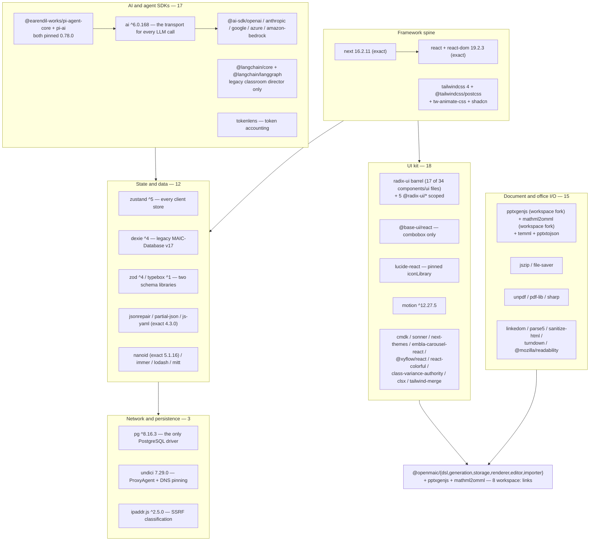
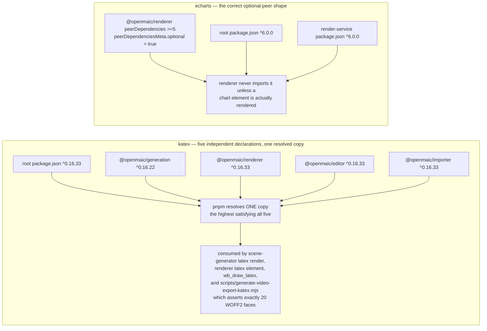

# Runtime npm Packages

The 132 entries in root `dependencies`, grouped by the role they actually play in
the code rather than by name. Heavy, duplicated and unreferenced choices are
flagged. This is a synthesis, not a transcription of `package.json`.

**Sources:** `package.json:35`-`:168` (132 entries), `render-service/package.json`,
the six `packages/@openmaic/*/package.json` manifests, plus the import sites cited
per row. Counts measured by script over `app`, `components`, `lib`, `tests`, `e2e`,
`eval`, `scripts`, `types`, `packages/@openmaic` and `render-service/src`.
Evidence: [quality-testing-ci-deps/04](../appendix/research/quality-testing-ci-deps/04-dependencies-and-config.md).

## Cluster map

## Framework spine

| Package | Range | Why it matters |
| --- | --- | --- |
| `next` | `16.2.11` exact | App Router, middleware, the `instrumentation.ts` hook, `next/font`. 62 of the 69 route files import `next/server`, 2 import `next/headers`. `middleware.ts:1` and `app/layout.tsx:1` are the other anchors. |
| `react` / `react-dom` | `19.2.3` exact | Suspense boundaries around `useSearchParams` (`app/workspace/page.tsx`), the whole provider stack in `app/layout.tsx:48`-`:59`. |
| `tailwindcss` 4 + `@tailwindcss/postcss` | `^4` | Sole PostCSS plugin (`postcss.config.mjs:3`). `app/globals.css:1`-`:16` carries five `@source` directives: four dist scans Tailwind 4's auto-detection would not find — `streamdown`, `@streamdown/code`, `@streamdown/math`, `@openmaic/renderer/dist` (`:9`-`:12`) — plus `./slide-renderer-demo/**` at `:16`, re-included because that local sandbox is gitignored and auto-detection therefore skips it (reason at `:13`-`:15`). |
| `shadcn` | `^3.6.3` | Not just a CLI: `app/globals.css:3` does `@import 'shadcn/tailwind.css'`, so it is a runtime CSS dependency. `components.json` pins `iconLibrary: "lucide"` and `style: "radix-vega"`. |
| `tw-animate-css` | `^1.4.0` | `@import` at `app/globals.css:2`. |
| `geist` | `^1.7.0` | `GeistSans`/`GeistMono` via `next/font`, applied as CSS variables on `<body>` (`app/layout.tsx:2`-`:3`, `:45`). |
| `animate.css` | `^4.1.1` | Global side-effect import at `app/layout.tsx:6`. |

### The font decision worth reading

`@fontsource-variable/inter` plus 13 `@fontsource/*` families are installed, and
the UI font is loaded from the **stylesheet**, not `next/font`
(`app/layout.tsx:29`). The 14-line comment at `app/layout.tsx:16`-`:28` explains
why: only the stylesheet carries per-subset `unicode-range` declarations. Pointing
`next/font` at `inter-latin-wght-normal.woff2` loaded exactly one subset, so
Cyrillic (ru-RU) and tone-marked Vietnamese fell back to an arbitrary OS font
mid-word — and declaring the other subsets as sibling faces without
`unicode-range` does not fall through per glyph either. Twelve of the thirteen
`@fontsource/*` families feed the slide-editor font picker
(`app/editor-fonts.ts:15`-`:39`). The thirteenth, `@fontsource/noto-sans-kr`, is
never imported: it is read through a `node_modules` path by
`scripts/generate-video-export-noto-cjk.mjs:16` to produce the offline
video-export Korean face.

### `next-themes` is installed but never mounted

`next-themes ^0.4.6` (`package.json:120`) has exactly one importer:
`components/ui/sonner.tsx:3` reads `useTheme()` from it to pick the toast
palette. The app's theme provider is first-party — `ThemeProvider` from
`lib/hooks/use-theme.tsx:15`, mounted at `app/layout.tsx:8`, `:48` — and no
`next-themes` provider is mounted anywhere, so that `useTheme()` sees no context
and the destructuring default in `sonner.tsx:14` (`{ theme = 'system' }`) always
wins. The toaster follows the OS preference rather than the app's theme state.

## AI and agent SDKs

| Package | Range | Role |
| --- | --- | --- |
| `ai` | `^6.0.168` | The actual transport. `generateText`/`streamText` behind `callLLM`/`streamLLM`; `APICallError`/`RetryError` status extraction in `lib/server/llm-error-response.ts:1`; `tool()` and `stepCountIs()` in the PBL agents. |
| `@ai-sdk/openai` | `^3.0.84` | `createOpenAI` — 14 of the 19 provider slots (`type: 'openai'` in the `PROVIDERS` literal). |
| `@ai-sdk/anthropic`, `@ai-sdk/google`, `@ai-sdk/azure`, `@ai-sdk/amazon-bedrock` | `^3`/`^4` | One slot family each (`lib/ai/providers.ts:29`-`:34`). |
| `@aws-sdk/credential-providers` | `^3.1045.0` | `fromNodeProviderChain()` for Bedrock, dynamically imported to stay out of the client bundle (`lib/ai/providers.ts:1794`). |
| `@earendil-works/pi-agent-core` | `0.78.0` **exact** | The agent loop itself: `Agent`, `Session`, `loadSkills`, compaction, `InMemorySessionRepo`. 43 source files import it, 69 including `tests/`. |
| `@earendil-works/pi-ai` | `0.78.0` **exact** | Event protocol and message types; 8 source files, 14 including `tests/`. |
| `@langchain/core` + `@langchain/langgraph` | `^1` | Only the legacy classroom director `StateGraph` (`lib/orchestration/director-graph.ts`) and its message adapter (`lib/orchestration/ai-sdk-adapter.ts`). Two files, two packages. |
| `tokenlens` | `^1.3.1` | One import site. |

Both `@earendil-works` packages are pinned exact, and the reason is written down:
`lib/agent/VENDOR.md:19`-`:21` records `0.78.0` as the baseline for a possible
future source vendoring, with a four-step fork procedure and the rule *"do not
vendor the source until you actually need to modify the loop."*

Both are also listed in `next.config.ts:serverExternalPackages` because they do
`import(specifier)` with a computed specifier that webpack cannot analyse — the
comment at `next.config.ts` states bundling them threw *"Cannot find module as
expression is too dynamic"* at runtime on the Pro-mode edit path.

## Document and office I/O

| Package | Range | Role |
| --- | --- | --- |
| `pptxgenjs` | `workspace:*` → 4.0.1 | Writes the `.pptx` package. Vendored fork — see [04-vendored-forks.md](./04-vendored-forks.md). |
| `mathml2omml` | `workspace:*` → 0.5.0 | MathML → OMML for editable PowerPoint formulas. Vendored fork, **LGPL-3.0-or-later**. |
| `temml` | `^0.13.1` | LaTeX → MathML, stage one of the pptx formula pipeline (`lib/export/latex-to-omml.ts:1`). |
| `pptxtojson` | `^1.11.0` | Declared at root and in `@openmaic/importer` — but the importer *is* a fork of it, and imports it purely for the parsed-JSON **types** (`transformParsedToSlides.ts:1`, `:34`). |
| `jszip` | `^3.10.1` | Classroom ZIP, resource pack, video-export ZIP, MinerU Cloud result unpack, skill zip parse. Also a real dependency of the pptxgenjs fork. |
| `file-saver` | `^2.0.5` | Downloads the produced Blob. |
| `unpdf` | `^1.4.0` | Built-in PDF text and raw-image extraction. |
| `sharp` | `0.35.4` exact | Raw PDF image buffers → PNG base64. Native; `pnpm.ignoredBuiltDependencies` suppresses its install script (`package.json:203`-`:207`) and `Dockerfile:32` installs the toolchain instead. |
| `pdf-lib` | `^1.17.1` | 2 import sites. |
| `docx` | `9.4.1` exact | 1 import site. |
| `linkedom` | `^0.18.13` | A DOM for the server-side pptx parse worker (`lib/server/agent-runtime/import-pptx-worker.mjs:7`), run inside a `worker_threads` worker so its globals never touch the request process. |
| `parse5`, `sanitize-html` (`2.17.0` exact), `turndown`, `@joplin/turndown-plugin-gfm`, `@mozilla/readability`, `parse-srcset`, `postcss-value-parser` | — | HTML ingest, sanitising and asset inlining. |

## Media and raster

| Package | Range | Role |
| --- | --- | --- |
| `katex` | `^0.16.33` | Server-side LaTeX render for slide `latex` elements and the `wb_draw_latex` whiteboard tool; the CSS is a global import (`app/layout.tsx:7`); the build scripts read its `dist/fonts` to vendor 20 WOFF2 faces for offline video export. |
| `echarts` | `^6.0.0` | Chart elements. **Optional peer** of `@openmaic/renderer` (`>=5`), a hard dep of the app and of `render-service`. |
| `shiki` | `^3.21.0` | Code-element highlighting. Same optional-peer shape as `echarts`. |
| `motion` | `^12.27.5` | Hero entrance, generation-step animation, `AnimatePresence` around the renderer's laser overlay, PBL workspace transitions. Machine-forbidden inside `lib/video-export/**` by ESLint. |
| `tinycolor2` | `^1.6.0` | Table sub-theme colours in the renderer, colour formatting in the pptx exporter. |
| `@napi-rs/canvas` | `^0.1.88` | **Zero first-party import sites.** Inferred: it is an optional peer of `unpdf`, declared at root so pnpm resolves it. |
| `svg-arc-to-cubic-bezier`, `svg-pathdata` | — | SVG path conversion for shape export. |
| `graphemer` | `1.4.0` exact | Grapheme segmentation; 1 import site. |

Note there is **no `gsap` runtime dependency** despite GSAP driving the exported
video composition. GSAP is a committed file — `public/vendor/gsap.min.js`, 72 927
bytes measured with `ls -la` — copied into the export ZIP so the render container
needs no CDN (`lib/video-export-app/package-zip.ts:19`, `:34`). `gsap` appears
only in `devDependencies`.

## State, schema and data

| Package | Range | Role |
| --- | --- | --- |
| `zustand` | `^5.0.10` | Every client store: settings (2 248 lines, persist v4), user profile, workbench session, stage, canvas, media generation, interactive-iframe pool, video render, agent registry. The `persist` middleware backs the two KV-persisted stores. |
| `dexie` | `^4.2.1` | The legacy browser database `MAIC-Database` (v17, 16 tables) that the document and chat cutovers migrate *from* and that backup restore stages *into*. Still live. |
| `zod` | `^4.3.5` | The `VideoTimeline` IR is authored in zod with TS types inferred from it; also the animation-descriptor schema, the PBL tool schemas and the operator model-capability schema. Notably **not** used for HTTP request validation in any of the 69 routes. |
| `typebox` | `^1.1.39` | 28 import sites: every agent tool's parameter schema, and the closed hand-written mirror of `slides.ts` the agent editor validates against. |
| `immer` | `^11.1.3` | The app-side op kernel and agent roster ops. |
| `jsonrepair` | `^3.13.2` | Repair attempt 3 of the JSON ladder, plus the action-array fallback. |
| `partial-json` | `^0.1.7` | Last-resort parse of a truncated action array, and the legacy classroom child's streaming JSON. |
| `js-yaml` | `4.3.0` exact | Parses `server-providers.yml`, reads a skill's `title` frontmatter, and parses `.github/workflows/ci.yml` in the workflow meta-tests. |
| `nanoid` | `5.1.16` exact | Ids for outlines, elements, actions, scenes, messages, generated media, classroom jobs. |
| `lodash` | `4.18.1` exact | Three functions across nine files: `isEqual` (six files — snapshot equality for conflict detection, chat/stage storage and PBL hydration), `debounce` (`components/slide-renderer/components/element/TextElement/index.tsx:4`, `ProsemirrorEditor.tsx:4`) and `uniq` (`Editor/Canvas/hooks/useSelectElement.ts:2`). |
| `mitt`, `es-module-lexer` | — | 1 import site each. |

**Two schema libraries, disjoint jobs.** `zod` owns data the app authors (the
video IR, animation descriptors); `typebox` owns data a model authors (tool
parameters, agent element patches). Neither validates an HTTP request body —
every route hand-writes its validation.

## Network and guard layer

Three packages, all load-bearing for security:

- `pg` `^8.16.3` — the only PostgreSQL driver anywhere. Injected into
  `@openmaic/storage` as `Queryable`/`WithTransaction` so no storage backend
  imports a driver (`lib/persistence/server-provider.ts:8`, `:72`). Reached from
  `instrumentation.ts` only by dynamic import, with the comment *"so the Edge
  bundle never pulls in `pg`"* at `instrumentation.ts:18`.
- `undici` `7.29.0` exact — `ProxyAgent` so server-side fetches honour
  `https_proxy`/`http_proxy`/`no_proxy` (Node's built-in `fetch` ignores them,
  `lib/server/proxy-fetch.ts:15`-`:25`), and DNS-answer pinning in the hardened
  agent fetch path.
- `ipaddr.js` `^2.5.0` — address classification inside `assertSafeIp`, including
  IPv4-mapped IPv6 unwrapping and 6to4/Teredo/ISATAP tunnel detection
  (`lib/server/ssrf-guard.ts:9`, `:35`-`:49`).

## Rich text

Eleven `prosemirror-*` packages at root **and** the same eleven in
`packages/@openmaic/editor/package.json:48`-`:58`. Both a legacy in-app editor
(`lib/prosemirror`) and the packaged one ship today, selected by
`NEXT_PUBLIC_MAIC_EDITOR_RENDERER_ENABLED`. That duplication is the main
structural debt of the editor subsystem, not a packaging accident — see
[07-dsl-renderer-editor](../07-dsl-renderer-editor/index.md).

## Declared with no first-party importer

Measured by scanning every `.ts/.tsx/.mjs/.js/.css` under the source roots for a
quoted specifier, then confirming the only remaining occurrences are
`package.json` and `pnpm-lock.yaml`:

| Entry | Field | Note |
| --- | --- | --- |
| `@copilotkit/backend`, `@copilotkit/runtime`, `copilotkit` | dependencies | CopilotKit is not imported anywhere. |
| `@modelcontextprotocol/sdk` | dependencies | No MCP client or server code in the repository. |
| `@ai-sdk/react` | dependencies | The app hand-rolls `useChatSessions` instead of the SDK's React hooks. |
| `@alicloud/credentials` | dependencies | `lib/pdf/alidocmind-client.ts:12`-`:14` uses only `docmind-api20220711`, `openapi-client`, `tea-util`. |
| `openai` | dependencies | Zero import sites. The nineteen provider slots reach OpenAI-compatible endpoints through `@ai-sdk/openai`'s `createOpenAI`; the only tree-wide occurrences of the bare string are the `type: 'openai'` / `id: 'openai'` literals in `lib/ai/providers.ts`. |
| `vue-to-react` | devDependencies | No Vue source in the repository. |

The `openai` row is the one the scan method above can get wrong: a specifier
search that does not require the `from '…'` context matches those quoted
provider-id literals and reports a phantom import site.

Five more produce no import specifier but are genuinely required: `hyperframes`
and `fontkit` are invoked as CLI/`node_modules`-path reads, `@napi-rs/canvas` is
an optional peer of `unpdf`, `@fontsource/noto-sans` /
`@fontsource/noto-sans-arabic` are read by
`scripts/generate-video-export-noto-script-fonts.mjs` through a `node_modules`
path, and `@fontsource/noto-sans-kr` is read the same way by
`scripts/generate-video-export-noto-cjk.mjs:16`, `:42` alongside
`@fontsource/noto-sans-sc`.

## Cross-manifest duplication

Fifty-seven distinct package names are declared in two or more of the ten
manifests in this repository. Most are deliberate (peer + app dep), a few are
not:

| Package | Declarations | Reading |
| --- | --- | --- |
| `katex` | root `^0.16.33`, generation `^0.16.22`, renderer/editor/importer `^0.16.33` | The generation package's floor is 11 patches behind its siblings. Compatible under caret, but the four are meant to move together — the video-export font script asserts exactly 20 WOFF2 faces (`scripts/generate-video-export-katex.mjs:36`) against whichever copy resolves. |
| `nanoid` | root `5.1.16` exact, generation/importer `^5.1.6` | Root pins, packages float. |
| `tinycolor2` | root `^1.6.0`, renderer `^1.6.0`, importer `1.6.0` exact | Importer pins where its siblings do not. |
| `echarts`, `shiki` | root dep, `render-service` dep, renderer **optional peer** | Correct shape: the renderer declares them optional (`peerDependenciesMeta.optional = true`, `packages/@openmaic/renderer/package.json:72`-`:79`), and the two applications that execute the chart/code paths supply them. |
| `motion` | root dep, `render-service` dep, renderer **required peer** `>=11` | The same three declarations, but `motion` is absent from `peerDependenciesMeta`, so it is a plain required peer: installing `@openmaic/renderer` without `motion` is an unmet-peer error, unlike `echarts`/`shiki`. Nothing in the renderer's source makes animation more mandatory than charting, so this reads as an oversight rather than a decision. |
| `react`, `react-dom` | root `19.2.3`, `render-service` `19.2.3`, renderer/editor peer `>=18` | Correct. |
| `@openmaic/dsl` | root `workspace:*`, five packages `workspace:^`, `render-service` **`0.11.0` exact from the registry** | The render service is outside the pnpm workspace, so it consumes published tarballs. It is currently pinned to dsl `0.11.0` and renderer `0.1.4` while the workspace copies are `0.11.1` and `0.1.6`. Nothing in CI compares the two. |

The two shapes that duplication takes, side by side:

The `echarts`/`shiki` shape is what the `katex` case is not: the package
that *needs* the dependency declares it optional, and each application that
actually executes the code path supplies it. `katex` is a hard dependency of four
packages that all resolve to one copy, so the lowest floor among them
(`^0.16.22`) silently governs what a consumer installing only
`@openmaic/generation` receives.

## Open questions

- Whether the eight unimported manifest entries are abandoned experiments or
  planned work is not recorded anywhere. Removing them is a ~4 MB install-size
  question and a supply-chain-surface question, not a functional one.
- `render-service`'s registry pins (`@openmaic/dsl@0.11.0`,
  `@openmaic/renderer@0.1.4`) drift silently from the workspace versions. No gate
  compares them, and the DSL format-version rule
  ([05-published-packages.md](./05-published-packages.md)) does not reach across
  the workspace boundary.
- `katex ^0.16.22` in `@openmaic/generation` versus `^0.16.33` elsewhere: no
  comment explains the older floor.
