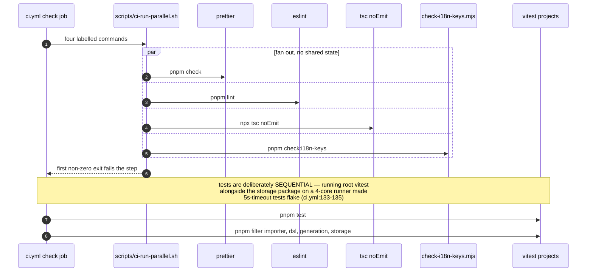

# Dev and Build Packages

The 32 root `devDependencies` plus the per-package dev trees, mapped to the stage
of the development loop each one gates. The pattern to notice: several are pinned
exact because their *output bytes* are compared, not because their API is fragile.

**Sources:** [`package.json:169`](package.json#L169)-[`:202`](package.json#L202), the six `packages/@openmaic/*/package.json`
manifests, `render-service/package.json`, `eslint.config.mjs` (670 lines),
`.prettierrc`, `tsconfig.json`, `tsconfig.build.json`, `vitest.config.ts`,
`playwright.config.ts`, `scripts/*.mjs`, `.github/workflows/ci.yml`. Evidence:
[quality-testing-ci-deps/01b](docs/appendix/research/quality-testing-ci-deps/01b-modules-ci-and-build.md),
[quality-testing-ci-deps/04](docs/appendix/research/quality-testing-ci-deps/04-dependencies-and-config.md).

## Tool to dev-loop stage

```mermaid
flowchart LR
  subgraph INSTALL["1. Install"]
    PNPM["pnpm 10.28.0<br/>packageManager with sha512 integrity"]
    RU["rollup + @rollup/plugin-commonjs<br/>+ @rollup/plugin-node-resolve<br/>+ rollup-plugin-typescript2 (fork only)"]
    TSJ["ts-json-schema-generator ~2.4.0<br/>dsl schema codegen"]
    FK["fontkit 2.0.4 + 2 pinned @fontsource<br/>video-export font assets"]
  end
  subgraph EDIT["2. Edit"]
    TS["typescript ^5 — strict:true"]
    TYPES["9 @types/* packages"]
  end
  subgraph GATE["3. Gate — pnpm check / lint / tsc / i18n"]
    PR["prettier 3.8.1 exact"]
    ES["eslint ^9 + eslint-config-next 16.2.11 exact"]
    I18["scripts/check-i18n-keys.mjs"]
    SEM["semver 7.8.5 exact"]
  end
  subgraph TEST["4. Test"]
    VT["vitest ^4.1.8 — 8 projects<br/>from 9 config files"]
    PG["@electric-sql/pglite ^0.3.16"]
    FI["fake-indexeddb ^6.2.5"]
    PGD["pg — read pg_stat from outside the test process"]
    PW["@playwright/test ^1.58.2"]
    HF["hyperframes 0.7.60 exact — CLI lint"]
  end
  subgraph BUILD["5. Build and release"]
    TW["tailwindcss ^4 + @tailwindcss/postcss"]
    TSX["tsx ^4.21.0 — 6 eval harnesses + render-service"]
    SMOKE["scripts/smoke-test-package-tarballs.mjs"]
  end
  INSTALL --> EDIT --> GATE --> TEST --> BUILD
```

## Static gates

| Package | Range | Gate | Notes |
| --- | --- | --- | --- |
| `typescript` | `^5` | `npx tsc --noEmit` | `strict: true` ([`tsconfig.json:7`](tsconfig.json#L7)). Six `tsc` invocations across CI: the root `--noEmit` in the parallel linter fan ([`ci.yml:130`](.github/workflows/ci.yml#L130)), `@openmaic/generation run typecheck` and `@openmaic/storage run typecheck` — **each of which is two invocations**, `tsconfig.json` then `tsconfig.test.json` — and `npm run typecheck` in the render-service job ([`ci.yml:216`](.github/workflows/ci.yml#L216)). `next build` uses `tsconfig.build.json` instead of `tsconfig.json` when `NODE_ENV=production` (`next.config.ts`). |
| `eslint` | `^9` | `pnpm lint` | `eslint.config.mjs` is 670 lines and 16 entries in the exported `defineConfig([…])` array: 14 object blocks plus the two spreads `...nextVitals`/`...nextTs` (`:27`-`:28`). Nine of the objects are path-scoped architectural boundary walls expressed as `no-restricted-imports`/`no-restricted-syntax` allowlists (`:97`, `:122`, `:146`, `:195`, `:254`, `:348`, `:419`, `:498`, `:539`) — the purity fence around `lib/video-export/**` is three of them; the last two blocks (`:608`, `:650`) are global `**/*`. `AI_SDK_DYNAMIC_IMPORT_BAN` is spread into five of the ten blocks that set `no-restricted-syntax` (`:102`, `:127`, `:151`, `:203`, `:561`) plus the global block's direct use at `:665`; `lib/choreography` and `lib/video-export/**` deliberately omit it because they ban *every* `ImportExpression` outright, which subsumes it — stated at `:648`-`:649`. It must be re-spread rather than inherited because flat config **replaces** rule options per key rather than merging them. |
| `eslint-config-next` | `16.2.11` **exact** | same | Pinned to the same version as `next`, so the config cannot drift from the framework it is describing. |
| `prettier` | `3.8.1` **exact** | `pnpm check` (`prettier . --check`) | Exact because Prettier rewrites the tree: a minor bump reformats files and turns every open PR red. Config: 100 columns, single quotes, trailing commas everywhere, LF (`.prettierrc`). |
| `semver` | `7.8.5` **exact** | `pnpm check:node-engine`, `.github/scripts/check-clawhub-version.mjs` | [`scripts/check-node-engine-contract.mjs:4`](scripts/check-node-engine-contract.mjs#L4) uses `semver.minVersion` to prove the root `engines.node` floor is not below any direct production dependency's. Also installed globally in the skill-publish workflow. |
| `js-yaml` | `4.3.0` **exact** (a runtime dep) | workflow meta-tests | `tests/workflows/*.test.ts` parse `.github/workflows/ci.yml` and assert on its structure, so the workflow itself is under test. |

The four linters run in parallel through `scripts/ci-run-parallel.sh` because
sequentially they took roughly two minutes and ESLint alone is now the bound
([`.github/workflows/ci.yml:125`](.github/workflows/ci.yml#L125)-[`:131`](.github/workflows/ci.yml#L131), with the reason in the step comment).

## Test tooling

| Package | Range | What it enables |
| --- | --- | --- |
| `vitest` | `^4.1.8` | Eight test projects from nine config files: the root (`vitest.config.ts`, a single project whose include is exactly `tests/**/*.test.ts`), one per `@openmaic` package, and `render-service`. The ninth file is the dead `vitest.eval.config.ts` below. |
| `@playwright/test` | `^1.58.2` | E2E against `http://localhost:3002`, one Chromium project, `retries: 2` in CI. Also drives `/eval/whiteboard` for layout-regression screenshots (`eval/whiteboard-layout/capture.ts`). Browsers are cached by `actions/cache` and installed with `playwright install chromium`. |
| `@electric-sql/pglite` | `^0.3.16` | In-process PostgreSQL for storage tests that do not need a real server. Declared at root *and* in `packages/@openmaic/storage/package.json`. |
| `fake-indexeddb` | `^6.2.5` | IndexedDB shim in the storage test setup. Works because [`lib/document-store/store.ts:47`](lib/document-store/store.ts#L47)-[`:50`](lib/document-store/store.ts#L50) probes the *capability* rather than sniffing the environment, so an injected fake is indistinguishable from a real browser. |
| `pg` | `^8.16.3` (a runtime dep) | [`scripts/assert-pg-contract-suites.mjs:138`](scripts/assert-pg-contract-suites.mjs#L138) reaches it via `createRequire` from the storage package to read `pg_stat` `n_tup_ins` deltas **from outside** the Vitest process — the only way to prove a contract suite actually inserted rows, because everything under `test/` is an ignored publishable input. |
| `hyperframes` | `0.7.60` **exact** | CLI lint over seven materialised video-export samples in the e2e job. Exact because the check string-matches its output: version 0.7.60 reports warning-only lint with exit status **zero**, so [`ci.yml:307`](.github/workflows/ci.yml#L307) additionally greps for the literal `0 errors, 0 warnings`. |
| `jsdom` + `@testing-library/{react,dom,jest-dom}` | per package | Component tests in `renderer` and `editor` only. |
| `ajv` | `^8.17.1` (dsl devDep) | Compiles the three generated JSON Schema artifacts in `packages/@openmaic/dsl/test/schema.test.ts`. |

## Build tooling

| Package | Range | Consumer |
| --- | --- | --- |
| `rollup` | `^4.35.0` | Bundles `renderer`, `editor`, `importer` and both vendored forks. Not used for the Next.js app. |
| `@rollup/plugin-node-resolve`, `@rollup/plugin-commonjs` | `^16`, `^28` | Declared at root **for the vendored forks**, whose own configs import them ([`packages/pptxgenjs/rollup.config.mjs:2`](packages/pptxgenjs/rollup.config.mjs#L2)-[`:3`](packages/pptxgenjs/rollup.config.mjs#L3), [`packages/mathml2omml/rollup.config.js:1`](packages/mathml2omml/rollup.config.js#L1)). The `@openmaic` packages declare their own copies. |
| `rollup-plugin-typescript2` | `^0.36.0` | Only [`packages/pptxgenjs/rollup.config.mjs:4`](packages/pptxgenjs/rollup.config.mjs#L4). Kept at root because the fork's config is upstream's. |
| `rollup-plugin-preserve-directives` | per package | `renderer` and `editor` need it because 23 renderer files and 38 editor files carry `'use client'`, and Next.js needs those directives to survive bundling. |
| `ts-json-schema-generator` | `~2.4.0` (dsl devDep) | [`packages/@openmaic/dsl/scripts/gen-schema.mjs:5`](packages/@openmaic/dsl/scripts/gen-schema.mjs#L5) emits `dist/schema/{stage,scene,action}.schema.json` at build time. Build-only **so the DSL keeps zero runtime dependencies** — that is the stated reason. |
| `tsx` | `^4.21.0` | Runs all six eval harness entry points ([`package.json:28`](package.json#L28)-[`:33`](package.json#L33): four `runner.ts` plus the two extra orchestration runners, `answering-runner.ts` and `answer-content-runner.ts`) and, in the render container, the service itself: `render-service` has no build step and `tsx` is a production dependency there. |
| `tailwindcss` + `@tailwindcss/postcss` | `^4` | The whole CSS pipeline; `postcss.config.mjs` declares exactly one plugin. |
| `fontkit` | `2.0.4` **exact** | [`scripts/generate-video-export-noto-script-fonts.mjs:4`](scripts/generate-video-export-noto-script-fonts.mjs#L4) (`openSync`) — reads font tables to subset the Noto script fonts. Pinned because its output bytes land in a committed asset. |
| `@fontsource/noto-sans`, `@fontsource/noto-sans-arabic` | `5.3.0` **exact** | Read through a `node_modules` path, not an import, by the same script. Same reason for pinning. |
| `tslib` | `^2.8.0` | TypeScript helper emit for the rollup builds. |

### Per-package build commands

| Package | Build | Emits |
| --- | --- | --- |
| `dsl` | `rmSync(dist) && tsc -p tsconfig.json && node scripts/gen-schema.mjs` | `dist/*.js`, `dist/*.d.ts`, three JSON Schemas |
| `generation` | `rmSync(dist) && tsc -p tsconfig.json` | `dist/` (templates/snippets ship as files, not compiled) |
| `storage` | `rmSync(dist) && tsc -p tsconfig.json` | `dist/` with 16 subpath exports |
| `renderer` | `generate-fonts-css.mjs && generate-katex-fonts.mjs && rmSync(dist) && rollup -c && tsc --emitDeclarationOnly --declarationDir dist` | `dist/`, plus **tracked, publishable** `fonts.css` and a KaTeX font snapshot |
| `editor` | `rmSync(dist) && rollup -c && tsc --emitDeclarationOnly --declarationDir dist` | `dist/{core,react,ui}` |
| `importer` | `rmSync(dist) && rollup -c && tsc --emitDeclarationOnly` | `dist/index.js`, `dist/index.cjs`, `dist/index.d.ts` |
| `pptxgenjs` (fork) | `rollup -c --bundleConfigAsCjs` | `dist/pptxgen.{es,cjs}.js` |
| `mathml2omml` (fork) | `rollup -c` + a `node -e` copy of `src/index.d.ts` | `dist/index.{js,cjs,d.ts}` |

Every `@openmaic` package also declares `prepublishOnly: pnpm run build`, so a
manual `npm publish` cannot ship a stale `dist`.

**The renderer's build writes tracked files.** That is why both [`ci.yml:107`](.github/workflows/ci.yml#L107)-[`:121`](.github/workflows/ci.yml#L121)
and [`publish-packages.yml:143`](.github/workflows/publish-packages.yml#L143)-[`:157`](.github/workflows/publish-packages.yml#L157) diff the working tree against `$GITHUB_SHA`
after install+build: a stale committed `fonts.css` becomes a PR failure rather
than a release that ships content absent from the commit.

## Undeclared and unconsumed

Two asymmetries worth knowing before you debug a CI failure:

- **`@openmaic/renderer` runs `vitest run` but does not declare `vitest`.** Its
  `devDependencies` are the rollup plugins, `@testing-library/*`, `@types/*`,
  `jsdom`, `rollup`, `rollup-plugin-preserve-directives`, `tslib` and
  `typescript` — no `vitest`. It resolves from the workspace root
  ([`package.json:200`](package.json#L200)). Every other `@openmaic` package declares its own.
- **Root `gsap` `^3.15.0` has no first-party consumer.** No file under `scripts`,
  `tests`, `lib` or `app` imports the `gsap` package; the exported composition
  uses the committed `public/vendor/gsap.min.js` instead
  ([`tests/video-export/e2e-materialize.test.ts:404`](tests/video-export/e2e-materialize.test.ts#L404) reads that path). Together
  with `vue-to-react`, that is two devDependencies with no reference in the tree.

`@openmaic/importer` also carries a large Babel dev tree
(`@babel/core`, `preset-env`, `plugin-transform-runtime`, `runtime`,
`@rollup/plugin-babel`, `@rollup/plugin-terser`, `rollup-plugin-node-builtins`,
`rollup-plugin-node-globals`) inherited from the `pptxtojson` fork it descends
from. Inferred: none of it is needed by the current rollup config, but nothing
asserts that.

## The one dead config

`vitest.eval.config.ts` exists, includes `tests/**/*.eval.test.ts`, matches **zero
files**, and is referenced by no script, workflow or document. Nothing runs it and
nothing would notice if it were deleted.

## Open questions

- **No coverage provider is installed anywhere.** Nine Vitest config files (eight
  live projects), zero
  `coverage` blocks, no `@vitest/coverage-*` dependency. Coverage is therefore
  unknowable, and the 80 % target in the contributing rules is unmeasurable as
  the repository stands.
- `e2e/` (2 698 lines) is excluded from both `tsconfig.json` and `eslint.config.mjs`
  and there is no `tsc` step covering it, so Playwright specs are neither
  type-checked nor linted.
- Five contract suites silently skip in every CI job: four app-level
  `*.pg.test.ts` and one `*.s3.test.ts` whose env vars (`S3_CONTRACT_*`) are set
  nowhere under `.github/`.

See [16-development-view](docs/16-development-view/index.md) for the CI job graph
these tools sit inside, and [14-code-quality](docs/14-code-quality/index.md) for
what the gates actually catch.
