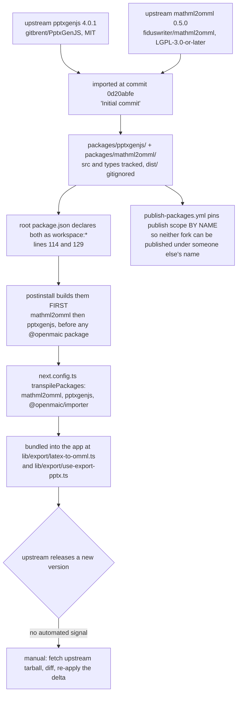
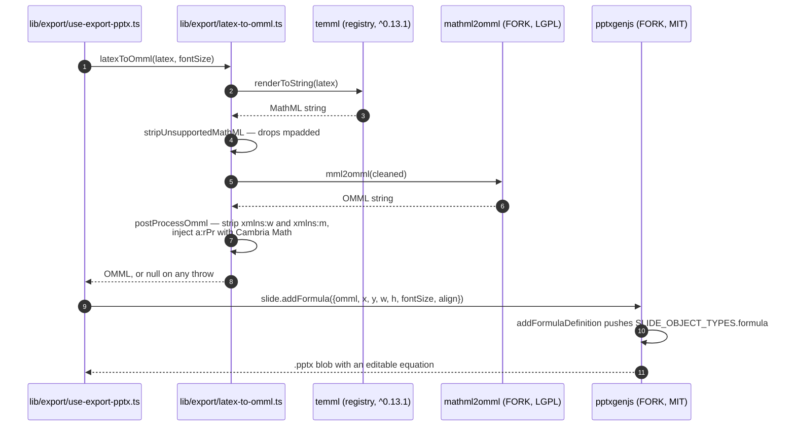

# Vendored Forks

Two upstream npm packages live in-tree under `packages/` and are consumed as
`workspace:*` instead of from the registry: `pptxgenjs` and `mathml2omml`. Both
exist for the same feature — editable PowerPoint formulas. This file covers what
each fork changes, how divergence is managed, and the three *other* vendorings in
the repository that are not npm forks.

**Sources:** `packages/pptxgenjs/`, `packages/mathml2omml/`,
`lib/export/latex-to-omml.ts`, `lib/export/use-export-pptx.ts`,
`lib/agent/VENDOR.md`, `lib/edit/html-edit.ts`,
`scripts/sync-maic-importer.mjs`, `scripts/assert-vendor-maic-importer.mjs`,
`next.config.ts`, `.github/workflows/publish-packages.yml`, `git log`. Evidence:
[dsl-renderer-editor/04](docs/appendix/research/dsl-renderer-editor/04-dependencies-and-config.md).

## Vendor lifecycle



There is no automated drift signal. No Dependabot config, no Renovate config, no
`.npmrc`, no licence or advisory scanner — verified by absence
(`ls .npmrc .github/dependabot.yml .github/renovate.json renovate.json` finds
nothing). Nothing tells you upstream has moved.

## `packages/pptxgenjs` — fork of 4.0.1

Upstream: `gitbrent/PptxGenJS`, MIT, [`package.json:10`](packages/pptxgenjs/package.json#L10), repository field at
`:68`-`:71`. Version `4.0.1` (`:3`) — the fork does not renumber, so the workspace
version reads exactly like the upstream release it descends from.

**Why forked:** upstream has no primitive for Office Math. The fork adds one, so
exported `.pptx` decks carry *editable* formulas instead of rasterised images.

**The delta**, six source files plus the hand-maintained declaration file:

| File | Line | Addition |
| --- | --- | --- |
| `src/core-enums.ts` | 743 | `'formula' = 'formula'` added to `SLIDE_OBJECT_TYPES` |
| `src/core-interfaces.ts` | 609-630 | the `FormulaProps` interface (`omml`, `fontSize`, `color`, `align`, plus `PositionProps`/`ObjectNameProps`) |
| `src/core-interfaces.ts` | 1708-1709 | `formula?: string` and `formulaAlign?: 'left' \| 'center' \| 'right'` on `ISlideObject` |
| `src/gen-objects.ts` | 669 | `addFormulaDefinition(target, opts)` — pushes the slide object, auto-names it `Formula N` |
| `src/slide.ts` | 253 | `addFormula(options)` — the public API surface |
| `src/gen-xml.ts` | 692-715 | the `SLIDE_OBJECT_TYPES.formula` case: maps `formulaAlign` to OOXML `centerGroup`/`left`/`right` and emits the OMML payload verbatim at `:715` |
| `types/index.d.ts` | 1443, 2664 | `FormulaProps` and the `addFormula` method signature |

**How divergence is managed: it is not, structurally.** The fork arrived in the
repository's *initial commit*, so the delta is not recoverable from this
repository's history — `git log -- packages/pptxgenjs` shows four commits and none
of them is the formula work:

| Commit | Touches |
| --- | --- |
| `0d20abfe` | initial import (fork already carries the formula code) |
| `1b5d2114` | comment typos |
| `e613b757` | one line each in `src/gen-media.ts` and `src/pptxgen.ts` |
| `c0b7ea23` | ESM import for `typescript` in the rollup config (hence `rollup.config.mjs`) |

Recovering the delta means fetching `pptxgenjs@4.0.1` from the registry and
diffing. Nothing in the repo automates or records that.

**No `LICENSE` file.** `packages/pptxgenjs/` contains only `src/`, `types/`,
`.gitignore`, `package.json`, `rollup.config.mjs`, `tsconfig.json`. The MIT
declaration lives in `package.json` and nowhere else — see
[07-licences.md](docs/13-dependencies/07-licences.md).

## `packages/mathml2omml` — fork of 0.5.0

Upstream: `fiduswriter/mathml2omml`, author Johannes Wilm,
**`LGPL-3.0-or-later`** ([`package.json:26`](packages/mathml2omml/package.json#L26)), with the full LGPL text present as
`LICENSE` (7.5 KB).

**Why forked:** one upstream bug, fixed in commit `a3f88d53`, one character wide:

```
- textContainerNames.includes[arr[level].name] &&
+ textContainerNames.includes(arr[level].name) &&
```

[`src/parse-stringify/parse.js:82`](packages/mathml2omml/src/parse-stringify/parse.js#L82). The commit message states the consequence
precisely: indexing the `includes` function always yields `undefined`, so the
"trailing text node" branch never ran and trailing text inside a MathML text
container (`mtext`/`mi`/`mn`/`mo`/`ms`) was silently dropped from the OMML. Line 48
of the same file already used the correct call form. The message also notes that
`dist/` is gitignored and rebuilt by `postinstall`, so the runtime bundle picks the
fix up on install.

One further local commit, `a58618a7`, replaced a Unix `cp` in the build script
with a `node -e` `copyFileSync` for cross-platform builds — visible in
[`package.json:14`](packages/mathml2omml/package.json#L14).

Total local divergence from upstream 0.5.0: **one character in one source file,
plus one build-script line.** This is the cheapest possible fork, and it is the
one carrying the copyleft licence.

## What both forks are for



`latexToOmml` returns `null` on any failure and logs a warning
([`lib/export/latex-to-omml.ts:77`](lib/export/latex-to-omml.ts#L77)-[`:80`](lib/export/latex-to-omml.ts#L80)) — a formula that will not convert
degrades rather than failing the export. The Cambria Math `<a:rPr>` injection at
`:25`-`:33` is a PowerPoint requirement, not a MathML one; `xmlns:w` is stripped
because it is DOCX-only and invalid in PPTX (`:37`).

## The guard scripts, and what they do NOT cover

| Guard | Covers | Does it cover the forks? |
| --- | --- | --- |
| `scripts/openmaic-packages.mjs` `assertPackageListIsComplete()` | disk vs `OPENMAIC_PACKAGES` vs `publish-packages.yml` enumerations, as exact sets | **No.** It reads `packages/@openmaic` only (`PACKAGES_DIRECTORY`, `:47`). The two forks live one level up, in `packages/`. |
| `scripts/check-package-version-bumps.mjs` | version increases on changed publishable inputs; the DSL format-version caret-escape rule | **No.** Iterates `OPENMAIC_PACKAGES`. |
| `scripts/check-internal-dependency-ranges.mjs` | `workspace:^` shape for owned packages | **No.** Same list. |
| `scripts/smoke-test-package-tarballs.mjs` | six `@openmaic` tarballs install and import in a clean consumer | **No.** |
| `publish-packages.yml` | publishes six packages by name | **Protects by exclusion:** the workflow pins its publish scope by name precisely because these two names are not ours ([`publish-packages.yml:5`](.github/workflows/publish-packages.yml#L5)-[`:7`](.github/workflows/publish-packages.yml#L7)). |
| [`ci.yml:107`](.github/workflows/ci.yml#L107)-[`:121`](.github/workflows/ci.yml#L121) "Verify the install did not rewrite tracked package files" | tracked files under `packages/@openmaic` changed by install/build — the diff is pathspec-limited (`git --no-replace-objects diff --quiet "$GITHUB_SHA" -- packages/@openmaic`, [`:115`](.github/workflows/ci.yml#L115)) | **No.** The forks live one level up, in `packages/`, so a `postinstall` that rewrote `packages/pptxgenjs/src/**` or `packages/mathml2omml/src/**` passes this step. Only the release job's equivalent is tree-wide ([`publish-packages.yml:151`](.github/workflows/publish-packages.yml#L151), no pathspec) — and that runs after merge. |
| `next.config.ts` `transpilePackages` | both forks are transpiled by Next rather than consumed as prebuilt ESM | — |

So: **no gate versions, validates or diff-checks either fork.** They are checked
by the same thing that checks the app — the type-checker and the export
round-trip tests (`tests/edit/round-trip/geometry.test.ts` reads an exported
`.pptx` back through `jszip`).

## Three other vendorings that are not npm forks

### 1. `@openmaic/importer` — a fork of `pptxtojson` that became a package

`packages/@openmaic/importer` (22 133 LOC, the largest module in the repo) is a
fork of `pptxtojson` carrying the entire PPTX → DSL transform. It still declares
`pptxtojson ^1.11.0` as a dependency, imported purely for the parsed-JSON
**types** — `ParsedPptxJson` at
[`src/import-pipeline/transformParsedToSlides.ts:34`](packages/@openmaic/importer/src/import-pipeline/transformParsedToSlides.ts#L34) is
`Awaited<ReturnType<typeof parsePptxDefault>>`.

Unlike the two `packages/` forks, this one is renumbered (`0.1.3`), published to
npm, and covered by every gate in [05-published-packages.md](docs/13-dependencies/05-published-packages.md).

Its transitive `pdfjs-dist` pin (`4.8.69`, exact) is the reason for the whole
static-asset dance: `pdfjs-dist`'s dynamic `require()` patterns are rejected
outright by Turbopack as *"Module not found: Can't resolve <dynamic>"*, so
[`scripts/sync-maic-importer.mjs:1`](scripts/sync-maic-importer.mjs#L1)-[`:10`](scripts/sync-maic-importer.mjs#L10) copies `dist/` into
`public/vendor/maic-importer/` and the app URL-imports it at runtime
([`lib/import/use-import-pptx.ts:62`](lib/import/use-import-pptx.ts#L62)), bypassing the bundler entirely while
keeping types from the workspace package. `scripts/assert-vendor-maic-importer.mjs`
fails `pnpm build` if the bundle is missing or empty — the comment at `:6`-`:11`
explains the failure mode it prevents: a 404 HTML page parsed as JavaScript,
surfacing as an opaque `SyntaxError`.

### 2. `lib/edit/html-edit.ts` — a source copy from the pi coding agent

Exact-text (`str_replace`) edit application, copied from
`@earendil-works/pi-coding-agent`'s `dist/core/tools/edit-diff.ts`. The header at
[`lib/edit/html-edit.ts:1`](lib/edit/html-edit.ts#L1)-[`:19`](lib/edit/html-edit.ts#L19) states why it is a copy rather than an import:
that package only exports its root index (the apply core is internal), and pulling
the `edit` tool drags in `@earendil-works/pi-tui` — a terminal UI — plus a CLI/bash
dependency tree unsuitable for a Next.js bundle. The `diff`-backed
unified-patch/preview helpers are deliberately omitted; the app only needs to
apply. The comment ends with the maintenance instruction: *"Keep this in sync with
upstream if the matching algorithm changes."*

### 3. `lib/agent/VENDOR.md` — a vendoring deliberately *not* done

Both `@earendil-works/pi-agent-core` and `@earendil-works/pi-ai` are pinned exact
at `0.78.0` and consumed from the registry. `lib/agent/VENDOR.md` records the
baseline tag, which parts of upstream are and are not used, the MIT attribution
text, and a four-step fork procedure — under an explicit rule:

> **Do not vendor the source until you actually need to modify the loop.**

That is the healthiest artefact in this file: a written decision to defer, with
the pinning that makes the deferral safe and the procedure ready if it stops being
safe.

### And one committed binary

`public/vendor/gsap.min.js`, 72 927 bytes (measured with `ls -la`), drives the
single paused GSAP timeline in every exported video composition. It is shipped
*inside* the export ZIP ([`lib/video-export-app/package-zip.ts:19`](lib/video-export-app/package-zip.ts#L19), [`:34`](lib/video-export-app/package-zip.ts#L34)) so the
render container — which has an iptables egress lockdown and therefore no
outbound network at all — needs no CDN. GSAP is not a runtime npm dependency;
the root `gsap` devDependency has no first-party consumer.

## Maintenance cost, honestly stated

| Fork | Delta size | Recoverable from git history? | Upstream-drift signal | Real cost |
| --- | --- | --- | --- | --- |
| `pptxgenjs` | ~7 files, one feature | **No** (arrived in the initial commit) | none | High if upstream 4.x moves: the delta must be re-derived by diffing a registry tarball. The feature is self-contained (one enum member, one props type, one definition builder, one XML case), which is what keeps it tractable. |
| `mathml2omml` | 1 character + 1 build line | **Yes** (`a3f88d53`, `a58618a7`) | none | Near zero, *except* for the licence question. Upstream may well have fixed this; nothing checks. |

The `pptxgenjs` fork also carries upstream's full dev tree in its own
`devDependencies` — gulp, eslint, express, typescript-eslint — none of which the
repository's build path uses. Only `rollup`, `rollup-plugin-typescript2` and the
two `@rollup` plugins are actually exercised, and those are duplicated at the
repository root so the fork's config can resolve them.

## Open questions

- Whether the `mathml2omml` `.includes` bug has been fixed upstream since 0.5.0
  is unknown from this repository. If it has, the fork's only remaining reason to
  exist is the build-script line — and the LGPL exposure could be removed by
  going back to the registry copy. Nobody has recorded checking.
- The `pptxgenjs` formula delta has never been offered upstream as far as this
  repository records. A merged upstream PR would eliminate the fork.
- No document records who owns either fork or what the review protocol is for
  changing them.
