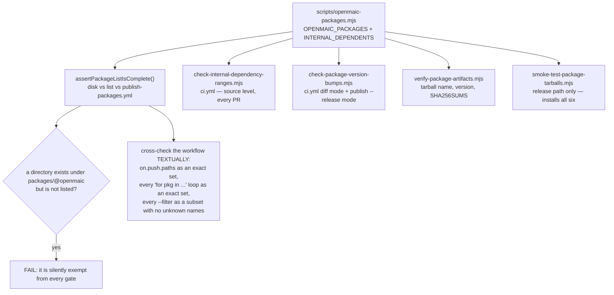
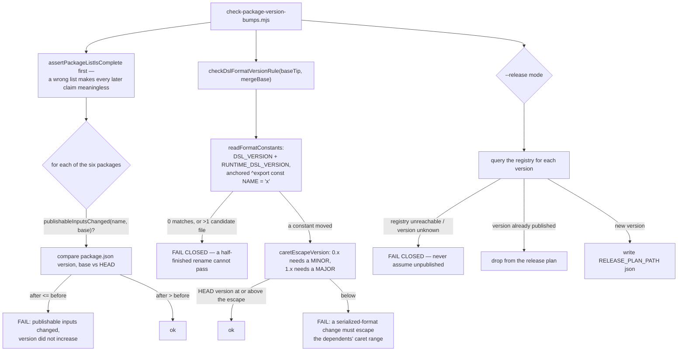
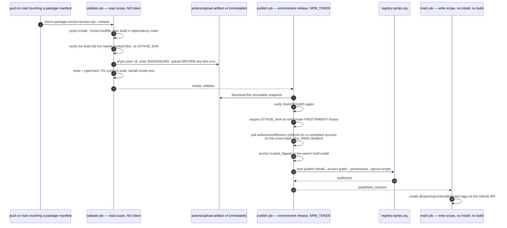

# Published Packages

Six packages under `packages/@openmaic/` are published to npm from this
repository. They are simultaneously the app's own dependencies (as
`workspace:*`), which is what makes their version discipline load-bearing rather
than cosmetic. This file covers the one shared list, the four gates built on it,
the tarball smoke test, and the nine-step `postinstall` chain the whole monorepo
rests on.

**Sources:** `scripts/openmaic-packages.mjs`,
`scripts/check-package-version-bumps.mjs` (27.2 KB),
`scripts/check-internal-dependency-ranges.mjs`,
`scripts/smoke-test-package-tarballs.mjs`,
`scripts/verify-package-artifacts.mjs`, `scripts/sync-maic-importer.mjs`,
`scripts/assert-vendor-maic-importer.mjs`, [`package.json:10`](package.json#L10),
`.github/workflows/publish-packages.yml`, `.github/workflows/ci.yml`. Evidence:
[quality-testing-ci-deps/01b](docs/appendix/research/quality-testing-ci-deps/01b-modules-ci-and-build.md),
[dsl-renderer-editor/04](docs/appendix/research/dsl-renderer-editor/04-dependencies-and-config.md).

## The family

| Package | Version | Licence field | Runtime deps | Role |
| --- | --- | --- | --- | --- |
| `@openmaic/dsl` | 0.11.1 | MIT | **none** | The slide/scene contract: types, validators, normalisers, two version ladders, three generated JSON Schemas. |
| `@openmaic/generation` | 0.3.5 | MIT | dsl, `jsonrepair`, `katex`, `nanoid`, `partial-json` | Outline/content/action generators and the PBL task-engine kernel. Ships its Markdown prompt templates as package files. |
| `@openmaic/storage` | 0.28.1 | MIT | dsl only | KV, document, runtime, asset, agent-session stores over browser/PG/HTTP backends. Driver injected, never imported. |
| `@openmaic/renderer` | 0.1.6 | MIT | dsl, `clsx`, `html-to-image`, `html2canvas-pro`, `katex`, `lucide-react`, `tailwind-merge`, `tinycolor2` | Paints a `Slide` to DOM; off-screen PNG snapshot and geometry probe. |
| `@openmaic/editor` | 0.0.5 | **absent** | dsl, renderer, `immer`, `katex`, `lucide-react`, 11 `prosemirror-*`, `react-colorful` | Edit-intent kernel plus the controlled editing canvas. |
| `@openmaic/importer` | 0.1.3 | MIT | dsl, `@xmldom/xmldom`, `jpegxr`, `jszip`, `katex`, `mathml-to-latex`, `nanoid`, `omml2mathml`, `pdfjs-dist` (4.8.69 exact), `pptxtojson`, `tinycolor2`, `utif` | PPTX → DSL. Fork of `pptxtojson`. |

`@openmaic/editor` has no `license` field in its manifest even though a MIT
`LICENSE` file is present and listed in `files` — npm will publish it with no SPDX
identifier. See [07-licences.md](docs/13-dependencies/07-licences.md).

## One list, four gates

Every check reads `OPENMAIC_PACKAGES` from [`scripts/openmaic-packages.mjs:34`](scripts/openmaic-packages.mjs#L34),
ordered by dependency (`dsl` first). The module's docstring at `:5`-`:33` explains
why the list is shared and states the threat model verbatim: these gates are
configuration in the same repository as the code they check, so anyone who can
merge can weaken them — *"They exist to catch MISTAKES … Deliberate subversion is
not in scope and cannot be."*

### Gate 1 — internal ranges must be `workspace:^`

`scripts/check-internal-dependency-ranges.mjs` enforces that an owned package
appears **exactly once**, in `dependencies`, as `workspace:^`. The reasoning at
`:8`-`:43`:

- pnpm publishes `workspace:*` as an **exact pin**, so a consumer installing two
  dependents released at different times gets two copies of `@openmaic/dsl` —
  and the dsl carries the schema, the validators *and* the version constants, so
  two copies mean a document produced against one instance can be validated by
  the other's schema revision. `workspace:^` publishes as `^<version>` and lets
  one copy satisfy both.
- `peerDependencies` and `optionalDependencies` are published constraints too, so
  an exact entry in either reintroduces the duplicate while `dependencies` still
  reads correctly. Both fields reject owned packages outright.
- `devDependencies` also rejects them: a devDependency satisfies the workspace
  link while the tarball declares no dependency at all.
- `INTERNAL_DEPENDENTS` is cross-checked **in both directions**, so deleting a map
  entry cannot quietly exempt a package.

Known limitation, written into the script at `:36`: `^` deduplicates within one
`0.x` line only. A consumer mixing `^0.5.0` and `^0.6.0` dependents still gets two
dsl lines.

### Gate 2 — version bumps and the DSL format rule

`scripts/check-package-version-bumps.mjs` runs in two modes: `<base-ref>` (diff
mode, on every PR and on push to main) and `--release` (pre-publish, twice — once
in `validate` and again inside the token-bearing publish step).

The rule this whole gate exists for is stated at
[`packages/@openmaic/dsl/src/version.ts:25`](packages/@openmaic/dsl/src/version.ts#L25): changing `DSL_VERSION` or
`RUNTIME_DSL_VERSION` requires an npm version increase the **dependents' caret
range will not admit**. The failure it prevents is spelled out in the script: one
published `@openmaic/storage` version resolving two different admitted dsl
versions would write rows it then refuses to read.

Three deliberately conservative behaviours:

1. The caret to escape comes from the **highest dsl version on the base branch**,
   not the merge base — because that is what already-published dependents carry.
2. Two candidate files both declaring the constants is an error, not "take the
   first".
3. If the constants cannot be located at either revision *while dsl changed at
   all*, the check fails rather than defaulting to pass.

Known limitation, in the script header: "publishable input" means "file under the
package directory", which under-approximates. All six packages bundle or emit
through the lockfile's toolchain, so a dependency bump can change a tarball with
no diff under the package directory. Diff mode is described as *"a merge-time
guard against the common case, not a proof of byte equality."*

### Gate 3 — artefact identity

`scripts/verify-package-artifacts.mjs` runs three times: `--write` after packing,
plain immediately after, and again in the publish job after downloading the
artefact. It asserts:

- the directory contains **exactly** the six expected `openmaic-<name>-<version>.tgz`
  files plus `SHA256SUMS` — nothing more, nothing fewer (`:39`-`:43`);
- every entry is a regular file and **not a symlink** (`:46`-`:49`);
- the packed `package/package.json` inside each tarball declares the expected
  name and version (`:52`-`:64`) — i.e. the *registry's* view, not the workspace's;
- `SHA256SUMS` lists every allowed tarball exactly once, in a strictly matched
  `^[0-9a-f]{64}␠␠[^/]+\.tgz$` form, and every digest re-verifies (`:76`-`:101`).

### Gate 4 — the tarball smoke test

`scripts/smoke-test-package-tarballs.mjs` builds a throwaway consumer in a temp
directory, installs all six tarballs via `file:` specifiers plus their union of
non-optional peers, and runs a generated `smoke.mjs`. It proves things a unit test
cannot:

| Assertion | What would otherwise break silently |
| --- | --- |
| `assertDeduplicableDslRange` — the packed manifest must declare `@openmaic/dsl` as exactly `^<dslVersion>`, and must not name any owned package in `peerDependencies`/`optionalDependencies` | pnpm publishing `workspace:*` as an exact pin, giving consumers two dsl copies |
| peer ranges must be **identical** across the family (no attempt to intersect, unsafe for `\|\|` ranges) | two `@openmaic` packages demanding incompatible React majors |
| root, `/core`, `/react` and `/ui` entries of `@openmaic/editor` all import | a broken `exports` map |
| `buildPrompt(PROMPT_IDS.REQUIREMENTS_TO_OUTLINES, {mediaEnabled:true})` produces >100 chars with **no remaining `{{snippet:` marker** | a missing `snippets/` directory in `files` — snippet inlining runs *before* conditional pruning, so it throws even for pruned blocks |
| `@openmaic/importer` resolves under both `import.meta.resolve` and `createRequire().resolve` | a dual-format `exports` regression |
| six `@openmaic/storage` subpaths import: `runtime/http`, `document/http`, `document/pg`, `runtime/pg`, `server`, `server/reference` | a subpath dropped from `exports` or `files` |
| `DOCUMENT_PG_SCHEMA` matches `/CREATE TABLE IF NOT EXISTS document_stages/` | the SQL schema string not surviving compilation |

`npm install --ignore-scripts` is used, so no tarball's install hooks execute.

## Release pipeline: the security boundary is a job boundary

Design points that are stated in the workflow's own comments and worth carrying
in your head:

- **Install and build run only in `validate`**, which holds `contents: read`, no
  token and `persist-credentials: false`. `postinstall` executes third-party code;
  the token-bearing job runs neither install nor build (`:66`-`:71`).
- **The only release input is a version bump that landed on main** (`:9`-`:15`).
  Tags are an *output*, written after the fact, because a tag can be created by
  anyone with write access on any commit (`:17`-`:20`).
- **`NPM_TOKEN` must not also be a repository secret** — a repository secret is
  readable by a workflow on any branch, which would let a branch-local edit of
  the workflow collect it without the environment (`:34`-`:36`).
- **First-parent only**, not plain reachability: plain reachability accepts every
  intermediate commit of every merged branch, including states no reviewer saw
  (`:279`-`:283`).
- **Green CI is required on the same `head_sha`**, identified by workflow *file*
  and triggering event rather than by check-run display name, because names are
  not unique (`:306`-`:309`).
- **Digests are anchored in a parent shell scalar** before any repository script
  runs with the token: a child process can alter files but cannot rewrite its
  parent's variable (`:369`-`:372`).
- **Per-package publishing**, not one recursive publish, so an ordinary re-run
  resumes exactly where it stopped — a version already on the registry drops out
  of the plan (`:352`-`:356`).
- Every action is pinned to a full commit SHA with a version comment.

The workflow also documents the one hole it cannot close (`:227`-`:233`): the
smoke test reads the writable local directory, not the uploaded snapshot. Because
upload already happened, a test process could replace a poisoned local tarball
with a valid one. Closing it requires a separate packing-only job that runs no
tests.

## The `postinstall` chain

One `&&`-joined shell line, [`package.json:10`](package.json#L10). Nine steps, strictly ordered, no
parallelism, no idempotence check, run on **every** `pnpm install` — locally, in
[`ci.yml:91`](.github/workflows/ci.yml#L91), in the release `validate` job, and in the Docker `deps` stage
([`Dockerfile:46`](Dockerfile#L46)).

```mermaid
flowchart LR
  I["pnpm install"] --> S1["1. packages/mathml2omml<br/>npm run build (rollup)"]
  S1 --> S2["2. packages/pptxgenjs<br/>npm run build (rollup, --bundleConfigAsCjs)"]
  S2 --> S3["3. @openmaic/dsl<br/>tsc + scripts/gen-schema.mjs"]
  S3 --> S4["4. @openmaic/generation<br/>tsc"]
  S4 --> S5["5. @openmaic/storage<br/>tsc"]
  S5 --> S6["6. @openmaic/importer<br/>rollup + tsc --emitDeclarationOnly"]
  S6 --> S7["7. @openmaic/renderer<br/>generate-fonts-css + generate-katex-fonts<br/>+ rollup + tsc -d"]
  S7 --> S8["8. @openmaic/editor<br/>rollup + tsc -d"]
  S8 --> S9["9. cd ../../.. then<br/>node scripts/sync-maic-importer.mjs<br/>importer/dist to public/vendor/maic-importer"]
  S9 --> B["pnpm build:<br/>assert-vendor-maic-importer.mjs && next build"]
```

The ordering is not incidental: `dsl` must precede its five dependents, `renderer`
must precede `editor`, and `importer` must be built before step 9 can copy its
`dist`.

### Where it is fragile

| Property | Consequence |
| --- | --- |
| Written with **relative `cd`s** (`cd ../generation`, then `cd ../../..`) | Renaming or reordering a package directory silently redirects a build rather than failing. |
| **Two steps use `npm`, six use `pnpm`, and step 9 is a bare `node scripts/sync-maic-importer.mjs`** | The vendored forks keep their original npm-style scripts. A pnpm-only assumption elsewhere would miss them. |
| **No idempotence check** | Nine builds on every install, including a `sharp`-free `pnpm install --frozen-lockfile` that changed nothing. |
| **`renderer` regenerates tracked, publishable files** (`fonts.css`, a KaTeX font snapshot) | This is why [`ci.yml:107`](.github/workflows/ci.yml#L107)-[`:121`](.github/workflows/ci.yml#L121) and [`publish-packages.yml:143`](.github/workflows/publish-packages.yml#L143)-[`:157`](.github/workflows/publish-packages.yml#L157) diff the tree against `$GITHUB_SHA` after install/build: a stale committed copy becomes a PR failure rather than a release shipping content absent from the commit. Both compare against `GITHUB_SHA` with `--no-replace-objects`, and both first assert `HEAD` did not move — because build code ran before the check and could move `HEAD` but not `GITHUB_SHA`. |
| **Step 9's output is gitignored** | `public/vendor/maic-importer/index.js` exists only after a successful install. `scripts/assert-vendor-maic-importer.mjs` fails `pnpm build` when it is missing or zero-length, with the failure it prevents named in the header: a 404 HTML page parsed as JavaScript, surfacing as an opaque `SyntaxError`. |
| **`postinstall` runs third-party build code** | The stated reason the release pipeline confines install and build to the tokenless `validate` job. |

`pnpm.ignoredBuiltDependencies` is `['sharp', 'unrs-resolver']`
([`package.json:203`](package.json#L203)-[`:207`](package.json#L207)), so those two do not run their own install scripts;
[`Dockerfile:32`](Dockerfile#L32) installs the native toolchain (`python3`, `build-base`, `g++`,
`cairo-dev`, `pango-dev`, `jpeg-dev`, `giflib-dev`, `librsvg-dev`) and lets
`sharp` resolve prebuilt binaries instead.

## Open questions

- [`CONTRIBUTING.md:132`](CONTRIBUTING.md#commit-message-convention) names **four** published packages where the code has six,
  omitting `generation` and `editor`. The gates use the code's list, so this is a
  documentation defect rather than a release defect — but it is the document a
  new contributor reads.
- The `render-service` consumes `@openmaic/dsl@0.11.0` and
  `@openmaic/renderer@0.1.4` from the registry while the workspace is at `0.11.1`
  and `0.1.6`. It is outside the pnpm workspace by construction, so this is
  expected — but no gate compares the two, and the DSL format-version rule cannot
  reach across that boundary.
- Nothing checks that a published tarball's *transitive* dependency set is
  unchanged. The version gate reasons about files under the package directory
  only, and its own header says so.
