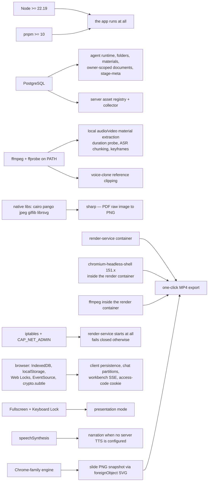
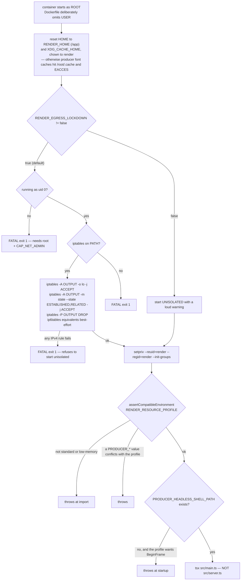

# Runtime Prerequisites

What must exist on the host, in the container, or in the browser before a given
feature works. Node and pnpm versions and where each is actually enforced; the
native binaries; PostgreSQL; the render container's hard startup preconditions;
and the browser APIs the classroom and the exporter depend on.

**Sources:** [`package.json:6`](package.json#L6)-[`:8`](package.json#L8), `.nvmrc`, [`README.md:106`](README.md#prerequisites)-[`:109`](README.md#prerequisites),
`scripts/check-node-engine-contract.mjs`, `.github/workflows/ci.yml`,
`Dockerfile`, `docker-compose.yml`, `render-service/Dockerfile`,
`render-service/docker-entrypoint.sh`, `render-service/src/resource-profile.ts`,
`lib/document/extractors/local-media.ts`,
`packages/@openmaic/renderer/src/snapshot/index.ts`,
`lib/utils/chat-storage.ts`, `lib/runtime/learner-key.ts`,
`components/edit/PlaybackChromeRoot.tsx`. Evidence:
[media-audio-video/04](docs/appendix/research/media-audio-video/04-dependencies-and-config.md),
[persistence-storage-state/04](docs/appendix/research/persistence-storage-state/04-dependencies-and-config.md).

## Prerequisite to feature

## Node

`engines.node` is `>=22.19.0` ([`package.json:6`](package.json#L6)-[`:8`](package.json#L8)). Where that constrains
anything:

| Point | Value | Effect |
| --- | --- | --- |
| [`package.json:7`](package.json#L7) | `>=22.19.0` | The declaration. Advisory at install time — there is **no `.npmrc`** in the repository, so `engine-strict` is off and `pnpm install` will not refuse an older Node. |
| `scripts/check-node-engine-contract.mjs` (`pnpm check:node-engine`, [`ci.yml:93`](.github/workflows/ci.yml#L93)) | — | Does **not** check the developer's Node. It reads every installed direct production dependency's own `engines.node` and fails if the root minimum (`semver.minVersion`) is *below* any of them ([`:57`](.github/workflows/ci.yml#L57)-[`:63`](.github/workflows/ci.yml#L63)). It is a consistency proof about the declaration, not an enforcement of it. Requires `pnpm install` to have run first ([`:40`](.github/workflows/ci.yml#L40)-[`:44`](.github/workflows/ci.yml#L44)). |
| `.nvmrc` | `22` | Resolves to the newest available 22.x, which satisfies `>=22.19.0` today. Nothing pins the patch floor. |
| [`ci.yml:56`](.github/workflows/ci.yml#L56), [`:203`](.github/workflows/ci.yml#L203), [`:236`](.github/workflows/ci.yml#L236) | `node-version: 22` | Same shape: `setup-node` resolves the latest 22.x. |
| [`Dockerfile:4`](Dockerfile#L4), [`:82`](Dockerfile#L82) | `node:22-alpine` (floating tag) | Latest 22.x at build time. Not digest-pinned. |
| [`render-service/Dockerfile:8`](render-service/Dockerfile#L8) | `node:22.22.2-bookworm-slim@sha256:f3a68cf4…` | The only **digest-pinned** Node in the repository, and the only exact version. |
| `render-service/package.json` | `engines.node: ">=22"` | Looser than the root. |
| [`README.md:108`](README.md#prerequisites) | `Node.js >= 22.19` | The operator-facing statement. |

So: the floor is declared in one place, restated in the README, proven consistent
with dependency floors by one CI script, and satisfied incidentally everywhere
else by `22` resolving to a recent patch. Nothing would fail loudly on Node 22.5.

**pnpm** is pinned harder than Node: `packageManager: pnpm@10.28.0+sha512.05df71d…`
([`package.json:209`](package.json#L209)) carries an integrity hash, and [`Dockerfile:21`](Dockerfile#L21)-[`:22`](Dockerfile#L22) activates
exactly that version through corepack. [`README.md:109`](README.md#prerequisites) asks for `>= 10`.
`--frozen-lockfile` is used in all four workflows and in the Docker `deps` stage.

## Native binaries on the app host

### `ffmpeg` and `ffprobe`

Required only for **local** media material extraction (the
`local-ffmpeg` extractor) and for voice-clone reference clipping. Not needed if
you use AliDocMind for media, and not needed at all for slide generation.

Resolution is hand-rolled rather than a `which` call
([`lib/document/extractors/local-media.ts:180`](lib/document/extractors/local-media.ts#L180)-[`:199`](lib/document/extractors/local-media.ts#L199)): every `PATH` entry, then
four fixed directories — `/usr/local/bin`, `/opt/homebrew/bin`, `/usr/bin`,
`/bin` — each probed with `access(candidate, X_OK)`. The first executable wins.
Failure throws a `MaterialExtractionError` marked **permanent** (not transient)
with the message *"`<name>` is unavailable; install ffmpeg (including ffprobe) to
extract media materials"*. The extractor's `availability()` probe resolves both
binaries and reports unavailable rather than throwing
([`local-media.ts:818`](lib/document/extractors/local-media.ts#L818)-[`:820`](lib/document/extractors/local-media.ts#L820)), which is what lets
`selectMediaExtractorProvider` walk past it to a cloud provider.

Timeouts around them: `FFPROBE_TIMEOUT_MS` 30 s, per-command 20 min,
whole-job 45 min, per-ASR-chunk 8 min, max media duration 90 min
([`local-media.ts:32`](lib/document/extractors/local-media.ts#L32)-[`:38`](lib/document/extractors/local-media.ts#L38)).

### Shared libraries for `sharp` and `@napi-rs/canvas`

`sharp` is pinned exact (`0.35.4`) and listed in
`pnpm.ignoredBuiltDependencies`, so its own install script does not run. The
Docker path compensates in two places:

- build stage: `apk add python3 build-base g++ cairo-dev pango-dev jpeg-dev
  giflib-dev librsvg-dev` (`Dockerfile:32`);
- runtime stage: the non-`-dev` runtime libraries `libc6-compat cairo pango jpeg
  giflib librsvg` (`Dockerfile:96`).

On a non-Docker host these are the operator's problem; nothing checks for them.

### Chromium on the app host

Needed only for **CI**, not for running the app: two `*.browser.test.ts` suites
and the Playwright e2e job install Chromium through
`playwright install chromium` and are gated by `COVER_LAYOUT_BROWSER` /
`INTERACTIVE_STATIC_BROWSER`, which turn a missing browser into a hard failure
rather than a skip ([`ci.yml:274`](.github/workflows/ci.yml#L274), [`:279`](.github/workflows/ci.yml#L279)).

## PostgreSQL

| Where | Version | Notes |
| --- | --- | --- |
| [`docker-compose.yml:47`](docker-compose.yml#L47) | `postgres:16` | Behind the `server-persistence` profile, so it is opt-in. Default password `openmaic-dev`, labelled development-only. Volume `openmaic-postgres`. |
| [`.github/workflows/storage-pg-contract.yml:20`](.github/workflows/storage-pg-contract.yml#L20) | `postgres:16` service | The storage contract database. |
| [`.github/workflows/publish-packages.yml:87`](.github/workflows/publish-packages.yml#L87) | `postgres:16` service | Release `validate` runs the PG contract suites with `STORAGE_PG_CONTRACT_REQUIRED=1`, because those suites skip themselves without a database and publishing `storage` without ever running them would ship the one backend only a real PostgreSQL can confirm (`:82`-`:84`). |

No minimum version is declared in code. Twenty tables are created by five
idempotent `ensure*Schema` calls at first use
([`lib/persistence/server-provider.ts:36`](lib/persistence/server-provider.ts#L36)-[`:67`](lib/persistence/server-provider.ts#L67)). Inferred: the floor is whatever
the declared SQL needs — `pg_notify`, `LISTEN`, `BYTEA`, triggers and row locks
are all long-standing, so 16 is a choice rather than a requirement, but nothing
records that.

## The render container's hard preconditions

The render service is the only component that **refuses to start** when its
environment is wrong, in four separate ways.

Five things in that chain are worth carrying:

1. **The entrypoint fails closed.** Three separate `FATAL exit 1` paths rather
   than a degraded start ([`render-service/docker-entrypoint.sh:51`](render-service/docker-entrypoint.sh#L51)-[`:63`](render-service/docker-entrypoint.sh#L63)). The
   reason is in the header: an untrusted Chromium sharing a Docker network with
   the app must not be able to reach back. `RENDER_EGRESS_LOCKDOWN=false` is the
   only opt-out and it prints a warning naming the risk.
2. **`chromium-headless-shell`, specifically the old headless shell.** The
   Dockerfile comment at `:5`-`:7` states why: producer's `beginFrame` capture
   requires it, and regular Chromium *exposes the resolver path but then rejects*
   `HeadlessExperimental.beginFrame` and silently falls back to screenshots — a
   correctness failure that looks like success.
3. **Every apt package is pinned to an exact Debian version from one dated,
   signed snapshot** — `DEBIAN_SNAPSHOT=20260731T162426Z`
   ([`render-service/Dockerfile:18`](render-service/Dockerfile#L18)), covering `chromium-common` and
   `chromium-headless-shell` `151.0.7922.71-1~deb12u1`, `ffmpeg`
   `7:5.1.9-0+deb12u1`, `iptables` `1.8.9-2`, `ca-certificates`, and four font
   packages. The comment at `:27`-`:30` explains: exact versions must stay
   installable after they rotate out of the live mirrors.
4. **Debian, not Alpine** (`:3`-`:7`): provisioning Chromium and its shared
   libraries on glibc is far simpler than on musl.
5. **The entry is `main.ts`, not `server.ts`** (`:91`-`:94`):
   `@hyperframes/producer` auto-starts its own bundled server when the process
   entry path ends with `/src/server.ts`. The container runs TypeScript directly
   through `tsx` — there is no build step, and `tsx` is a production dependency
   there.

Compose-level resources: `mem_limit` 8 GiB (the `standard` profile *requires* 8;
`low-memory` requires 4), `shm_size` 2 GB, `cap_add: NET_ADMIN`, and an
`internal: true` `render` network so the container has no host or internet route
at all.

## Browser capabilities

| API | Required for | Behaviour when absent |
| --- | --- | --- |
| **IndexedDB** | every browser storage backend: `maic-documents`, `maic-runtime`, `maic-asset-pool`, the Dexie `MAIC-Database` | [`lib/document-store/store.ts:47`](lib/document-store/store.ts#L47)-[`:50`](lib/document-store/store.ts#L50) probes the *capability*, not the environment, so an injected fake works. No fallback store. |
| **localStorage** | `BrowserKVStore` under `maic:account:*` and `maic:device:*`; settings and profile persistence; the raw workbench panel preference | `ambientLocalStorage()` catches the throw some privacy modes produce ([`lib/store/kv-persist.ts:462`](lib/store/kv-persist.ts#L462)-[`:468`](lib/store/kv-persist.ts#L468)); the persist state machine moves that key to `unavailable` and raises a `persist-health` event. |
| **Web Locks (`navigator.locks`)** | chat-storage partitions, learner-key minting, document migration, quiz-attempt serialisation | Five files feature-detect it at six sites ([`lib/document-store/migration.ts:227`](lib/document-store/migration.ts#L227), [`lib/quiz/runtime.ts:219`](lib/quiz/runtime.ts#L219), [`lib/runtime/learner-key.ts:52`](lib/runtime/learner-key.ts#L52), [`lib/utils/chat-storage-lock.ts:19`](lib/utils/chat-storage-lock.ts#L19), [`lib/utils/chat-storage.ts:220`](lib/utils/chat-storage.ts#L220) and [`:1435`](lib/utils/chat-storage.ts#L1435)). `lib/utils/chat-storage-lock.ts` provides an in-process reader/writer queue fallback, but `withPartitionLocks` **throws `ChatStorageLockUnavailableError`** when a cross-realm lock is genuinely required ([`lib/utils/chat-storage.ts:230`](lib/utils/chat-storage.ts#L230)-[`:234`](lib/utils/chat-storage.ts#L234)). [`lib/runtime/learner-key.ts:61`](lib/runtime/learner-key.ts#L61)-[`:66`](lib/runtime/learner-key.ts#L66) documents its accepted residual race: a tab whose re-read lands before another tab's write keeps an orphaned key, splitting one anonymous learner's local history. |
| **`indexedDB.databases()`** | probed before deleting the runtime DB so a device that never wrote runtime data is not made to create it ([`lib/runtime/store.ts:63`](lib/runtime/store.ts#L63)-[`:69`](lib/runtime/store.ts#L69)) | Assumed present; older Firefox lacks it. |
| **EventSource** | the owner-level session stream and per-session event stream that feed the workbench fold | Abstracted behind `OwnerEventSource` for tests ([`lib/workbench/owner-session-client.ts:40`](lib/workbench/owner-session-client.ts#L40)-[`:46`](lib/workbench/owner-session-client.ts#L46)). |
| **`crypto.subtle`** | Edge-compatible HMAC verification of the access-code cookie in [`middleware.ts:26`](middleware.ts#L26)-[`:35`](middleware.ts#L35); `node:crypto` `createHmac`/`timingSafeEqual` on the Node side | Required wherever `ACCESS_CODE` is set. |
| **`speechSynthesis`** | narration fallback with sentence-level chunking, and a cancel+re-speak pause because Firefox's `speechSynthesis.pause` is broken ([`lib/playback/engine.ts:246`](lib/playback/engine.ts#L246)) | Without it and without server TTS there is no narration. |
| **Fullscreen + Keyboard Lock** | presentation mode: `stageElement.requestFullscreen()` then `navigator.keyboard?.lock(['Escape'])` so Escape does not auto-exit ([`components/edit/PlaybackChromeRoot.tsx:589`](components/edit/PlaybackChromeRoot.tsx#L589)-[`:593`](components/edit/PlaybackChromeRoot.tsx#L593)) | Optional-chained and `.catch(() => {})`; presentation still works, Escape just exits fullscreen. |

### Chrome-family engine for export

The slide-to-PNG path is **native-paint-first** by design
([`packages/@openmaic/renderer/src/snapshot/index.ts:10`](packages/@openmaic/renderer/src/snapshot/index.ts#L10)-[`:24`](packages/@openmaic/renderer/src/snapshot/index.ts#L24)): `html-to-image`
serialises the slide into an SVG `<foreignObject>` that *the same Chrome engine
painting the live classroom* rasterises, so KaTeX HTML, CSS `filter`, soft-edge
`mask` and mixed CJK/Latin text come out exactly as the classroom shows them.
`html2canvas-pro` re-implements layout and paint, and therefore re-rasterises
KaTeX's vlist/frac-line/delimiter internals, drops `filter`/`mask`, and cannot
draw `<video>`.

The one thing a `foreignObject` SVG cannot do is reach the document's font
registry, so web fonts are inlined as data URLs up front via `getFontEmbedCSS`.
If that embed still misses the KaTeX faces, or a cross-origin image taints the
canvas, the code falls back to `html2canvas-pro` rather than shipping broken
output.

Inferred: exporting from a non-Chromium browser will therefore work but may take
the fallback path and produce output that differs from the live classroom.
Nothing in the repository asserts the engine.

## Offline asset prerequisites

The render container has **zero outbound network** after lockdown, so every asset
the composition needs must already be inside the ZIP:

| Path | Measured size | Produced by |
| --- | --- | --- |
| `public/vendor/video-export/fonts/` | 25 files, 2.0 MiB | `pnpm gen:video-export-katex` (20 KaTeX WOFF2 faces, count asserted at [`scripts/generate-video-export-katex.mjs:36`](scripts/generate-video-export-katex.mjs#L36)), `gen:video-export-noto-cjk`, `gen:video-export-noto-script-fonts` |
| `public/vendor/gsap.min.js` | 72 927 bytes | committed vendor drop |
| `public/vendor/maic-importer/` | gitignored build artefact | `postinstall` step 9 |

The three `gen:video-export-*` scripts are **not** run by `postinstall` or by
`pnpm build`; their outputs are committed. Regenerating them is a manual step.

## Open questions

- Nothing enforces the `>=22.19.0` floor at install or start time. Adding
  `engine-strict=true` to a `.npmrc` would; whether that was considered and
  rejected is not recorded.
- `Dockerfile` uses the floating `node:22-alpine` tag while
  `render-service/Dockerfile` digest-pins. The asymmetry is undocumented.
- No minimum PostgreSQL version is declared anywhere; `postgres:16` appears only
  as a compose image and two CI services.
- The three video-export font scripts produce committed assets but are not wired
  into any gate, so a KaTeX bump can leave the vendored faces stale until someone
  runs the script — the only signal is the `!== 20` assertion, which fires at
  generation time, not at build time.
