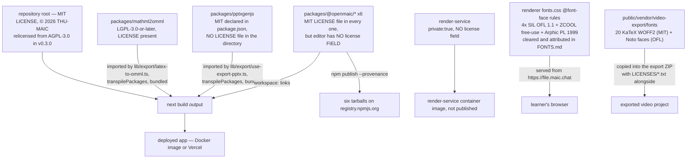
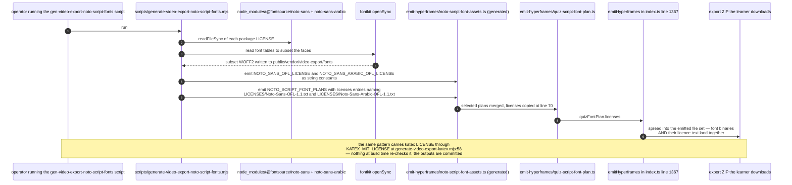

# Licences

The project licence, the licences declared inside this repository, the font
clearance record, and the places where redistribution terms are either unclear or
undeclared. **This is an inventory of what the repository states, not legal
advice.** Where the repository is silent, this file says so rather than filling
the gap.

**Sources:** `LICENSE`, `package.json:5`, `README.md:1041`-`:1053`,
`CHANGELOG.md:132`-`:134`, `CONTRIBUTING.md:193`-`:195`, the ten workspace
`package.json` manifests, `packages/mathml2omml/LICENSE`,
`packages/@openmaic/renderer/FONTS.md`,
`packages/@openmaic/renderer/font-licenses/`,
`scripts/generate-video-export-*.mjs`, `.github/workflows/*.yml`. Evidence:
[quality-testing-ci-deps/04](../appendix/research/quality-testing-ci-deps/04-dependencies-and-config.md).

## Licence flow into the distributed artefacts

## What the repository declares

| Artefact | Declared licence | `LICENSE` file | Notes |
| --- | --- | --- | --- |
| Repository root | MIT (`LICENSE`, `package.json:5`) | yes, `MIT License / Copyright (c) 2026 THU-MAIC` | `CHANGELOG.md:132`-`:134` records the relicense **from AGPL-3.0 to MIT** in v0.3.0. |
| `@openmaic/dsl` | MIT | yes, in `files` | |
| `@openmaic/generation` | MIT | yes, in `files` | Also ships `templates`, `snippets`, `prompts-pbl` — the Markdown prompts are part of the published artefact. |
| `@openmaic/storage` | MIT | yes, in `files` | |
| `@openmaic/renderer` | MIT | yes, in `files` | Additionally ships `FONTS.md` and `font-licenses/` in `files`. |
| `@openmaic/editor` | **no `license` field** | yes (MIT), in `files` | npm will publish it with **no SPDX identifier** in the registry metadata. The MIT text ships, but automated consumers see `license: undefined`. |
| `@openmaic/importer` | MIT | yes, in `files` | |
| `packages/mathml2omml` | **LGPL-3.0-or-later** (`package.json:26`) | yes, full LGPL text, 7.5 KB | Consumed as `workspace:*`, transpiled by Next, bundled. |
| `packages/pptxgenjs` | MIT (`package.json:10`) | **no `LICENSE` file** | Directory contains only `src/`, `types/`, `.gitignore`, `package.json`, `rollup.config.mjs`, `tsconfig.json`. Upstream is `gitbrent/PptxGenJS`, MIT. |
| `render-service` | **no `license` field**, `private: true` | no | Not published. Runs as a container image. |

## The LGPL entry

`packages/mathml2omml` is `LGPL-3.0-or-later`, imported by
`lib/export/latex-to-omml.ts:2`, listed in `next.config.ts` `transpilePackages`,
and therefore compiled into the app's JavaScript output — which is distributed
both as a Docker image and as a Vercel deployment.

**What the repository does record.** `README.md:1045`-`:1053` names it explicitly
under "Third-Party Components", links its `LICENSE`, and states: *"When
redistributing the repository as a whole, the terms of each bundled package above
apply to that package's files."* The full LGPL text is present. Both facts are
better than most repositories manage.

**What the repository does not record.** LGPL-3.0 §4 attaches conditions to
*combining* the library into a larger work — the relinking/reverse-engineering
provisions. Whether a bundled, minified, tree-shaken JavaScript build satisfies
them, and what would be needed if it does not, is a legal question. No document,
comment, ADR or issue in this repository records that anyone has evaluated it.
This file makes no claim either way.

Two engineering facts that bear on the size of the question:

- The local divergence from upstream `mathml2omml@0.5.0` is **one character**
  (`src/parse-stringify/parse.js:82`, commit `a3f88d53`) plus one build-script
  line. If upstream has since fixed the same bug, the fork could be replaced by
  the registry copy — which would not change the licence, but would remove the
  in-tree source. See [04-vendored-forks.md](./04-vendored-forks.md).
- `latexToOmml` is used only by the PPTX export path and returns `null` on
  failure (`lib/export/latex-to-omml.ts:70`-`:80`), so the dependency is
  feature-scoped rather than core.

## The `pptxgenjs` fork's missing LICENSE file

MIT is declared in `package.json:10` and the upstream repository is named at
`:68`-`:71`, but no `LICENSE` file exists in `packages/pptxgenjs/`. MIT's own
condition is that the copyright notice and permission notice be included in all
copies or substantial portions. The notice is not in the directory.

Mitigations already in place: the package is `workspace:*` and never published —
`publish-packages.yml:5`-`:7` pins the publish scope by name *precisely because*
these two names are not ours. And `README.md:1050` links the licence, though it
links `package.json` rather than a licence text.

## Font licences — the best-documented part

`packages/@openmaic/renderer/FONTS.md` is a genuine clearance record, and it is
explicit about the thing that makes it necessary:

> `@openmaic/renderer` does **not** embed any font binaries. `fonts.css` only
> declares `@font-face` rules whose `src` points at self-hosted woff2 files on
> object storage (`https://file.maic.chat/fonts/<name>.woff2`). Serving those
> faces is a form of redistribution, so each face below must be cleared for
> redistribution and attributed here. This file is the font
> attribution/clearance record; it is **separate** from the package's own
> `LICENSE` (MIT), which does not cover the fonts.

| Family | Licence | Redistribution | Notice location |
| --- | --- | --- | --- |
| `SourceHanSans`, `SourceHanSerif`, `LXGWWenKai`, `ZhuQueFangSong` | SIL OFL 1.1 | yes | `font-licenses/OFL.txt` — OFL §2 requires the notice to accompany every redistributed copy, and the four per-face copyright lines are bundled with it |
| `ZcoolHappy` | ZCOOL (站酷) free-use licence | yes, with conditions | `font-licenses/ZcoolHappy-LICENSE.txt`. Conditions named in `FONTS.md`: keep the font name unchanged, do not resell it standalone, retain designer attribution |
| `WenDingPLKaiTi` (AR PL KaitiM GB) | Arphic Public License 1999 | yes | `font-licenses/ARPHIC-PL.txt` |

`FONTS.md` also notes the mechanism that limits exposure: the importer does not
remap fonts — it passes each slide's original `font-family` names through
unchanged, so a name only renders in one of these six faces if it matches.

### Fonts inside the exported video project

The three `gen:video-export-*` scripts carry licence text into their generated TS
modules rather than leaving it behind:

| Script | Emits | Licence source |
| --- | --- | --- |
| `scripts/generate-video-export-katex.mjs:14`, `:58` | `KATEX_MIT_LICENSE` | read from `katex/LICENSE` in `node_modules` |
| `scripts/generate-video-export-noto-cjk.mjs:12`, `:19`, `:59` | `NOTO_SANS_SC_OFL_LICENSE`, `NOTO_SANS_KR_OFL_LICENSE` | read from each `@fontsource` package's `LICENSE` |
| `scripts/generate-video-export-noto-script-fonts.mjs:179`-`:210` | `NOTO_SANS_OFL_LICENSE`, `NOTO_SANS_ARABIC_OFL_LICENSE`, plus descriptors placing them at `LICENSES/Noto-Sans-OFL-1.1.txt` and `LICENSES/Noto-Sans-Arabic-OFL-1.1.txt` inside the export | same |

So the export ZIP a user downloads carries the font licences alongside the font
binaries. That is a deliberate design, not an accident: the descriptors name the
in-ZIP paths explicitly.

## Attribution for vendored source

`lib/agent/VENDOR.md:36`-`:58` reproduces the full MIT text and copyright line for
`@earendil-works/pi-*` (Mario Zechner) even though those packages are consumed
from the registry rather than vendored. `lib/edit/html-edit.ts:1`-`:19` names its
source file inside `@earendil-works/pi-coding-agent` but does **not** reproduce a
licence notice for the copied code. Inferred: it inherits the same MIT terms as
the rest of the pi project, per `lib/agent/VENDOR.md:6`. That inference is not
stated at the copy site.

## What no automated check covers

Verified by absence:

| Missing | Consequence |
| --- | --- |
| No licence scanner in any workflow (`grep -rniE 'licen[cs]e\|audit\|sbom\|cyclonedx\|spdx\|trivy\|snyk' .github/` returns one unrelated match) | A future copyleft addition to the 132 runtime dependencies would surface only if a human noticed. |
| No `license-checker`-style dependency | Same. |
| No `NOTICE` or `THIRD_PARTY_LICENSES` file at the root | Transitive dependency notices are not aggregated anywhere. The Docker image and the Vercel bundle ship no third-party notice file. |
| No `.npmrc`, no Dependabot, no Renovate | No signal when a dependency changes licence between versions — which does happen. |
| No SPDX or SBOM emission in the release pipeline | `npm publish --provenance` attests *who built* the tarball, not what is inside it. |

## Transitive licences: explicitly not surveyed

`node_modules` is not present in the working tree these docs were written against,
so the licences of the ~2 723 resolved packages in `pnpm-lock.yaml` were **not
read**. This file deliberately makes no claim about them. Two that are worth
someone checking, on the grounds of prominence rather than suspicion:

- `pdfjs-dist` `4.8.69`, pinned exact, a runtime dependency of
  `@openmaic/importer` — a Mozilla project whose licence terms should be
  confirmed against the pinned version rather than assumed.
- `@alicloud/*` and `@aws-sdk/*` cloud SDKs, which carry vendor-specific terms
  alongside their open-source licences.

The lockfile is the authoritative input for that survey and it is checked in;
nothing prevents the survey being done, it simply has not been.

## Open questions

- Has anyone evaluated the LGPL-3.0 §4 position for `mathml2omml` being bundled
  into the distributed app? Nothing in the repository records it. This is the one
  item on this page that should have a written decision attached.
- Should `packages/pptxgenjs/` carry upstream's MIT `LICENSE` text? Its sibling
  fork does; it does not.
- Should `@openmaic/editor` declare `"license": "MIT"` so registry metadata
  matches the `LICENSE` file it already ships?
- Is `https://file.maic.chat` operated by the project? `FONTS.md` calls it "our
  CDN", which implies yes, but the origin is hard-coded with no configuration
  knob (`packages/@openmaic/renderer/fonts.config.mjs:13`), so a third-party
  deployment serves fonts from an origin it does not control.
- Should the release pipeline emit an SBOM? It already has the provenance
  machinery and a single trusted artefact directory to attach one to.
