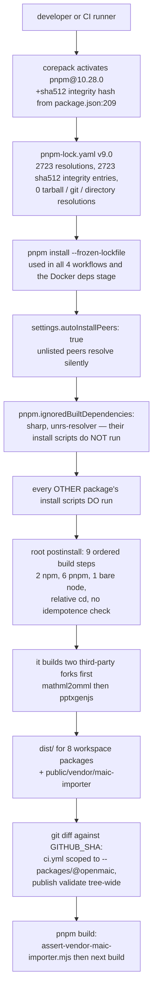
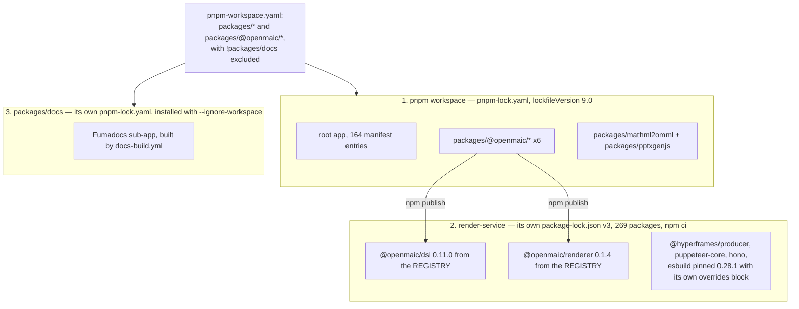

# Supply Chain

Lockfile discipline, the version-range operators actually in use and why the exact
pins are where they are, the three separate dependency universes, and the trust
boundaries at install time and release time — with the gaps named.

**Sources:** `package.json`, `pnpm-lock.yaml` (28 086 lines, 957 564 bytes),
`pnpm-workspace.yaml`, `render-service/package-lock.json`,
`packages/docs/pnpm-lock.yaml`, `Dockerfile`, `render-service/Dockerfile`,
`.github/workflows/*.yml`, `scripts/*.mjs`. All counts in this file were measured
by script over the working tree; the measuring expression is named where the
number is load-bearing. Evidence:
[quality-testing-ci-deps/04](../appendix/research/quality-testing-ci-deps/04-dependencies-and-config.md).

## The install-time trust chain

Two properties of that chain are the whole story:

1. **Resolution is fully locked and fully integrity-checked.** Every one of the
   2 723 `resolution:` entries carries a `sha512` integrity hash
   (`grep -c 'integrity: sha' pnpm-lock.yaml` = 2 723, equal to the resolution
   count). There are **zero** `tarball:`, `repo:`/`commit:` or `directory:`
   resolutions — nothing is fetched from a git URL or an arbitrary tarball. There
   is no `overrides`, no `patchedDependencies` and no `packageExtensions` block
   anywhere, so the lockfile is a plain registry graph.
2. **Install executes third-party code.** `postinstall` runs on every install and
   builds two forked upstream packages before anything else. This is the reason
   the release pipeline confines install and build to a job that holds
   `contents: read`, no token and `persist-credentials: false`
   (`publish-packages.yml:66`-`:71`, `:78`-`:81`).

## Lockfile discipline

| Property | Value | Where |
| --- | --- | --- |
| `lockfileVersion` | `'9.0'` | `pnpm-lock.yaml:1` |
| Size | 28 086 lines / 957 564 bytes | `wc` |
| Resolutions | 2 723, all with `sha512` integrity | `grep -c` |
| Non-registry resolutions | 0 | `grep 'resolution: {tarball\|repo:\|directory'` |
| `settings.autoInstallPeers` | `true` | `pnpm-lock.yaml:4` |
| `settings.excludeLinksFromLockfile` | `false` | `pnpm-lock.yaml:5` |
| Package manager | `pnpm@10.28.0+sha512.05df71d…` | `package.json:209`; `Dockerfile:22` activates the same version via corepack |
| `--frozen-lockfile` | `ci.yml:91`, `:239`; `publish-packages.yml:117`; `docs-build.yml`; `Dockerfile:46` | i.e. everywhere an install happens except a developer's first `pnpm install` |
| `.npmrc` | **absent** | so no `engine-strict`, no registry override, no `audit` configuration |

`autoInstallPeers: true` is worth pausing on: a package whose peer is not declared
anywhere in the manifest still gets installed. It makes the install forgiving and
makes the manifest an incomplete description of what lands in `node_modules` —
which is exactly why `scripts/smoke-test-package-tarballs.mjs` builds its consumer
from the *packed manifests'* peer sets rather than from the workspace.

## Version-range operators

Measured with a classifier over the root manifest:

| Field | Total | `^x.y.z` | exact | `workspace:*` |
| --- | --- | --- | --- | --- |
| `dependencies` | 132 | 111 | 13 | 8 |
| `devDependencies` | 32 | 25 | 7 | 0 |

No `~`, no `>=`, no `*`, no ranges with `||`, no pre-release tags. Two operators
plus workspace links, for 164 entries.

The 20 exact pins are not arbitrary. They fall into four groups:

| Group | Entries | Reason |
| --- | --- | --- |
| **The framework trio** | `next@16.2.11`, `react@19.2.3`, `react-dom@19.2.3`, plus `eslint-config-next@16.2.11` in devDeps | A framework minor is a migration. `eslint-config-next` is pinned to the *same* version so the lint config cannot describe a different Next than the one installed. |
| **The agent harness** | `@earendil-works/pi-agent-core@0.78.0`, `@earendil-works/pi-ai@0.78.0` | `lib/agent/VENDOR.md:19`-`:21` states the reason explicitly: `0.78.0` is the recorded baseline for a possible future source vendoring, and an exact pin is what keeps that baseline meaningful. |
| **Parsing and security surface** | `sanitize-html@2.17.0`, `undici@7.29.0`, `js-yaml@4.3.0`, `graphemer@1.4.0`, `nanoid@5.1.16`, `sharp@0.35.4`, `lodash@4.18.1`, `docx@9.4.1` | Libraries whose behaviour change is a security or correctness event rather than a feature. `sharp` additionally has its install script suppressed. |
| **Tools whose OUTPUT BYTES are compared** | `prettier@3.8.1`, `hyperframes@0.7.60`, `fontkit@2.0.4`, `@fontsource/noto-sans@5.3.0`, `@fontsource/noto-sans-arabic@5.3.0`, `semver@7.8.5` | Prettier rewrites the tree, so a minor turns every open PR red. `hyperframes`' lint output text is string-matched in CI (`ci.yml:307` greps for `0 errors, 0 warnings`). `fontkit` and the two pinned fonts feed committed generated assets. |

The eight `workspace:*` links are the six `@openmaic` packages plus the two
vendored forks. Note the asymmetry that
[05-published-packages.md](./05-published-packages.md) explains: the **root** app
uses `workspace:*` (published as an exact pin, irrelevant because the root is
never published), while the six packages must use `workspace:^` between
themselves — and a script enforces that.

## Three separate dependency universes

`pnpm-workspace.yaml` excludes `packages/docs` with the reason inline: *"standalone
docs sub-app: own lockfile, build, deploy"*. `docs-build.yml` installs it with
`pnpm install --frozen-lockfile --ignore-workspace` and a separate
`cache-dependency-path`.

`render-service` is outside the workspace entirely: `npm ci` against its own
`package-lock.json` (v3, 269 packages), and it consumes `@openmaic/dsl` and
`@openmaic/renderer` as **published registry tarballs at exact versions**. It is
currently two dsl patches and two renderer patches behind the workspace. That is
by construction — but nothing in CI compares them, and the DSL format-version rule
cannot reach across the boundary.

The service also carries its own `overrides: { esbuild: "0.28.1" }` — the only
override anywhere in the repository.

## Release-time trust boundary

Covered in detail at [05-published-packages.md](./05-published-packages.md); the
supply-chain-relevant summary:

| Control | Effect |
| --- | --- |
| Install/build confined to the tokenless `validate` job | `postinstall`'s third-party code never runs in a process that can read `NPM_TOKEN` |
| `pnpm pack --config.ignore-scripts=true` | suppresses `prepack`/`prepare` during packing |
| Upload to `actions/upload-artifact` v4 **before** any test runs | the publish input becomes immutable before test code can touch it |
| `SHA256SUMS` written, verified, downloaded, verified again, and re-verified per tarball immediately before `npm publish` | four verification points |
| `trusted_digests` read into a **parent shell scalar** before any repository script runs with the token | a child process can alter files, not its parent's variable |
| `npm publish <tarball> --provenance --ignore-scripts` | provenance attestation on the exact validated bytes; publish lifecycle scripts cannot execute |
| `git --no-replace-objects diff --quiet "$GITHUB_SHA"` plus a `HEAD` identity check, in both jobs | build code can move `HEAD`, not `GITHUB_SHA`; a local replace ref cannot redirect the comparison |
| First-parent-only reachability on `origin/main` | rejects commits merged *underneath* main that no reviewer saw |
| Poll `actions/workflows/ci.yml/runs` for a completed success on the same `head_sha`, 1 800 s deadline | being on main is not the same as having passed CI, which runs concurrently and blocks nothing |
| `NPM_TOKEN` only in the `release` GitHub Environment, never a repository secret | a repository secret is readable by a workflow on **any** branch |
| Every action pinned to a full commit SHA with a version comment, `persist-credentials: false` | in `publish-packages.yml` and `publish-openmaic-skill.yml` only |

The skill-publish path has the same shape: `clawhub@0.23.3` installed globally
with `--ignore-scripts`, `CLAWHUB_TOKEN` scoped to a `clawhub-release`
environment.

## Exposure, named

| Gap | Why it matters |
| --- | --- |
| **111 of 132 runtime dependencies float on `^`.** | The lockfile pins them today, so a `--frozen-lockfile` install is reproducible. But any lockfile refresh admits every published minor of 111 packages at once, with no per-package review step and no changelog gate. |
| **No Dependabot, no Renovate, no `.npmrc`.** | Verified by absence. There is no automated signal that a dependency published a new version, changed licence, or was flagged. Updates are entirely manual and event-driven. |
| **No `pnpm audit`, no SBOM, no licence scanner in any workflow.** | `grep -rniE 'licen[cs]e\|audit\|sbom\|cyclonedx\|spdx\|trivy\|snyk' .github/` returns one unrelated match. A known-vulnerable transitive dependency would surface only from an external report. |
| **`postinstall` runs nine builds of third-party and first-party code on every install, including on developer machines.** | This is the largest install-time execution surface in the repository, and it is unavoidable — the app does not build without it. |
| **`autoInstallPeers: true`.** | The manifest under-describes `node_modules`. |
| **`Dockerfile` uses the floating `node:22-alpine` tag.** | Two builds of the same commit can ship different Node patch levels. `render-service/Dockerfile` digest-pins by contrast, so the pattern exists in the repository and simply is not applied to the app image. |
| **`ALPINE_MIRROR` and `NPM_REGISTRY` are build args.** | `Dockerfile:6`-`:22` lets an operator redirect both the OS package mirror and the npm registry. Useful in restricted networks; also a build-time trust delegation with no verification beyond apk/pnpm's own. |
| **`ci.yml`, `storage-pg-contract.yml` and `docs-build.yml` use floating action tags** (`actions/checkout@v4`, `pnpm/action-setup@v4`) and declare **no `permissions:` block**, so they inherit the repository default. | The two publish workflows do neither. The asymmetry is deliberate (the publish path is the one holding a token) but it means the PR-time workflows are the softer target. |
| **`render-service` registry pins drift silently from the workspace.** | Two dsl patch releases and two renderer patch releases behind, with no comparison anywhere. |

## What is genuinely strong

Worth saying plainly, because the gaps above are easier to list:

- Full integrity coverage with zero non-registry resolutions is not the norm.
- The exact-pin taxonomy is coherent and each group has a stated reason, most of
  them written into a comment next to the thing they protect.
- The release pipeline's boundary is a **job** boundary, not a step boundary, and
  the workflow explains what each control removes rather than just asserting it.
- Two of the checks (`assertPackageListIsComplete`,
  `assert-pg-contract-suites.mjs`) exist specifically to detect a *gate going
  quiet*, which is the failure mode most repositories never think about.
- `scripts/openmaic-packages.mjs:17`-`:33` states the threat model rather than
  implying one: the gates catch mistakes, not deliberate subversion, and cannot,
  because they are configuration in the same repository as the code they check.

## Open questions

- Was Dependabot/Renovate considered and rejected? With 164 direct entries and no
  scanner, the update strategy appears to be "someone notices" — but nothing
  records that as a decision.
- Should the app `Dockerfile` digest-pin its base image the way
  `render-service/Dockerfile` does?
- Should the release pipeline emit an SBOM? It already has provenance signing and
  a single verified artefact directory.
- Nothing pins the **transitive** dependency set of a published tarball. The
  version gate reasons about files under a package directory only, and its own
  header says that under-approximates.

## Related

- [05-published-packages.md](./05-published-packages.md) — the gates and the
  release pipeline in full.
- [04-vendored-forks.md](./04-vendored-forks.md) — the two forks this chain builds
  first.
- [07-licences.md](./07-licences.md) — the licence side of the same graph.
- [16-development-view/index.md](../16-development-view/index.md) — the CI jobs
  these controls live in.
- [17-deployment-view/index.md](../17-deployment-view/index.md) — how the built
  artefacts reach a host.
