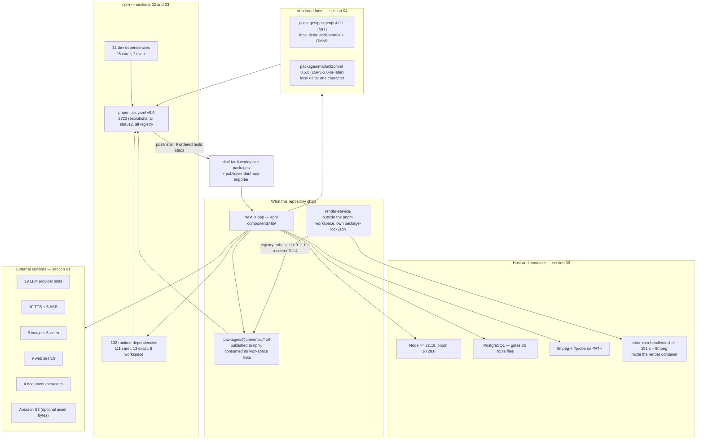

# External Dependencies: Services, Packages, Forks, Licences

Everything OpenMAIC does not own but cannot run without: the SaaS and self-hosted
services it calls, the npm packages it installs, the two upstream libraries it
carries as in-tree forks, the six packages it publishes back to npm, the binaries
and the database it needs on the host, and the licence and supply-chain posture
that follows from all of that.

**Who this is for:** a staff engineer who needs to know what breaks when a
provider goes away, what a `pnpm install` actually executes, why two upstream
libraries live under `packages/`, and what the redistribution constraints are.

**Sources:** `package.json`, `pnpm-lock.yaml`, `pnpm-workspace.yaml`,
`render-service/package.json`, `packages/@openmaic/*/package.json`,
`packages/pptxgenjs/`, `packages/mathml2omml/`, `next.config.ts`, `vercel.json`,
`Dockerfile`, `docker-compose.yml`, `render-service/Dockerfile`,
`scripts/*.mjs`, `.github/workflows/*.yml`, plus the provider registries under
`lib/audio/`, `lib/media/`, `lib/web-search/`, `lib/pdf/`, `lib/ai/` and
`lib/server/provider-config.ts`. Evidence packs:
[quality-testing-ci-deps](docs/appendix/research/quality-testing-ci-deps/04-dependencies-and-config.md),
[ai-provider-layer](docs/appendix/research/ai-provider-layer/04-dependencies-and-config.md),
[media-audio-video](docs/appendix/research/media-audio-video/04-dependencies-and-config.md),
[generation-pipeline](docs/appendix/research/generation-pipeline/04-dependencies-and-config.md),
[persistence-storage-state](docs/appendix/research/persistence-storage-state/04-dependencies-and-config.md),
[dsl-renderer-editor](docs/appendix/research/dsl-renderer-editor/04-dependencies-and-config.md).

## Shape of the dependency surface

Four things OpenMAIC depends on, with very different failure modes: services it
calls over the network, packages it installs, code it forked in-tree, and binaries
or a database it needs on the host.

## Section files

| File | Contents |
| --- | --- |
| [01-external-services.md](docs/13-dependencies/01-external-services.md) | Every external service: LLM, TTS/ASR, image, video, web search, document extraction, object storage, render service. Env vars, adapter files, and what degrades when each is absent. |
| [02-runtime-packages.md](docs/13-dependencies/02-runtime-packages.md) | The 132 runtime npm dependencies grouped by role, with the heavy and unusual choices flagged, and the entries with no first-party importer named. |
| [03-dev-and-build-packages.md](docs/13-dependencies/03-dev-and-build-packages.md) | Dev/test/build dependencies mapped to the stage of the dev loop each one gates. |
| [04-vendored-forks.md](docs/13-dependencies/04-vendored-forks.md) | `packages/pptxgenjs` and `packages/mathml2omml`: upstream, the exact local delta, how divergence is managed, and the maintenance cost. Plus the two source-level vendorings that are not npm packages. |
| [05-published-packages.md](docs/13-dependencies/05-published-packages.md) | The six `@openmaic/*` packages: version-bump discipline, the internal-range rule, the tarball smoke test, and the nine-step `postinstall` chain. |
| [06-runtime-prerequisites.md](docs/13-dependencies/06-runtime-prerequisites.md) | Node >= 22.19 and where it is enforced, `ffmpeg`/`ffprobe`, Chromium, PostgreSQL, the render service, and the browser capabilities export depends on. |
| [07-licences.md](docs/13-dependencies/07-licences.md) | Project licence, the LGPL fork, the packages missing licence metadata, and the redistribution questions nobody has recorded an answer to. |
| [08-supply-chain.md](docs/13-dependencies/08-supply-chain.md) | Lockfile discipline, version-range operators, `postinstall` trust, the release-job security boundary, and the gaps. |

## Facts at a glance

| Question | Answer | Detail |
| --- | --- | --- |
| How many runtime dependencies? | 132 (111 `^`, 13 exact, 8 `workspace:*`) | [02](docs/13-dependencies/02-runtime-packages.md), [08](docs/13-dependencies/08-supply-chain.md) |
| How many dev dependencies? | 32 (25 `^`, 7 exact) | [03](docs/13-dependencies/03-dev-and-build-packages.md) |
| Lockfile | `pnpm-lock.yaml` v9.0, 2 723 resolutions, every one with a `sha512` integrity hash, zero git/tarball resolutions | [08](docs/13-dependencies/08-supply-chain.md) |
| Declared with no first-party importer | 8 in `dependencies`/`devDependencies`, plus `gsap` | [02](docs/13-dependencies/02-runtime-packages.md), [03](docs/13-dependencies/03-dev-and-build-packages.md) |
| Vendored forks | 2 (`pptxgenjs` MIT, `mathml2omml` LGPL-3.0-or-later) | [04](docs/13-dependencies/04-vendored-forks.md) |
| Published packages | 6 `@openmaic/*` | [05](docs/13-dependencies/05-published-packages.md) |
| Dependency universes | 3 separate lockfiles (root pnpm, `render-service` npm, `packages/docs` pnpm) | [08](docs/13-dependencies/08-supply-chain.md) |
| The one hard service contract | `MODEL_ROUTES` must configure the `maic-agent-driver` stage — boot only *warns*; the runner throws when it first resolves the driver | [01](docs/13-dependencies/01-external-services.md) |
| The one component that refuses to start | `render-service` — no `iptables`/`CAP_NET_ADMIN` means `exit 1`, not a degraded start | [06](docs/13-dependencies/06-runtime-prerequisites.md) |
| Automated dependency-update or licence scanning | **none** — no Dependabot, Renovate, `.npmrc`, SBOM or licence checker | [07](docs/13-dependencies/07-licences.md), [08](docs/13-dependencies/08-supply-chain.md) |

## Reading order

Start at [01-external-services.md](docs/13-dependencies/01-external-services.md) if you are
diagnosing a deployment; at [05-published-packages.md](docs/13-dependencies/05-published-packages.md)
if you are about to cut a release; at [04-vendored-forks.md](docs/13-dependencies/04-vendored-forks.md)
if a PowerPoint formula came out wrong.

## Related topics

- [02-container-view/index.md](docs/02-container-view/index.md) — where each of
  these services sits relative to the app, the render service and the database.
- [04-ai-provider-layer/index.md](docs/04-ai-provider-layer/index.md) — how the
  19 LLM provider slots resolve credentials, models and thinking config.
- [09-media-and-export/index.md](docs/09-media-and-export/index.md) — the TTS,
  image, video and video-export pipelines that consume most of section 01.
- [16-development-view/index.md](docs/16-development-view/index.md) — the monorepo
  layout, build graph and CI that sections 03, 05 and 08 describe from the
  dependency side.
- [17-deployment-view/index.md](docs/17-deployment-view/index.md) — Vercel, Docker
  Compose and the render container as deployment targets.
- [15-cross-cutting/index.md](docs/15-cross-cutting/index.md) — the SSRF guard and
  proxy path that every outbound dependency funnels through.
- [../README.md](docs/README.md) — the documentation set root.

## Conventions used in these files

- Line-anchored citations ([`lib/ai/providers.ts:80`](lib/ai/providers.ts#L80)) point at a symbol as of the
  commit these docs were written against. Line numbers drift; the symbol name in
  the same sentence is the durable part.
- "Inferred:" marks anything not directly readable from source.
- Counts (dependency totals, provider counts, import-site counts) were measured
  by script over the working tree, not read off a manifest by eye. The measuring
  command is named wherever the number is load-bearing.
