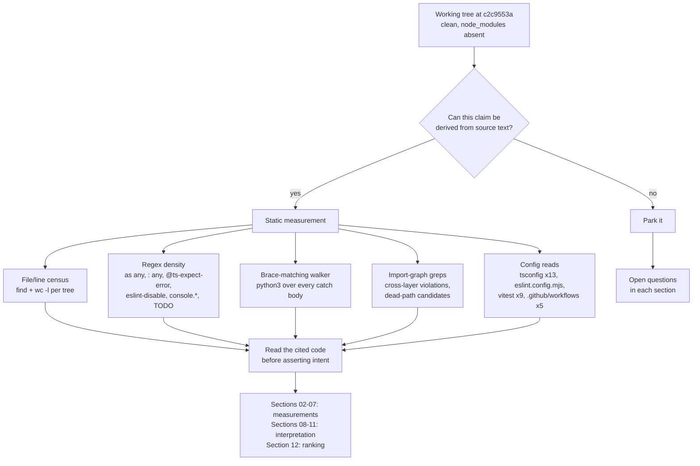
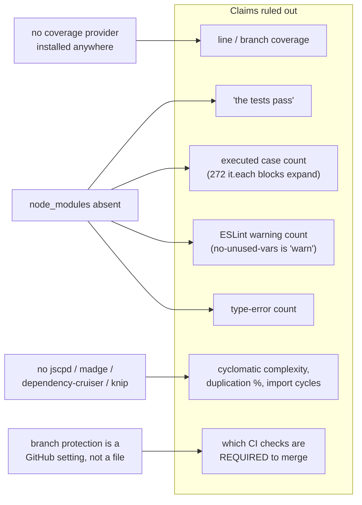

# 01 — Method

What was measured, with what command, and what this method cannot tell you. Read this
before any number in sections 02-07, because the single most important fact about all
of them is that no test was executed.

**Sources:** the working tree at `c2c9553a`;
[`../appendix/research/quality-testing-ci-deps/06-quality-and-metrics.md`](../appendix/research/quality-testing-ci-deps/06-quality-and-metrics.md),
[`06c-metrics-scale-and-gates.md`](../appendix/research/quality-testing-ci-deps/06c-metrics-scale-and-gates.md),
[`07-open-questions.md`](../appendix/research/quality-testing-ci-deps/07-open-questions.md).

## The measurement environment

```bash
git rev-parse --short HEAD          # c2c9553a
git status --porcelain              # (empty — clean tree)
test -d node_modules                # absent
pnpm --version                      # 10.28.0
```

`node_modules` is absent at the repository root and in every package. `pnpm` itself
is available, but installing would run the repository's `postinstall` chain against
the network, and that chain includes `scripts/sync-maic-importer.mjs`, which copies a
build artefact into `public/vendor/`. Installing therefore *changes the tree being
measured*. The decision taken was: measure the tree as committed, and state plainly
what that forfeits.

Every command below uses literal paths rather than shell variables, because the
measuring shell was `zsh`, where an unquoted `$VAR` holding several paths does **not**
word-split. The commands as printed run identically under `bash` and `zsh`.

## The method



The step labelled *Read the cited code* is not decoration. Three claims inherited
from the evidence packs did not survive it and are corrected in place:

| Inherited claim | What the code says | Corrected in |
| --- | --- | --- |
| "all `@ts-expect-error` live in tests" | 6 of 29 are in shipping source — 4 CSS-custom-property casts under `components/slide-renderer/`, one in `packages/@openmaic/renderer/src/elements/shape/BaseShapeElement.tsx:132`, one for an untyped dependency at `packages/@openmaic/importer/src/serializer/mathSerializer.ts:19` | [03-type-safety.md](./03-type-safety.md) |
| "five package Vitest suites run in CI" | Four do. `@openmaic/renderer` and `@openmaic/editor` are invoked by no workflow | [05-test-strategy.md](./05-test-strategy.md) |
| "legacy video-export is a dead path" | `lib/video-export/legacy/read.ts` is imported by `lib/video-export/passes/visuals.ts:24` and is live | [10-duplication-and-dead-code.md](./10-duplication-and-dead-code.md) |

## The commands, by category

### Scale

```bash
# per tree, for each of: app components lib packages/@openmaic tests e2e eval render-service scripts types
find <tree> -type f \( -name '*.ts' -o -name '*.tsx' -o -name '*.mjs' -o -name '*.js' \) \
  ! -path '*/node_modules/*' ! -path '*/dist/*' | wc -l
find <tree> -type f \( -name '*.ts' -o -name '*.tsx' -o -name '*.mjs' -o -name '*.js' \) \
  ! -path '*/node_modules/*' ! -path '*/dist/*' -print0 | xargs -0 cat | wc -l
```

### File-size distribution

```bash
find app components lib packages/@openmaic/*/src render-service/src types \
  -type f \( -name '*.ts' -o -name '*.tsx' \) ! -path '*/dist/*' -print0 \
  | xargs -0 wc -l | grep -v ' total$' \
  | awk '{n=$1; if(n<=100)a++; else if(n<=200)b++; else if(n<=400)c++;
          else if(n<=800)d++; else if(n<=1500)e++; else f++}
         END {print a,b,c,d,e,f,a+b+c+d+e+f}'
```

### Type-safety density

```bash
grep -rn --include='*.ts' --include='*.tsx' -e 'as any\b' \
  app components lib packages/@openmaic render-service/src types | grep -v '/dist/' | wc -l
grep -rn --include='*.ts' --include='*.tsx' \
  -E ':[[:space:]]*any(\[\])?([[:space:],);>=]|$)' \
  app components lib packages/@openmaic render-service/src types | grep -v '/dist/' | wc -l
grep -rn --include='*.ts' --include='*.tsx' -e '@ts-ignore' <same paths> | wc -l
grep -rn --include='*.ts' --include='*.tsx' -e '@ts-expect-error' <same paths> | wc -l
```

### Lint suppression density

```bash
grep -rn --include='*.ts' --include='*.tsx' --include='*.mjs' -e 'eslint-disable' \
  app components lib packages/@openmaic tests e2e eval scripts render-service/src types \
  | grep -v '/dist/' | wc -l
grep -rhno --include='*.ts' --include='*.tsx' --include='*.mjs' \
  -E 'eslint-disable(-next-line|-line)?[[:space:]]+[@a-z0-9/_-]+' <same paths> \
  | sed -E 's/.*eslint-disable(-next-line|-line)?[[:space:]]+//' | sort | uniq -c | sort -rn
```

### Error handling

A regex cannot classify a `catch` body, so a brace-matching walker was used. It scans
every `.ts`/`.tsx` file under `app`, `components`, `lib`, `render-service/src` and each
`packages/@openmaic/*/src`, finds each `catch (…) {`, matches braces to the closing
`}`, strips `//` and `/* */` comments from the body, and classifies the remainder as
empty / comment-only / single-`console.*` / code. The full script is reproduced in
[07-error-handling.md](./07-error-handling.md).

### Test volume

```bash
find tests -name '*.test.ts' | wc -l
grep -rhoE '^[[:space:]]*(it|test)(\.[a-z]+)?\(' tests | wc -l
# then per package, and for render-service and e2e
```

### Route test coverage

The sharpest available substitute for coverage: does any file under `tests/`, `e2e/`
or `packages/@openmaic/*/test/` contain the alias-form import specifier of this route
module?

```python
python3 - <<'PY'
import os
blob=[]
for root in ['tests','e2e','packages/@openmaic']:
    for dp,dn,fn in os.walk(root):
        if 'node_modules' in dp or '/dist' in dp: continue
        for f in fn:
            if f.endswith(('.ts','.tsx')):
                blob.append(open(os.path.join(dp,f),encoding='utf-8',errors='ignore').read())
blob='\n'.join(blob)
routes=[os.path.join(dp,f) for dp,dn,fn in os.walk('app/api') for f in fn if f=='route.ts']
miss=[r for r in sorted(routes) if f"@/{r[:-3]}" not in blob and f"@/{r}" not in blob]
print('routes',len(routes),'referenced',len(routes)-len(miss),'unreferenced',len(miss))
for m in miss: print('  ',m)
PY
```

This is a measure of *import*, not of assertion quality. A route imported by a test
that asserts nothing counts as referenced.

## What this method cannot support



Seven classes of claim are therefore absent from this topic:

1. **"The suite passes."** Not run. Any statement here about a test is a statement
   about the text of the test, not its result.
2. **Line or branch coverage.** No provider is installed
   (`grep -rn 'coverage' package.json packages/@openmaic/*/package.json render-service/package.json vitest*.config.ts packages/@openmaic/*/vitest.config.ts render-service/vitest.config.ts`
   → exit 1, no output), so coverage cannot be produced even after an install without
   first adding a dependency.
3. **The executed case count.** 7 837 is a floor, not a total:
   `grep -rhoE '\b(it|test)\.each\b' tests packages/@openmaic/*/test | wc -l` → 272
   parameterised blocks, each expanding to as many runtime cases as its table has rows.
4. **The current ESLint warning count.** `@typescript-eslint/no-unused-vars` is
   configured as `'warn'` (`eslint.config.mjs:65`), so warnings can accumulate with no
   gate counting them.
5. **Cyclomatic complexity, duplication percentage, or import-cycle counts.** No
   tool for any of these is installed, and adding one changes the tree.
6. **Which CI checks are required to merge.** That is a repository setting. Three
   workflow comments show the design intends specific answers
   (`publish-openmaic-skill.yml:8-9`, `publish-packages.yml:29-36`,
   `publish-packages.yml:298-300`) but none of them is the setting.
7. **Non-null assertion count as anything but an order of magnitude.** The figure in
   [03-type-safety.md](./03-type-safety.md) comes from a regex and will both miss forms
   and catch string-content false positives.

## Two measurement notes that change numbers

**Denominator ambiguity.** `packages/@openmaic` contains each package's own `test/`
tree. Counted whole it is 117 036 lines; counted as `packages/@openmaic/*/src` only,
the source subtotal drops. Section 03's `as any` density uses the whole-tree
denominator (**333 699** lines, `grep`'s own path set); section 02's size distribution
uses the src-only set (**1 382 files, 297 767 lines**). Both are stated at the point of
use.

**`console.` is not `console.*`.** `grep -rhoE 'console\.[a-zA-Z]+'` over the source
trees returns 107, but four of those hits are `console.aliyun` and `console.volcengine`
inside provider console URLs. The real count over the six logging levels is 103.

## Open questions

- Whether any figure here would change after an install is unknown. The most likely
  candidate is the ESLint suppression count, since `pnpm build` regenerates
  `public/vendor/maic-importer/` — a path `eslint.config.mjs:45` ignores, so probably
  not, but that is inference rather than measurement.
- `find scripts -type f \( -name '*.ts' -o -name '*.mjs' -o -name '*.js' \)` returns
  16 files / 2 670 lines here, against 17 / 2 728 recorded in the evidence pack. The
  discrepancy is unexplained; the pack's own module list contains one path
  (`scripts/check-package-village-bumps.mjs`) that does not exist on disk, so a
  transcription error in the pack is the likelier explanation than a tree change.
  [02-size-and-shape.md](./02-size-and-shape.md) uses the measured 16 / 2 670, so its
  first-party subtotal (1 614 / 349 611) is the sum of its own rows rather than the
  pack's total.
