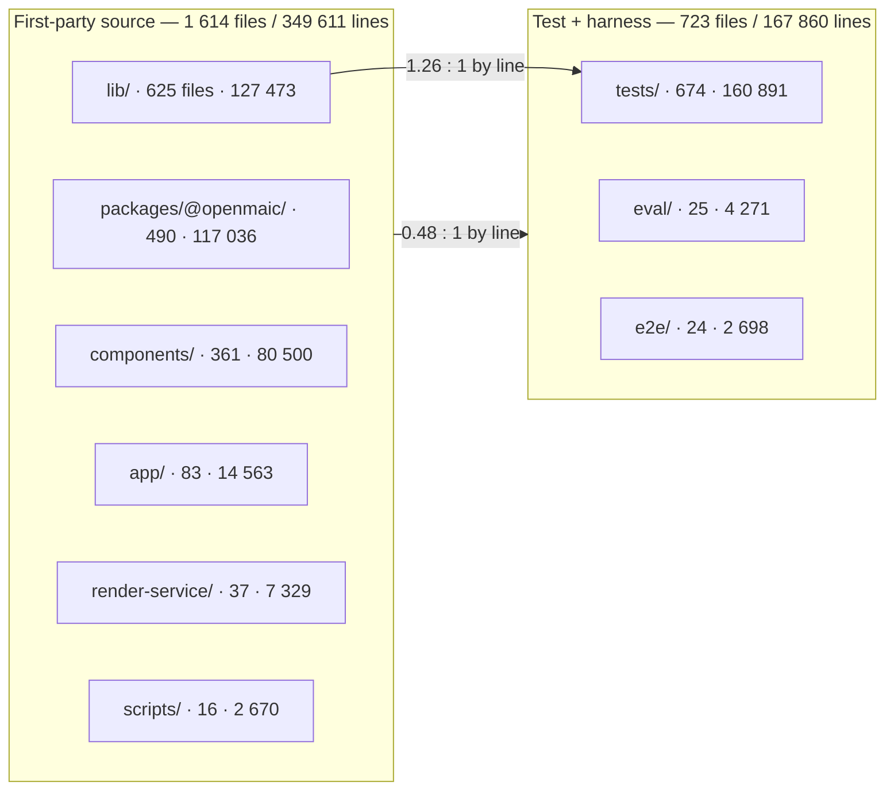
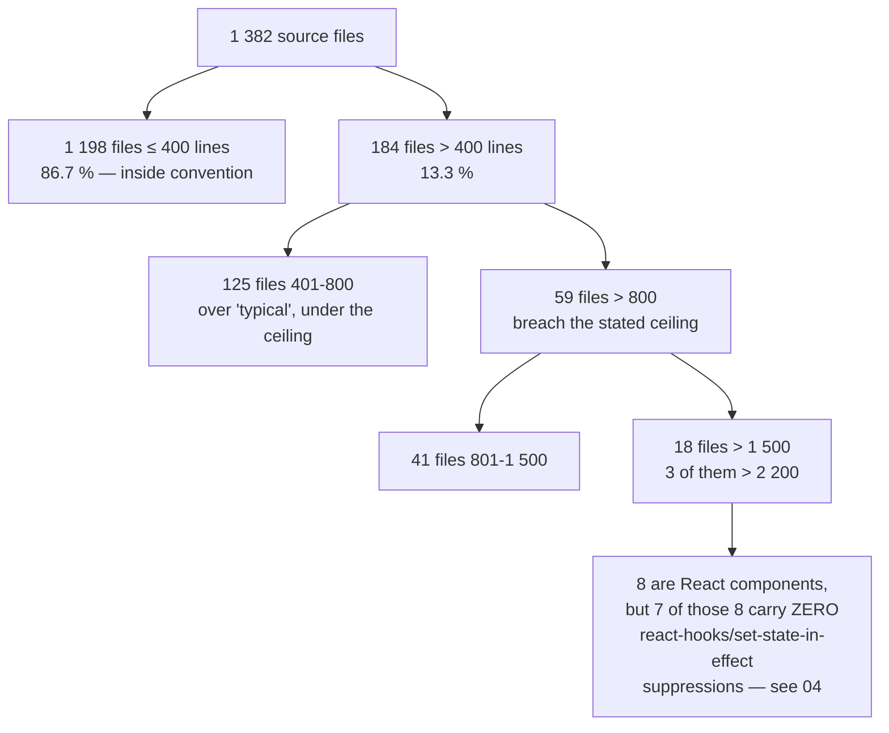

# 02 — Size and shape

How much code there is, where it sits, how it is distributed by file size, and which
of the 18 files over 1 500 lines earn their size. The repository's own convention is
recorded in the global coding rules as *200-400 lines typical, 800 max*; this section
measures how often that is exceeded and whether the exceptions are the same ones every
time.

**Sources:** `find`/`wc` census of the working tree at `c2c9553a`;
[`../appendix/research/quality-testing-ci-deps/06c-metrics-scale-and-gates.md`](docs/appendix/research/quality-testing-ci-deps/06c-metrics-scale-and-gates.md).

## Lines by tree

```bash
find <tree> -type f \( -name '*.ts' -o -name '*.tsx' -o -name '*.mjs' -o -name '*.js' \) \
  ! -path '*/node_modules/*' ! -path '*/dist/*' | wc -l          # files
find <tree> ... -print0 | xargs -0 cat | wc -l                    # lines
```

| Tree | Files | Lines | Note |
| --- | --- | --- | --- |
| `lib/` | 625 | 127 473 | Domain code — the centre of gravity |
| `packages/@openmaic/` | 490 | 117 036 | Six publishable packages, **including** their own `test/` trees |
| `components/` | 361 | 80 500 | React |
| `app/` | 83 | 14 563 | 69 API routes + 8 route components |
| `render-service/` | 37 | 7 329 | Standalone MP4 render service (own lockfile, own tsconfig) |
| `scripts/` | 16 | 2 670 | CI/release helpers |
| `types/` | 2 | 40 | |
| **first-party source subtotal** | **1 614** | **349 611** | Sum of the rows above |
| `tests/` | 674 | 160 891 | Root Vitest project |
| `eval/` | 25 | 4 271 | Four LLM eval harnesses + shared |
| `e2e/` | 24 | 2 698 | Playwright |

Test-to-source by line: **0.48 : 1** overall; **1.26 : 1** measured against `lib/`
alone. The two ratios differ because `packages/@openmaic` counts its own tests inside
the source subtotal.



## File-size distribution

Measured over `app`, `components`, `lib`, `packages/@openmaic/*/src`,
`render-service/src` and `types` — i.e. source only, package test trees excluded.
**1 382 files, 297 767 lines.**

| Bucket | Files | Share | Cumulative |
| --- | --- | --- | --- |
| ≤ 100 lines | 646 | 46.7 % | 46.7 % |
| 101-200 | 311 | 22.5 % | 69.2 % |
| 201-400 | 241 | 17.4 % | 86.7 % |
| 401-800 | 125 | 9.0 % | 95.7 % |
| 801-1 500 | 41 | 3.0 % | 98.7 % |
| > 1 500 | 18 | 1.3 % | 100 % |

```bash
find app components lib packages/@openmaic/*/src render-service/src types \
  -type f \( -name '*.ts' -o -name '*.tsx' \) ! -path '*/dist/*' -print0 \
  | xargs -0 wc -l | grep -v total | awk '$1>400' | wc -l   # 184
#                                        ... awk '$1>800' | wc -l   # 59
#                                        ... awk '$1>1500' | wc -l  # 18
```

**The house convention is exceeded 184 times (13.3 %) and the hard 800-line ceiling
59 times (4.3 %).** Read the other way: 86.7 % of files are at or under 400 lines and
nearly half are under 100. The distribution is healthy in the aggregate; the problem
is a small, named, and — as section 03 and 04 show — *repeatedly the same* tail.



### Where the breaches live

```bash
for d in app components lib packages/@openmaic render-service/src; do
  find $d -type f \( -name '*.ts' -o -name '*.tsx' \) ! -path '*/dist/*' \
    ! -path '*/node_modules/*' ! -path '*/test/*' -print0 \
    | xargs -0 wc -l | grep -v total | awk '$1>800' | wc -l
done
```

| Tree | Files > 800 lines |
| --- | --- |
| `lib` | 22 |
| `components` | 17 |
| `packages/@openmaic` | 16 |
| `app` | 3 |
| `render-service/src` | 1 |

## The 18 files over 1 500 lines

```bash
find app components lib packages/@openmaic/*/src render-service/src types \
  -type f \( -name '*.ts' -o -name '*.tsx' \) ! -path '*/dist/*' -print0 \
  | xargs -0 wc -l | grep -v total | awk '$1>1500' | sort -rn
```

| Lines | Path | Kind | Size justified? |
| --- | --- | --- | --- |
| 6 574 | `packages/@openmaic/importer/src/shapes/presets.ts` | data | **Yes.** One `Map` of 154 OOXML preset geometry generators, populated from `:149`, plus overlay/accessor functions at `:4040`, `:4449`, `:6546`. Splitting it buys nothing; its real problem is test cover, not length ([05](docs/14-code-quality/05-test-strategy.md)) |
| 2 420 | `lib/ai/providers.ts` | registry + logic | **Partly.** The `PROVIDERS` record spans `:75`-`:1551` (1 477 lines, brace-matched from `:75`) — 61 % of the file is a declarative table. The remaining ~870 lines (`getModel` `:2033`, `parseModelString` `:2370`, deprecation handling `:2348`) are logic that could live beside it |
| 2 298 | `components/workbench/workspace/WorkspaceRail.tsx` | React | **No.** 56 combined `useState`/`useEffect`/`useCallback`/`useMemo` occurrences in one component |
| 2 286 | `components/chat/use-chat-sessions.ts` | React hook | **No.** 26 top-level exports from one hook module |
| 2 248 | `lib/store/settings.ts` | zustand store | **No.** 91 state fields and 42 setters (each declared once in the state type and once in the implementation, so 84 `set…:` occurrences); the custom `merge` re-runs ten normalisation passes on every rehydrate |
| 2 189 | `components/roundtable/index.tsx` | React | **Borderline.** Purely presentational with 57 props and 17 lines carrying `useState`/`useEffect`; the size follows from the prop count, which is the actual defect |
| 2 173 | `lib/workbench/session-store.ts` | zustand store | **Argued.** Contains an 840-line pure `foldEvent` (`:913`-`:1752`) over 21 `case` labels and 22 distinct event literals. Purity is load-bearing for exact `Last-Event-ID` resumption, so keeping the fold in one function is defended; the *store* around it is what is large |
| 1 931 | `packages/@openmaic/generation/src/scene-generator.ts` | generator | **No.** Six unrelated concerns: scene routing, DSL element repair, KaTeX rendering, an HTML attribute scraper (`:1289`-`:1564`), PBL fallback policy, four canned action lists |
| 1 923 | `lib/server/agent-runtime/runner.ts` | server runtime | **Argued in-source.** `runSession` alone is `:889`-`:1858` = 970 lines, with the rationale at `:886`-`:888`: ~22 mutable closure cells pair with nested `finally` blocks. Seventeen pure helpers *were* extracted (`:129`, `:203`, `:269`, …). See [08](docs/14-code-quality/08-complexity-hotspots.md) |
| 1 896 | `app/page.tsx` | React page | **No.** 27 `useState` occurrences, 9 `useEffect`, 13 `useRef` in one client component that also hosts the Pro runtime probe, generation handoff, folder CRUD, search and thumbnail lifecycle |
| 1 864 | `lib/pbl/v2/agents/instructor.ts` | agent | **Borderline.** Three-phase turn generator plus heavy output post-processing |
| 1 848 | `components/edit/PlaybackChromeRoot.tsx` | React | **No.** 28 `useState`, 22 `useRef`, 11 `useEffect`, 31 `useCallback`; the scene-init effect spans `:655`-`:961` with an exhaustive-deps suppression at `:960` |
| 1 794 | `packages/@openmaic/importer/src/serializer/textSerializer.ts` | serializer | **Borderline.** One OOXML text-run walker; branch count follows the format |
| 1 710 | `packages/@openmaic/storage/src/agent-session/pg.ts` | PG backend | **Yes.** Schema DDL plus the lifecycle/lease/event-log/entry-tree implementations for one backend; splitting separates DDL from the queries that depend on it |
| 1 672 | `components/settings/tts-settings.tsx` | React | **No.** Largest component in its area, and larger than the whole `lib/whiteboard` package |
| 1 554 | `app/generation-preview/page.tsx` | React page | **No.** Drives the six-step generation pipeline and owns the `previewPhase` state machine in the same file as its UI |
| 1 553 | `components/scene-renderers/pbl/v2/chat.tsx` | React | **No.** |
| 1 523 | `components/generation/outlines-editor.tsx` | React | **No.** |

Five further files over 1 400 lines sit just under the cut and belong to the same
cluster: `components/edit/ActionsBar/ActionsBar.tsx` (1 480), `lib/utils/chat-storage.ts`
(1 455), `lib/audio/constants.ts` (1 454, a 20-export provider registry — defensible),
`lib/export/use-export-pptx.ts` (1 443) and
`lib/video-export/emit-hyperframes/index.ts` (1 404).

### The commands behind the shape figures in that table

Every per-file figure above is a line count over one file, so each carries its own
command. The recurring ones:

```bash
grep -cE 'use(State|Effect|Callback|Memo)' components/workbench/workspace/WorkspaceRail.tsx  # 56
grep -cE '^export ' components/chat/use-chat-sessions.ts                                     # 26
sed -n '81,426p' lib/store/settings.ts | grep -cE '^  [a-zA-Z]+\??:'                         # 91 fields
grep -cE '^  set[A-Z]' lib/store/settings.ts                                                 # 42 setters
sed -n '45,112p' components/roundtable/index.tsx | grep -cE '^[[:space:]]*readonly '          # 57 props
grep -cE 'useState|useEffect' components/roundtable/index.tsx                                # 17
grep -c useState app/page.tsx; grep -c 'useEffect(' app/page.tsx; grep -c useRef app/page.tsx  # 27 / 9 / 13
python3 -c "s=open('lib/ai/providers.ts').read().split('\n');d=0
for i in range(74,len(s)):
    d+=s[i].count('{')-s[i].count('}')
    if d==0 and i>74: print(75,i+1); break"                                                  # 75 1551
```

## The one structural signal, and the correlation that is not there

Of the 18 files over 1 500 lines, **eight are React components** (`WorkspaceRail`,
`roundtable/index`, `PlaybackChromeRoot`, `tts-settings`, `pbl/v2/chat`,
`outlines-editor`, plus the two page components `app/page.tsx` and
`app/generation-preview/page.tsx`). `PlaybackChromeRoot.tsx` is simultaneously the
second-worst `eslint-disable` file (5) and the third-worst `as any` file (3):

```bash
grep -rc --include='*.ts' --include='*.tsx' -e 'as any\b' app components lib \
  packages/@openmaic render-service/src types | grep -v ':0$' | sort -t: -k2 -rn | head -3
# lib/action/engine.ts:9
# components/slide-renderer/Editor/Canvas/Operate/index.tsx:5
# components/edit/PlaybackChromeRoot.tsx:3
```

**The tempting next step — "the oversized components are also the ones suppressing the
React effect rules" — is false, and the measurement says so:**

```bash
for f in components/workbench/workspace/WorkspaceRail.tsx components/roundtable/index.tsx \
         components/edit/PlaybackChromeRoot.tsx components/settings/tts-settings.tsx \
         components/scene-renderers/pbl/v2/chat.tsx components/generation/outlines-editor.tsx \
         app/page.tsx app/generation-preview/page.tsx; do
  printf '%s %s\n' "$(grep -c 'set-state-in-effect' $f)" "$f"; done
# 1 components/scene-renderers/pbl/v2/chat.tsx — and 0 for the other seven
```

Seven of the eight carry **zero** `react-hooks/set-state-in-effect` suppressions; the
eighth carries one. The 34 suppressions are spread across **29 files**, 27 of them
holding exactly one, and the largest single holder is the legacy canvas
`components/slide-renderer/` (7 across 6 files) — none of which is over 1 500 lines.

What *is* true, and is the useful signal: **every one of the 34 is in React code and
none is in domain code.** By top-level directory: `components/**` 26,
`packages/@openmaic/**` React surfaces 4, `lib/hooks/**` 3, `app/**` 1 — and 0 anywhere
else under `lib/`. The same holds for `react-hooks/exhaustive-deps` (19, all in React
code). So the effect-rule debt is a property of the React layer, but it is *thin and
diffuse* rather than concentrated in the big files.

Size, by contrast, does split by layer in the way the table suggests: `lib/` has 22
files over 800 lines and its offenders are argued for in-source
([`runner.ts:886-888`](lib/server/agent-runtime/runner.ts#L886-L888), [`session-store.ts:490-510`](lib/workbench/session-store.ts#L490-L510)); `components/` has 17 and its
offenders are not argued for anywhere.

## Open questions

- Whether `components/roundtable/index.tsx`'s 57 props are a deliberate
  "presentational component, all state injected" choice or accreted drift. The file
  carries no header comment on the decision, unlike `runner.ts` and `session-store.ts`.
- `lib/ai/providers.ts` has no comment explaining why the ~870 lines of logic live in
  the same file as the 1 477-line registry, so whether that is deliberate co-location
  or the registry having grown around the logic is not recorded.
