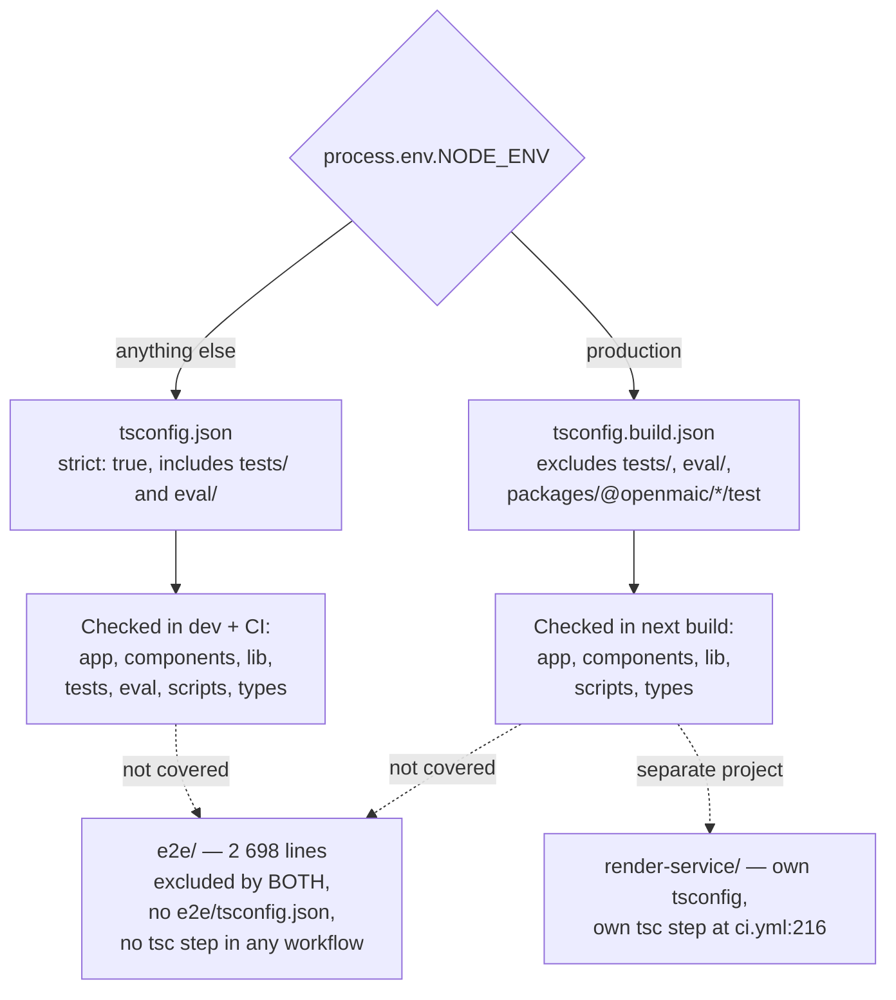
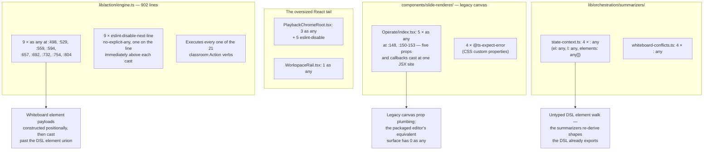

# 03 — Type safety

Compiler strictness across the thirteen `tsconfig*.json` files, and measured counts of
every escape hatch the language offers. The headline is genuinely good and the headline
is also incomplete: `as any` is rare, but `as unknown as` is 4× more common in shipping
source and no gate counts it.

**Sources:** `tsconfig.json`, `tsconfig.build.json`, `next.config.ts`, the six
`@openmaic` package `tsconfig.json` files, `render-service/tsconfig.json`;
[`../appendix/research/quality-testing-ci-deps/06-quality-and-metrics.md`](docs/appendix/research/quality-testing-ci-deps/06-quality-and-metrics.md).

## Strictness settings

```bash
find . -name 'tsconfig*.json' -not -path '*/node_modules/*' | sort   # 13 files
grep -E '"(strict|noUncheckedIndexedAccess|exactOptionalPropertyTypes|noImplicitAny|noFallthroughCasesInSwitch|noUnusedLocals|skipLibCheck)"' \
  packages/@openmaic/*/tsconfig.json render-service/tsconfig.json
```

| Setting | Root (`tsconfig.json`) | Six `@openmaic` packages | `render-service` |
| --- | --- | --- | --- |
| `strict` | `true` (`:7`) | `true` in all six | `true` |
| `noFallthroughCasesInSwitch` | not set | `true` in 5 of 6 (absent in `editor`) | `true` |
| `noUnusedLocals` | not set | explicitly `false` in 5 of 6 | not set |
| `noUncheckedIndexedAccess` | **not set anywhere** | — | — |
| `exactOptionalPropertyTypes` | **not set anywhere** | — | — |
| `skipLibCheck` | `true` | `true` in all six | `true` |
| `allowJs` | `true` (`:5`) | not set | not set |

**There is no `ignoreBuildErrors` and no `ignoreDuringBuilds`** anywhere in
`next.config.ts` (59 lines, `grep -n 'ignoreBuildErrors\|ignoreDuringBuilds' next.config.ts`
→ no match). Type errors block the production build. That is the single most important
strictness fact and it is easy to get wrong in a Next.js repository.

`strict: true` implies `noImplicitAny`, `strictNullChecks`, `strictFunctionTypes`,
`strictBindCallApply`, `strictPropertyInitialization`, `noImplicitThis` and
`useUnknownInCatchVariables`. The two absent settings —
`noUncheckedIndexedAccess` and `exactOptionalPropertyTypes` — are the two the
TypeScript team ships outside `strict` because they are noisy on existing code, so
their absence is conventional rather than a lapse. It does mean every `array[i]` and
`record[key]` in 297 767 lines is typed as present when it may be `undefined`.

### The dev/production config split

[`next.config.ts:13`](next.config.ts#L13):

```ts
tsconfigPath: process.env.NODE_ENV === 'production' ? 'tsconfig.build.json' : 'tsconfig.json',
```

`tsconfig.build.json` extends the root config but **replaces** `exclude` rather than
extending it (`exclude` is not additive in TypeScript), adding `tests`, `eval` and
`packages/@openmaic/*/test`. Its own comment at `:3` records the consequence: *"`exclude`
replaces the inherited list; keep shared entries in sync with `tsconfig.json`."* So a
path added to `tsconfig.json`'s exclude list and not mirrored here silently starts being
type-checked in production builds only. The two lists are kept consistent by that
comment alone.

Both configs exclude `e2e` and `render-service`. `e2e/` (24 files, 2 698 lines) has **no
`tsconfig.json` of its own** and no workflow runs `tsc` over it — see
[05-test-strategy.md](docs/14-code-quality/05-test-strategy.md).



## Escape-hatch counts

All counts over `app`, `components`, `lib`, `packages/@openmaic`,
`render-service/src`, `types`, with `/dist/` filtered out.

```bash
grep -rn --include='*.ts' --include='*.tsx' -e 'as any\b' <paths> | grep -v '/dist/' | wc -l   # 31
grep -rn --include='*.ts' --include='*.tsx' -e '@ts-ignore' <paths>          | wc -l           # 0
grep -rn --include='*.ts' --include='*.tsx' -e '@ts-expect-error' <paths>    | wc -l           # 23
grep -rn --include='*.ts' --include='*.tsx' 'as unknown as' <paths> | grep -v '/dist/' | wc -l # 305
grep -rn --include='*.ts' --include='*.tsx' \
  -E ':[[:space:]]*any(\[\])?([[:space:],);>=]|$)' <paths> | grep -v '/dist/' | wc -l          # 23 raw
#   ... | grep -vE ':[0-9]+:[[:space:]]*(\*|//)'                                     | wc -l   # 13 real
grep -rn --include='*.ts' --include='*.tsx' ': unknown' \
  app components lib packages/@openmaic/*/src render-service/src types | wc -l                # 790
grep -rhoE '[]A-Za-z0-9_)]!(\.|\)|,|;|\[| )' --include='*.ts' --include='*.tsx' \
  app components lib packages/@openmaic/*/src render-service/src types | grep -v '!=' | wc -l # 338
```

Note the bracket expression in that last pattern: `]` must come **first**, because POSIX
ERE does not honour `\]` inside a bracket expression. Writing it as `[A-Za-z0-9_)\]]`
makes `grep` read the class as closing at the `\]` and then require a literal `]`, which
silently under-counts (62 instead of 338).

| Escape | Count | Per 1 000 source lines | Notes |
| --- | --- | --- | --- |
| `as any` | **31** | 0.10 | Across 16 files |
| explicit `: any` annotation | **13** | 0.04 | Across 6 files, all in `lib/`. The raw regex returns 23; 10 of those are the English word "any" in doc comments (e.g. [`packages/@openmaic/dsl/src/runtime.ts:228`](packages/@openmaic/dsl/src/runtime.ts#L228) *"any value EXCEPT"*, [`packages/@openmaic/importer/src/serializer/mathSerializer.ts:267`](packages/@openmaic/importer/src/serializer/mathSerializer.ts#L267) *"Catch-all: any Mathematical Alphanumeric Symbol"*) |
| `@ts-ignore` | **0** | 0 | The single repo-wide hit is a code sample inside [`packages/@openmaic/importer/SKILL.md`](packages/@openmaic/importer/SKILL.md) |
| `@ts-expect-error` | **29** repo-wide | — | **6 are in shipping source**, not tests — see below |
| `as unknown as` | **128** in `*/src` + `app` + `components`, 305 counting package `test/` trees | 0.43 (src only) | 71 source files. **The real escape hatch, and nothing counts it.** |
| non-null `!` (regex heuristic) | 338 | 1.14 | Order of magnitude only; regex `[]A-Za-z0-9_)]!(\.|\)|,|;|\[| )` minus `!=`. 499 counting package `test/` trees |
| `: unknown` annotation | 790 | 2.65 | The narrowing discipline that makes the low `any` count real. 913 counting package `test/` trees |

Source denominator for the per-1 000 figures: **297 767** lines across the 1 382
`*/src` files (see [02-size-and-shape.md](docs/14-code-quality/02-size-and-shape.md)). Ratios that use the
whole-`packages/@openmaic` denominator (333 699) are ~11 % lower.

### The `@ts-expect-error` correction

The evidence pack states all `@ts-expect-error` live in test files. They do not:

```bash
grep -rn --include='*.ts' --include='*.tsx' -e '@ts-expect-error' \
  app components lib packages/@openmaic render-service/src types | grep -v '/test/'
```

| Site | Reason |
| --- | --- |
| [`components/slide-renderer/components/element/ShapeElement/BaseShapeElement.tsx:108`](components/slide-renderer/components/element/ShapeElement/BaseShapeElement.tsx#L108) | CSS custom property on a `style` object |
| [`components/slide-renderer/components/element/ShapeElement/index.tsx:194`](components/slide-renderer/components/element/ShapeElement/index.tsx#L194) | same |
| [`components/slide-renderer/components/element/TextElement/BaseTextElement.tsx:48`](components/slide-renderer/components/element/TextElement/BaseTextElement.tsx#L48) | same |
| [`components/slide-renderer/components/element/TextElement/index.tsx:197`](components/slide-renderer/components/element/TextElement/index.tsx#L197) | same |
| [`packages/@openmaic/renderer/src/elements/shape/BaseShapeElement.tsx:132`](packages/@openmaic/renderer/src/elements/shape/BaseShapeElement.tsx#L132) | same |
| [`packages/@openmaic/importer/src/serializer/mathSerializer.ts:19`](packages/@openmaic/importer/src/serializer/mathSerializer.ts#L19) | *"omml2mathml has no type declarations"* |

All six are benign and self-documenting — CSS custom properties genuinely are not in
`React.CSSProperties`, and an untyped dependency genuinely needs a suppression. The
correction matters only because the original claim was used to argue that the codebase
has *zero* compiler suppressions in shipping code. It has six, all justified.

The remaining 23 are in test files, and several are deliberate **negative type
assertions**: `packages/@openmaic/storage/test/http-kv-store.test.ts` alone has 9,
probing that a networked store cannot be handed the device scope. [`ci.yml:181-184`](.github/workflows/ci.yml#L181-L184)
records why storage gets a second `tsc -p tsconfig.test.json` run — *"a probe nothing
type-checks proves nothing"*.

## Where unsafety concentrates



### `lib/action/engine.ts` is the single hotspot

```bash
grep -c 'as any' lib/action/engine.ts        # 9
grep -c 'eslint-disable' lib/action/engine.ts # 9
```

Nine `as any` (`:498`, `:529`, `:559`, `:594`, `:657`, `:692`, `:732`, `:754`, `:804`) and
nine `eslint-disable-next-line @typescript-eslint/no-explicit-any`, each on the line
immediately above its cast (`:497`, `:528`, `:558`, `:593`, `:656`, `:691`, `:731`,
`:753`, `:803`) — nine pairs, in the 902-line module that executes every classroom
action. The pattern at
`:490-500` is representative: a whiteboard element is built as a positional object
literal (`left`, `top`, `width`, `height`, `rotate`, `defaultFontName`, `defaultColor`)
and then cast past the DSL's `PPTElement` union with an inline suppression.

This is the highest-leverage type-safety fix in the repository: the DSL already exports
the element union and `normalizeElement` (`packages/@openmaic/dsl/src/normalize.ts`), so
constructing through the DSL's own builders would remove all nine casts and all nine
suppressions at once. See [12-remediation-backlog.md](docs/14-code-quality/12-remediation-backlog.md).

### The `as unknown as` blind spot

128 double assertions in 71 shipping source files. The top sites:

| File | Count |
| --- | --- |
| `app/api/materials/route.ts` | 8 |
| `lib/pbl/v2/agents/instructor.ts` | 6 |
| `lib/server/agent-runtime/course-tools.ts` | 5 |
| `lib/edit/scene-edit-bridge.ts` | 4 |
| `lib/agent/runtime/stream-fn.ts` | 4 |
| `components/edit/ActionsBar/actions-edit.ts` | 4 |
| 65 further files | 1-3 each |

A double assertion is narrower than `as any` — the result is typed, so it does not
propagate. But it bypasses structural checking exactly as completely, and unlike
`as any` it triggers no ESLint rule, appears in no metric, and needs no suppression
comment. Counted together, shipping source carries **159** assertion-based type-check
escapes (31 + 128) — 0.53 per 1 000 lines. That is still tight for 300 kLOC, but it is
five times the headline figure.

Two of those sites are load-bearing rather than cosmetic: all three folder routes reach
`DocumentFolderStore` through `as unknown as`
([`app/api/folders/route.ts:57,101`](app/api/folders/route.ts#L57), `app/api/folders/[id]/route.ts:66,110`,
[`app/api/folders/members/route.ts:54`](app/api/folders/members/route.ts#L54)) even though the underlying factory already
returns `DocumentStore & DocumentFolderStore` — the accessor's declared return type is
what narrows the capability away. And
[`components/edit/surfaces/slide/slide-edit-session.ts:164-166`](components/edit/surfaces/slide/slide-edit-session.ts#L164-L166) casts between the two
editor history types through what its own comment (`:160-162`) calls a "compatibility
bridge", to be kept "until its React surface moves into `@openmaic/editor`"
([09-architectural-consistency.md](docs/14-code-quality/09-architectural-consistency.md)).

## The genuinely good numbers

`as any` at 0.10 per 1 000 lines and zero `@ts-ignore` in 300 kLOC of TypeScript is
an order of magnitude tighter than typical for this size. It is not an accident of
counting: `: unknown` appears 790 times, i.e. the narrowing is done with `unknown` plus
shape guards rather than with `any`. Three packages hold the line completely:

```bash
for p in dsl editor generation importer renderer storage; do
  printf '%s %s\n' "$p" "$(grep -rn -E ':[[:space:]]*any' packages/@openmaic/$p/src | wc -l)"
done
# dsl 2 · editor 0 · generation 0 · importer 2 · renderer 0 · storage 1
```

## Open questions

- Whether [`lib/api/stage-api-types.ts:79,81`](lib/api/stage-api-types.ts#L79) (`setState: (partial: any) => void`,
  `subscribe: (listener: (state: any, prevState: any) => void)`) can be typed at all.
  It is describing a zustand store shape to an in-process agent toolkit, and zustand's
  own `StoreApi` generics may not survive the boundary. No comment records an attempt.
- Whether the 177 `as unknown as` in `packages/@openmaic/*/test` against the 128 in
  source is deliberate (tests legitimately fabricate malformed input) or whether the
  test figure hides fabrications that a helper factory should own. Not measured further.
- The 338 non-null assertions are unclassified. Whether any of them sit on a value that
  `noUncheckedIndexedAccess` would have caught is unknown without a compiler run.
