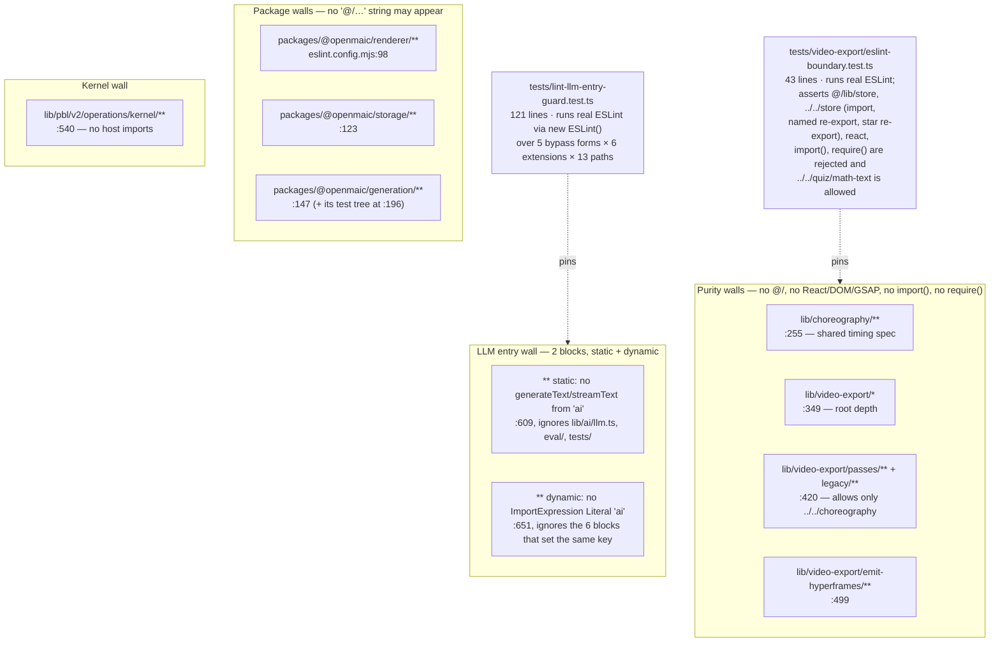
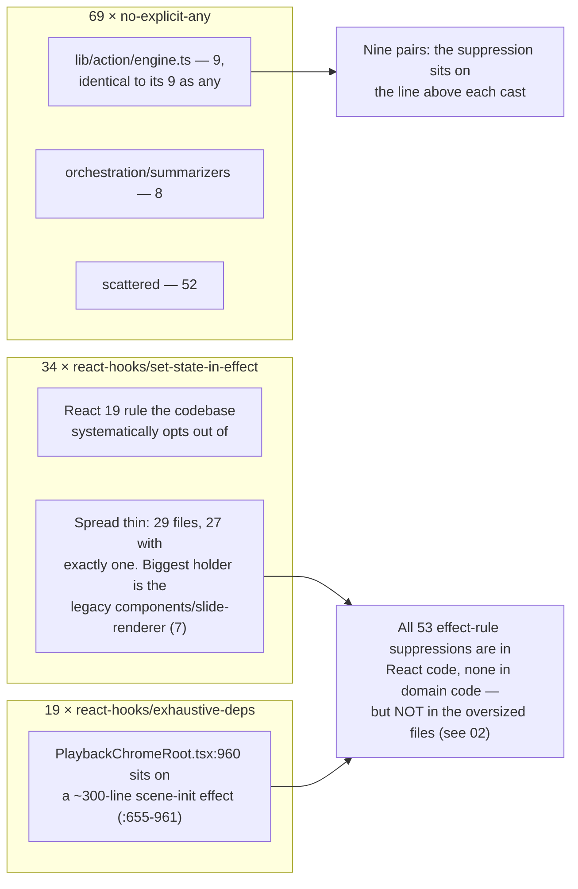

# 04 — Lint and format

`eslint.config.mjs` is 670 lines and almost none of it is style. It encodes seven
architectural boundaries as AST selectors, and one of those boundaries is itself pinned
by a test that runs real ESLint. Against that, 128 suppressions exist and three rules
account for 122 of them.

**Sources:** `eslint.config.mjs`, `.prettierrc`, `.prettierignore`,
`tests/lint-llm-entry-guard.test.ts`, `tests/video-export/eslint-boundary.test.ts`,
`.github/workflows/ci.yml`;
[`../appendix/research/quality-testing-ci-deps/02-interfaces.md`](../appendix/research/quality-testing-ci-deps/02-interfaces.md).

## Config shape

```bash
wc -l eslint.config.mjs .prettierignore .prettierrc   # 670 / 31 / 16
grep -nE "^\s+files:" eslint.config.mjs               # 11 file-scoped blocks
grep -nE "^\s+'[@a-z0-9/._-]+':\s*(\[|')" eslint.config.mjs   # 17 rule keys set
```

The config extends `eslint-config-next/core-web-vitals` and
`eslint-config-next/typescript`, then sets 17 rule keys: **two** conventional rules and
**fifteen** boundary-rule instances (10 + 5).

| Rule key | Setting | Purpose |
| --- | --- | --- |
| `@next/next/no-img-element` | `'off'` (`:62`) | AI-generated image URLs have unknown dimensions and un-allowlisted domains |
| `@typescript-eslint/no-unused-vars` | `'warn'` with `^_` ignore patterns (`:65`) | **Warn, not error** — see the gap below |
| `no-restricted-syntax` | `'error'` in 10 separate blocks (`:100,125,149,201,257,351,425,501,559,665`) | Every module boundary |
| `no-restricted-imports` | `'error'` in 4 blocks (`:306,392,469,542`) | `lib/choreography`, the two `lib/video-export` scopes, the PBL kernel |
| `@typescript-eslint/no-restricted-imports` | `'error'` in 1 block (`:620`) | The LLM entry point — a different key on purpose, so it cannot replace the four above (`:584-588`) |

Prettier is 16 lines of ordinary settings (`printWidth: 100`, `singleQuote: true`,
`trailingComma: 'all'`, `endOfLine: 'lf'`) enforced by `prettier . --check` at
`ci.yml:128`.

## The seven boundary walls



The AI-SDK ban is the most instructive part of the file. `AI_SDK_DYNAMIC_IMPORT_BAN`
(`:13`) is defined once and spread into the blocks that would otherwise lose it, with the
reason stated at `:5-12`: flat config *replaces* rule options per key rather than merging
them, so a single repo-wide block would silently drop each other block's own module
boundary.

```bash
grep -n 'AI_SDK_DYNAMIC_IMPORT_BAN' eslint.config.mjs
# :13 definition; spread at :102 (renderer), :127 (storage), :151 (generation),
# :203 (generation test tree), :561 (PBL kernel), :665 (the repo-wide dynamic block)
```

The config's own comment at `:5-12` says the ban is spread into "every block that sets the
key". It is in fact spread into 5 of the 10 such blocks: the `lib/choreography` and
`lib/video-export` blocks (`:257`, `:351`, `:425`, `:501`) do not carry it, because their
*positive* allowlists already reject `'ai'` outright — which the config explains at
`:648`. The comment at `:640-648` records the review that produced the arrangement:

> An earlier revision left them out on the reasoning that they are built in isolation
> against `@openmaic/dsl`; review showed `void import('ai')` under the renderer source
> path passing lint, which is exactly why that reasoning was not good enough.

`:600-607` records a second such round: an earlier revision guarded only `.ts`/`.tsx`,
which left `app/api/route.js` and `scripts/*.mjs` free to import the SDK. The scope is
now every linted extension and `tests/lint-llm-entry-guard.test.ts` pins the matrix.

Both meta-tests import ESLint programmatically and lint in-memory text:

```bash
grep -n "ESLint\|lintText" tests/lint-llm-entry-guard.test.ts tests/video-export/eslint-boundary.test.ts
# tests/lint-llm-entry-guard.test.ts:2:  import { ESLint } from 'eslint';
# tests/lint-llm-entry-guard.test.ts:62: const eslint = new ESLint({ cwd: process.cwd() });
# tests/video-export/eslint-boundary.test.ts:5: const eslint = new ESLint({ cwd: process.cwd() });
```

`tests/lint-llm-entry-guard.test.ts:65-68` goes one step further: a path ESLint would
*ignore* returns no result, and the test treats that as a sentinel failure rather than a
pass — so adding a path to `globalIgnores` cannot quietly turn the guard green.

## Suppression density

```bash
grep -rn --include='*.ts' --include='*.tsx' --include='*.mjs' -e 'eslint-disable' \
  app components lib packages/@openmaic tests e2e eval scripts render-service/src types \
  | grep -v '/dist/' | wc -l                                             # 128
grep -rhno --include='*.ts' --include='*.tsx' --include='*.mjs' \
  -E 'eslint-disable(-next-line|-line)?[[:space:]]+[@a-z0-9/_-]+' <same> \
  | sed -E 's/.*eslint-disable(-next-line|-line)?[[:space:]]+//' | sort | uniq -c | sort -rn
```

| Rule suppressed | Count | Share |
| --- | --- | --- |
| `@typescript-eslint/no-explicit-any` | 69 | 53.9 % |
| `react-hooks/set-state-in-effect` | 34 | 26.6 % |
| `react-hooks/exhaustive-deps` | 19 | 14.8 % |
| `prefer-const` | 2 | 1.6 % |
| `no-console` | 2 | 1.6 % |
| `react-hooks/refs` | 1 | 0.8 % |
| `@typescript-eslint/no-require-imports` | 1 | 0.8 % |
| **Total** | **128** | |

128 suppressions across ~500 kLOC of linted text (source + tests + eval + scripts) is
low, and the tail is genuinely trivial — two `prefer-const`, two `no-console`, one
`no-require-imports`. Everything interesting is in the first three rows.

```bash
grep -rc --include='*.ts' --include='*.tsx' --include='*.mjs' -e 'eslint-disable' <same> \
  | grep -v ':0$' | sort -t: -k2 -rn | head -12
```

| File | Suppressions |
| --- | --- |
| `lib/action/engine.ts` | 9 |
| `components/edit/PlaybackChromeRoot.tsx` | 5 |
| `tests/export/export-classroom-inline.test.ts` | 4 |
| `lib/orchestration/summarizers/whiteboard-conflicts.ts` | 4 |
| `lib/orchestration/summarizers/state-context.ts` | 4 |
| `components/workbench/workspace/WorkspaceShell.tsx` | 4 |
| `tests/export/classroom-zip.test.ts` | 3 |
| `lib/ai/llm.ts` | 3 |
| `components/edit/ActionsBar/ActionsBar.tsx` | 3 |

## Two readings that matter



**1. The `no-explicit-any` suppressions are the `as any` count.** `lib/action/engine.ts`
is simultaneously the top file on both metrics with 9 each, paired one-to-one: each
`eslint-disable-next-line` (`:497`, `:528`, `:558`, `:593`, `:656`, `:691`, `:731`,
`:753`, `:803`) sits directly above its cast (`:498`, `:529`, `:559`, `:594`, `:657`,
`:692`, `:732`, `:754`, `:804` — [03-type-safety.md](./03-type-safety.md)). Fixing the
type fixes the suppression; they are one debt, not two.

**2. The React effect rules are opted out of rather than satisfied — thinly and
everywhere, not in the big files.** 34 `react-hooks/set-state-in-effect` plus 19
`react-hooks/exhaustive-deps` is 53 of the 128, and every one of the 53 is in React code
with none in domain code. But the distribution is flat:

```bash
grep -rn --include='*.ts' --include='*.tsx' 'eslint-disable.*react-hooks/set-state-in-effect' \
  app components lib packages/@openmaic | cut -d/ -f1-2 | sort | uniq -c | sort -rn
# 7 components/slide-renderer · 4 packages/@openmaic · 4 components/workbench
# 4 components/settings · 4 components/edit · 3 lib/hooks · 3 components/ai-elements
# 2 components/scene-renderers · 1 components/classroom · 1 app/classroom · 1 components/user-profile.tsx
```

29 files hold the 34, and 27 of those hold exactly one. The single biggest holder is the
legacy canvas `components/slide-renderer/` (7 across 6 files), and `exhaustive-deps` has
the same shape (6 of 19 there). Only two files hold more than two suppressions of this
rule: `WorkspaceShell.tsx` (4, 1 323 lines) and `ActionsBar.tsx` (3, 1 480 lines) —
neither of which is one of the eight React files over 1 500 lines counted in
[02](./02-size-and-shape.md), seven of which carry none at all.
`PlaybackChromeRoot.tsx:960` suppresses `exhaustive-deps` on an effect spanning
`:655`-`:961`.

Note that neither of these is a lint config problem. Both rules are *on* and *erroring*;
the suppressions are visible, greppable and reviewable. The comment at
`eslint.config.mjs:600-601` states the design intent explicitly: *"An `eslint-disable`
comment defeats any of them, which is the point: the bypass has to be written down where
a reviewer sees it."*

## The three gaps

| Gap | Evidence | Consequence |
| --- | --- | --- |
| **`no-unused-vars` is `'warn'`, not `'error'`** | `eslint.config.mjs:65` | Warnings accumulate with no gate counting them. The current count is unmeasurable without an install ([01-method.md](./01-method.md)) |
| **`e2e/` is not linted** | `eslint.config.mjs:53` ignores `e2e/**`; there is no `e2e/eslint.config.*` | 2 698 lines of TypeScript with no lint and (per [03](./03-type-safety.md)) no `tsc` either |
| **Workflow YAML is not format-checked** | `.prettierignore` excludes `*.yml` and `*.yaml`; `wc -l .github/workflows/*.yml` → 1 228 | 1 228 lines of workflow outside `pnpm check`. Markdown is excluded too (`*.md`), which is defensible; YAML with this much logic in it is less so |

`render-service/**` is also ignored (`eslint.config.mjs:57`), but that one is deliberate
and covered: the service has its own tsconfig and its own `tsc` step at `ci.yml:216`.
`packages/@openmaic/importer/src1/**` is ignored by both ESLint (`:44`) and Prettier —
see [10-duplication-and-dead-code.md](./10-duplication-and-dead-code.md).

## Where lint runs

```bash
grep -nE '^\s+run: (pnpm|npx|npm)' .github/workflows/ci.yml
```

`ci.yml` runs four linters in parallel through `scripts/ci-run-parallel.sh` (Prettier
`--check`, ESLint, root `tsc --noEmit`, `check:i18n-keys`), preceded by a bash-only
self-test of the parallel runner itself at `:41-50`. The comment at `:123-124` records
that the four were "~2 minutes" sequential, which is why they were parallelised —
consistent with the pattern noted in [11-strengths.md](./11-strengths.md) that every
CI oddity here carries the incident that produced it.

## Open questions

- Whether `@typescript-eslint/no-unused-vars` was set to `'warn'` deliberately (to keep
  work-in-progress branches lintable) or inherited from a preset. No comment records a
  decision, and `eslint.config.mjs:63-64` explains only the `^_` ignore patterns.
- Whether the 34 `set-state-in-effect` suppressions were reviewed individually or added
  in bulk when React 19 introduced the rule. Answering that needs `git log -S`, which
  was not run.
