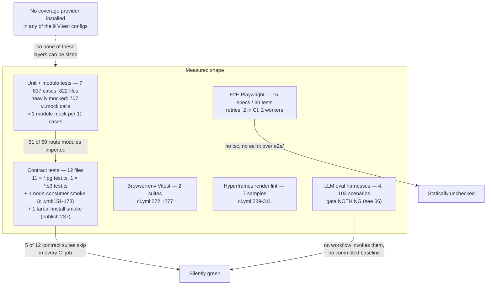

# 05 — Test strategy

7 837 statically-counted cases across 837 test files, no coverage instrumentation of
any kind, and seven suites that either never run in CI or run without their
infrastructure. This section separates volume (large) from assurance (uneven).

**Sources:** `vitest.config.ts` and the eight sibling configs, `playwright.config.ts`,
`.github/workflows/ci.yml`, `.github/workflows/storage-pg-contract.yml`,
`.github/workflows/publish-packages.yml`, `scripts/assert-pg-contract-suites.mjs`;
[`../appendix/research/quality-testing-ci-deps/01a-modules-test-harnesses.md`](docs/appendix/research/quality-testing-ci-deps/01a-modules-test-harnesses.md),
[`06-quality-and-metrics.md`](docs/appendix/research/quality-testing-ci-deps/06-quality-and-metrics.md).

## Volume

```bash
find tests -name '*.test.ts' | wc -l                              # 666
find tests -name '*.test.tsx' | wc -l                             # 0
grep -rhoE '^[[:space:]]*(it|test)(\.\w+)?\(' tests | wc -l         # 6385
grep -rhoE '^[[:space:]]*describe(\.\w+)?\(' tests | wc -l          # 1293
# per package:
find packages/@openmaic/<p> -name '*.test.ts*' -not -path '*/node_modules/*' -not -path '*/dist/*' | wc -l
find ... -print0 | xargs -0 grep -hoE '^[[:space:]]*(it|test)(\.\w+)?\(' | wc -l
find e2e -name '*.spec.ts' | wc -l                                 # 15
grep -rhoE '\btest\(' e2e/tests | wc -l                            # 30
grep -rhoE '\btest\.describe\(' e2e/tests | wc -l                  # 13
```

**The character class in that pattern decides the answer.** `\.\w+` is used above
deliberately. The obvious-looking `(it|test)(\.[a-z]+)?\(` is case-sensitive: it
matches a bare `it(`/`test(` or an all-lowercase modifier, but not a camelCase one,
so it silently misses `it.skipIf(!ffmpegAvailable)(` at
[`tests/agent-runtime/voice-clone-tools.test.ts:474`](tests/agent-runtime/voice-clone-tools.test.ts#L474) — the only such instance in
`tests/`, and enough on its own to move the headline figure. The lowercase-only
class counts 6 384 cases in `tests/` and a grand total of 7 836; `\.\w+` counts
**6 385** and **7 837**. The published figure throughout this set is now 7 837.
The same trap applies to `describe`: 1 284 under `\.[a-z]+`, 1 293 under `\.\w+`.
Per-package case counts are unaffected — both classes return the same value for
all six packages and for `render-service`.

| Project | Files | Cases | Runs in CI? |
| --- | --- | --- | --- |
| root `tests/` | 666 | 6 385 | yes — [`ci.yml:137`](.github/workflows/ci.yml#L137) `pnpm test` |
| `@openmaic/storage` | 32 | 483 | yes — [`ci.yml:187`](.github/workflows/ci.yml#L187) |
| `@openmaic/editor` | 49 | **432** | **no workflow invokes it** |
| `@openmaic/dsl` | 7 | 200 | yes — [`ci.yml:143`](.github/workflows/ci.yml#L143) |
| `@openmaic/generation` | 26 | 135 | yes — [`ci.yml:149`](.github/workflows/ci.yml#L149) |
| `render-service` | 16 | 121 | yes — [`ci.yml:220`](.github/workflows/ci.yml#L220) `npm test` |
| `@openmaic/renderer` | 14 | **45** | **no workflow invokes it** |
| `@openmaic/importer` | 12 | 36 | yes — [`ci.yml:140`](.github/workflows/ci.yml#L140) |
| `e2e` (Playwright) | 15 specs | 30 `test(` in 13 `test.describe` groups | yes — [`ci.yml:333`](.github/workflows/ci.yml#L333) |
| **total** | **837** | **7 837** unit/integration + 30 e2e | |

The two totals are the sums of the column above them: 666 + 32 + 49 + 7 + 26 + 16 + 14 +
12 = 822 unit/integration files, plus the 15 Playwright specs; 6 385 + 483 + 432 + 200 +
135 + 121 + 45 + 36 = 7 837 cases.

`@openmaic/generation` is 26, not the 28 the `find` above returns: two of those paths
are `test/__snapshots__/*.test.ts.snap` files, which `-name '*.test.ts*'` matches.

7 837 is a floor. `grep -rhoE '\b(it|test)\.each\b' tests packages/@openmaic/*/test | wc -l`
→ **272** parameterised blocks, each expanding to as many runtime cases as its table has
rows.

### 477 cases run in no workflow

```bash
grep -rhoE 'pnpm --filter @openmaic/[a-z]+ (run )?[a-z:]+' .github/workflows/*.yml | sort -u
# pnpm --filter @openmaic/dsl test
# pnpm --filter @openmaic/generation run typecheck
# pnpm --filter @openmaic/generation test
# pnpm --filter @openmaic/importer test
# pnpm --filter @openmaic/storage exec
# pnpm --filter @openmaic/storage run typecheck
# pnpm --filter @openmaic/storage test
```

`@openmaic/renderer` and `@openmaic/editor` both declare `"test": "vitest run"`
([`packages/@openmaic/renderer/package.json:44`](packages/@openmaic/renderer/package.json#L44),
[`packages/@openmaic/editor/package.json:38`](packages/@openmaic/editor/package.json#L38)), and neither appears in any workflow. The
root Vitest project cannot pick them up: [`vitest.config.ts:11`](vitest.config.ts#L11) is
`include: ['tests/**/*.test.ts']`. [`publish-packages.yml:225`](.github/workflows/publish-packages.yml#L225) runs `--filter
"@openmaic/editor" run typecheck` but not its tests.

**63 test files and 477 cases — the third- and seventh-largest suites by case count
(`editor` is the second-largest by file count), covering the op kernel,
`EditableSlideCanvas` (a 1 838-line test file) and the whole renderer element set — are
never executed by CI.** This is the single largest assurance gap found, and it is not in
the evidence packs.

## The pyramid as it actually exists



Note the shape: it is not a pyramid narrowing to a few e2e tests — it is a very wide
unit base, a thin but *well-designed* contract layer, and a genuinely small e2e tip (30
tests). The contract layer is where the interesting engineering is (see
[11-strengths.md](docs/14-code-quality/11-strengths.md)); it is also where the skips are.

## Coverage: none

```bash
grep -rn 'coverage' package.json packages/@openmaic/*/package.json \
  render-service/package.json vitest*.config.ts \
  packages/@openmaic/*/vitest.config.ts render-service/vitest.config.ts
# exit 1, no output
find . -name 'vitest*.config.ts' -not -path '*/node_modules/*' | sort   # 9 files
```

No `@vitest/coverage-v8`, no `@vitest/coverage-istanbul`, no `coverage` block in any of
the nine Vitest configs, no threshold, no upload step in any of the five workflows.
**Line and branch coverage are unknown and unknowable from this checkout** — producing
them requires adding a dependency first.

The one non-heuristic substitute available is route-module import:

```bash
find app/api -name 'route.ts' | wc -l    # 69
# python3 scan for "@/<route path minus .ts>" across tests/, e2e/, packages/@openmaic/
# (the script is printed in 01-method.md)
# → routes 69 referenced 51 unreferenced 18
```

**18 of 69 route handlers are imported by no test.** They are:

```
app/api/access-code/status/route.ts        app/api/generate-classroom/route.ts
app/api/access-code/verify/route.ts        app/api/generate-classroom/[jobId]/route.ts
app/api/azure-voices/route.ts              app/api/health/route.ts
app/api/chat/route.ts                      app/api/parse-pdf/route.ts
app/api/classroom/route.ts                 app/api/pbl/v2/task/update/route.ts
app/api/comfyui-workflows/route.ts         app/api/quiz-grade/route.ts
app/api/export-video/capability/route.ts   app/api/server-providers/route.ts
app/api/export-video/render/route.ts       app/api/skills/[id]/route.ts
app/api/export-video/render/[jobId]/route.ts
app/api/export-video/render/[jobId]/download/route.ts
```

The consequential ones: **`app/api/chat/route.ts`** is the primary conversational
endpoint; **both `access-code` routes** are the credential check itself;
**`app/api/pbl/v2/task/update/route.ts`** is 163 lines of five-branch learner-state
mutation; the **four `export-video` routes** are the only ones handling a 300 MiB
streamed upload and a byte-stream response. `app/api/parse-pdf/route.ts` appears only as
a *string literal* in [`tests/providers/provider-neutrality-guard.test.ts:77,270`](tests/providers/provider-neutrality-guard.test.ts#L77), not as
an import.

## Subsystem versus test presence

Measured as: does any file under `tests/`, `e2e/` or `packages/@openmaic/*/test/`
contain this module's alias-form import specifier?

```bash
grep -rl "@/lib/action/engine" tests e2e packages/@openmaic/*/test | wc -l
```

| Module | Lines | Test files importing it | Reading |
| --- | --- | --- | --- |
| `lib/action/engine.ts` | 902 | 7 | Reasonable for the classroom action executor, though only 13 cases live in `tests/action/` |
| `lib/playback/engine.ts` | 902 | 2 | Thin for a four-clock state machine with 20 cancellation guard sites |
| `lib/buffer/stream-buffer.ts` | 749 | 1 | One file for the live-conversation pacing loop |
| `components/roundtable/index.tsx` | 2 189 | 1 | Largest React component with a single test |
| `components/edit/PlaybackChromeRoot.tsx` | 1 848 | 1 | The real playback orchestrator |
| `components/workbench/workspace/WorkspaceRail.tsx` | 2 298 | 2 | |
| `app/page.tsx` | 1 896 | **0** | The home surface — composer, discovery, folders, Pro probe, generation handoff |
| `app/generation-preview/page.tsx` | 1 554 | **0** | Drives the six-step generation pipeline |
| `components/settings/tts-settings.tsx` | 1 672 | **0** | |
| `components/generation/outlines-editor.tsx` | 1 523 | **0** | |
| `middleware.ts` | 90 | **0** | **The HMAC access-code gate and the `/workbench` 404 gate** |
| `lib/server/agent-runtime/course-edit/element-schema.ts` | 694 | **0** | The hand-maintained TypeBox mirror of `slides.ts` — no drift check either ([08](docs/14-code-quality/08-complexity-hotspots.md)) |
| `packages/@openmaic/importer/src/shapes/presets.ts` | 6 574 | **0** | 154 OOXML preset geometry generators, no per-preset assertion |

`middleware.ts` deserves its own note. It is the only auth gate in the system, and:

```bash
grep -rln 'openmaic_access\|ACCESS_CODE\|access-code' tests e2e   # no output
wc -l tests/server/access-token.test.ts                           # 17
grep -c '  it(\|  test(' tests/server/access-token.test.ts        # 1
```

Zero tests reference the middleware, the cookie name, or the env var. Its Node twin,
`lib/server/access-token.ts`, has a 17-line test with one `test()`. Neither verifier ever
compares the signed timestamp to now ([`middleware.ts:22-43`](middleware.ts#L22-L43),
[`lib/server/access-token.ts:11-25`](lib/server/access-token.ts#L11-L25)), so a leaked `openmaic_access` cookie is valid until
`ACCESS_CODE` is rotated — and the two implementations differ in their comparison
primitive (`timingSafeEqual` in Node, a hand-rolled non-constant-time loop in Edge, with
the caveat written down at [`middleware.ts:37`](middleware.ts#L37)).

### The one genuine test-directory gap, corrected

The evidence pack states `tests/whiteboard/` does not exist. That is literally true and
misleading — the whiteboard tests live one level down:

```bash
git ls-files 'tests/whiteboard/*' | wc -l                                    # 0
find tests -path '*whiteboard*' -name '*.test.ts' | wc -l                    # 13
find tests/lib/whiteboard -name '*.test.ts' -print0 \
  | xargs -0 grep -hoE '^[[:space:]]*(it|test)(\.[a-z]+)?\(' | wc -l         # 77
```

`tests/lib/whiteboard/` holds 6 files / 77 cases (`runtime-store`, `runtime-contract`,
`browser-projection`, `legacy-import`, `viewport`, `runtime-store.pg`) against 1 470
lines of `lib/whiteboard`. That is adequate cover, not a hole.

## Suites that skip

```bash
find tests packages/@openmaic/*/test -name '*.pg.test.ts' -o -name '*.s3.test.ts' | sort   # 12
grep -rn 'PG_CONTRACT_URL\|S3_CONTRACT' .github/workflows/
sed -n '61,65p' scripts/assert-pg-contract-suites.mjs
```

| Suite | Guard | Set in CI? |
| --- | --- | --- |
| `packages/@openmaic/storage/test/pg-document-store.pg.test.ts` | `describe.skipIf(!PG_CONTRACT_URL)` | yes — [`storage-pg-contract.yml:32`](.github/workflows/storage-pg-contract.yml#L32); **in `REQUIRED_SUITES`** |
| `…/pg-runtime-store.pg.test.ts` | same | yes; in `REQUIRED_SUITES` |
| `…/pg-scene-revision.pg.test.ts` | same | yes; in `REQUIRED_SUITES` |
| `…/pg-agent-session-store.pg.test.ts` | same | runs, **not** in `REQUIRED_SUITES` |
| `…/pg-agent-session-material.pg.test.ts` | same | runs, not in `REQUIRED_SUITES` |
| `…/pg-asset-store.pg.test.ts` | same | runs, not in `REQUIRED_SUITES` |
| `tests/lib/whiteboard/runtime-store.pg.test.ts` | `skipIf` **plus** a hard fail at `:23` when `STORAGE_PG_CONTRACT_REQUIRED=1` and the URL is absent | yes — invoked explicitly at [`storage-pg-contract.yml:67`](.github/workflows/storage-pg-contract.yml#L67) |
| [`tests/agent-runtime/event-notify.pg.test.ts:57`](tests/agent-runtime/event-notify.pg.test.ts#L57) | `describe.skipIf(!contractUrl)`, no hard-fail guard | **no** |
| [`tests/agent-runtime/park-attempt-budget.pg.test.ts:30`](tests/agent-runtime/park-attempt-budget.pg.test.ts#L30) | same | **no** |
| [`tests/agent-runtime/session-events-live.pg.test.ts:51`](tests/agent-runtime/session-events-live.pg.test.ts#L51) | same | **no** |
| [`tests/persistence/owner-materials.pg.test.ts:29`](tests/persistence/owner-materials.pg.test.ts#L29) | same | **no** |
| [`packages/@openmaic/storage/test/s3-asset-bytes.s3.test.ts:22`](packages/@openmaic/storage/test/s3-asset-bytes.s3.test.ts#L22) | `skipIf(!configured)` + hard fail at [`:16`](packages/@openmaic/storage/test/s3-asset-bytes.s3.test.ts#L16) under `STORAGE_S3_CONTRACT_REQUIRED=1` | **no** — `S3_CONTRACT_ENDPOINT` appears nowhere under `.github/` |

Five suites silently pass in every job: four app-level PostgreSQL contracts covering
`NOTIFY` delivery, attempt-budget fencing, live SSE tails and owner-quota locking, plus
the S3 byte-store contract. The irony is documented in the repository itself —
[`storage-pg-contract.yml:47-52`](.github/workflows/storage-pg-contract.yml#L47-L52) and [`scripts/assert-pg-contract-suites.mjs:4-40`](scripts/assert-pg-contract-suites.mjs#L4-L40) argue at
length that a silently-skipping suite is worse than no suite, and then five of them skip.
The audit that exists to prevent a narrowed suite set covers 3 of the 6 storage suites
([`scripts/assert-pg-contract-suites.mjs:61-65`](scripts/assert-pg-contract-suites.mjs#L61-L65)).

## Discipline markers

```bash
grep -rnE '\b(it|test|describe)\.only\b' tests e2e packages/@openmaic/*/test render-service/test | wc -l  # 0
grep -rhoE '\b(it|test|describe)\.(skip|todo|failing)\b' tests packages/@openmaic/*/test render-service/test e2e \
  | sort | uniq -c   # 2 describe.skip, 5 test.skip
grep -rn 'vi.mock(' tests packages/@openmaic/*/test render-service/test | wc -l                          # 707
find . -name '*.snap' -not -path '*/node_modules/*'                                                       # 3
```

**Zero `.only` and seven skip markers across all 837 test files** is exceptional and worth
stating plainly — the greps above cover exactly that set. 707 `vi.mock` calls against
7 837 cases (≈ 1 per 11) is heavy mocking — the
unavoidable cost of unit-testing an app whose surface is provider SDKs and a database, but
it does mean many suites verify wiring rather than behaviour. Only three snapshot files
exist, so the suite is assertion-driven:
`packages/@openmaic/generation/test/__snapshots__/outline-prompt.test.ts.snap`,
`…/scene-prompt-golden.test.ts.snap`, `tests/video-export/__snapshots__/emit-hyperframes.test.ts.snap`.

## Open questions

- Whether `@openmaic/renderer` and `@openmaic/editor` are omitted from CI deliberately
  (e.g. their suites need a DOM environment the runner lacks) or by oversight. Both
  declare a plain `vitest run`; `ci.yml` has two browser-environment steps at `:272`
  and `:277` already, so a technical blocker is not evident from the files.
- Whether the four app-level `*.pg.test.ts` files are expected to be added to the PG job
  or considered redundant with the storage-package suites. The job invokes exactly one
  app-level suite ([`storage-pg-contract.yml:67`](.github/workflows/storage-pg-contract.yml#L67)) and the comment does not say why.
- Whether an S3-compatible CI service was planned. `docker-compose.yml` has no
  S3-compatible service either.
