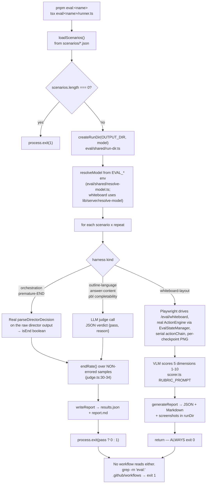
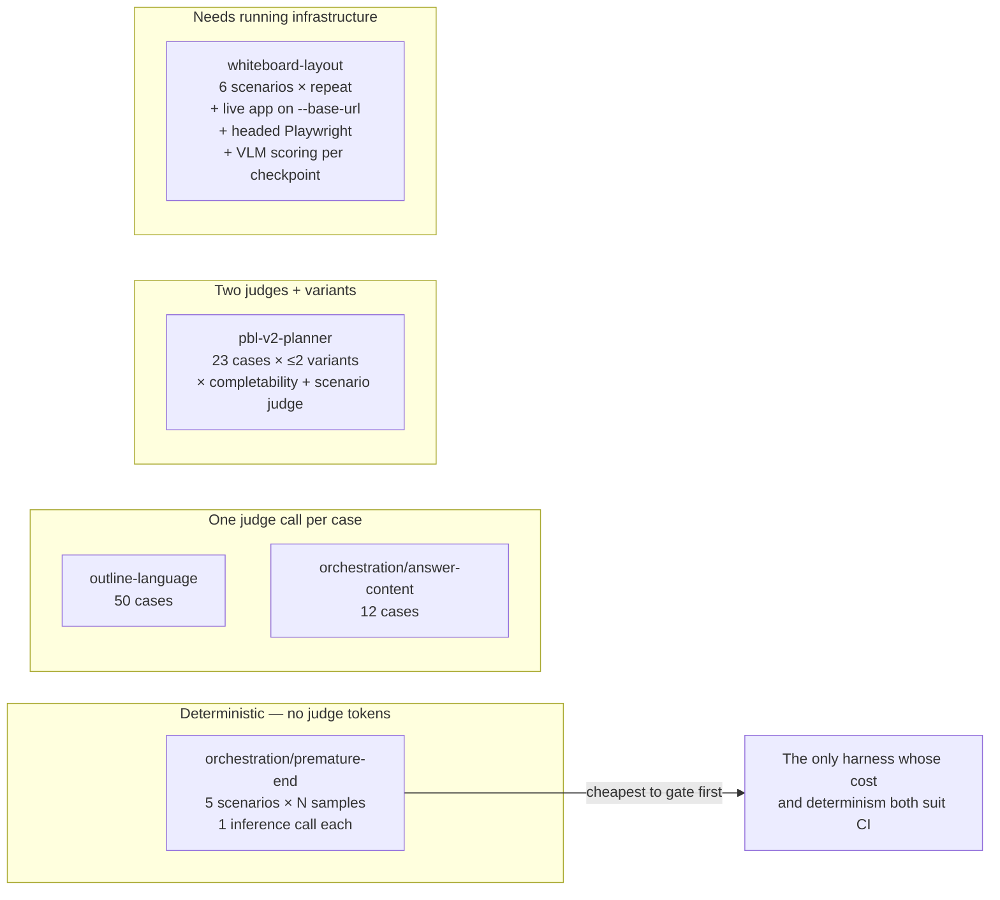

# 06 — Eval harnesses

**Four harness directories exposing six `pnpm eval:*` runner scripts** — the canonical
phrasing, reconciled in
[`../16-development-view/06-testing-and-evals.md`](docs/16-development-view/06-testing-and-evals.md),
because `eval/orchestration` ships three runners. 4 271 lines, 103 scenarios. Five of the
six scripts have a real pass/fail exit contract. **No workflow invokes any of them and no
baseline is committed**, so they are manual instruments, not gates.

**Sources:** `eval/orchestration/{runner,answering-runner,answer-content-runner,judge}.ts`,
`eval/outline-language/{runner,judge}.ts`, `eval/pbl-v2-planner/runner.ts`,
`eval/whiteboard-layout/{runner,scorer,state-manager}.ts`, [`package.json:28-33`](package.json#L28-L33),
[`.gitignore:76-80`](.gitignore#L76-L80);
[`../appendix/research/quality-testing-ci-deps/01a-modules-test-harnesses.md`](docs/appendix/research/quality-testing-ci-deps/01a-modules-test-harnesses.md).

## Inventory

```bash
find eval -name '*.ts' -print0 | xargs -0 wc -l | tail -1     # 4271 total
grep -n 'eval' package.json                                    # 6 scripts, :28-33
```

| Harness | Scenarios | Scoring | Exit contract | Gates anything? |
| --- | --- | --- | --- | --- |
| `eval/orchestration` (premature-END) | 5 (`scenarios/premature-end.json`) | **Deterministic.** `classifyDecision` calls the production `parseDirectorDecision` ([`judge.ts:10`](eval/orchestration/judge.ts#L10)); END/not-END is binary | `process.exit(allPostFixPass ? 0 : 1)` — [`runner.ts:187`](eval/orchestration/runner.ts#L187) | no |
| `eval/orchestration` (answering) | 7 (`scenarios/answering.json`) | Threshold over sampled runs | `process.exit(overallPass ? 0 : 1)` — [`answering-runner.ts:402`](eval/orchestration/answering-runner.ts#L402) | no |
| `eval/orchestration` (answer-content) | 12 (`scenarios/answer-content.json`) | LLM judge (`answer-content-judge.ts`) | `process.exit(overallPass ? 0 : 1)` — [`answer-content-runner.ts:516`](eval/orchestration/answer-content-runner.ts#L516) | no |
| `eval/outline-language` | 50 (`scenarios/language-test-cases.json`) | LLM-as-judge, explicitly *lenient* rubric ([`judge.ts:14-21`](eval/outline-language/judge.ts#L14-L21)) | `process.exit(passed === results.length ? 0 : 1)` — [`runner.ts:168`](eval/outline-language/runner.ts#L168) | no |
| `eval/pbl-v2-planner` | 23 (`scenarios/test-cases.json`) × up to 2 prompt variants | Deterministic completion gate **and** two LLM judges (`judge-prompt.md`, `judge-prompt-scenario.md`, `judge-prompt-completability.md`) | `process.exit(allPassed ? 0 : 1)` requiring `r.ok && r.passesCompletionGate`, plus `completability.pass` only when `judgeEnabled()` — [`runner.ts:913-919`](eval/pbl-v2-planner/runner.ts#L913-L919); harness crash exits **2** | no |
| `eval/whiteboard-layout` | 6 (`scenarios/*.json`) | VLM scorer, 5 dimensions 1-10 ([`scorer.ts:26-49`](eval/whiteboard-layout/scorer.ts#L26-L49): readability, overlap, rendering_correctness, content_completeness, layout_logic) | **none** — `main()` exits non-zero only on "no scenarios" ([`:356`](eval/whiteboard-layout/runner.ts#L356)) or a fatal throw ([`:393`](eval/whiteboard-layout/runner.ts#L393)) | no |

`eval/shared/` is a three-file support library (`markdown-report.ts`,
`resolve-model.ts`, `run-dir.ts`), not a harness.

Scenario counts measured with:

```bash
python3 -c "import json;d=json.load(open('eval/outline-language/scenarios/language-test-cases.json'));print(len(d))"  # 50
# orchestration: answer-content.json 12, answering.json 7, premature-end.json 5
# pbl-v2-planner: test-cases.json 23
ls eval/whiteboard-layout/scenarios/*.json | wc -l   # 6
```

## What an eval run does



## Three things the harnesses get right

**1. `eval/orchestration/judge.ts` argues *against* using an LLM judge.** Its header
(`:1-8`) states that the bug under guard is "director picks END while a student question
is unresolved", that END/not-END is binary, and that "reading `parseDirectorDecision` is
sufficient". It imports the production parser (`:10`) rather than re-deriving the verdict,
so a change to the parser changes the eval — which is the correct coupling for a
regression guard.

**2. The END-rate denominator excludes errored samples.** [`judge.ts:30-34`](eval/orchestration/judge.ts#L30-L34) filters
`!s.error` before computing the rate, with the incident named: "so API failures (e.g.
provider 'Forbidden') don't masquerade as deterministic END behavior." An Anthropic
`Forbidden` on every sample would otherwise read as 100 % END, i.e. as the bug being
guarded against.

**3. `eval/whiteboard-layout` exercises the real executor.** [`state-manager.ts:4`](eval/whiteboard-layout/state-manager.ts#L4) imports
`ActionEngine` from `@/lib/action/engine` and drives headless Zustand stores; the runner
serialises actions through a single `actionChain` promise ([`runner.ts:130`](eval/whiteboard-layout/runner.ts#L130), `:190`, `:221`)
because `ensureWhiteboardOpen()` awaits an internal delay on first use (`:126`). It is the
only harness that integrates the production action executor end to end — which is notable
given that `lib/action/engine.ts` is the repository's type-safety hotspot
([03-type-safety.md](docs/14-code-quality/03-type-safety.md)).

## What they do not do

```bash
grep -rn 'eval:' .github/workflows/          # exit 1, no output
git ls-files 'eval/*/results/*' | wc -l      # 0
grep -n 'eval' .gitignore                    # :76-80 — five results paths
```

| Gap | Evidence | Consequence |
| --- | --- | --- |
| **No workflow invokes any harness** | `grep -rn 'eval:' .github/workflows/` → no output | Five real exit-code contracts gate nothing |
| **No committed baseline** | `git ls-files 'eval/*/results/*'` → empty | Every run starts from zero. A threshold on an absolute LLM score is a much weaker signal than a delta against a recorded run — which is the deeper reason these cannot simply be wired up |
| **`whiteboard-layout` has no threshold** | [`runner.ts:339-390`](eval/whiteboard-layout/runner.ts#L339-L390) — `main()` returns after writing the report; the only `process.exit(1)` calls are at `:356` (no scenarios) and `:393` (fatal throw) | A board scoring 2/10 on every dimension exits 0 |
| **`eval/pbl-v2-planner/results/` is not gitignored** | [`.gitignore:76-80`](.gitignore#L76-L80) covers `whiteboard-layout`, `outline-language` and the three `orchestration` output dirs (`results/`, `results-answering/`, `results-answer-content/`) — not this one | A PBL run leaves untracked files in `git status` that can be committed by accident |
| **`vitest.eval.config.ts` is dead** | `find . -name '*.eval.test.ts' -not -path '*/node_modules/*'` → 0; `grep -rn 'vitest.eval.config'` finds only documentation | 14 lines of config matching nothing, referenced by no script, workflow or document |

The absent baseline is the load-bearing gap, and it makes "add the evals to CI" the wrong
first step. Every run spends real provider tokens — `eval/outline-language` is 50 cases,
`eval/pbl-v2-planner` is 23 cases × up to 2 variants × two judges — and `whiteboard-layout`
additionally needs a live app on `--base-url` and a headed capture browser. Wiring an
absolute threshold into CI before a baseline exists produces a flaky gate rather than a
signal. The concrete first step is in
[12-remediation-backlog.md](docs/14-code-quality/12-remediation-backlog.md).

## Cost and environment shape



[`eval/whiteboard-layout/runner.ts:294`](eval/whiteboard-layout/runner.ts#L294) also supports a `--rescore` mode that re-scores
existing screenshots without re-running inference — the right primitive for building the
missing baseline cheaply.

## Open questions

- Why the harnesses gate nothing is not recorded anywhere. Cost is the obvious
  hypothesis and the token arithmetic supports it, but no comment or document states it.
- Why `eval/whiteboard-layout` alone has no threshold while its four siblings all do.
  It needs a live app and a headed browser, so it may simply be classified as
  exploratory; not recorded.
- Whether `eval/pbl-v2-planner/serve.ts` and `build-compare.ts` (a local side-by-side
  HTML compare page) are part of a documented review ritual or a one-off debugging aid.
- Whether `vitest.eval.config.ts` is a leftover from a removed `*.eval.test.ts`
  convention or scaffolding for a planned one. No CHANGELOG entry, no comment.
