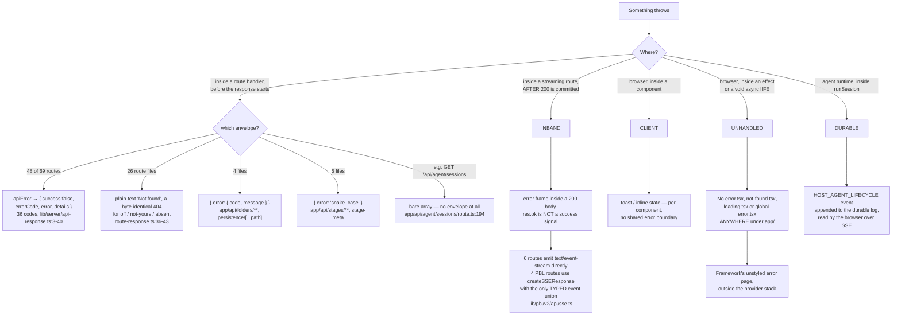
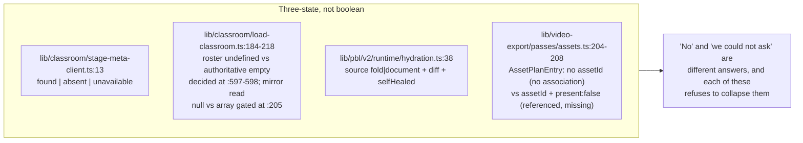

# 07 — Error handling

934 `catch` blocks, 141 with no executable body, **13 truly bare** — and all 13 in the
same class of code. The discipline inside catch bodies is unusually good. The discipline
at the HTTP boundary is not: four error-envelope shapes coexist and ten streaming routes
commit HTTP 200 before doing any work.

**Sources:** brace-matching walker over `app`, `components`, `lib`,
`render-service/src`, `packages/@openmaic/*/src`; `lib/server/api-response.ts`,
`lib/server/agent-runtime/route-response.ts`, `lib/pbl/v2/api/sse.ts`,
`lib/utils/iframe.ts`;
[`../appendix/research/quality-testing-ci-deps/05-failure-modes.md`](docs/appendix/research/quality-testing-ci-deps/05-failure-modes.md),
[`../appendix/research/api-surface/`](docs/appendix/research/api-surface/00-overview.md).

## Catch-body census

A regex cannot classify a `catch` body, so this uses a brace-matching walker:

```python
python3 - <<'PY'
import os,re
roots=['app','components','lib','render-service/src']+[f'packages/@openmaic/{p}/src'
       for p in sorted(os.listdir('packages/@openmaic'))]
files=[os.path.join(dp,f) for r in roots if os.path.isdir(r)
       for dp,dn,fn in os.walk(r) if 'node_modules' not in dp and '/dist' not in dp
       for f in fn if f.endswith(('.ts','.tsx'))]
tot=empty=comment_only=bare=logonly=0
for p in files:
    s=open(p,encoding='utf-8',errors='ignore').read()
    for m in re.finditer(r'\bcatch\s*(\([^)]*\))?\s*\{', s):
        tot+=1; i=m.end(); depth=1
        while i<len(s) and depth>0:
            if s[i]=='{': depth+=1
            elif s[i]=='}': depth-=1
            i+=1
        body=s[m.end():i-1]
        st=re.sub(r'//[^\n]*','',body); st=re.sub(r'/\*.*?\*/','',st,flags=re.S).strip()
        if st=='':
            empty+=1
            if body.strip()=='': bare+=1
            else: comment_only+=1
        elif re.fullmatch(r'console\.\w+\([^;]*\);?', st): logonly+=1
print(len(files), tot, empty, comment_only, bare, logonly)
PY
# 1380 934 141 128 13 7
```

| Metric | Count | Share of catches |
| --- | --- | --- |
| `catch` blocks scanned (1 380 files) | 934 | |
| bodies with no executable code | 141 | 15.1 % |
| …of which **comment-only** (documented intent) | 128 | 13.7 % |
| …of which **truly bare** `catch {}` | **13** | 1.4 % |
| bodies that are a single `console.*` call | 7 | 0.7 % |

**13 bare catches in 297 767 lines is the strongest single error-handling number in the
repository**, and the location is what makes it defensible:

```bash
# from the same walker, printing paths for bare bodies
# lib/utils/iframe.ts                            6
# lib/video-export-app/prepare-interactive-html.ts 5
# lib/video-export/emit-hyperframes/index.ts       1
# render-service/src/preview-renderer.ts           1
```

All 13 sit inside **injected null-origin browser storage shims**, where a `SecurityError`
is the expected path rather than an exception. [`lib/utils/iframe.ts:3-13`](lib/utils/iframe.ts#L3-L13) writes out why:
the shim replaces `localStorage`/`sessionStorage` inside a `sandbox="allow-scripts"` iframe
that has no `allow-same-origin`, so every access throws by design and there is nothing to
report. The other three files inject the same shim into exported interactive HTML.

The 128 comment-only catches are the real story: **91 % of code-free catch bodies carry an
explanatory comment.** That ratio is what makes the error-handling posture readable rather
than a swallow-everything habit.

### The seven log-only catches

| Site | Logged as |
| --- | --- |
| [`components/edit/PlaybackChromeRoot.tsx:596`](components/edit/PlaybackChromeRoot.tsx#L596) | `console.warn('[Presentation] Fullscreen request denied — browser policy')` |
| [`components/edit/PlaybackChromeRoot.tsx:700`](components/edit/PlaybackChromeRoot.tsx#L700) | `console.warn('Failed to load playback cursor for stage …')` |
| [`components/edit/surfaces/slide/ImagePicker.tsx:31`](components/edit/surfaces/slide/ImagePicker.tsx#L31) | `console.error('ImagePicker: failed to read image file', err)` |
| [`lib/pbl/v2/runtime/drain.ts:441`](lib/pbl/v2/runtime/drain.ts#L441) | `console.warn('Failed to drain PBL events for stage …')` |
| [`lib/server/material-extraction/runner.ts:74`](lib/server/material-extraction/runner.ts#L74) | `console.error('[material-extraction] scan failed', error)` |
| [`packages/@openmaic/importer/src/import-pipeline/transformParsedToSlides.ts:749`](packages/@openmaic/importer/src/import-pipeline/transformParsedToSlides.ts#L749) | `console.warn('[PPTX导入] KaTeX 无法渲染公式，回退为图片:', error)` |
| [`…/transformParsedToSlides.ts:857`](packages/@openmaic/importer/src/import-pipeline/transformParsedToSlides.ts#L857) | `console.warn('[PPTX导入] 视频编码解析失败:', err)` |

Three of these are user-visible degradations logged only to the console — the playback
cursor failing to load (`:700`), a PBL event drain failing ([`drain.ts:441`](lib/pbl/v2/runtime/drain.ts#L441)), and an image
file failing to read ([`ImagePicker.tsx:31`](components/edit/surfaces/slide/ImagePicker.tsx#L31)). The last is the sharpest: a user picks an
image, nothing happens, and the only trace is a `console.error`.

### Logging levels

```bash
grep -rhoE 'console\.(log|warn|error|info|debug)\b' \
  app components lib packages/@openmaic/*/src render-service/src types | sort | uniq -c | sort -rn
# 45 console.warn   44 console.error   5 console.log   5 console.info   4 console.debug
grep -rnoE '\b(TODO|FIXME|HACK|XXX)\b' <same paths> | wc -l   # 9, all TODO
```

**Five `console.log` calls in 297 767 lines**, and 89 of the 103 console calls are `warn`
or `error` on a genuine failure path. Nine TODO markers total, seven of them clustered in
the legacy `components/slide-renderer/Editor/` canvas.

## How a failure propagates



### Envelope inconsistency, measured

```bash
sed -n '3,40p' lib/server/api-response.ts | grep -cE '^  [A-Z_]+:'   # 36 error codes
grep -rl 'api-response' app/api | wc -l                              # 48 of 69 route files
grep -rl "ownerNotFound\|'Not found'" app/api | wc -l                # 26
grep -rln "error: { code" app/api                                    # 4 files
grep -rln "error: '[a-z_]*'" app/api                                 # 5 files
```

Four envelope shapes plus bare JSON. A generic client cannot parse an OpenMAIC error
uniformly: it must branch on the route family. The plain-text 404 is *deliberate* and
argued for in the comment at [`lib/server/agent-runtime/route-response.ts:36-40`](lib/server/agent-runtime/route-response.ts#L36-L40) — "an
existence probe must not be able to distinguish 'never existed' from 'someone else's'" —
directly above `ownerNotFound` itself at `:41-43`, so that shape is a feature. The
`{error:{code,message}}` and `{error:'snake_case'}` families are not argued for anywhere.

### The 200-then-fail pattern

```bash
grep -rln 'text/event-stream' app/api    # 6 routes
grep -rln 'createSSEResponse' app/api    # 4 routes (all PBL v2)
```

Ten streaming routes commit HTTP 200 before doing any work, so `res.ok` is not a success
signal — a total generation failure arrives as an in-band error frame inside a 200. Only
the four PBL routes have a **typed** event union to parse against (`PBLSSEEvent`,
`lib/pbl/v2/api/sse.ts`); the other six emit untyped frames the client must recognise by
convention.

### No route boundaries at all

```bash
git ls-files app | grep -E 'error|not-found|loading|template|global-error'   # exit 1, no output
```

There is no `error.tsx`, `not-found.tsx`, `loading.tsx`, `template.tsx` or
`global-error.tsx` anywhere under `app/`. Two consequences:

1. **Any unhandled client throw drops to the framework's unstyled error page**, rendered
   *outside* the provider stack — so no theme, no i18n, no toast.
2. **The single condition "workbench disabled" presents three different ways**:
   [`middleware.ts:57`](middleware.ts#L57) returns a plain-text `'Not found'` 404, [`app/workbench/new/page.tsx:14`](app/workbench/new/page.tsx#L14) calls
   `notFound()`, and [`app/workspace/page.tsx:35`](app/workspace/page.tsx#L35) calls `redirect('/')`. The last two are
   each *justified in-source* — [`app/workspace/page.tsx:10-16`](app/workspace/page.tsx#L10-L16) argues that "a workspace
   whose every submit 404s is worse than no workspace", and
   [`app/workbench/new/page.tsx:1-5`](app/workbench/new/page.tsx#L1-L5) notes it is a compat shim with no product UI — so the
   divergence is deliberate per route. What is missing is the styled 404 page all three
   would render into.

## Two swallowed-failure patterns worth naming

| Pattern | Site | Failure visible to the user? |
| --- | --- | --- |
| `if (!res.ok) return;` early-returns out of a `try` whose `catch` is comment-only | [`components/scene-renderers/pbl/v2/workspace.tsx:153`](components/scene-renderers/pbl/v2/workspace.tsx#L153) (catch at [`:160`](components/scene-renderers/pbl/v2/workspace.tsx#L160)) and [`:239`](components/scene-renderers/pbl/v2/workspace.tsx#L239) (catch at [`:262`](components/scene-renderers/pbl/v2/workspace.tsx#L262)), both bodies just `/* transient; the button stays available for retry */` | **No.** A learner clicks Done and nothing happens |
| Parse failure awards partial credit silently | [`app/api/quiz-grade/route.ts:95-103`](app/api/quiz-grade/route.ts#L95-L103) — 50 % of the marks when the LLM's JSON cannot be parsed, with no signal to the client | **No**, and the path has no test (`grep -c 'quiz-grade' tests/quiz/grading.test.ts` → 0) |
| Listing error becomes an empty success | [`app/api/comfyui-workflows/route.ts:19-22`](app/api/comfyui-workflows/route.ts#L19-L22) returns `200 {workflows: []}` on any error (it does `console.error` first, so the server sees it) | **No.** "ComfyUI misconfigured" is indistinguishable from "no workflows installed" |
| Unrecognised element paints nothing | [`packages/@openmaic/renderer/src/SlideElement.tsx:76-102`](packages/@openmaic/renderer/src/SlideElement.tsx#L76-L102) — the switch's `default` arm returns `null` ([`:98-99`](packages/@openmaic/renderer/src/SlideElement.tsx#L98-L99)) with no warning, and [`:103`](packages/@openmaic/renderer/src/SlideElement.tsx#L103) turns that into `return null` | **No.** A future DSL element type is silently invisible |
| Unknown action type is skipped | [`lib/playback/engine.ts:743-746`](lib/playback/engine.ts#L743-L746) — `default` arm with no log and no counter | **No.** A document from a newer DSL degrades invisibly |

These five are the counterweight to the 13-bare-catch figure. The catch bodies are
disciplined; the *degradation branches* — `default:` arms, `if (!ok) return`, empty-list
fallbacks — are where information is actually lost, and those are not catches at all, so no
catch-body metric finds them.

## Where the model is right



Four independent places refuse to encode "we could not determine this" as `false`. The
classroom one is two distinctions rather than one three-valued field, and both are
load-bearing in code rather than only in a comment: `rosterNeedsLegacyFallback`
(`:594-600`) returns `true` for an absent roster and `false` for an explicit `[]`, so a
document that predates roster persistence probes the legacy mirror while an authoritative
empty roster never does; separately, a mirror read that *failed* returns `null`
(`loadLegacyAgentFallbacks`, e.g. `:262`, `:268`) and the `fallbacks !== null` gate at
`:205` skips both the merge and the memo, so the next load retries — where a read that
succeeded with nothing to migrate is memoized at `:215` and never probes again. A third
roster state, present-but-missing-voice-data, also probes (`:599`). The
stage-meta sidecar's `unavailable` branch ([`app/classroom/[id]/page.tsx:94-104`](app/classroom/[id]/page.tsx#L94-L104)) records the
outage and leaves the edit gate on upstream defaults rather than concluding "not the
owner" from a network failure. [`lib/video-export/ir.ts:61-94`](lib/video-export/ir.ts#L61-L94) goes further and makes
thirteen diagnostic codes part of the output contract, so a degradation is a structured
value rather than a log line.

That is the pattern to extend. The five swallowed-failure sites above are exactly the
places where the same three-state discipline is absent.

## Open questions

- Whether the four error-envelope shapes reflect three generations of code or a deliberate
  per-family choice. Only the plain-text 404 carries a rationale comment.
- Whether the absence of `app/error.tsx` is deliberate. Given how carefully
  [`app/workspace/page.tsx:10-16`](app/workspace/page.tsx#L10-L16) and [`app/workbench/new/page.tsx:1-5`](app/workbench/new/page.tsx#L1-L5) each argue their 404
  strategy, the omission of the page all three land on looks like an oversight rather than
  a decision — but nothing records it.
- [`lib/audio/tts-providers.ts:120`](lib/audio/tts-providers.ts#L120) carries the repository's only informative TODO: the
  route "currently catches all errors uniformly as GENERATION_FAILED". That is now stale for
  429s ([`app/api/generate/tts/route.ts:167-168`](app/api/generate/tts/route.ts#L167-L168) maps `TTSRateLimitError` to
  `RATE_LIMITED`), but `TTSRequestTimeoutError` still collapses into `GENERATION_FAILED` at
  `:167-183`, so a client cannot distinguish a slow provider from a broken one.
