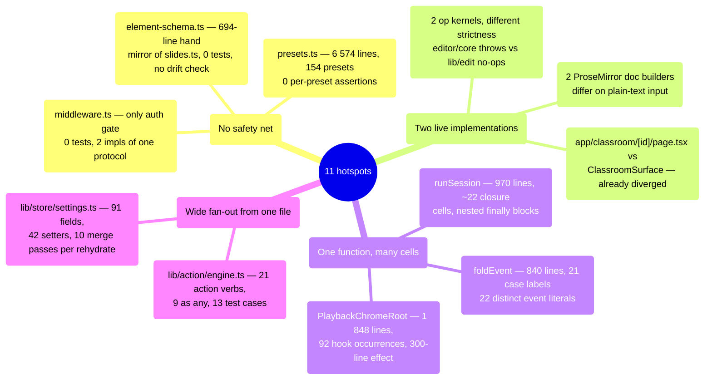
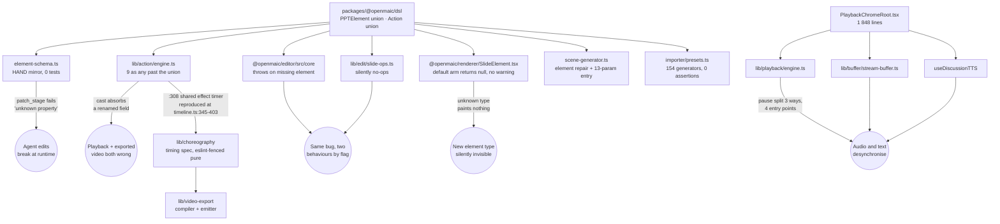

# 08 — Complexity hotspots

Eleven places where a change is most likely to break something distant. Each entry gives
the evidence, what it couples, and the concrete failure mode — not a general "this file is
big" observation. Ranked by blast radius × absence of a safety net.

**Sources:** direct reads of every file cited;
[`../appendix/research/agent-runtime/`](../appendix/research/agent-runtime/00-overview.md),
[`../appendix/research/classroom-runtime/`](../appendix/research/classroom-runtime/00-overview.md),
[`../appendix/research/dsl-renderer-editor/`](../appendix/research/dsl-renderer-editor/00-overview.md),
[`../appendix/research/persistence-storage-state/`](../appendix/research/persistence-storage-state/00-overview.md).

The 941-line `components/agent/agent-bar.tsx` is an honourable mention rather than a
numbered hotspot; see §Two honourable mentions and
[`../05-agent-runtime/02-client-server-split.md`](../05-agent-runtime/02-client-server-split.md)
for the client-side inventory it belongs to.

## The map



## 1. `middleware.ts` — the only auth gate, untested, with two implementations

```bash
wc -l middleware.ts                                                # 90
grep -rl "@/middleware" tests e2e | wc -l                          # 0
grep -rln 'openmaic_access\|ACCESS_CODE\|access-code' tests e2e     # no output
wc -l tests/server/access-token.test.ts                            # 17
grep -c '  it(\|  test(' tests/server/access-token.test.ts          # 1
```

`middleware.ts` is the single point where `ACCESS_CODE` is enforced across the whole
surface (`:60-85`), plus the `/workbench*` 404 gate (`:56-58`) which runs *before* the auth
allowlist. It has zero tests. Its matcher regex
(`'/((?!_next/static|_next/image|favicon.ico|logos/).*)'`, `:89`) is untested. And the HMAC
protocol has **two independent implementations**: the Edge verifier at `:18-44` (hand-rolled
Web Crypto, with a non-constant-time comparison the comment at `:37` admits) and the Node
signer/verifier in `lib/server/access-token.ts:4-25` (`createHmac` + `timingSafeEqual`).

Neither compares the signed timestamp to now. A leaked `openmaic_access` cookie is valid
until `ACCESS_CODE` is rotated; the 7-day `maxAge` at
`app/api/access-code/verify/route.ts:36` is browser-enforced only.

**Failure mode:** a change to the token format that updates one verifier and not the other
locks out every existing session or, worse, accepts tokens the other rejects — and no test
notices either way.

## 2. `lib/server/agent-runtime/course-edit/element-schema.ts` — a hand-maintained mirror

```bash
wc -l lib/server/agent-runtime/course-edit/element-schema.ts packages/@openmaic/dsl/src/slides.ts
#  694 / 995
grep -rln 'element-schema' tests packages/@openmaic/*/test    # no output
grep -n 'ROOTS' packages/@openmaic/dsl/scripts/gen-schema.mjs # :15 — Stage, SerializedScene, Action
```

Its own header states the coupling at `:15`: *"Field sets mirror `@openmaic/dsl`
`slides.ts` exactly (the 10-element union)."* There is **no test referencing this file and
no generated cross-check**, even though `packages/@openmaic/dsl/scripts/gen-schema.mjs`
already emits `stage.schema.json`, `scene.schema.json` and `action.schema.json` from those
very types at build time.

**Failure mode:** adding a DSL field means editing two files. Forgetting the second makes
every `patch_stage` that touches the new field fail with "unknown property" — at agent
runtime, in production, with no compile error and no test failure.

## 3. Two op kernels with different strictness, both live

```bash
sed -n '651,662p' packages/@openmaic/editor/src/core/index.ts   # throws
sed -n '181,184p' lib/edit/slide-ops.ts                          # silently returns
```

`packages/@openmaic/editor/src/core/index.ts`'s `requireElement` (`:651-659`) resolves an
element and calls `missingElement()` at `:657`, which throws at `:662`:
`throw new Error('<op>: element "<id>" does not exist')`. `lib/edit/slide-ops.ts:183` does
`if (!element) return;` — a silent no-op. Both are browser op kernels; which one runs is
decided by a feature flag, and
`components/edit/surfaces/slide/slide-edit-session.ts:164-166` casts between their two
history types through what its own comment (`:160-162`) calls a "compatibility bridge".

There is a documented split between the server and browser surfaces
(`lib/server/agent-runtime/course-edit/apply.ts:122-126`), but it is about *op
vocabulary*, not strictness: "the classroom/browser editor uses the lower-level
`SlideEditOperation` union in `lib/edit/slide-ops.ts` directly; keep that UI contract
independent from which sugar ops the agent exposes." Nothing anywhere argues for two
browser kernels disagreeing about whether a missing element is an error.

**Failure mode:** a bug reproduces under one flag and not the other, and the difference is
"one kernel throws, the other pretends it worked".

## 4. `lib/action/engine.ts` — 21 verbs, 9 type escapes, 13 test cases

```bash
wc -l lib/action/engine.ts                                # 902
grep -c 'as any' lib/action/engine.ts                     # 9
grep -c 'eslint-disable' lib/action/engine.ts             # 9  (the same 9 lines)
grep -rl "@/lib/action/engine" tests e2e | wc -l          # 7 files
find tests/action -name '*.test.ts' -print0 | xargs -0 \
  grep -hoE '^[[:space:]]*(it|test)(\.[a-z]+)?\(' | wc -l  # 13 cases
```

Every one of the DSL's 21 `Action` verbs executes here. The nine casts at `:498`, `:529`,
`:559`, `:594`, `:657`, `:692`, `:732`, `:754`, `:804` all follow the same shape: a
whiteboard element built as a positional object literal, then cast past the DSL's
`PPTElement` union. `:308` also holds the shared effect-clear timer whose behaviour
`lib/choreography/timeline.ts:345-403` had to reproduce for the video exporter.

**Failure mode:** a field renamed in the DSL element union does not fail to compile here —
the cast absorbs it — and appears as a missing whiteboard property at playback, in the
exported video, or both.

## 5. `runSession` — 970 lines, ~22 mutable closure cells

```bash
grep -n 'export async function runSession' lib/server/agent-runtime/runner.ts   # :889
# closing brace at :1858 → 970 lines
wc -l lib/server/agent-runtime/runner.ts                                        # 1923
```

The trade is argued at `:886-888` and the argument is real: roughly 22 mutable closure cells
pair with nested `finally` blocks so that each timer, subscription and listener is torn down
at exactly its own scope's exit. Seventeen helpers *were* extracted (`:129`, `:203`,
`:269`, `:292`, `:305`, `:317`, `:324`, `:338`, `:412`, `:514`, `:682`, `:704`, `:721`,
`:728`, `:772`, `:829`, `:834`), so this is not neglect.

It remains the module a newcomer must read in full before touching anything, and it is
where crash recovery makes tool execution **at-least-once**, which `resume.ts:32-36`
states outright: *"The interrupted-result repair is what makes tool execution
AT-LEAST-ONCE: a tool that ran but whose result never got persisted will be re-issued by
the model. Every tool in this system must therefore be idempotent."*

The path, since the property is easy to get backwards: a worker that dies mid-tool leaves
an `assistant` frame whose calls have no results. `planResume:147` collects those dangling
ids; `repairOrphanedToolCalls:176` synthesizes an `interruptedToolResult` for each — an
**error** receipt (`{ok:false, error:'interrupted'}`, `isError:true`, `:20-24`) that is
deliberately *not* persisted (`:190`). The model reads "interrupted" and re-issues the
call. So the re-execution is the model's, not the runtime's, and the tool may already have
had its side effect — hence the idempotency requirement. `resume.ts:34-36` names how two
tools satisfy it: `putScene` keys on `(stageId, sceneId)`, and `generate_scene` derives its
scene id from the outline entry rather than minting one.

**Failure mode:** an early `return` added inside the wrong `try` skips a `finally` and leaks
a lease, a timer, or a `LISTEN` subscription for the process lifetime.

## 6. `components/edit/PlaybackChromeRoot.tsx` — 92 hook occurrences

```bash
wc -l components/edit/PlaybackChromeRoot.tsx                                  # 1848
grep -c 'useState' components/edit/PlaybackChromeRoot.tsx                     # 28
grep -c 'useRef' components/edit/PlaybackChromeRoot.tsx                       # 22
grep -c 'useEffect(' components/edit/PlaybackChromeRoot.tsx                   # 11
grep -c 'useCallback(' components/edit/PlaybackChromeRoot.tsx                  # 31
grep -c 'eslint-disable' components/edit/PlaybackChromeRoot.tsx                # 5
grep -rl "@/components/edit/PlaybackChromeRoot" tests e2e | wc -l             # 1
```

Owns the `PlaybackEngine`, the `AudioPlayer`, `useDiscussionTTS`, the `ChatArea` ref, resume
persistence and every keyboard handler. The scene-init effect spans `:655`-`:961` with an
`exhaustive-deps` suppression at `:960`. Pause is split across three owners
(`PlaybackEngine`, `StreamBuffer`, `useDiscussionTTS`) and the entry points pause different
subsets: the space-key handler at `:1333` and the `onInputActivate` "level-1 pause" at
`:1656-1672`. `pauseActiveLiveBuffer` sets a sticky ref that *newly created* buffers
inherit, so it has to be cleared explicitly before the next send — which this file does
twice, at `:1602` and `:1684`, with the reason written out at `:1599-1601`.

**Failure mode:** adding a fifth pause entry point that forgets one of the three owners
produces "audio stopped but text keeps scrolling", reproducible only mid-utterance.

## 7. `lib/store/settings.ts` — 91 fields, 10 normalisation passes per rehydrate

```bash
sed -n '81,426p' lib/store/settings.ts | grep -cE '^  [a-zA-Z]+\??:'   # 91
grep -cE '^  set[A-Z]' lib/store/settings.ts                           # 42 setters
grep -c 'as Record<string, unknown>' lib/store/settings.ts             # 22
wc -l lib/store/settings.ts                                            # 2248
```

The custom `merge` at `:2213-2235` runs ten passes —  `ensureBuiltInProviders`,
`promoteLegacyCustomProviderBaseUrls`, `ensureBuiltInAudioProviders`,
`ensureBuiltInImageProviders`, `ensureBuiltInVideoProviders`, `ensureBuiltInPDFProviders`,
`ensureBuiltInWebSearchProviders`, `ensureValidProviderSelections`,
`stripLegacyServerBaseUrl` and `pruneThinkingConfigs` — on **every** rehydrate rather than
once at migration time. The comment at `:2211-2212` explains the choice for the
built-in-provider sync ("Custom merge: always sync built-in providers on every rehydrate,
so newly added providers/models appear without clearing cache") but not for the other
seven; the only other comment in the block (`:2214-2216`) is about a single retired
property, `editInsertToolbarCollapsed`.

**Failure mode:** a normalisation pass that is not idempotent corrupts settings on the
second rehydrate rather than the first, so it survives testing.

## 8. `lib/workbench/session-store.ts` — one 840-line pure function over 22 event literals

```bash
grep -n 'export function foldEvent' lib/workbench/session-store.ts    # :913 (closes :1752)
python3 -c "import re;s=open('lib/workbench/session-store.ts').read().split(chr(10))
span=chr(10).join(s[912:1752])
print(len(re.findall(r'^\s*case ',span,re.M)), len(set(re.findall(r\"'([a-z0-9]+(?:_[a-z0-9]+)+)'\",span))))"
# 21 case labels, 22 distinct snake_case string literals in that span
```

`foldEvent` is a pure fold over the agent-session durable event log, deliberately outside
React so that `Last-Event-ID` resumption is byte-exact. Purity is load-bearing, and
`createInitialSessionState()` at `:511-560` returns the complete 31-key state so that a new
fold field fails to compile if the reset misses it — with the comment at `:490-510` recording
that the same bug arrived three times before the invariant was made structural.

**Failure mode:** every new durable event type edits one enormous switch. A case added to
the wrong branch of a nested `if` inside that switch produces a fold that is subtly wrong
only after a resume.

## 9. `app/classroom/[id]/page.tsx` versus `ClassroomSurface` — already diverged

```bash
grep -n 'ClassroomSurface' 'app/classroom/[id]/page.tsx'    # exit 1, no match
wc -l 'app/classroom/[id]/page.tsx' components/classroom/ClassroomSurface.tsx   # 256 / 392
sed -n '3,12p' components/classroom/ClassroomSurface.tsx
```

`ClassroomSurface`'s own header states the intent explicitly: it moved out of the route file
"for exactly one reason — the Pro workspace's third pane hosts the REAL classroom … so both
surfaces must run the same code rather than two copies that drift." The route file does not
import it, and the copies have already drifted: the route lacks the terminal `notFound`
state (`ClassroomSurface.tsx:90`), `resetCanvasState()` (`:184`), the
`shouldResumeClassroomGeneration` gate (`:225`) and the
`outlineProducer === 'server-job'` guard (`:239`).

**Failure mode:** a classroom-load bug fixed in one surface reappears in the other, and the
file that documents the invariant is the one being violated.

## 10. `packages/@openmaic/importer/src/shapes/presets.ts` — 154 generators, zero assertions

```bash
wc -l packages/@openmaic/importer/src/shapes/presets.ts             # 6574
grep -c 'presetShapes.set(' packages/@openmaic/importer/src/shapes/presets.ts    # 154
grep -cE 'multiPathPresets.set\(' packages/@openmaic/importer/src/shapes/presets.ts  # 44
grep -rl 'shapes/presets' tests packages/@openmaic/*/test | wc -l   # 0
sed -n '6570,6573p' packages/@openmaic/importer/src/shapes/presets.ts
```

154 OOXML preset geometry generators plus 44 multi-path presets. **No per-preset assertion
exists anywhere.** The only signal for an *unregistered* preset is a `console.warn` at
`:6572` that never reaches the UI, followed by a rectangle fallback. There is no signal at
all for a *registered-but-wrong* one.

The whole importer is the thinnest-tested module in the repository: 22 133 lines of source
against 932 lines of test.

```bash
find packages/@openmaic/importer/src -name '*.ts' -o -name '*.tsx' | tr '\n' '\0' \
  | xargs -0 wc -l | tail -1                                                    # 22133
find packages/@openmaic/importer/test -name '*.test.ts' | tr '\n' '\0' \
  | xargs -0 wc -l | tail -1                                                    # 932
```

**Failure mode:** a preset whose path maths is wrong ships silently. The deck imports, the
shape is the wrong shape, and nothing anywhere notices.

## 11. `packages/@openmaic/generation/src/scene-generator.ts` — six concerns, 13 positional params

```bash
wc -l packages/@openmaic/generation/src/scene-generator.ts   # 1931
sed -n '602,615p' packages/@openmaic/generation/src/scene-generator.ts
```

Six unrelated concerns in one file: scene routing (`:227`), DSL element repair (`:483-597`),
KaTeX rendering, an ad-hoc HTML attribute/utility-class scraper (`:1289-1564`), PBL fallback
policy, and four canned action lists.

`generateSlideContent` (`:602-615`) takes **13 positional parameters**, eleven of them
optional or defaulted, including two adjacent `string | undefined` parameters —
`languageDirective` then `editDirective`. Every sibling already uses an options object
(`generateWidgetContent` `:1117`, `generateSceneActions` `:1608`).

**Failure mode:** a caller that transposes `languageDirective` and `editDirective`
type-checks cleanly and produces a course generated with the edit instruction as its
language directive.

## What couples to what



The DSL element union is the single most-coupled artifact in the codebase: **seven**
independent consumers, of which three (`element-schema.ts`, `lib/action/engine.ts`,
`SlideElement.tsx`) have no mechanism that would detect a change to it. That is the
highest-value structural fix available, and it is cheap — `gen-schema.mjs` already produces
the artifacts a drift test would compare against. See
[12-remediation-backlog.md](./12-remediation-backlog.md).

## Three honourable mentions

- **`components/agent/agent-bar.tsx` (941 lines)** holds three components in one file —
  `AgentVoicePill` (`:68`), `TeacherVoicePill` (`:350`) and the only export, `AgentBar`
  (`:614`) — and reaches `useSettingsStore` **16 times** across them
  (`grep -oE "use[A-Z][A-Za-z]*\(" components/agent/agent-bar.tsx | sort | uniq -c` → 16
  `useSettingsStore`, 5 `useState`, 4 `useEffect`, 4 `useCallback`, plus
  `useAllVoiceProfiles` and `useAgentRegistry`). Every one of those 16 is an independent
  subscription to the 91-field settings store (§7), which makes the file the widest single
  consumer of that store's shape. It has one mount site (imported at `app/page.tsx:40`,
  rendered at `:883`) and no component test; three suites exercise the *state* it writes
  (`tests/classroom/agent-selection-restore.test.ts`,
  `tests/config/settings-agent-voice-overrides.test.ts`, `tests/store/stage-agents.test.ts`)
  but nothing renders it. It is an honourable mention rather than a numbered hotspot
  because the blast radius is one page, not a distant subsystem — split it by component
  before adding a fourth. Inventory in
  [`../05-agent-runtime/02-client-server-split.md`](../05-agent-runtime/02-client-server-split.md).
- **`lib/utils/chat-storage.ts` (1 455 lines)** coordinates through five interacting
  mechanisms: a global shared/exclusive Web Lock, two *nested* per-partition locks
  (`:214-228`), a per-store promise queue, four `WeakMap`s of observation state
  (`:111-118`), plus restore markers and deletion tombstones stored as runtime sessions. Its
  own comments cite that state space as the reason automatic legacy adoption was removed
  elsewhere (`lib/store/kv-persist.ts:501-511`).
- **`packages/@openmaic/importer` as a whole** — 22 133 source lines against 932 test lines
  (ratio 0.04), the largest module with the thinnest cover. Its own suite *does* run in CI
  (`ci.yml:140`); what does not run is the `renderer` and `editor` pair
  ([05-test-strategy.md](./05-test-strategy.md)).

## Open questions

- Whether the two browser op kernels are a planned migration with a cutover date or an
  indefinite parallel state. `slide-edit-session.ts:160-162` names a *condition* for
  removing its bridge — "until its React surface moves into `@openmaic/editor`" — but no
  date, owner or tracking issue, and nothing in the tree records how far that move has got.
- Whether `runSession`'s 970 lines could be split by lease scope rather than by concern.
  The in-source rationale argues against splitting by concern; it does not address the
  alternative.
