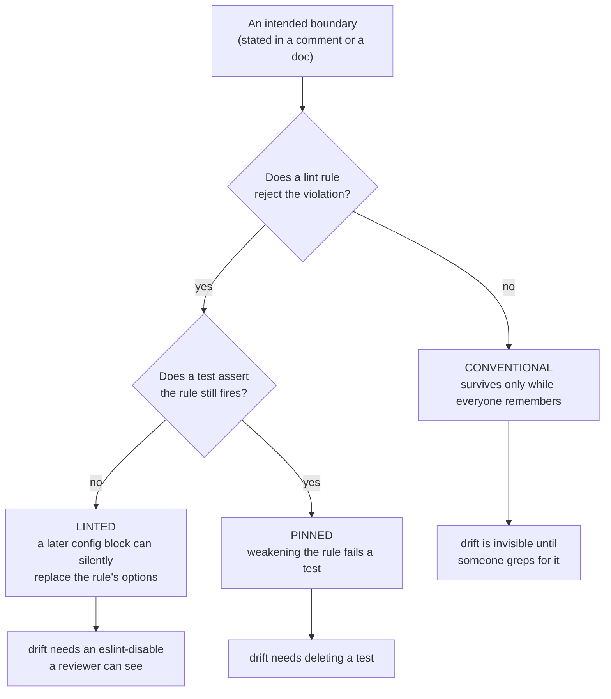
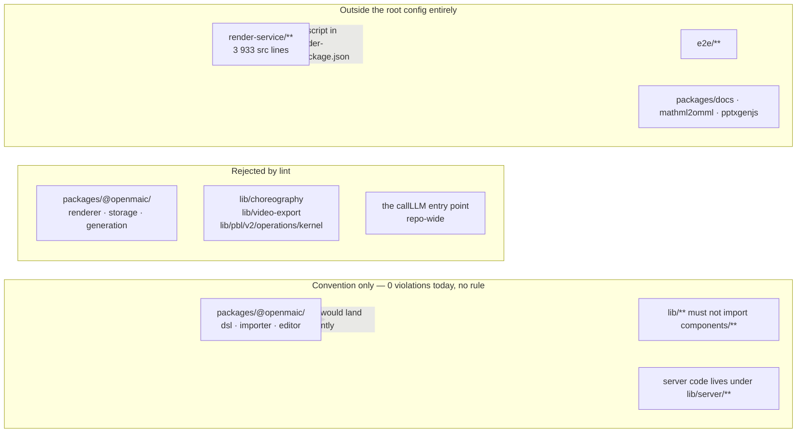
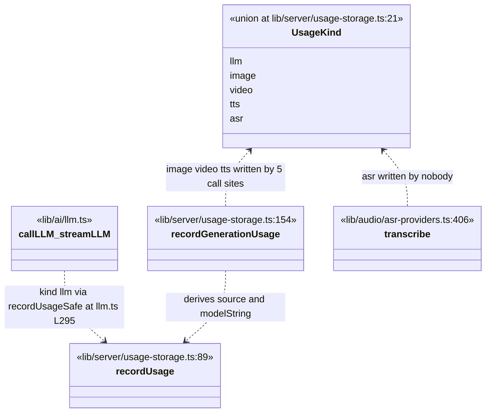

# 09 — Architectural consistency

Where the intended layering is *machine-enforced* versus merely conventional, and the
six places where the convention has drifted and nothing rejects it. Interpretation, not
measurement: read [01-method.md](./01-method.md) first for what a static pass can and
cannot conclude.

**Sources read directly:** `eslint.config.mjs` (670 lines, the only ESLint config in the
repository — `find . -maxdepth 3 -name 'eslint.config.*' -not -path '*/node_modules/*'`
returns exactly one path), `tests/lint-llm-entry-guard.test.ts`,
`tests/video-export/eslint-boundary.test.ts`, `lib/server/usage-storage.ts`,
`lib/audio/asr-providers.ts`, `render-service/package.json`.

## What counts as enforcement here

Three grades, and they behave very differently under deadline pressure.

The distinction is not academic in this repository. `eslint.config.mjs` is *flat* config,
where a later block that sets the same rule key **replaces** that rule's options rather
than merging them. The config says so five times in its own comments
(`eslint.config.mjs:8-12,192-194,584-588,635-638,656`), because the failure mode is
silent: adding one new `no-restricted-syntax` block for a new module drops the module
boundary of every earlier block whose files it also matches. Ten blocks set
`no-restricted-syntax` (`grep -c "'no-restricted-syntax'" eslint.config.mjs` → 10, at
`:100,125,149,201,257,351,425,501,559,665`). Two of the ten are pinned by a test.

## The machine-enforced walls

Eight rows below. **Seven are module or package boundaries; row 7 is not a boundary at all**
— it is a repo-wide single-entry-point rule that happens to be enforced by the same rule
families. [`../02-container-view/04-logical-layering.md`](../02-container-view/04-logical-layering.md)
counts the same eight rows and phrases it as "seven module walls plus one repo-wide rule
that is not a wall". Both are the same eight rows; the numbers differ only in what gets
called a wall.

| # | Wall | Scope | Config | Pinned by a test? |
| --- | --- | --- | --- | --- |
| 1 | `@openmaic/renderer` must contain no `@/…` host-app string at all | `packages/@openmaic/renderer/**` | `:97-115` | no |
| 2 | `@openmaic/storage` — same policy | `packages/@openmaic/storage/**` | `:122-140` | no |
| 3 | `@openmaic/generation` — no `@/…`, plus a positive import allowlist (`@openmaic/dsl`, `jsonrepair`, `katex`, `nanoid`, `partial-json`, `node:`, relatives) and no `import()` / `require()` | `packages/@openmaic/generation/**` and its `test/**` + `vitest.config.ts` as a separate block | `:146-191`, `:195-242` | no |
| 4 | `lib/choreography` stays pure Node — allowlist is `@openmaic/dsl`, `zod`, in-folder `./…` only; plus a `no-restricted-imports` ban on `react`, `react-dom`, `gsap`, `framer-motion`, `motion` | `lib/choreography/**` | `:254-329` | no |
| 5 | `lib/video-export` stays pure Node, with a **depth-specific** relative allowance: root files may reach `../choreography` and `./…`; `passes/**` and `legacy/**` may use one `../…` (still inside the module) and `../../choreography` | two disjoint blocks so root `*` does not match `passes/` | `:348-415`, `:419-492` | no |
| 6 | The Hyperframes emitter may import in-module relatives and exactly one app module, `../../quiz/math-text`, so classroom and exported formulas cannot drift | `lib/video-export/emit-hyperframes/**` | `:498-533` | **yes** — `tests/video-export/eslint-boundary.test.ts`, one allow case plus seven `it.each` reject cases |
| 7 | Every server model call goes through `callLLM` / `streamLLM`; `generateText` / `streamText` static, namespace, `require()` and `await import('ai')` forms are all covered | `**/*.{ts,tsx,js,jsx,mjs,cjs}` minus `lib/ai/llm.ts`, `eval/**`, `tests/**` | `:608-634` + `:650-667` + the `AI_SDK_DYNAMIC_IMPORT_BAN` spread into walls 1–3 and 8 | **yes** — `tests/lint-llm-entry-guard.test.ts`, a form × extension matrix plus an exemption case and a case asserting the shared rule key did not drop walls 4–5 |
| 8 | PBL v2 kernel operations must not import `operations/runtime`; runtime may depend on the kernel, never the reverse | `lib/pbl/v2/operations/kernel/**` | `:539-574` | no |

Wall 7 is the one with a written provenance: issue #1003 is cited in the comment
(`eslint.config.mjs:5,580-582`), and the drift it describes is specific — five direct
`streamText` calls in the PBL v2 runtime, which meant zero usage records for the busiest
traffic in the product plus three different meanings for one thinking config. The rule
exists because the boundary already failed once.

## Where the intended layering is not enforced at all

`eslint.config.mjs:30-57` globally ignores `render-service/**` (`:56`), `e2e/**`
(`:53`) and the three third-party/vendored package trees (`:37-39`), on the stated
reasoning that render-service is "linted/typechecked under `render-service/`". Its
`package.json` has four scripts — `dev`, `start`, `typecheck`, `test` — and none of them
is a lint (`render-service/package.json:10-15`). So `render-service/src` is typechecked
and tested but linted by nothing, in either tree.

## The six violations that survive

Each row is a boundary the code or a comment states, that no rule rejects, and that the
tree today actually crosses.

### 1. `lib/**` imports from `components/**` — five static sites, eight in total

The domain layer reaching into the UI layer inverts the dependency direction that
[`../02-container-view/04-logical-layering.md`](../02-container-view/04-logical-layering.md)
describes.

**Two numbers, two scopes, and they must not be confused.** This section counts
`from '…'` specifiers only:
`grep -rn --include='*.ts' --include='*.tsx' -E "from '(@/components|\.\./components)" lib`
→ **5**. The layering page counts *every* module-reference form including dynamic
`import()` → **8 sites over six files**, of which 7 are `lib/ → components/` and 1 is
`lib/ → app/`. The extra three are all in `lib/edit/preload-editor.ts:35-37`, a chunk
preloader whose whole job is to warm modules it does not otherwise depend on — deliberate,
and argued as such there. The five static sites are:

| Site | Imports | Severity |
| --- | --- | --- |
| `lib/chat/action-translations.ts:1` | `Badge` from `@/components/ui/badge` | a domain module importing a rendered React component |
| `lib/edit/noop-surface.tsx:4` | `SceneRenderer` from `@/components/stage/scene-renderer` | same, and the file is a `.tsx` living in `lib/` |
| `lib/hooks/use-home-discovery.tsx:41` | `NewFolderDialog` from `@/components/discovery/folder-dialogs` | a hook that mounts a dialog |
| `lib/edit/content-validation.ts:4` | `ELEMENT_BOUND` from `@/components/edit/ActionsBar/cue-meta` | a *constant* that belongs in `lib/`, not the reverse dependency it looks like |
| `lib/hooks/use-discussion-tts.ts:17` | `type AudioIndicatorState` from `@/components/roundtable/audio-indicator` | type-only — erased at build, weakest of the five |

The inverse direction is clean for *static* specifiers: `grep -rn "from '@/app/" lib` → 0
(the one `lib/ → app/` site the layering page counts is the dynamic
`import('@/app/editor-fonts')` at `lib/edit/preload-editor.ts:35`),
`grep -rn "from '@/lib/server" components` → 0, and `packages/@openmaic/{dsl,importer,editor}/src`
contain zero `'@/` strings despite having no rule that would say so.

### 2. Transcription bypasses wall 7, and `UsageKind` has a variant nothing writes

Wall 7 names exactly two SDK exports, `generateText` and `streamText`
(`eslint.config.mjs:626`). `lib/audio/asr-providers.ts:149` imports
`experimental_transcribe as transcribe` from the same package and calls it at `:406`;
`lib/document/extractors/local-media.ts:511` drives it per chunk. Neither path records
usage. The consequence is visible in the type:

`grep -rn "kind: 'asr'"` over the tree returns nothing. The five
`recordGenerationUsage` call sites are `app/api/generate/{image,tts,video}/route.ts`
(`:113`, `:146`, `:111`) and `lib/server/agent-runtime/generate-{image,video}.ts`
(`:325`, `:409`) — image, video, tts only.

### 3. Three of the six published packages are walled; three are not

Walls 1–3 cover `renderer`, `storage`, `generation`. `dsl`, `importer` and `editor` get
no `@/…` ban. They comply today (0 hits), so this is a latent hole rather than a live
violation — but it is asymmetric for no stated reason, and `@openmaic/dsl` is the one
package every other package and both runtime units depend on.

### 4. "Server code lives under `lib/server/`" is convention only

Eight `lib/**` modules outside `lib/server/` import a `node:` built-in
(`grep -rln --include='*.ts' --include='*.tsx' "from 'node:" lib | grep -v '^lib/server/'`):
`lib/ai/thinking-context.ts`, `lib/audio/qwen-voice-clone.ts`,
`lib/audio/qwen-voice-clone-registration.ts`, `lib/chat/pi/tools/native-whiteboard.ts`,
`lib/document/extractors/local-media.ts`, `lib/persistence/server-auth.ts`,
`lib/rag/chunking/document.ts`, `lib/rag/ingest/document.ts`. Several document the hazard
in a comment rather than in a rule — `lib/ai/thinking-context.ts:8` ("This module uses
`node:async_hooks` which is server-only"), `lib/ai/providers.ts:60`,
`lib/media/comfyui-workflows.ts:60,68`. No `server-only` package import guards any of
them; the failure surfaces as a bundler error, at build time, in whichever unrelated
client module happens to pull the chain in.

### 5. Eight of the ten `no-restricted-syntax` blocks are unpinned

Walls 1–5 and 8 have no test. The rule-key replacement hazard means the way they break is
not "someone deletes the rule" but "someone adds a block for a new module". The two
existing pins show what a pin costs: 43 lines
(`tests/video-export/eslint-boundary.test.ts`) and 121 lines
(`tests/lint-llm-entry-guard.test.ts`), both driving the real `ESLint` class over a
string of code rather than asserting on the config object.

### 6. `render-service/src` is outside every lint config

3 933 lines (`wc -l render-service/src/*.ts`) with no lint pass anywhere. It is the one
tree in the repository where the root config's seven architectural walls, the unused-vars
warning, and the Next.js rule set all simply do not apply — including wall 7, so a direct
`streamText` there would be accepted. It has no `ai` import today
(`grep -rn "from 'ai'" render-service/src` → no hits).

## What was checked and came back clean

Recorded so a future reader knows these axes were looked at rather than skipped.

| Axis | Command | Result |
| --- | --- | --- |
| `lib/**` → `app/**` | `grep -rn "from '@/app/" lib` | 0 |
| `components/**` → `lib/server/**` | `grep -rn "from '@/lib/server" components` | 0 |
| `app/api/**` → `components/**` | `grep -rn "from '@/components" app/api` | 0 |
| `dsl` / `importer` / `editor` → `@/…` | `grep -rn "'@/" packages/@openmaic/{dsl,importer,editor}/src` | 0 |
| `process.env` read in `components/**` | `grep -rn "process\.env\." components` | 0 |
| A `'use client'` file importing `@/lib/server` | brace-free regex pass over `app`, `components`, `lib` | 0 |
| Banned SDK exports outside the entry point | `grep -rn "from 'ai'" app components lib packages/@openmaic render-service/src` | 34 hits; only `lib/ai/llm.ts:7` imports `generateText` / `streamText`. Every other hit is a type-only import or a non-banned value export — `jsonSchema`, `stepCountIs`, `tool` (`lib/agent/runtime/stream-fn.ts:28-30`, `lib/pbl/v2/agents/{instructor,planner}.ts`), `wrapLanguageModel` / `extractReasoningMiddleware` (`lib/ai/providers.ts:34`), `APICallError` / `RetryError` (`lib/server/llm-error-response.ts:1`) and `experimental_transcribe` (`lib/audio/asr-providers.ts:149`, the §2 gap) |

## Open questions

- Whether walls 1–5 and 8 would still fire today is unverifiable here: asserting it
  requires running ESLint, and `node_modules` is absent
  ([01-method.md](./01-method.md)). The two pinned walls are pinned precisely because
  that question came up before.
- Whether `render-service` being unlinted is deliberate or an oversight. The ignore
  comment (`eslint.config.mjs:54-55`) claims it is "linted/typechecked under
  `render-service/`", which is half true — the typecheck exists, the lint does not.
- Whether `'asr'` in `UsageKind` is intended future work or a leftover. Nothing in the
  tree distinguishes the two.

---

Next: [10-duplication-and-dead-code.md](./10-duplication-and-dead-code.md) — what is
duplicated and what is unreachable, each with a confidence level.
Back to [index.md](./index.md) · set root [../README.md](../README.md).
