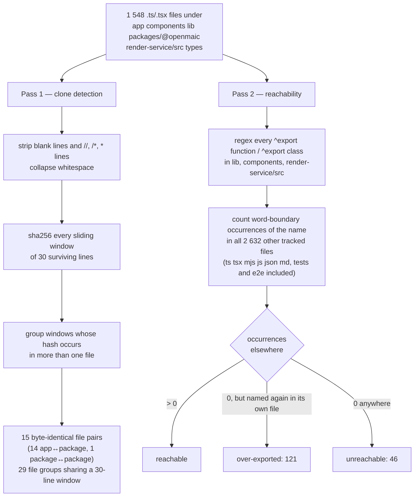
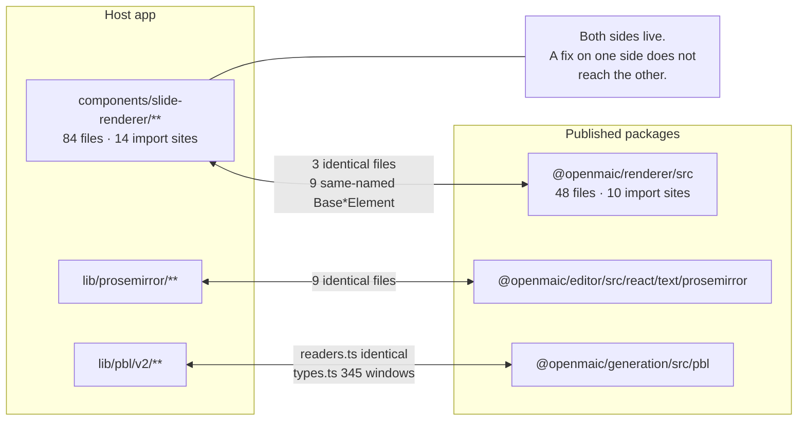

# 10 — Duplication and dead code

Two questions a new maintainer asks in week one: *if I fix this, do I have to fix it
twice?* and *can I delete this?* Both are answered here by measurement over source text,
each finding carrying a confidence level, because a static pass can prove a name is never
written and cannot prove a code path is never taken.

**No duplication tool is installed.** `grep -rn "knip\|madge\|jscpd\|dependency-cruiser\|ts-prune" package.json packages/@openmaic/*/package.json render-service/package.json packages/docs/package.json`
returns nothing, and adding one changes the tree being measured
([01-method.md](./01-method.md)). What follows is produced by two purpose-written passes
whose code is printed below, so the numbers are reproducible without a new dependency.

## The two passes



Pass 2's denominator deliberately includes `tests/`, `e2e/`, `render-service/test/`,
`eval/`, `scripts/`, `skills/`, JSON and Markdown. A symbol named only in a test still
counts as reachable, and a symbol named in a doc still counts — which makes the
`unreachable` set conservative, not aggressive.

```bash
git ls-files | grep -E '\.(ts|tsx|mjs|js|json|md)$' \
  | grep -v '/node_modules/' | grep -v '/dist/' | wc -l    # 2632
```

## Duplication finding 1 — the app↔package mirror is the whole story

Three package extractions are in flight, and in each one the app-side original and the
package-side copy are both live. This is not accidental copy-paste; it is an unfinished
migration, and it is where "fix it twice" actually bites.

| App tree | Package tree | Evidence of drift risk |
| --- | --- | --- |
| `components/slide-renderer/**` (84 files) | `packages/@openmaic/renderer/src/**` (48 files) | 3 byte-identical files; 9 `Base*Element` components exported under the same name from both trees; `BaseCodeElement.tsx` shares **296** identical 30-line windows |
| `lib/prosemirror/**` | `packages/@openmaic/editor/src/react/text/prosemirror/**` | **9 byte-identical files** — `selection-sync.ts`, `commands/{replaceText,setListStyle,setTextAlign,toggleList}.ts`, `plugins/{index,inputrules,keymap,placeholder}.ts`; `utils.ts` shares 170 windows, `schema/marks.ts` 116, `schema/nodes.ts` 68 |
| `lib/pbl/v2/**` | `packages/@openmaic/generation/src/pbl/**` | `readers.ts` byte-identical; `types.ts` shares **345** identical windows — the largest clone in the repository |

Both sides of the renderer split are imported by live code:
`grep -rn "components/slide-renderer" app components lib` → 14 import sites,
`grep -rn "@openmaic/renderer" app components lib` → 10. So neither tree is the dead one.



**Confidence: high.** Byte-identical content and identical export names are facts, not
inferences. What is *not* established is whether the app copies are scheduled for
deletion — nothing in the tree says so.

Thirteen of the 15 byte-identical pairs belong to the three mirrors above (3 renderer, 9
prosemirror, `pbl/v2/readers.ts`). A fourteenth is the same *kind* of split outside those
trees — `lib/utils/cn.ts` ↔ `packages/@openmaic/renderer/src/utils/cn.ts`, a one-line
class-name helper. The fifteenth is package↔package and not duplication in the sense that
matters (see below).

## Duplication finding 2 — four clones with no migration story

| Clone | Windows shared | Reading |
| --- | --- | --- |
| `packages/@openmaic/editor/src/ui/adapters/shapeFormulas.ts` ↔ `packages/@openmaic/importer/src/openmaic/configs/shapes.ts` | 216 | two published packages carrying the same shape-geometry table. Neither depends on the other, so there is no obvious owner |
| `components/settings/image-settings.tsx` ↔ `components/settings/video-settings.tsx` | 43 | two provider-settings panels differing mostly in modality. Plain intra-app duplication |
| `app/classroom/[id]/page.tsx` ↔ `components/classroom/ClassroomSurface.tsx` | 20 | the classroom-load duplication the evidence pack flags (`../appendix/research/classroom-runtime/00-overview.md`) — the route and the surface component each build the load path |
| `packages/@openmaic/editor/src/ui/{audio/AudioToolbarOverlay,element/ElementToolbarOverlay,video/VideoToolbarOverlay}.tsx` | 18, three-way | three overlays with one shape |

**Confidence: high** for the measurement, **medium** for the judgement — 30 identical
normalised lines is a threshold, and a shared 30-line window can be a legitimately
repeated declaration block rather than logic worth extracting.

## Duplication finding 3 — one clone that is load-bearing on purpose

`packages/@openmaic/storage/src/document/pg.ts` shares 119 windows, and
`.../agent-session/pg.ts` 116 windows, with
`packages/@openmaic/storage/test/pg-schema-contract.test.ts`. That is the test restating
the DDL so a schema change cannot land silently, and `scripts/assert-pg-contract-suites.mjs`
(12.8 KB) exists to assert those suites are wired up. Counting it as duplication to be
removed would be wrong; it is recorded here so a future duplication scan does not
"clean it up".

Also excluded from every finding above: `packages/@openmaic/editor/vitest.config.ts` and
`packages/@openmaic/renderer/vitest.config.ts` are byte-identical, which is what a shared
test config looks like when there is no shared preset.

## Dead-code finding 1 — 46 unreachable exported functions and classes

Declared, exported, and never named again in any of the 2 632 tracked files.

**Confidence: high** for "no static reference exists". **Confidence: medium** for "safe to
delete" — a React component can be reached through a string-keyed registry, and this pass
does not resolve those.

The ones worth reading before anything else, because each tells you something about the
system rather than just about a symbol:

| Symbol | Why it matters |
| --- | --- |
| `BrandProvider` (`lib/brand/brand-context.tsx:27`) | the white-label provider is **never mounted**. Its three consumers — `components/edit/SlideNavRail/SlideNavRail.tsx:54`, `components/workbench/workspace/WorkspaceHome.tsx:65`, `components/workbench/workspace/WorkspaceRail.tsx:234` — call `useBrand()` and therefore read the context *default* (`DEFAULT_BRAND`, `lib/brand/brand-config.ts:27`). The file says so itself (`brand-context.tsx:8-11`: "accepts the values as props (for future wiring)") |
| `AgentConfigPanel` (`components/agent/agent-config-panel.tsx:17`) | 152 lines of in-class agent configuration UI with zero references anywhere (`grep -rn "AgentConfigPanel\|agent-config-panel" app components lib tests` → the declaration only) |
| `useAssetUrl` / `useAssetUrls` / `runWithAssetUrls` (`lib/media/use-asset-url.ts:237,267,169`) | three of the module's exports are unreachable while the module itself is live |
| `initDatabase`, `getScenesByStageId`, `getDatabaseStats` (`lib/utils/database.ts:578,941,1026`) | Dexie helpers in the largest client-storage module |
| `isRenderServiceConfigured` (`lib/server/render-service.ts:21`) | superseded by `resolveRenderServiceUrl`, which the relay route actually calls |
| `importEligibleLegacyWhiteboard` (`lib/whiteboard/runtime/legacy-import.ts:130`) | a legacy-import entry point with no caller |
| `getAllModels` (`lib/ai/providers.ts:2397`) | in a 2 400-line registry, the "give me everything" accessor is the one nobody uses |
| `getActionDisplayName`, `getMessageTextParts`, `getMessageActionParts` (`lib/chat/action-translations.ts:24,72,84`) | all three exports of the module that also holds one of the five `lib/**` → `components/**` imports ([09](./09-architectural-consistency.md)) — the whole file is a deletion candidate |

## Dead-code finding 2 — 121 exports that should not be exports

Named nowhere outside their declaring file, but used *inside* it: an internal helper with
a public keyword in front of it. They are not dead code — they are surface area. Each one
widens what a refactor has to consider and defeats the unused-export analysis a tool like
`knip` would otherwise do for free. Concentration by directory:

| Directory | Over-exported + unreachable |
| --- | --- |
| `lib/server/` | 35 |
| `lib/utils/` | 15 |
| `lib/document/` | 11 |
| `lib/media/` | 10 |
| `components/workbench/` | 9 |
| `lib/edit/` | 8 |
| `components/edit/` | 7 |
| `lib/audio/` | 7 |
| `components/ai-elements/` | 6 |

`lib/server/` leading this table is expected — it is the largest directory — but it is
also the trust-sensitive one, where "exported" means "callable from any other server
module".

## Dead-code finding 3 — a fetch to a route that does not exist

`lib/storage/client.ts:25` posts to `/api/storage/upload`. There is no
`app/api/storage/` directory (`find app/api -type d -name 'storage*'` → nothing; the
tree has 69 `route.ts` files and none of them serves that path). `uploadBlobToStorage`
catches everything and returns `null` (`:29-31`), so its one live caller —
`components/scene-renderers/pbl/v2/submission.tsx:1016,1065` — always takes the fallback
branch: base64-inline for images under `IMAGE_BASE64_CAP`, a localized
`imageTooLargeNoStorage` error above it, and `setFileUrl(undefined)` for PDFs.

**Confidence: high.** The route's absence is a directory listing, and the fallback is
read from the caller. This is not dead code — it is *live code with a dead destination*,
which is worse, because the fallback masks it.

## Dead-code finding 4 — one inherited claim that did not survive

`../appendix/research/media-audio-video/` records `lib/video-export/legacy/` as a dead
path. It is not. `lib/video-export/passes/visuals.ts:20-24` imports
`isRunnablePblV2CoverProject`, `isUsableLegacyCoverConfig` and `pblLegacyCover` from
`../legacy/read`, and `eslint.config.mjs:419-423` deliberately widens the
`lib/video-export` boundary block to cover `legacy/**` — a wall is maintained around it.
Only one of that module's exports is unreachable, `hasPblV2CoverContainers`
(`lib/video-export/legacy/read.ts:40`). The correction is also recorded in
[01-method.md](./01-method.md).

## Open questions

- Whether the three app↔package mirrors are mid-migration or permanently forked. Nothing
  in the tree records an intent, and both sides have live import sites.
- Whether any of the 46 unreachable exports is reached through a string-keyed registry or
  a dynamic `import()` with a computed specifier. Pass 2 cannot see either.
- Whether the missing `/api/storage/upload` route is intentional (object storage is an
  opt-in deployment concern) or a route that was removed without its client. The
  `tests/runtime/storage-entrypoint-removal.test.ts` pin shows a *different* part of
  `lib/storage/` was deliberately deleted, which makes "intentional" the likelier reading
  — but the client still fetches a 404 rather than checking a capability first.

---

Next: [11-strengths.md](./11-strengths.md) — what this codebase does better than its
peers, with the evidence. Then
[12-remediation-backlog.md](./12-remediation-backlog.md) ranks everything.
Back to [index.md](./index.md) · set root [../README.md](../README.md).
