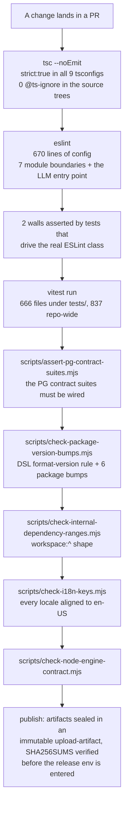
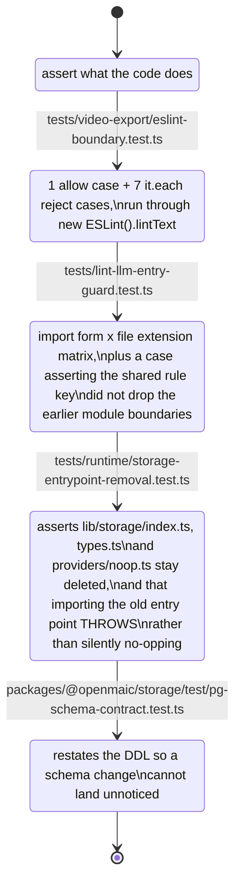
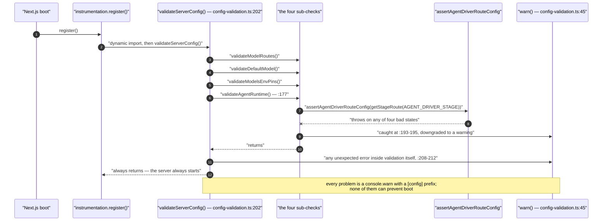

# 11 — Strengths

Sections 08–10 name what is dangerous, inconsistent or duplicated. This section names what
this codebase does *better* than the median repository of its size, with the same evidence
discipline — because a reader who only reads the problem sections will mis-estimate how
much of the machinery they can trust.

Nothing here is a grade. Every row is a property that either exists in the tree or does
not.

## The shape of the safety net

Seven of those nine steps are *repository-specific scripts*, not off-the-shelf tooling.
That is the single most distinctive property of this codebase: where the standard toolchain
had no answer, someone wrote the check rather than writing a convention.

## 1. Boundaries are rules, not documentation

Seven module and package boundaries — plus one repo-wide entry-point rule — are rejected by
ESLint rather than described in a CONTRIBUTING file ([09-architectural-consistency.md](docs/14-code-quality/09-architectural-consistency.md)
has the full table). Two properties make this unusual:

- **The rules are complete against evasion, and say so.** The `@/…` bans match the string
  *prefix* wherever it appears, precisely so that static, `import type`, `export … from`,
  dynamic `import()`, `require()`, `require.resolve()`, `import.meta.resolve()`,
  computed-property and template-literal forms, and string-concatenation operands are all
  one rule with one report ([`eslint.config.mjs:82-91`](eslint.config.mjs#L82-L91)). What is *out of scope* is written
  down too (`:93-96`): a specifier assembled from non-`@/` pieces, and relative parent
  escapes, which are caught by building the package in isolation instead.
- **The allowlists are positive, not negative.** `lib/choreography`,
  `lib/video-export` and `@openmaic/generation` use negative-lookahead selectors so the
  guard is "only these sources are permitted", not "these known-bad names are forbidden"
  ([`eslint.config.mjs:275-292`](eslint.config.mjs#L275-L292), [`:363-380`](eslint.config.mjs#L363-L380), [`:162-179`](eslint.config.mjs#L162-L179)). A new bad dependency fails by
  default.

The `lib/video-export` boundary goes one step further and is **depth-specific**: a single
`../…` escapes the module from a root file but stays inside it from `passes/`, so the
boundary is split into two disjoint file scopes with different allowlists
([`eslint.config.mjs:336-347`](eslint.config.mjs#L336-L347)). That is a level of care most repositories do not spend on
lint config.

## 2. The comments record *why*, including the revisions that were wrong

Configuration and boundary code in this repository carries its own review history. Five
examples, all verbatim-checkable:

| Where | What it records |
| --- | --- |
| [`eslint.config.mjs:5-12`](eslint.config.mjs#L5-L12) | why the dynamic-import ban needs `no-restricted-syntax` rather than `no-restricted-imports` (an `ImportExpression` is invisible to the latter), and why it is spread per-block rather than declared repo-wide (flat config *replaces* rule options, so one repo-wide block would silently drop each block's own module boundary) |
| [`eslint.config.mjs:603-607`](eslint.config.mjs#L603-L607) | an earlier revision guarded only `.ts`/`.tsx`, which left `app/api/route.js` and `scripts/*.mjs` free to import the SDK — "review caught it", and `tests/lint-llm-entry-guard.test.ts` now pins the whole extension matrix |
| [`eslint.config.mjs:640-648`](eslint.config.mjs#L640-L648) | why three package trees are ignored by the dynamic-import block *and* nonetheless covered, ending with the observation that the earlier reasoning "was not good enough" because `void import('ai')` under the renderer path passed lint |
| [`eslint.config.mjs:575-582`](eslint.config.mjs#L575-L582) | the provenance of the single-LLM-entry wall: five direct `streamText` calls in the PBL v2 runtime meant zero usage records for the busiest traffic in the product |
| [`lib/store/kv-persist.ts:508-510`](lib/store/kv-persist.ts#L508-L510) | why automatic legacy-key migration was *removed*: "repeated review rounds found its legacy-adoption state space too large to keep correct" |

A comment that names the bug the rule prevents survives refactoring in a way that a
comment describing the rule does not.

## 3. Tests that pin absences and deletions, not just behaviour

Most suites assert what the code does. Three patterns here assert what it must *not* do.

`tests/runtime/storage-entrypoint-removal.test.ts` is the rarest of the four. It encodes
the *reason* the code was removed — "`getStorageProvider()` unconditionally returned a
`NoopStorageProvider` and swallowed every operation into silence" — and then asserts that
a caller who still believes it has storage gets "a loud resolution failure at import time
— never a silent no-op provider". A deletion with a rationale and a regression pin is
institutional memory that survives everyone who was in the room.

## 4. Failure is designed to be loud in the right places and silent in the others

Boot-time config validation is explicitly warn-only and non-throwing: every check runs,
every problem becomes a `console.warn` with a `[config]` prefix, and the whole thing is
wrapped so an unexpected error inside validation cannot take the server down
([`lib/server/config-validation.ts:198-213`](lib/server/config-validation.ts#L198-L213)). Meanwhile the checks it runs are the
"nothing happens" misconfigurations that cost a whole debugging session — a feature flag
set without its `DATABASE_URL` (`:177-190`), a `*_MODELS` pin on a provider with no key
(`:150-166`), an unroutable agent-driver stage (`:191-195`).

The inverse choice is made where correctness matters more than uptime.
`assertAgentDriverRouteConfig` throws on four distinct bad states
([`lib/server/agent-runtime/agent-driver-model.ts:26,37,44,50`](lib/server/agent-runtime/agent-driver-model.ts#L26)) and only the *boot-time*
caller downgrades that to a warning; a request-path caller gets the throw.

Two more instances of the same discipline, both in the render path:

- The video relay never parses the request body. `capBodyStream(req.body, 300 MiB)` caps a
  stream that is forwarded with `duplex: 'half'`, and a declared `content-length` over the
  cap is refused with a courtesy 413 *before* any bytes are read
  ([`../11-data-flows/08-export-video.md`](docs/11-data-flows/08-export-video.md)).
- `PreviewGate.acquire` returns a release function that is idempotent by construction, "so
  every route exit can safely call it once" ([`render-service/src/preview-gate.ts:26-29`](render-service/src/preview-gate.ts#L26-L29)) —
  a class of leak that is normally found in production.

## 5. Typing discipline holds at scale

| Property | Measured |
| --- | --- |
| `strict: true` | all 9 tsconfigs — root, six `@openmaic/*`, `render-service`, `packages/docs` |
| `@ts-ignore` | **0** across `app components lib packages/@openmaic render-service/src types` |
| `as any` | 31, in 333 699 lines of the same path set |
| `@ts-expect-error` | 23 in those paths (29 repo-wide) — and every one of them, unlike `@ts-ignore`, fails the build if the error it suppresses goes away |
| `eslint-disable` | 128, of which three rules account for 122 ([04-lint-and-format.md](docs/14-code-quality/04-lint-and-format.md)) |

Zero `@ts-ignore` in a 333 699-line TypeScript tree is the number to remember. The
codebase's suppression of choice is the *self-invalidating* one.

## 6. Layering is clean on every axis measured except one

Six of seven checked import-direction axes return zero violations
([09](docs/14-code-quality/09-architectural-consistency.md) has the commands): `lib/**` → `app/**`,
`components/**` → `lib/server/**`, `app/api/**` → `components/**`,
`packages/@openmaic/{dsl,importer,editor}` → `@/…`, `process.env` in `components/**`, and a
`'use client'` file importing `@/lib/server`. Only `lib/**` → `components/**` is crossed,
five times, one of them type-only.

The three `packages/@openmaic/{dsl,importer,editor}` trees are the interesting result:
they have **no** lint rule banning the host alias and still contain zero occurrences of
it. The convention holds where it is not enforced.

## 7. Absences are documented as findings

This is a property of the codebase, not only of this documentation set. `next.config.ts`,
the workflow comments ([`publish-openmaic-skill.yml:8-9`](.github/workflows/publish-openmaic-skill.yml#L8-L9),
[`publish-packages.yml:29-36,298-300`](.github/workflows/publish-packages.yml#L29-L36)), [`lib/brand/brand-config.ts:1-9`](lib/brand/brand-config.ts#L1-L9) ("This workspace
has no vendor shell … the config is static and the desktop flag is always off") and
[`lib/brand/brand-context.tsx:8-11`](lib/brand/brand-context.tsx#L8-L11) ("accepts the values as props (for future wiring)") all
state what is deliberately *not* implemented, in the file where a reader would otherwise
assume it was. That is why [10](docs/14-code-quality/10-duplication-and-dead-code.md) can classify
`BrandProvider` as intentional scaffolding rather than rot: the file said so first.

## What this section deliberately does not claim

- Not "the tests are good". 666 files under `tests/` and 6 385 statically counted
  `it(`/`test(` openings in that directory (7 837 across all 837 test files) measure
  *volume*, and
  [05-test-strategy.md](docs/14-code-quality/05-test-strategy.md) is explicit that no coverage provider is
  installed and no suite was run here.
- Not "the walls work". Six of the eight are unpinned, and verifying they still fire
  requires running ESLint ([09](docs/14-code-quality/09-architectural-consistency.md), open questions).
- Not "the architecture is right". These are properties of the *engineering*, which is a
  different claim.

---

Next: [12-remediation-backlog.md](docs/14-code-quality/12-remediation-backlog.md) — everything in sections
08–11 ranked, with a first step per item.
Back to [index.md](docs/14-code-quality/index.md) · set root [../README.md](docs/README.md).
