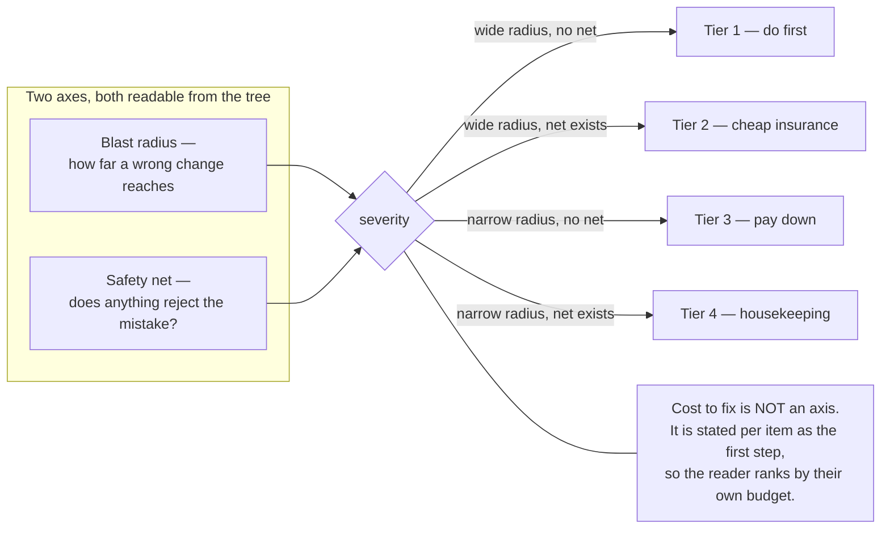

# 12 — Remediation backlog

Everything sections 02–11 found, ranked, with the evidence, the first concrete step, and a
severity. This is the only page in the topic that prescribes rather than describes.

**This is not a grade.** Severity here is a two-axis judgement stated explicitly below, not
a score. Items are ordered so that finishing the top five would remove the parts of this
codebase that are dangerous to change; nothing below tier 3 needs to happen this quarter.

## The rubric

Deliberately excluded from every tier: anything that would need a suite run, a coverage
number, or an installed tool to substantiate. Those are listed at the end as *blocked on
an install*, because recommending them here would smuggle in a claim
[01-method.md](./01-method.md) rules out.

## How to use this list

Three ways it is meant to be read, and one it is not.

- **Planning a quarter.** Take Tier 1 whole. Items 1–5 are three tests, one lint config and
  one triage exercise; none of them is a refactor, and together they remove the "no safety
  net" half of every judgement in [08](./08-complexity-hotspots.md).
- **Touching a file.** Search this page for the file's path first. If it appears in Tier 3,
  the item is the thing to do *while you are in there* — that is why Tier 3 items are scoped
  to a first step small enough to ride along with unrelated work.
- **Estimating a change.** The Tier-1 items are the reason a change near
  `middleware.ts` or `element-schema.ts` costs more than its diff suggests.

Not meant to be read as a rewrite plan. See §Nothing on this list is an architecture change.

## Tier 1 — wide blast radius, nothing rejects the mistake

| # | Finding | Evidence | First step |
| --- | --- | --- | --- |
| 1 | **`middleware.ts` is the only auth gate, has zero tests, and the access-cookie protocol has two implementations** | [08 §1](./08-complexity-hotspots.md) | Write the first test for the gate: a table of `(path, cookie state) → allow/deny`, driven through the exported matcher rather than through Next. Then delete one of the two protocol implementations |
| 2 | **`lib/server/agent-runtime/course-edit/element-schema.ts` is a 694-line hand-maintained mirror of the DSL element schema with no drift check** | [08 §2](./08-complexity-hotspots.md) | Add a contract test in the shape of `packages/@openmaic/storage/test/pg-schema-contract.test.ts`: enumerate the element discriminants from `@openmaic/dsl` and assert the mirror covers exactly that set. The pattern already exists in the repo, so this is a copy, not a design |
| 3 | **`render-service/src` (3 933 lines) is outside every ESLint config** — including the single-LLM-entry wall | `eslint.config.mjs:56` ignores `render-service/**`; `render-service/package.json:10-15` has `dev`, `start`, `typecheck`, `test` and no lint. [09 §6](./09-architectural-consistency.md) | Add `"lint": "eslint"` plus a minimal `eslint.config.mjs` under `render-service/`, and wire it into the workflow that already runs `render-service` typecheck. The ignore comment (`eslint.config.mjs:54-55`) already claims this exists |
| 4 | **Eight of the ten `no-restricted-syntax` blocks are unpinned, and the way they break is silent** | flat config replaces rule options per key — stated five times in the config's own comments (`:8-12,192-194,584-588,635-638,656`); `grep -c "'no-restricted-syntax'" eslint.config.mjs` → 10; two pins exist. [09 §5](./09-architectural-consistency.md) | Extend `tests/video-export/eslint-boundary.test.ts` from one boundary to all eight, one `describe` per wall, reusing its `boundaryErrors()` helper. 43 lines currently cover one wall |
| 5 | **18 of 69 API routes are imported by no test file** | `python3` scan in [05 §Coverage](./05-test-strategy.md) → `routes 69 referenced 51 unreferenced 18` | Take the unreferenced list and sort it by what the route can destroy. Start with the ones that write persistence or spend money, not the ones that are easiest |

## Tier 2 — wide radius, but a net exists that can be widened cheaply

| # | Finding | Evidence | First step |
| --- | --- | --- | --- |
| 6 | **Transcription bypasses the single-LLM-entry wall, and `UsageKind`'s `'asr'` variant is written by nobody** | wall names only `generateText`/`streamText` (`eslint.config.mjs:626`); `lib/audio/asr-providers.ts:149` imports `experimental_transcribe`, calls it at `:406`; `grep -rn "kind: 'asr'"` → nothing. [09 §2](./09-architectural-consistency.md) | Either add `experimental_transcribe` to the wall's `importNames` and route it through a wrapper that calls `recordGenerationUsage({ kind: 'asr', … })`, or delete `'asr'` from `UsageKind` (`lib/server/usage-storage.ts:21`). The type currently promises accounting that does not exist |
| 7 | **Three of six published packages are lint-walled against the host alias; `dsl`, `importer` and `editor` are not** | walls 1–3 in [09](./09-architectural-consistency.md); the three unwalled trees contain zero `'@/` strings today | Copy the `@openmaic/storage` block (`eslint.config.mjs:122-140`) three times with the package path changed. It is 19 lines per package and the trees already comply, so the change cannot break the build |
| 8 | **`lib/storage/client.ts:25` posts to `/api/storage/upload`, which does not exist** — the caller silently takes its fallback every time | `find app/api -type d -name 'storage*'` → nothing, across 69 `route.ts`; caller fallbacks at `components/scene-renderers/pbl/v2/submission.tsx:1016,1065`. [10 §Dead-code 3](./10-duplication-and-dead-code.md) | Make the absence explicit: have `uploadBlobToStorage` check a capability (the pattern `GET /api/export-video/capability` already uses) instead of discovering it through a 404, so "no object storage configured" and "upload failed" stop looking identical |
| 9 | **`server-only` is a convention, not a guard**: eight `lib/**` modules outside `lib/server/` import a `node:` built-in, several documenting the hazard in a comment | `grep -rln "from 'node:" lib \| grep -v '^lib/server/'` → 8; comments at `lib/ai/thinking-context.ts:8`, `lib/ai/providers.ts:60`, `lib/media/comfyui-workflows.ts:60,68`. [09 §4](./09-architectural-consistency.md) | Add the `server-only` import to those eight modules. It turns a bundler error in an unrelated client module into a build error at the offending import |
| 10 | **Five degradation branches lose information silently** — a learner's Done click that does nothing, quiz parse failure awarding 50 %, a ComfyUI listing error returning an empty success, an unknown DSL element painting nothing, an unknown action type skipped | the five sites tabulated in [07 §Two swallowed-failure patterns](./07-error-handling.md) — none of them is a `catch`, so no catch-body metric finds them | Give each one the three-state treatment [07 §Where the model is right](./07-error-handling.md) already documents four instances of: return "we could not determine this" as a distinct value rather than as an empty success. Start with `app/api/quiz-grade/route.ts:95-103`, which silently awards marks. **Do not** start with the 13 bare `catch {}` bodies — [07](./07-error-handling.md) establishes that all 13 are injected null-origin storage shims where a `SecurityError` is the expected path, so they are correct as written |

## Tier 3 — narrow radius, no net; pay down when touching the area

| # | Finding | Evidence | First step |
| --- | --- | --- | --- |
| 11 | **Three app↔package mirrors are both live**: `components/slide-renderer` ↔ `@openmaic/renderer`, `lib/prosemirror` ↔ `@openmaic/editor`, `lib/pbl/v2` ↔ `@openmaic/generation` | 15 byte-identical file pairs; `lib/pbl/v2/types.ts` shares 345 identical 30-line windows with its package twin; 14 vs 10 live import sites for the two renderer trees. [10 §Duplication 1](./10-duplication-and-dead-code.md) | Pick the *smallest* mirror — the 9 byte-identical `lib/prosemirror` files — and make the app side a re-export of the package. Nine files is small enough to prove the pattern before committing to the 84-file one |
| 12 | **Five `lib/**` modules import from `components/**`** | listed with severity in [09 §1](./09-architectural-consistency.md) | Start with `lib/edit/content-validation.ts:4`, which imports a *constant* (`ELEMENT_BOUND`) — move the constant into `lib/`, which removes the import without touching a component |
| 13 | **46 unreachable exported functions/classes and 121 exports that should be internal** | pass 2 in [10](./10-duplication-and-dead-code.md) | Delete seven of the eight entries named in [10 §Dead-code 1](./10-duplication-and-dead-code.md) as a single reviewable commit — including all three exports of `lib/chat/action-translations.ts`, which also removes one Tier-3 item 12 violation. `BrandProvider` is the exception: keep it, per item 21 |
| 14 | **`lib/action/engine.ts`: 21 action verbs, 9 type escapes, 13 test cases** | [08 §4](./08-complexity-hotspots.md) | One test per verb, table-driven. 21 rows against 13 existing cases is a bounded, mechanical gap |
| 15 | **`runSession` is 970 lines with roughly 22 mutable closure cells** | [08 §5](./08-complexity-hotspots.md) | Do not refactor it. Name the cells: add a single typed object holding the loop state so the next reader can see the state machine that is currently spread across the closure |
| 16 | **`packages/@openmaic/importer/src/shapes/presets.ts`: 154 generators, zero assertions** | [08 §10](./08-complexity-hotspots.md) | One snapshot test over all 154 generated paths. It will not tell you they are *correct*, but it will tell you when one changes |
| 17 | **Four clones with no migration story**: the cross-package shape table (216 windows), the image/video settings panels (43), the classroom load duplication (20), the three editor toolbar overlays (18) | [10 §Duplication 2](./10-duplication-and-dead-code.md) | The classroom one is already a named hotspot ([08 §9](./08-complexity-hotspots.md), "already diverged"), which makes it the one where duplication has a demonstrated cost |

## Tier 4 — housekeeping

```mermaid
stateDiagram-v2
  [*] --> Registered
  Registered: 477 package test cases run in NO workflow\n(pnpm --filter @openmaic/renderer test,\n@openmaic/editor test)
  Registered --> Evals
  Evals: 4 eval harness directories, 6 pnpm eval:* scripts,\ninvoked by no workflow
  Evals --> Envelope
  Envelope: four different error-envelope shapes\nacross app/api
  Envelope --> Scaffolding
  Scaffolding: BrandProvider never mounted;\nAgentConfigPanel never referenced
  Scaffolding --> [*]
```

| # | Finding | Evidence | First step |
| --- | --- | --- | --- |
| 18 | `@openmaic/renderer` and `@openmaic/editor` suites (477 cases) are invoked by no workflow | [05 §477 cases](./05-test-strategy.md) | Add the two `pnpm --filter … test` lines next to the four that already run |
| 19 | The eval harnesses run in no workflow | [06](./06-eval-harnesses.md), and [`../16-development-view/06-testing-and-evals.md`](../16-development-view/06-testing-and-evals.md) for the four-directories/six-scripts reconciliation | These cost money per run; the fix is a scheduled or manually-dispatched workflow, not a PR gate |
| 20 | Four error-envelope shapes across `app/api` | [07 §Envelope inconsistency](./07-error-handling.md) | Pick the shape [`../12-api-reference/09-conventions.md`](../12-api-reference/09-conventions.md) documents as canonical and convert the deviations named there |
| 21 | `BrandProvider` is never mounted; `AgentConfigPanel` is never referenced | `lib/brand/brand-context.tsx:27`, `components/agent/agent-config-panel.tsx:17`. [10](./10-duplication-and-dead-code.md) | Leave `BrandProvider` — the file documents it as future wiring. Delete `AgentConfigPanel` or mount it; 152 lines of unreferenced configuration UI will otherwise rot silently |
| 22 | 18 source files exceed 1 500 lines; 59 exceed the house 800-line ceiling | [02 §The 18 files](./02-size-and-shape.md) | Size alone is not a defect. Act on it only where it coincides with a Tier 1–3 item — which is true for `element-schema.ts` and `runSession` and for nothing else on the list |

## Blocked on an install, therefore not ranked

These are real gaps that this method cannot size, listed so they are not mistaken for
absences of a problem.

| Gap | What unblocks it |
| --- | --- |
| No coverage instrumentation anywhere | a coverage provider dependency plus `pnpm install`; `grep -rn 'coverage'` over every manifest and vitest config returns nothing today ([05](./05-test-strategy.md)) |
| No duplication, cycle or unused-export tool | `knip`, `jscpd`, `madge` or `dependency-cruiser`. The two passes in [10](./10-duplication-and-dead-code.md) are a substitute, not a replacement — they cannot see import cycles at all |
| Unknown current ESLint warning count | `@typescript-eslint/no-unused-vars` is `'warn'` (`eslint.config.mjs:65`), so warnings accumulate with no gate; counting them needs a run |
| Which CI checks are *required* to merge | a repository setting, not a file. Three workflow comments show the intent (`publish-openmaic-skill.yml:8-9`, `publish-packages.yml:29-36,298-300`) |
| Whether walls 1–5 and 8 still fire | running ESLint. Items 4 and 7 above are the durable fix for exactly this |

## Nothing on this list is an architecture change

Worth stating, because a backlog this long invites a rewrite proposal. Every item is a
test, a lint rule, a deletion, or a re-export. The two items that look structural —
item 11 (the mirrors) and item 15 (`runSession`) — are deliberately scoped to *not*
restructure: re-export the smallest mirror, and name the state rather than extract it.
The properties in [11-strengths.md](./11-strengths.md) are what this codebase would risk
by doing more.

---

Back to [index.md](./index.md) · previous [11-strengths.md](./11-strengths.md) · set root
[../README.md](../README.md).
