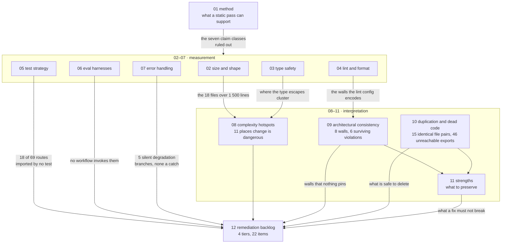
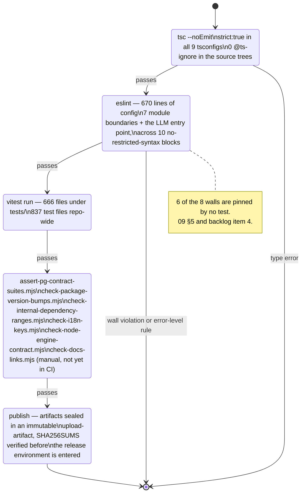

# Code Quality Assessment

A measured assessment of the OpenMAIC codebase: how big it is, how strictly it is
typed and linted, what is tested and what is not, where errors go, where change is
dangerous, and where the intended layering holds. Every number on these pages comes
from a command run against the working tree at commit `c2c9553a`, and every command
is printed next to its result.

## Ground rules for this topic

- **No grades.** There is no letter score, no "health index", no percentage of
  "quality". Those numbers cannot be derived from a checkout, so they are absent.
- **Every number carries its command.** If a figure appears without a command that
  produced it, it is a defect in this document.
- **`node_modules` was absent when these measurements were taken**
  (`test -d node_modules` → absent, `pnpm --version` → `10.28.0`). No suite was
  executed. Every figure below is a *static* measurement of source text. Nothing
  here should be read as "the tests pass" — see [01-method.md](docs/14-code-quality/01-method.md) for
  the full list of what that rules out.
- **Findings are separated from measurements.** Sections 02–07 measure. Sections
  08–11 interpret. Section 12 ranks.

## How the twelve sections relate

The reading order is not the file order. Method first, then whichever measurement
answers your question, then 08 before you touch anything and 12 before you plan
anything.

## What actually rejects a bad change

The gate ladder, in the order a change meets it. Everything after `vitest` is a
repository-specific script rather than off-the-shelf tooling — see
[11-strengths.md](docs/14-code-quality/11-strengths.md) §1 and
[`../16-development-view/07-quality-gates.md`](docs/16-development-view/07-quality-gates.md).

## Who this is for

A staff engineer who has just been handed this repository and needs to know, in the
first week: which files to read before touching anything, which subsystems have no
safety net, and which of the codebase's own conventions are actually enforced versus
merely written down.

## Sources

Primary evidence packs (each a directory of small files with verbatim signatures,
traced flows and recorded commands; every pack's entry point is its `00-overview.md`,
indexed at [`../appendix/research/index.md`](docs/appendix/research/index.md)):

- [`../appendix/research/quality-testing-ci-deps/00-overview.md`](docs/appendix/research/quality-testing-ci-deps/00-overview.md)
  — test harnesses, CI gates, scale metrics, dependency and licence inventory
- [`../appendix/research/dsl-renderer-editor/00-overview.md`](docs/appendix/research/dsl-renderer-editor/00-overview.md)
  — the two-op-kernel split, the TypeBox mirror, the importer
- [`../appendix/research/agent-runtime/00-overview.md`](docs/appendix/research/agent-runtime/00-overview.md)
  — `runSession`, tool registration, dead runtime config
- [`../appendix/research/classroom-runtime/00-overview.md`](docs/appendix/research/classroom-runtime/00-overview.md)
  — playback cancellation, `PlaybackChromeRoot`, the classroom-load duplication
- [`../appendix/research/persistence-storage-state/00-overview.md`](docs/appendix/research/persistence-storage-state/00-overview.md)
  — store sizes, KV state machine, i18n gate
- [`../appendix/research/app-shell-and-routing/00-overview.md`](docs/appendix/research/app-shell-and-routing/00-overview.md)
  — route boundaries, feature-flag discipline, middleware

Code read directly for verification: `tsconfig.json`, `tsconfig.build.json`, the
six `@openmaic` package `tsconfig.json` files, `eslint.config.mjs`, `.prettierignore`,
`vitest.config.ts` and the eight sibling Vitest configs, `middleware.ts`,
`lib/server/access-token.ts`, `lib/action/engine.ts`, `next.config.ts`,
`.github/workflows/*.yml`, `scripts/assert-pg-contract-suites.mjs`, `eval/*/runner.ts`,
`lib/server/config-validation.ts`, `lib/server/usage-storage.ts`,
`lib/audio/asr-providers.ts`, `lib/brand/brand-{config,context}.ts*`,
`lib/storage/client.ts`, `render-service/package.json`.

## Sections

| File | What it establishes |
| --- | --- |
| [01-method.md](docs/14-code-quality/01-method.md) | Exactly what was measured, the commands, and the seven classes of claim this method cannot support |
| [02-size-and-shape.md](docs/14-code-quality/02-size-and-shape.md) | 349 611 first-party lines; the file-size distribution; the 18 files over 1 500 lines and whether each earns it |
| [03-type-safety.md](docs/14-code-quality/03-type-safety.md) | `strict: true` everywhere; 31 `as any`, 13 `: any`, 0 `@ts-ignore` in 333 699 lines; where the unsafety concentrates |
| [04-lint-and-format.md](docs/14-code-quality/04-lint-and-format.md) | 670 lines of ESLint config encoding the architectural walls; 128 suppressions and the three rules that account for 122 of them |
| [05-test-strategy.md](docs/14-code-quality/05-test-strategy.md) | 7 837 statically-counted cases; the real pyramid; zero coverage instrumentation; the suites that never run |
| [06-eval-harnesses.md](docs/14-code-quality/06-eval-harnesses.md) | Four eval harness directories exposing six `pnpm eval:*` scripts, 103 scenarios, exit-code contracts — and no workflow that invokes any of them |
| [07-error-handling.md](docs/14-code-quality/07-error-handling.md) | 934 catch blocks, 141 code-free, 13 truly bare; four error-envelope shapes; where a failure actually reaches a user |
| [08-complexity-hotspots.md](docs/14-code-quality/08-complexity-hotspots.md) | The eleven places where a change is most likely to break something distant |
| [09-architectural-consistency.md](docs/14-code-quality/09-architectural-consistency.md) | The eight lint-enforced rows (seven module boundaries plus the repo-wide LLM entry point), which two are pinned by a test, and the six violations that survive |
| [10-duplication-and-dead-code.md](docs/14-code-quality/10-duplication-and-dead-code.md) | 15 byte-identical file pairs across three app↔package mirrors; 46 unreachable exports and 121 that should be internal; each with a confidence level |
| [11-strengths.md](docs/14-code-quality/11-strengths.md) | What this codebase does better than its peers, with the evidence — and what a remediation must not break |
| [12-remediation-backlog.md](docs/14-code-quality/12-remediation-backlog.md) | 22 items in four tiers: finding, evidence, first step, and the five gaps that are blocked on an install |

## Related topics

- [16-development-view](docs/16-development-view/index.md) — the monorepo, build graph and CI topology these measurements were taken over
- [15-cross-cutting](docs/15-cross-cutting/index.md) — logging, config, security and i18n as concerns
- [13-dependencies](docs/13-dependencies/index.md) — the dependency and licence inventory in full
- [18-decisions](docs/18-decisions/index.md) — the irreversible choices these measurements are measuring the consequences of
- [../glossary.md](docs/glossary.md) — the canonical vocabulary
- [../README.md](docs/README.md) — the documentation set root
