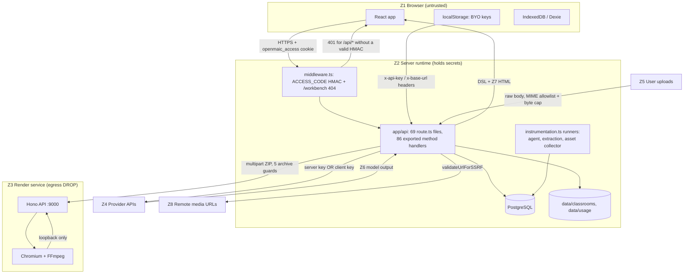
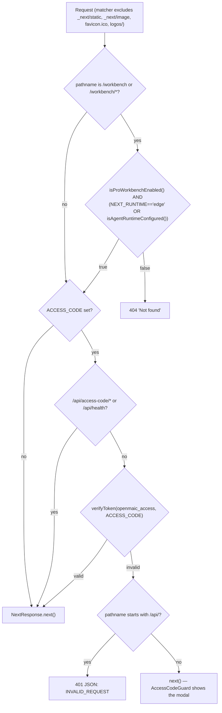
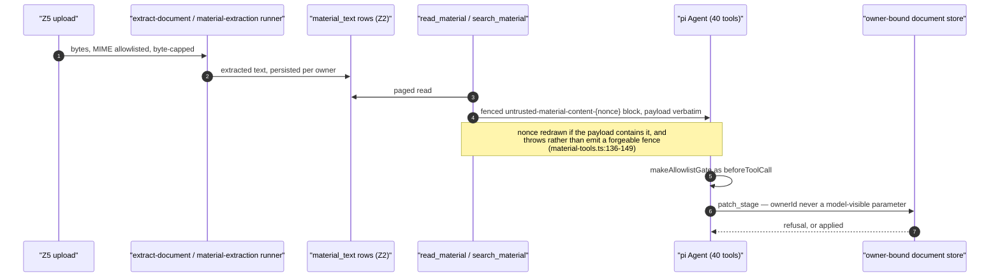
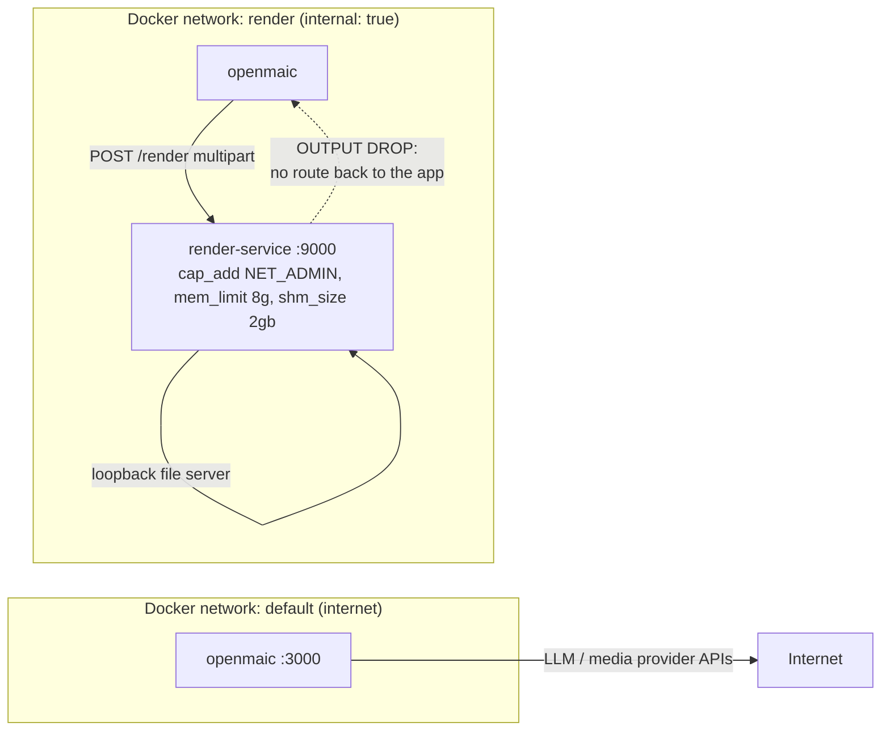

# Trust Boundaries

The eight trust zones OpenMAIC actually has, every place data crosses between
them, and the control installed at each crossing. Read this before any of the
threat sections — 02, 03 and 04 are each a zoom on crossings named here.

**Sources:** `middleware.ts`, [`next.config.ts:38-56`](next.config.ts#L38-L56), `lib/server/ssrf-guard.ts`,
`lib/server/agent-runtime/fetch-url.ts`, `lib/persistence/server-auth.ts`,
`components/scene-renderers/InteractiveIframeHost.tsx`,
`app/api/classroom-media/[classroomId]/[...path]/route.ts`,
`render-service/docker-entrypoint.sh`, `docker-compose.yml`,
[`../appendix/research/api-surface/02a-interfaces-envelope-identity-model.md`](docs/appendix/research/api-surface/02a-interfaces-envelope-identity-model.md),
[`../appendix/research/media-audio-video/02g-interfaces-render-service.md`](docs/appendix/research/media-audio-video/02g-interfaces-render-service.md).

## The zones

| Zone | What runs there | Trusted to |
| --- | --- | --- |
| **Z1 Browser** | React app, IndexedDB/localStorage, BYO provider keys | Nothing. Every value it sends is attacker-controlled. |
| **Z2 Server runtime** | Next.js Node process: 69 route files / 86 exported handlers, `instrumentation.ts` background runners | Hold operator secrets, reach PostgreSQL, reach provider APIs. |
| **Z3 Render service** | Standalone Hono + Chromium + FFmpeg container | Nothing outbound at all — egress is iptables-DROPped ([`render-service/docker-entrypoint.sh:34-49`](render-service/docker-entrypoint.sh#L34-L49)). |
| **Z4 Provider APIs** | LLM / TTS / ASR / image / video / PDF / web-search SaaS | Return bytes. Their content is untrusted. |
| **Z5 User uploads** | PDF/DOCX/PPTX/XLSX/image/audio/video bytes | Nothing. Parsed by third-party extractors. |
| **Z6 Model output** | LLM-authored DSL, HTML, actions, tool calls | Nothing. Structurally validated, semantically unverified. |
| **Z7 Generated interactive HTML** | Arbitrary HTML+JS authored by a model or imported | Nothing. Runs in a null-origin sandbox. |
| **Z8 Remote media** | CDN URLs the model or a provider returned | Nothing. Fetched only through a proxy with SSRF checks. |

## Canonical trust-zone map

The two crossings with no control are deliberate and documented:
`RENDER_SERVICE_URL` is exempt from the SSRF guard because it is *meant* to name
an internal host ([`lib/server/render-service.ts:25-35`](lib/server/render-service.ts#L25-L35)), and a server-managed
provider's base URL is operator config rather than user input
([`lib/server/resolve-model.ts:83-87`](lib/server/resolve-model.ts#L83-L87)).

## Crossing-by-crossing control table

| # | Crossing | Control | Cited at |
| --- | --- | --- | --- |
| C1 | Z1 → Z2, any path | `ACCESS_CODE` HMAC cookie; 401 JSON for `/api/*`, pass-through for pages | [`middleware.ts:60-85`](middleware.ts#L60-L85) |
| C2 | Z1 → Z2, `/workbench*` | Server-side 404 unless the public flag **and** (on Node) `isAgentRuntimeConfigured()` | [`middleware.ts:53-58`](middleware.ts#L53-L58) |
| C3 | Z1 → Z2, the runtime-gated routes (26 route files, 29 handlers) | `isAgentRuntimeConfigured()`; byte-identical plain 404 for off / absent / not-yours | [`lib/config/feature-flags.ts:23-25`](lib/config/feature-flags.ts#L23-L25), [`lib/server/agent-runtime/route-response.ts:35-40`](lib/server/agent-runtime/route-response.ts#L35-L40) |
| C4 | Z1 → Z2, owner-scoped data | `anonymous_id` UUIDv4 cookie → `anon:<uuid>` owner id | [`lib/server/agent-runtime/owner.ts:52-65`](lib/server/agent-runtime/owner.ts#L52-L65) |
| C5 | Z1 → Z2, `/api/persistence/*` | `PERSISTENCE_DEV_TOKEN` bearer, sha256 + `timingSafeEqual`; documents use the server-resolved owner instead of the client header | [`lib/persistence/server-auth.ts:32-43`](lib/persistence/server-auth.ts#L32-L43), [`app/api/persistence/[...path]/route.ts:109-112`](app/api/persistence/[...path]/route.ts#L109-L112) |
| C6 | Z1 → Z2, client model config | `x-model` / `x-api-key` / `x-base-url` / `x-provider-type`; a `MODEL_ROUTES` stage discards all four | [`lib/server/resolve-model.ts:63-81`](lib/server/resolve-model.ts#L63-L81) |
| C7 | Z5 → Z2, material upload | MIME allowlist (19 types), per-class byte cap enforced on the *streamed* bytes, owner count/byte quotas | [`app/api/materials/route.ts:176-200`](app/api/materials/route.ts#L176-L200), [`:274-285`](app/api/materials/route.ts#L274-L285) |
| C8 | Z2 → Z8, remote fetch | `validateUrlForSSRF` at 13 route files, plus per-redirect re-validation in `proxy-media` | [`lib/server/ssrf-guard.ts:253`](lib/server/ssrf-guard.ts#L253), [`app/api/proxy-media/route.ts:54-57`](app/api/proxy-media/route.ts#L54-L57) |
| C9 | Z2 → Z8, agent `fetch_url` | Strict URL normalisation **and** connection-time DNS pinning to the classified answer set | [`lib/server/agent-runtime/fetch-url.ts:159-174`](lib/server/agent-runtime/fetch-url.ts#L159-L174) |
| C10 | Z6 → Z2, DSL writes | TypeBox closed mirror of `slides.ts` + DSL structural validators; identity changes rejected | `lib/server/agent-runtime/course-edit/element-schema.ts` |
| C11 | Z6 → Z1, slide text | **None.** `elementInfo.content` reaches `dangerouslySetInnerHTML` unsanitised | [`packages/@openmaic/renderer/src/elements/text/BaseTextElement.tsx:29`](packages/@openmaic/renderer/src/elements/text/BaseTextElement.tsx#L29) |
| C12 | Z7 → Z1, interactive scene | `sandbox="allow-scripts allow-forms allow-popups"`, no `allow-same-origin`; `postMessage` matched on `event.source` + a `__maicInteractive` discriminant | [`components/scene-renderers/InteractiveIframeHost.tsx:281`](components/scene-renderers/InteractiveIframeHost.tsx#L281), [`:207-225`](components/scene-renderers/InteractiveIframeHost.tsx#L207-L225) |
| C13 | Z1 → Z2 → Z3, export ZIP | Declared-size ZIP guards before decompression; streamed body cap; identity bucket from `TRUST_PROXY_HEADERS` | [`render-service/src/config.ts:100-110`](render-service/src/config.ts#L100-L110), [`app/api/export-video/render/route.ts:33-38`](app/api/export-video/render/route.ts#L33-L38) |
| C14 | Z3 → anywhere | iptables `OUTPUT DROP` except loopback + `ESTABLISHED,RELATED`; **exits non-zero** if it cannot install the rules | [`render-service/docker-entrypoint.sh:51-67`](render-service/docker-entrypoint.sh#L51-L67) |
| C15 | Z2 → filesystem, classroom media | `..`/NUL rejection, then `fs.realpath` containment under `resolve(CLASSROOMS_DIR, classroomId)` | [`app/api/classroom-media/[classroomId]/[...path]/route.ts:53`](app/api/classroom-media/[classroomId]/[...path]/route.ts#L53), [`:63-69`](app/api/classroom-media/[classroomId]/[...path]/route.ts#L63-L69) |
| C16 | Z2 → Z1, framing | `Content-Security-Policy: frame-ancestors 'self' <extra>`; `X-Frame-Options: SAMEORIGIN` only when no extras are configured | [`next.config.ts:38-56`](next.config.ts#L38-L56) |

`frame-ancestors` is the **only** CSP directive the app emits. There is no
`script-src`, no `default-src`, no nonce — see
[`03-threat-injection.md`](docs/15-cross-cutting/03-threat-injection.md).

## Zoom: the ingress edge

Middleware does two unrelated jobs in a fixed order, and the workbench 404 runs
*before* the auth allowlist, so `/workbench` 404s even on a gated deployment
where the caller has no cookie.

`verifyToken` is a hand-rolled Web Crypto HMAC verifier written for Edge
compatibility ([`middleware.ts:18-44`](middleware.ts#L18-L44)). It parses the `timestamp.signature`
token, recomputes the HMAC over the timestamp, and compares. **It never compares
the timestamp to now** — the signed age is decoration; see
[`05-auth-and-access-control.md`](docs/15-cross-cutting/05-auth-and-access-control.md).

## Zoom: the untrusted-content path into a tool-wielding agent

Two independent zones (Z5 uploads and Z8 web results) become text that a model
with 40 registered tools reads. The durable runtime treats that as a first-class
threat; the generation pipeline does not.

The same discipline covers `fetch_url` ([`lib/server/agent-runtime/fetch-url.ts:557-561`](lib/server/agent-runtime/fetch-url.ts#L557-L561)
installs an always-present `## untrusted_content_policy` prompt block) and the
classroom child agent's `web_search` tool
([`lib/chat/pi/tools/web-search.ts:199`](lib/chat/pi/tools/web-search.ts#L199), [`:236`](lib/chat/pi/tools/web-search.ts#L236)).

It does **not** cover the generation pipeline: `buildOutlinePrompt` interpolates
extracted document text straight into the prompt as `pdfContent`
([`packages/@openmaic/generation/src/outline-generator.ts:101`](packages/@openmaic/generation/src/outline-generator.ts#L101)), and a recursive
grep for `untrusted` across `packages/@openmaic/generation` returns zero hits.
The blast radius is bounded — that call has no tools and returns JSON — but a
poisoned document can steer course content.

## Zoom: the render-service isolation

Three layers stack here: the `render` network is `internal: true` so it has no
host or internet gateway ([`docker-compose.yml:142-143`](docker-compose.yml#L142-L143)); the container drops all
egress except loopback and established replies; and it drops privileges to the
unprivileged `render` user for the Node process
([`render-service/docker-entrypoint.sh:71-74`](render-service/docker-entrypoint.sh#L71-L74)). The export ZIP is fully
self-contained — fonts and GSAP are bundled at build time — which is what makes
zero outbound network viable.

## Open questions

- The [`docker-compose.yml:85-86`](docker-compose.yml#L85-L86) comment says that without `NET_ADMIN` the
  service "still boots, but logs a warning and does NOT block Chromium egress".
  The entrypoint contradicts this: `RENDER_EGRESS_LOCKDOWN` defaults to `true`
  and a failed `lockdown()` exits 1 ([`render-service/docker-entrypoint.sh:60-63`](render-service/docker-entrypoint.sh#L60-L63)).
  One of the two is stale; the code is authoritative, so the comment should go.
- Whether Z7 interactive HTML is ever served from a same-origin `src` rather than
  `srcDoc`. `PooledIframe` supports both ([`InteractiveIframeHost.tsx:277-278`](components/scene-renderers/InteractiveIframeHost.tsx#L277-L278)),
  and the sandbox is identical either way, but the origin semantics differ. Not
  traced to a call site that sets `entry.src`.
