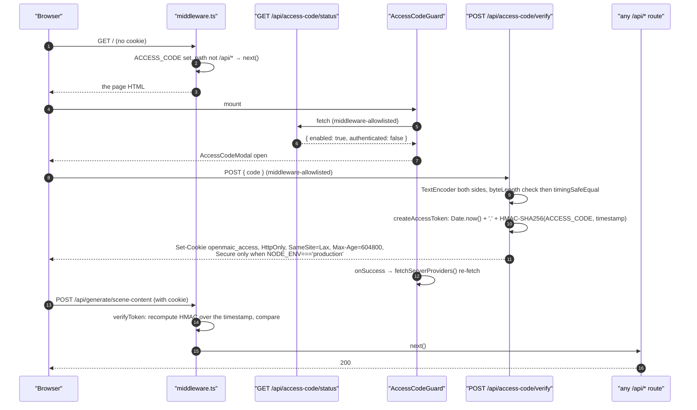
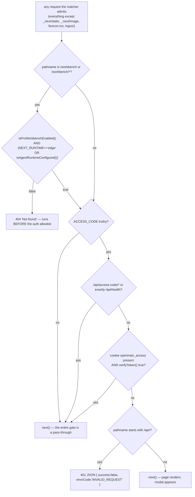
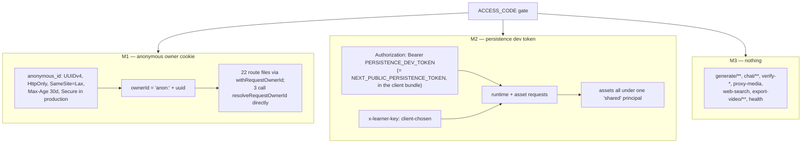

# Authentication and Access Control

OpenMAIC has one authentication gate, and it authenticates a *deployment*, not a
*user*. Three separate identity mechanisms live behind it and none of them
compose. This section traces the access-code model end to end, states precisely
what it does and does not provide, and gives the checklist a self-hoster needs
before putting this on the internet.

**Sources:** `middleware.ts:18-90`, `lib/server/access-token.ts`,
`app/api/access-code/verify/route.ts`, `app/api/access-code/status/route.ts`,
`components/access-code-guard.tsx`, `lib/server/agent-runtime/owner.ts`,
`lib/server/agent-runtime/with-owner.ts`, `lib/persistence/server-auth.ts`,
`app/api/stages/[id]/publish/route.ts`,
[`../appendix/research/api-surface/02a-interfaces-envelope-identity-model.md`](../appendix/research/api-surface/02a-interfaces-envelope-identity-model.md),
[`../appendix/research/quality-testing-ci-deps/05-failure-modes.md`](../appendix/research/quality-testing-ci-deps/05-failure-modes.md).

## The access-code model, end to end

Two details in that flow are load-bearing and easy to miss:

- **The access code IS the HMAC key.** `createAccessToken(accessCode)` uses it
  directly as the HMAC secret (`lib/server/access-token.ts:6`). Rotating
  `ACCESS_CODE` therefore invalidates every issued cookie — which is the only
  revocation mechanism that exists.
- **`AccessCodeGuard.onSuccess` re-fetches server providers** because
  `ServerProvidersInit` runs on mount, i.e. before any cookie exists, gets a 401,
  and silently keeps blank defaults. Without the re-fetch every server-configured
  provider reads as unconfigured until a manual reload
  (`components/access-code-guard.tsx:45-54`). On a `fetch` failure the guard
  fails **closed** — `{ enabled: true, authenticated: false }` (`:27-32`).

## The gate, precisely

The allowlist is exactly two entries: the `/api/access-code/` prefix and the
literal path `/api/health` (`middleware.ts:66`). No route re-checks the gate; a
route file that is reachable at all is reachable to any caller who cleared
middleware.

## What this does provide

| Property | Yes/No | Why |
| --- | --- | --- |
| Keeps casual visitors and scanners out of a self-hosted instance | Yes | Every `/api/*` path except two returns 401 without a valid cookie. |
| Cookie cannot be forged without the code | Yes | HMAC-SHA256 over the timestamp, keyed by the code. |
| Cookie is not readable by page JS | Yes | `httpOnly: true`. |
| Comparison of the submitted code is timing-safe | Yes | `timingSafeEqual` after a length check (`verify/route.ts:23-28`). |
| Global revocation | Yes | Rotate `ACCESS_CODE`; every token dies. |

## What this does not provide

| Missing property | Evidence |
| --- | --- |
| **Per-user identity.** One shared password; everyone who knows it is the same principal. | `middleware.ts:60-74` |
| **Server-side expiry.** The token carries a timestamp and `verifyToken` never compares it to `Date.now()`. The 7-day `Max-Age` is a browser-side hint a client can ignore; a captured cookie is valid forever until the code rotates. | `middleware.ts:18-44` vs `verify/route.ts:36` |
| **Per-session revocation.** No token store, no jti, no denylist. | whole of `lib/server/access-token.ts` |
| **Truly constant-time cookie comparison in middleware.** The Edge verifier does a length check then an XOR-accumulate loop, with an inline comment admitting it is "not truly constant-time in JS". (The Node path in `access-token.ts:24` does use `timingSafeEqual`.) | `middleware.ts:37-43` |
| **Rate limiting on the verify endpoint.** Nothing bounds guesses against `POST /api/access-code/verify`. | no rate-limit primitive exists under `app/api/**` |
| **Any test coverage.** `middleware.ts` has no test file. | [`../appendix/research/quality-testing-ci-deps/05-failure-modes.md`](../appendix/research/quality-testing-ci-deps/05-failure-modes.md) |
| **Multi-tenant isolation.** See the identity section below. | `lib/persistence/server-auth.ts:1-13` |

## Three identity mechanisms that do not compose

- **M1** is an unauthenticated bearer of its own id: possession of the cookie
  value *is* the identity. It exists so unrelated visitors do not see each other's
  agent sessions, described as "the smallest useful isolation boundary"
  (`lib/server/agent-runtime/owner.ts:33-36`). It is not an authentication claim.
- **M1 has a dead parameter.** `resolveRequestOwnerId` accepts
  `authenticatedOwnerId` and returns it verbatim, and the docstring warns that a
  future auth integration must thread it through
  (`owner.ts:38-51`). **No call site anywhere supplies it** — verified by grep
  across `app/` and `lib/`. Every owner id in the running system is `anon:`-prefixed.
- **The consequence:** `POST /api/stages/[id]/publish` and `.../unpublish` refuse
  `anon:` owners with `401 { error: 'login_required' }`
  (`app/api/stages/[id]/publish/route.ts:27-32`). Since every owner is `anon:`,
  those two routes are unreachable in this build.
- **M2 is documented as providing no isolation at all.** Its `x-learner-key` is
  client-supplied, so any visitor can name any learner partition; assets are
  therefore all collapsed into one `'shared'` principal on purpose, because a
  per-header asset partition only made a shared document's assets unreadable
  (`lib/persistence/server-auth.ts:38-53`). Document requests are the one
  exception — they use the server-resolved M1 owner instead
  (`app/api/persistence/[...path]/route.ts:109-112`).
- **M3** is most of the generation surface. Those routes spend the operator's
  provider credits with no identity attached beyond the shared access code.

## The no-existence-oracle 404

26 route files under `app/api` reference `isAgentRuntimeConfigured()` — 29
exported handlers, per
[`../appendix/research/api-surface/00-overview.md`](../appendix/research/api-surface/00-overview.md) —
and answer a byte-identical
plain-text `404 Not found` for three different situations: the feature is off,
the resource is not yours, and the resource does not exist. This is deliberate
and stated at `lib/server/agent-runtime/route-response.ts:36-40`. Owner-bound
document reads degrade to `null` rather than leaking existence
(`lib/persistence/owner-bound-document-store.ts`).

## Guidance for a self-hoster exposing this to the internet

Ordered by how much damage skipping it does.

1. **Put a real authenticating reverse proxy in front of it.** The access code is
   a shared password with no expiry, no revocation and no rate limit. Terminate
   real auth (OIDC, mTLS, a VPN) upstream and treat OpenMAIC as a trusted-network
   service. Everything else on this list assumes you did not.
2. **Set `ACCESS_CODE` to something long and random**, and understand that
   rotating it is your only revocation. There is no per-session logout.
3. **Do not enable server persistence on a public deployment.**
   `PERSISTENCE_DEV_TOKEN` + `NEXT_PUBLIC_PERSISTENCE_TOKEN` is explicitly
   development-only, and the token is in the client bundle. `lib/persistence/server-auth.ts:10-12`
   says production "must replace this module with real session verification and
   derive learner identity from server-controlled claims".
4. **Terminate TLS.** The access cookie only gets `Secure` when `NODE_ENV` is
   `production` (`verify/route.ts:37`), and the token is a bearer credential.
5. **Do not set `ALLOW_LOCAL_NETWORKS`.** It disables the SSRF guard for 13 route
   files at once — see [`02-threat-ssrf.md`](./02-threat-ssrf.md).
6. **Leave `TRUST_PROXY_HEADERS` unset unless a proxy really overwrites
   `x-forwarded-for`.** Otherwise a caller rotates the header to defeat the
   render-service per-identity guard; the default collapses everyone into one
   `direct` bucket, which is a shared limit rather than a spoofable one
   (`app/api/export-video/render/route.ts:23-38`).
7. **Add rate limiting at the proxy.** There is none in the app. Unauthenticated-
   when-ungated primitives worth bounding: `POST /api/access-code/verify`,
   `POST /api/proxy-media`, `POST /api/web-search`, every `POST /api/generate/*`.
8. **Set `ALLOWED_FRAME_ANCESTORS` only if you actually embed OpenMAIC.**
   Setting it removes `X-Frame-Options` entirely, because XFO has no allowlist
   form (`next.config.ts:46-48`).
9. **Expect your users' BYO provider keys to be visible to you** — they arrive as
   `x-api-key` on every request — and expect them to sit in each user's
   `localStorage`.

## Open questions

- Whether any deployment actually threads `authenticatedOwnerId`. The parameter,
  the docstring warning and the two unreachable publish routes suggest an
  intended host-auth integration that has not landed.
- Whether the 7-day `Max-Age` is meant to be the expiry. If so, the server-side
  timestamp check is simply missing; if not, the `Max-Age` is misleading. The code
  does not say which.
